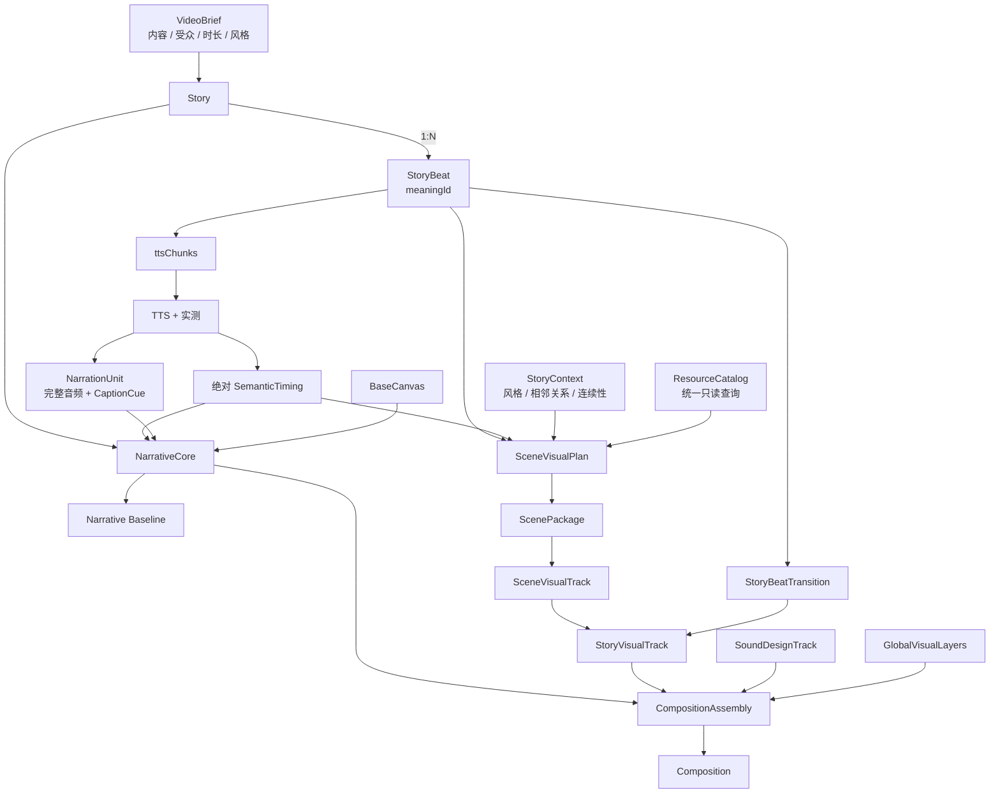
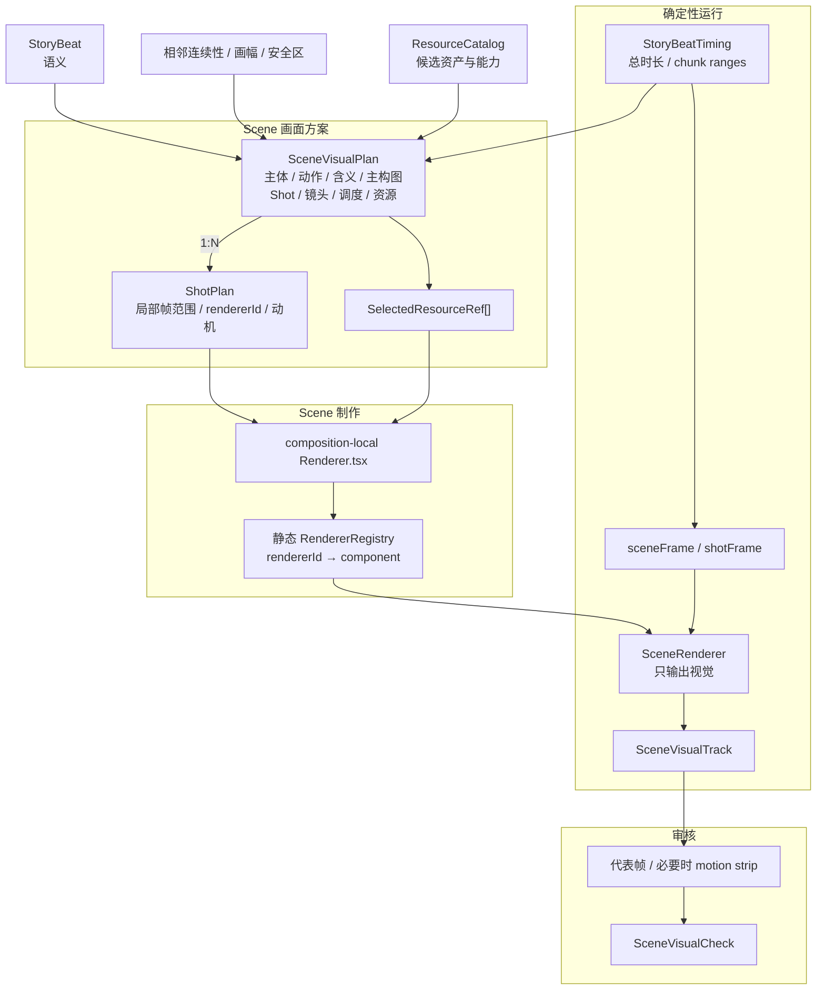

# 系统结构

## 总结构



## Scene 内部



## 图层与音轨

```text
视觉层（上 → 下）
CaptionLayer
GlobalVisualLayers / StoryBeatTransition overlay
SceneVisualTrack
BaseCanvas

非视觉音轨
NarrationAudioTrack
SoundDesignTrack：BGM / ambience / SFX
```

## 时间坐标

```text
compositionFrame：完整视频绝对帧
sceneFrame = compositionFrame - sceneStartFrame
shotFrame = sceneFrame - shotStartFrame
```

所有持久化范围统一为左闭右开的 `[startFrame, endFrame)`，并明确使用绝对帧还是局部帧。

## Remotion 对应

```text
Story                 -> Composition
StoryBeat             -> 语义数据 + Scene 外层 Sequence
Scene                 -> 独立视觉任务
Shot                  -> Scene 内局部 Sequence
NarrationAudioTrack   -> Composition 绝对音轨
CaptionLayer          -> Composition 顶层透明视觉层
StoryBeatTransition   -> Scene 边界上的等时长视觉实现
```

`<Sequence>` 只提供局部时间和挂载范围。图层叠加由 JSX 同时存在、节点顺序、定位与
z-index 决定；Sequence 数量不等于 Scene 或 Shot 的业务数量。

## 确定性装配边界

Assembly 可以校验、定位、查 registry、装配图层和执行已声明 preset；不能选择或重排
StoryBeat，不能改台词和 timing，也不能自动选择资源、Shot、镜头、renderer 或转场。
