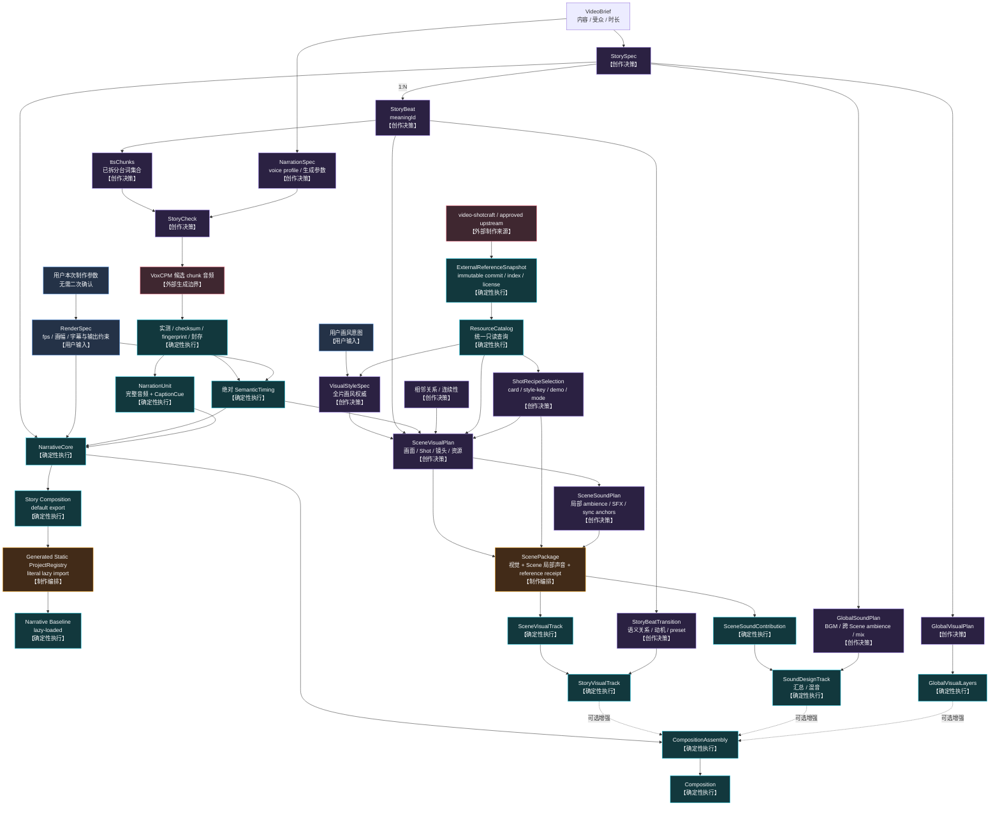
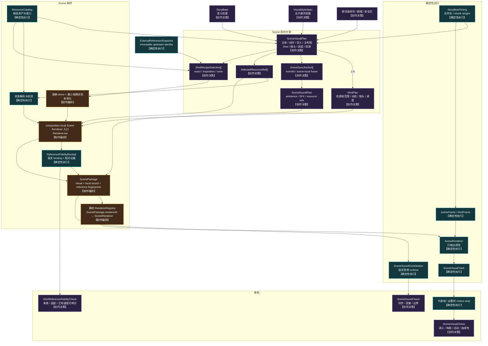

# 系统结构

> Status：M1–M4 Narrative Baseline 闭环与 M6 Scene Runtime foundation 已实现；M5/M6
> 规格与计划已批准。NarrativeCheck、GPS 正式 Scene、M7 主观 Scene 审核和 M8 全局增强
> 仍未实现。

## 节点责任

```text
【创作决策】决定表达什么，以及采用什么视觉、声音和审美方案
【制作编排】把已确定方案落实为资源引用、源码、组件和静态绑定
【确定性执行】脚本、组件或运行时根据确定输入生成可重复结果
【外部生成边界】允许调用结果非 bit-by-bit 可重复的服务，输出先作为候选产物
```

Agent 贯穿创作与制作过程：参与创作决策、完成制作编排并调用确定性工具，但不作为
结构节点，也不进入正式渲染运行时。自动化只能检查和执行已确定输入，不能自行选择
StoryBeat、Scene 方案、Shot、资源、镜头、声音或转场。

## 当前设计顺序

Scene 外部叙事生产主链按以下顺序推进：

```text
VideoBrief → StorySpec + NarrationSpec → StoryBeat + authored ttsChunks → StoryCheck
用户本次制作参数 → RenderSpec（结构化与机械校验，不二次确认）
StoryCheck → VoxCPM generation boundary → sealed narration
sealed narration + RenderSpec → SemanticTiming + CaptionCue
→ NarrativeCore
→ Generated Static ProjectRegistry + lazy-loaded Composition
→ Narrative Baseline
→ fixed project:check + persisted AutoCheck（M4）
```

当前 M4 已实现到 Narrative Baseline 的机械验证闭环：透明 NarrativeCore、tracked registry、
`GpsRelativity` lazy Composition、透明 still、全长 render 和 evidence receipt 均已落地。
`project:check` 以只读固定顺序聚合 M1–M3 权威并校验 persisted AutoCheck drift。主观叙事
质量审核和 NarrativeCheck 均未实现。

M4 的边界位于：

- `src/contracts/auto-check.ts`：strict report、固定 check/evidence 顺序和 report fingerprint；
- `scripts/project-check/`：固定作品发现、只读聚合、pass-only 原子写入和 exact CLI；
- `scripts/baseline/evidence.ts`：M3 collector 与 persisted receipt 的独立只读复验；
- `src/projects/gps-relativity/generated/narrative-auto-check.generated.json`：当前通过的持久化
  AutoCheck。

这些检查代码不进入 Remotion render runtime，也不调用 Agent、skill、MCP、provider 或网络。

这条主链必须在不存在 ScenePackage、renderer registry、视觉资源目录、SoundDesignTrack
和 GlobalVisualLayers 时独立工作。Scene、声音和全局效果是只读消费叙事主链的下游增强
轨；M6 已把 VisualStyleSpec、ScenePackage、外部镜头参考、本地化/保真、registry 和
visual/local-sound 投影落成通用基础，并用独立 synthetic proof 验证。它没有为 GPS 创建正式
Scene；当前下一步是 M7。详细流程见
[PRODUCTION_WORKFLOW.md](PRODUCTION_WORKFLOW.md)。

已实现的 Narrative Baseline 通过 generated static ProjectRegistry 注册为 Story Composition。
ProjectRegistry 的注册元数据静态可枚举，具体 Composition 代码通过 Remotion
`lazyComponent` 按需加载。它不读取 ScenePackage，也不导入 Scene renderer；它与
composition-local RendererRegistry 是两个独立装配边界。

### Composition 注册边界

```text
src/projects/<story>/Composition.tsx（default export）
+ 已校验 Story ID / RenderSpec / SemanticTiming
        ↓ bundle 前固定生成步骤
src/projects/project-registry.generated.ts
（静态元数据 + 字面量 () => import("./<story>/Composition")）
        ↓
Root 映射为 <Composition lazyComponent={entry.load} ... />
        ↓ 选中 / preview / render 时
Webpack 按需加载该 Story Composition
```

这里的“动态”只指 Composition 模块按需加载，不指运行时发现项目：

- 生成器只扫描固定一级目录 `src/projects/*/Composition.tsx`，稳定排序并拒绝非法 slug、
  重复 Composition ID、缺失合同或缺失 timing；
- ID、fps、width、height、durationInFrames 和小型 JSON-serializable defaultProps 在 registry
  中预先确定，Remotion 无需加载 Composition 就能列出它；
- 每个 registry import 都是生成后的字面量路径，模块路径不得来自 JSON、网络或字符串
  拼接；
- `Composition.tsx` 必须 default export，以满足 Remotion `lazyComponent` 的 Suspense
  加载约束；
- 所有 Story Composition 使用共同的 `StoryCompositionProps`；registry 的 defaultProps
  只传 `projectId` 等小型稳定标识，完整 Story、timing 和 manifest 留在项目模块内；
- `registerRoot()` 仍只在独立入口调用一次；Root 只读取 generated registry 并映射
  `<Composition>`；
- 正式 render runtime 不扫描文件系统，不生成 registry，也不动态改变 Composition 列表。

### Composition 组合模型

Composition 在语义上由一个必需主干和三个可选增强轨组成：

```text
Composition
├── NarrativeCore                  必需
└── EnhancementTracks              可选集合
    ├── StoryVisualTrack
    ├── SoundDesignTrack
    └── GlobalVisualLayers
```

在 CompositionAssembly 代码边界中，四者是并列的运行时装配输入；它们不互相包含，但也
不应被抹平成一个充满可选字段的万能 `Track` 类型。运行时分轨不等于创作数据分离：一个
ScenePackage 同时拥有 Scene 视觉贡献与局部声音贡献，StoryVisualTrack 和
SoundDesignTrack 分别汇总这些贡献。实现采用三层组合边界：

1. 抽取小而稳定的底层能力，例如时间线贡献、视觉贡献、音频贡献和 fingerprint
   依赖；
2. 用这些能力组合出 `NarrativeCore`、`StoryVisualTrack`、`SoundDesignTrack` 和
   `GlobalVisualLayers` 四个强语义聚合，由各自类型保证必需字段和领域约束；
3. `CompositionAssembly` 通过显式插槽接收四个聚合，再在内部展开为固定顺序的
   视觉层和音轨。

M8 完整装配的目标类型形状为：

```ts
type CompositionAssemblyProps = {
  readonly narrativeCore: NarrativeCore;
  readonly storyVisualTrack?: StoryVisualTrack;
  readonly soundDesignTrack?: SoundDesignTrack;
  readonly globalVisualLayers?: GlobalVisualLayers;
};
```

这是源码组装边界，不是允许 JSON 保存 React 组件或任意执行表达式的数据合同。M6 当前
实现：

```ts
type CompositionAssemblyProps = {
  readonly narrativeCore: ReactNode;
  readonly storyVisualTrack?: ReactNode;
  readonly soundDesignTrack?: ReactNode;
};
```

两个 Scene 投影插槽只在调用方存在真实 Scene 输入时传入；Narrative Baseline 调用仍只传
`narrativeCore`。`globalVisualLayers` 留到 M8，不存在万能 track 数组或空壳运行时。

### 已实现的 M2 模块

```text
src/contracts/story-check.ts                     StoryCheck 严格合同与 current-input 校验
scripts/narration/domain/provider-input.ts       redaction-safe provider/request fingerprints
scripts/narration/domain/candidate-progress.ts   candidate / measured 状态与续跑规划
scripts/narration/domain/pcm-wav.ts              canonical PCM、checksum、BigInt 拼接
scripts/narration/domain/seal.ts                 完整 measured batch → seal 纯领域装配
scripts/narration/adapters/private-config.ts     仓库外严格私有配置与 profile 解析
scripts/narration/adapters/voxcpm-client.ts      每 authored chunk 一个直接 VoxCPM 请求
scripts/narration/adapters/ffmpeg-normalizer.ts  host FFmpeg 规范化
scripts/narration/adapters/candidate-workspace.ts checksum-verified resume 与原子 progress
scripts/narration/adapters/atomic-files.ts       lock、immutable promotion 与 atomic receipt
scripts/narration/{generate-runner,seal-runner,check,cli}.ts
                                                  生成、封存、只读检查和固定命令
```

这些模块不 import Remotion，不注册 Composition，也不读取或实现 Scene。候选与 measured
artifact 只存在于 ignored work tree；content-addressed WAV、active manifest 和
SemanticTiming 才是 M2 持久产物。

### 已实现的 M3 模块

```text
src/contracts/narrative-baseline.ts
                                              registry/Baseline/evidence schemas 与 fingerprints
src/remotion/runtime/narrative-core/          single audio、顶层字幕、透明 NarrativeCore
src/remotion/runtime/composition-assembly/    required narrativeCore slot only
src/projects/gps-relativity/Composition.tsx   static local data validation + default export
scripts/registry/                             fixed discovery、AST check、stable atomic generation
src/projects/project-registry.generated.ts    tracked metadata + literal lazy import
src/Root.tsx                                  System component + Stories lazyComponent 映射
scripts/baseline/evidence.ts                  PNG alpha、MP4 streams/frames 与 receipt
```

M3 runtime 只读取本地静态源码、项目 JSON 和 M2 sealed artifacts；Root 不读取 Story 内容，
runtime 不扫描目录。

### 已实现的 M6 模块

```text
src/contracts/{visual-style,scene-primitives,resource-catalog,external-reference,
               shot-recipe,reference-fidelity,scene-task,scene-package,final-check}.ts
scripts/catalog/                       ResourceCatalog 生成、查询与漂移检查
scripts/external-references/           snapshot、Shotcraft resolver/localizer 与 fidelity
scripts/scene-package/                 pass-only ScenePackage/Coverage 生成与检查
scripts/renderer-registry/             composition-local 静态 registry 生成与检查
src/remotion/runtime/story-visual/     fixed Beat window 的纯视觉 Scene 投影
src/remotion/runtime/scene-sound/      fixed Beat window 的 Scene-local 音频投影
src/remotion/runtime/composition-assembly/ 可选 visual/sound 显式插槽
scripts/project-check/final-run.ts     final-mechanical-check-v1 十项机械聚合
src/remotion/proofs/m6-scene-runtime/  与 ProjectRegistry 隔离的 synthetic proof
```

所有生成器都是 pass-only、原子、byte-stable；check mode 只读。runtime 只消费静态 registry、
已校验合同和 `public/` 本地资产，不调用 Agent、skill、MCP、Git、网络或目录扫描。

## 总结构



## M6 Scene 基础与 M7 正式制作：Scene 内部

> M6 已实现本节的数据、生成器、registry 与 runtime 接入边界；正式 Story Scene authoring、
> 批量 SceneVisualCheck/SceneSoundCheck 和 GPS coverage 属于 M7，不能成为 Narrative Baseline
> 的依赖。



## Scene 级 Renderer 边界

```text
1 StoryBeat = 1 Scene audiovisual production responsibility
1 completed Scene = 1 ScenePackage
1 ScenePackage = 1 Scene-level rendererId + 1 SceneSoundPlan
1 ScenePackage = 1 visual contribution + 1 local sound contribution
1 Scene renderer = N Shot
```

- `rendererId` 只存在于 ScenePackage，并绑定 Scene 级 renderer 入口；ShotPlan 不保存
  `rendererId`、组件或模块路径。
- Narrative Baseline 可以在任何 ScenePackage 产生前独立预览；上面的 ScenePackage
  一一关系描述完成 Scene 视听制作后的可装配结果，不是 Baseline 的前置条件。
- ShotPlan 只描述 Scene 内部的 `shotId`、局部帧范围、视觉动机、镜头、调度和资源引用。
- Scene renderer 可以在自己的目录内拆分任意数量的 Shot 组件和辅助文件，也可以调用
  已批准共享能力；这些内部组件不单独注册到 runtime registry。
- Scene runtime 每个 Scene 只解析一次 `rendererId`，向该入口提供 Scene timing、局部帧
  和已校验资源；Shot 的具体 JSX 与连续运动由 Scene renderer 负责。
- SceneRenderer 始终只输出视觉；ScenePackage 内的局部 ambience、SFX 和同步关系由固定
  Scene audio runtime 消费，不允许 Renderer.tsx 私自挂载旁白或任意音频。
- ScenePackage 不拥有独立时长。它的外层范围严格等于对应 StoryBeatTiming，所有 Shot、
  SceneSyncAnchor 和局部声音 cue 都必须落在 `[0, beatDurationInFrames)` 内；需要跨越 Beat
  边界的声音不属于 SceneSoundPlan。
- TTSChunk 与 CaptionCue 不决定 Shot 数量或边界。Shot 服务同一个 meaningId，可跨越
  多个 TTSChunk，也可在一个 TTSChunk 内切换。

## Scene 并行制作边界

ScenePackage 是 Scene 视听制作阶段的最小并行 Agent 任务。主 Agent 在分发前冻结 Story、
SemanticTiming、VisualStyleSpec、RenderSpec、ResourceCatalog snapshot、允许的
ExternalReferenceSnapshot、相邻连续性摘要和检查要求；子 Agent 只写自己的
`src/projects/<story>/scenes/<meaningId>/`。

```text
1 meaningId = 1 独占 Scene 目录 = 1 Agent 任务 = 1 ScenePackage
```

- 子 Agent 不修改 Story、旁白、字幕、SemanticTiming、VisualStyleSpec、Catalog、共享能力
  源码、RendererRegistry 或其他 Scene；
- 每个任务同时交付 SceneVisualPlan、ShotPlan、SceneSoundPlan、资源/recipe 选择、必要的
  本地化 Shot 源码、Renderer.tsx 和可生成 ScenePackage 所需的全部本地输入；
- 主 Agent 统一校验所有 ScenePackage、生成 composition-local RendererRegistry、汇总运行时
  visual/sound 投影，并执行跨 Scene 连续性和最终预览；
- 子 Agent 找不到资源、时间窗口无法容纳方案或输入自相矛盾时，必须返回显式 fallback 或
  fail 状态，不得扩展 Beat 时长或修改共享输入。

## 外部镜头参考边界

`video-shotcraft` 等上游来源只进入 authoring path：显式 sync 固定完整 commit、解析
Gallery card/style-key、完整配方、准确 demo、preview 和最小依赖闭包；Scene Agent 再把已选
源码/资产本地化到自己的目录。正式 runtime 不访问上游仓库、全局 skill、远程 preview、
浮动 branch/tag，也不把 Catalog descriptor 当成动态 loader。

VisualStyleSpec 仍决定全片皮肤，ShotRecipeSelection 只决定当前 Shot 借用哪种运动结构：

```text
exact-demo-localized  → 必须通过 immutable lineage、真实 Renderer/frame-state binding、
                         source/adaptation 配对证据和正常速度可辨识检查
inspiration-only      → 记录 provenance，但不声明 exact fidelity
none                  → 普通 composition-local 自定义 Shot
```

代码许可证与 bundled audio/image/font 的逐项授权分开校验；未知或不允许当前用途的资产
`blocked`。Gallery preview 是 reference-only 证据，不能作为最终 Scene 视频播放。上游发生新
commit 不自动改变已冻结 Story；只有主 Agent 显式更新 ExternalReferenceSnapshot 并重新分发
受影响 Scene，相关 package 才按 fingerprint fail closed。

## 图层与音轨

```text
视觉层（上 → 下）
CaptionLayer
GlobalVisualLayers / StoryBeatTransition overlay
SceneVisualTrack
透明（无必需背景层）

非视觉音轨
NarrationAudioTrack
SoundDesignTrack：Scene-local ambience/SFX + GlobalSoundPlan
```

NarrativeCore 不渲染背景或其他全帧视觉，其唯一视觉输出是 CaptionLayer。StoryVisualTrack
和 GlobalVisualLayers 都缺失时，Composition 的其余视觉区域保持透明；具体容器、预览器
或输出编码如何呈现透明区域，不是 NarrativeCore 的责任。

SoundDesignTrack 是运行时汇总和混音视图：Scene 局部 ambience/SFX 的创作权威来自有序
ScenePackage，BGM、跨 Scene ambience、ducking 与 mastering 来自 GlobalSoundPlan。运行时
可以统一展开这些音频贡献，但不得生成或维护第二份 Scene SFX 计划。

CaptionLayer 字号固定为 40 px。它从 Composition 宽高计算横屏、方形和竖屏的最大字幕
宽度，并把 RenderSpec 显式安全区与按宽高计算的响应式最小 inset 合并；最终宽度永远不
超过安全区剩余空间。

## 时间坐标

```text
compositionFrame：完整视频绝对帧
sceneFrame = compositionFrame - sceneStartFrame
shotFrame = sceneFrame - shotStartFrame
```

所有持久化范围统一为左闭右开的 `[startFrame, endFrame)`，并明确使用绝对帧还是局部帧。
Scene 外层范围直接读取 StoryBeatTiming；`sceneFrame = absoluteFrame - beat.startFrame`。
修改 Scene 内部视觉或局部声音不会改变该范围，也不会移动后续 Beat；只有重新生成上游
SemanticTiming 才会重算后续绝对帧并使依赖它的 ScenePackage 失效。
音频边界先在 canonical PCM 的累计整数样本坐标中建立，再统一向上量化到帧；不得逐
chunk 把浮点秒数转帧后相加。唯一公式见
[确定性执行：音频样本到帧](DETERMINISTIC_EXECUTION.md#8-音频样本到帧的唯一算法)。

## Remotion 对应

```text
Story                 -> Composition
StoryBeat             -> 语义数据 + Scene 外层 Sequence
Scene                 -> 独立视听制作任务 + 一个 Scene renderer 入口 + SceneSoundPlan
Shot                  -> Scene renderer 内部的局部 Sequence 或组件；无 registry 绑定
NarrationAudioTrack   -> Composition 绝对音轨
CaptionLayer          -> Composition 顶层透明视觉层
SceneSoundPlan        -> 固定 Scene 窗口内的 ambience / SFX 音频贡献
StoryBeatTransition   -> Scene 边界上的等时长视觉实现
```

`<Sequence>` 只提供局部时间和挂载范围。图层叠加由 JSX 同时存在、节点顺序、定位与
z-index 决定；Sequence 数量不等于 Scene 或 Shot 的业务数量。

## 确定性装配边界

Assembly 可以校验、定位、查 registry、装配图层和执行已声明 preset；不能选择或重排
StoryBeat，不能改台词和 timing，也不能自动选择资源、Shot、镜头、renderer 或转场。

确定性执行由合同校验、固定 CLI、静态 registry、通用 Remotion runtime 和 fingerprint
失效机制共同实现，不由一个万能执行器承担。VoxCPM 结果在生成后通过实测、checksum
和 fingerprint 封存，再成为后续时间权威。完整设计见
[DETERMINISTIC_EXECUTION.md](DETERMINISTIC_EXECUTION.md)。
