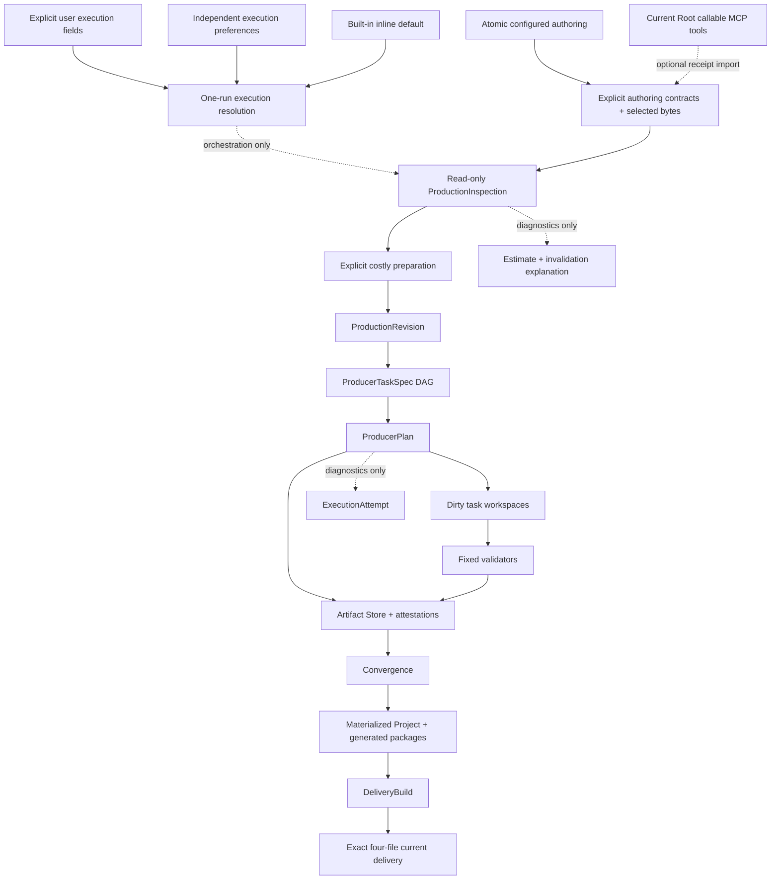

# Architecture

> 文档类型：架构 authority

## 1. 模块与依赖方向

```text
packages/studio/
  src/contracts/               JSON-safe versioned contracts
  src/remotion/                runtime capabilities and top-level ownership
  src/runtime/                 immutable package resources and policy manifest
  src/cli/                     one compiled workspace-aware CLI
  src/web/ + dist/web/         loopback HTTP adapter and prebuilt control center
packages/create-axmorf-studio/
  src/                         atomic scaffold application
  template/                    Workspace instructions, generic Skill and static seeds
src/projects/<storyId>/        ignored Project authoring + materialized current source
src/runtime/                   generated thin public-package facades for bundling
scripts/project-production/
  domain/                      pure Revision, DAG, invalidation, plan rules
  application/                 orchestration/use cases and ports
  adapters/                    filesystem, Artifact Store, media, progress, host tools
  cli.ts                       inspect/prepare/check/commit/converge surface
scripts/projects/              atomic Project create/delete use cases and adapters
scripts/narration/             provider attempt cache, PCM validation, seal and timing
scripts/scene-package/          deterministic ScenePackage/Coverage generation
scripts/renderer-registry/      static composition-local registry generation
settings/                      Web source; Vite is monorepo build-time only
private/execution-preferences.json  ignored Agent execution defaults, separate from ProducerConfig
AGENTS.md                      contributor instruction authority
packages/create-axmorf-studio/template/AGENTS.md
                               generated Workspace instruction authority
CLAUDE.md / GEMINI.md          thin host imports; no duplicated workflow
.agents/skills/                contributor workflow; creator owns the user Workspace snapshot
```

`AGENTS.md` remains the single repository Agent instruction authority. The creator writes a separate
Workspace-local `AGENTS.md` and Skill snapshot for the generated user's directory; host adapters only import the
authority in their own scope and never duplicate its rules.

根 package 只管理 npm workspaces 和 contributor checks，不是 consumer runtime import target。runtime package
公开 surface 只包含 `.`, `/contracts`, `/remotion` 和一个 compiled bin；creator 生成的是普通独立 npm application，
不是嵌套 monorepo。

`domain/` 不读取 filesystem 且不依赖 application/adapters/CLI。application 编排 use cases，不承载 host
details；adapters 实现 filesystem/process/media ports，不能反向成为业务 authority。`scripts/project-production`
是唯一 production/delivery root，不存在第二条构建链。

## 2. Authority graph



ProductionRevision/TaskRevision/ArtifactAttestation/DeliveryBuildId 是内容 identities；ProductionInspection、
TaskDecisionExplanation、diagnostic baseline 与 ExecutionAttempt 都不是。它们不得进入或改变 dispatch、
materialization、delivery identity/authority。Agent chat、child identity、process lifecycle、clock 与 absolute
path 都在 authority graph 之外。

`AgentTools` 是 create/edit 后、inspect 前的可选 capability slot，不属于 production data plane。只有当前
Root 实际 callable 的兼容 MCP tools 才激活；缺失时不生成任何结构。它只能通过固定
`project:asset:import` 把已验证 bytes/manifest identity 接入 `Inputs`，不能把 MCP、remote URL、credential、
receipt 或 candidate path 投影到 Revision、TaskSpec、child workspace、Artifact Store、delivery 或 runtime。

## 3. Contract boundaries

- ProductionRevision 只冻结 task inputs；不包含 Agent output、workspace path 或 attempt diagnostic。
- ProducerTaskSpec 绑定最小 complete input、dependency artifacts、declared read/output set 与 per-kind policy。
- ProducerPlan 投影结构化 task action、typed artifact state、direct changes、dependency propagation 与 blockedBy；
  DAG 拒绝 cycle、duplicate 或 unknown dependency。对外 explanation 只含 allowlisted input IDs 与安全 subject。
- ArtifactAttestation 绑定 exact sorted files、bytes、dependencies 与 validator policy；manifest 最后生成。
- DeliveryPublish 绑定 DeliveryBuildId、exact repository paths、media facts、checksums 与 publishing projection。

所有 JSON contracts 禁止代码、JSX、动态 module path 或 executable expression。runtime binding 由生成的静态
TypeScript registry 完成。

## 4. Write ownership

| Surface                                     | Writer                                      | Rule                                                                                       |
| ------------------------------------------- | ------------------------------------------- | ------------------------------------------------------------------------------------------ |
| Project create/configured authoring         | fixed atomic creator                        | existing/partial/conflicting target fail closed；零 provider/media/attempt                 |
| Optional external acquisition               | current Root Agent + fixed import           | callable compatible MCP 才出现；缺失即省略；只在 inspect 前写 Project-owned asset/evidence |
| Existing Project authoring inputs           | Root authoring Agent / fixed import command | preparation 前可变，受 Project ownership 限制                                              |
| `.producer-work/<story>/<taskRevision>`     | one assigned task executor                  | only declared output set; cannot edit `task.json` or inputs                                |
| `.producer-artifacts`                       | fixed commit adapter                        | validator recheck + atomic promotion only                                                  |
| materialized Scene/GlobalVisual/Cover roots | fixed materializer                          | all artifacts present; controlled replace/rollback                                         |
| generated packages/registry/Composition     | fixed convergence                           | deterministic projection                                                                   |
| delivery staging/current                    | fixed synchronous builder                   | exact identity, media validation, controlled promotion                                     |
| `.producer-attempts`                        | fixed prepare/progress adapter              | diagnostic snapshot only；不能拥有 artifact/delivery                                       |

private config、voice profiles、shared media、core、other Projects 与 historical data 不属于 Agent task write scope。

## 5. Task isolation

Scene task reads one complete StoryBeat, its SemanticTiming slice, Scene-only requirements, a derived
safe-area-local SceneViewport, Scene brief, resource pool and selected resources. It does not receive the raw
Composition readability policy, full-frame dimensions or insets. GlobalVisual reads
Story/Timing/VisualStyle/requirements/brief/resources but never Scene output. Cover reads only
Story/VisualStyle/fixed CoverSpec. Template-copy is a fixed task over the configured Project-local template
instance. Its artifact is the exact union of immutable copied source/assets and the canonical derived Scene bundle;
live-only fixed projections are excluded from its task identity.

inspect 前的 execution resolver 按用户提示词、settings、内置 `inline` 默认逐字段选择 Root inline 或 bounded
subagents，且不进入 production identity。每个 dirty Agent task 只有一个 executor；inline 一次一个 workspace，
subagents 最大四个并受 runtime capacity 限制。全部完成或 admission 后 Root 挂起；fixed continuation 以 one-shot
atomic claim 独占 exact attempt，只订阅 immutable mechanical task-terminal event log；attempt 创建起一小时总
deadline 防止无限等待。
ArtifactAttestation 才进入 production data plane。

## 6. Artifact Store security

Store/workspace paths 只由 strict storyId/task kind/taskRevision schemas 推导，不接收 arbitrary joined path。
所有 reads 和 commits 要求 containment、regular parents/files、no symlink/special file、exact declared set、
sorted unique logical paths、size/checksum current。相同 TaskRevision 与不同 bytes 是不可覆盖冲突。

promotion 在目标同父目录准备 staging，完整验证后写 manifest，最后原子 rename。捕获到 replacement failure
必须恢复上一有效 artifact。Attempt 写入失败不能污染 store。

## 7. Workspace、RuntimeResources 与 materialization

CLI 先从静态 `axmorf.workspaceVersion` marker 解析 canonical Workspace root；所有用户写入位置都
由这个 root 的 typed locations 派生。package install path 只用于读取 immutable RuntimeResources，包括
Scene template source、预构建 Web、Remotion preflight 和稳定 policy manifest。Workspace 不复制 package
authority，也不能写 package directory；package path、cwd、PID、时间和 npm cache 不进入 creative identity。

creator install/bootstrap 与生成 Workspace 的 `doctor` 组成 host capability boundary。Agent 可以在 data plane
之外准备声明的 Node.js/npm、普通依赖和宿主前置条件；OS/reference-environment label、安装步骤与诊断均不进入
Revision/Task/Artifact/Delivery identity。doctor 只读检查当前 Workspace 的 declared readiness；它不允许 Agent
改写 package internals、精确依赖、sandbox 或 validators，也不替代 production/Delivery evidence。

Remotion/FFmpeg/FFprobe/Studio 统一解析 Workspace-local `@remotion/cli` 的 JavaScript entry 并通过
`process.execPath` 启动，不依赖 shell、PATH 或 platform-specific `.bin`。generated Registry/Catalog 在 bundle
前写入 Workspace，runtime render 不扫描 package、filesystem 或网络。

Workspace configuration snapshot 要求根目录恰有一个 `remotion.config.mjs` 或 `remotion.config.ts`；creator
生成 `.mjs`，源码 Workspace 可以使用 `.ts`。缺失或同时存在时 fail closed。所选配置与 `package.json`、lockfile
共同进入独立 configuration fingerprint，不与 package-owned runtime policy 混成同一 identity。

convergence 在任何 live write 前通过 read-only current-plan builder 重新计算 Revision、检查全部 required
artifacts；它不调用 provider、不创建 workspace 或 planning attempt。Scene/GlobalVisual/Cover roots
分别 staging 并受控替换；跨 `src`/`public` 操作必须 rollback。物化后重新 hash live exact paths。
Template Scene source normalization 使 create-only、fixed-prepared 与 materialized view 对同一 unchanged input
产生同一 output set/TaskRevision，但 unknown file、symlink 或 byte drift 仍由 validator/store 拒绝。

ScenePackage、Coverage、RendererRegistry、GlobalVisualPackage 与 Composition 是 fixed projection，不由 Agent
workspace伪造。Composition owns global background, SceneViewport, CaptionLayer, narration and sound assembly；
Scene renderer 保持透明并只看到 safe-area-local SceneViewport 坐标系；Composition 把本地 `(0, 0)` 映射到
安全区左上角，Scene 不读取或推导 full-frame 尺寸与 inset，并只用 Remotion frame API。

Configured template 的复制边界由 Project-local `Renderer.tsx` adapter 承担：adapter 实现共享
`SceneRendererComponent` 的 `viewportWidth`/`viewportHeight` props，再映射到冻结模板组件内部通用的
`width`/`height`。模板组件不 import/安装 SceneViewport，也不读取 raw policy。adapter 与其 import graph
都进入 template instance/source-graph fingerprint；共享 generator 变化只影响未来 create，不静默改写既有
Project-local instance。

## 8. Synchronous delivery

Delivery builder 在一个 foreground command 内完成 render、probe、EOF decode、publish-last 和 current
promotion。build-owned staging 允许跨捕获失败复用同 identity 已验证媒体；不同 identity 不混用。
current directory exact 只允许三份 media 加 `publish.json`，其余文件、symlink、path drift 或 media mismatch
均 fail closed。

## 9. Web、Progress、删除与历史隔离

`web` 只绑定 `127.0.0.1`，普通 Node HTTP server 服务 package 的 `dist/web`，运行时不需要 Vite/`tsx`。
Host/Origin、CSP 和 body-size gates 保护 config API。Delivery endpoint 不接受 filesystem path，只允许映射已经
复验 current revision/build identity 的 video 或 cover enum，并在 open 前重新检查 regular-file/no-symlink 和
file identity。Web 是配置与只读投影界面；Remotion Studio 是实时视觉预览；二者都不修改 Project 或调度 Agent。

settings 从 source readiness、read-only inspection、latest ExecutionAttempt 和 current delivery 投影，不扫描
historical `.producer-runs`，也不自行重算失效原因。删除器是唯一允许读取 legacy manifest ownership 的
current code path；它只提取严格
storyId/legacy ID 来安全定位删除目标，不解析或迁移旧 state。

Repository operation locks 保护 Project create/import/delete、prepare、artifact/materialization 和 delivery 的
互斥 filesystem transitions；inspect 不取 mutation lock。锁与诊断数据都不进入 content identity。
Agent execution preferences 使用独立 strict contract 与 `0600` 原子存储，不修改 ProducerConfig fingerprint；
用户提示词 override 不自动写回该文件，解析值也不进入 content identity。

Scene authoring 仍必须使用 repository-local `remotion-best-practices`，但 Skill 不能扩大 TaskSpec 或
validator boundary。
