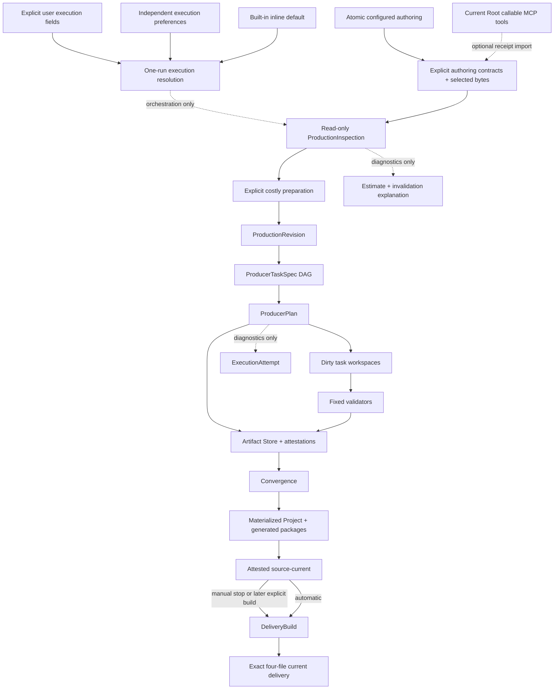

# Architecture

> 文档类型：架构 authority
>
> 第 1–9 节描述 current repository/Workspace 共用 production 主链；第 10 节描述已验证的 Phase B Desktop 实现边界。

## 1. 模块与依赖方向

```text
src/contracts/                 JSON-safe versioned contracts
src/remotion/                  runtime capabilities and top-level ownership
src/projects/<storyId>/        ignored Project authoring + materialized current source
scripts/project-production/
  domain/                      pure Revision, DAG, invalidation, plan rules
  application/                 orchestration/use cases and ports
  adapters/                    filesystem, Artifact Store, media, progress, host tools
  cli.ts                       inspect/prepare/check/commit/continue/delivery surface
scripts/projects/              atomic Project create/delete use cases and adapters
scripts/narration/             provider attempt cache, PCM validation, seal and timing
scripts/scene-package/          deterministic ScenePackage/Coverage generation
scripts/renderer-registry/      static composition-local registry generation
settings/                      config/progress API and UI
private/execution-preferences.json  ignored Agent execution defaults, separate from ProducerConfig
AGENTS.md                      single repository Agent instruction authority
CLAUDE.md / GEMINI.md          thin host imports; no duplicated workflow
.agents/skills/                host-neutral workflow plus optional host UI metadata
```

`domain/` 不读取 filesystem 且不依赖 application/adapters/CLI。application 编排 use cases，不承载 host
details；adapters 实现 filesystem/process/media ports，不能反向成为业务 authority。`scripts/project-production`
是唯一 production/delivery root，不存在第二条构建链。

## 2. Authority graph



ProductionRevision/TaskRevision/ArtifactAttestation/DeliveryBuildId 是内容 identities；ProductionInspection、
TaskDecisionExplanation、diagnostic baseline 与 ExecutionAttempt 都不是。它们不得进入或改变 dispatch、
materialization、delivery identity/authority。Agent chat、child identity、process lifecycle、clock 与 absolute
path 都在 authority graph 之外。

`AgentTools` 是 create/edit 后、inspect 前的可选 capability slot，不属于 production data plane。只有当前
Root 实际 callable 的兼容 MCP tools 才激活；缺失时不生成任何结构。它只能通过固定
`project:asset:import` 把已验证 bytes/manifest identity 接入 `Inputs`，不能把 MCP、remote URL、credential、
receipt 或 candidate path 投影到 Revision、TaskSpec、child workspace、Artifact Store、delivery 或 runtime。

## 3. Contract boundaries

- ProductionRevision 只冻结 task inputs；不包含 Agent output、workspace path 或 attempt diagnostic。
- ProducerTaskSpec 绑定最小 complete input、dependency artifacts、declared read/output set 与 per-kind policy。
- ProducerPlan 投影结构化 task action、typed artifact state、direct changes、dependency propagation 与 blockedBy；
  DAG 拒绝 cycle、duplicate 或 unknown dependency。对外 explanation 只含 allowlisted input IDs 与安全 subject。
- ArtifactAttestation 绑定 exact sorted files、bytes、dependencies 与 validator policy；manifest 最后生成。
- DeliveryPublish 绑定 DeliveryBuildId、source-current、renderer runtime、exact logical paths、media facts、checksums 与 publishing projection。

所有 JSON contracts 禁止代码、JSX、动态 module path 或 executable expression。runtime binding 由生成的静态
TypeScript registry 完成。

## 4. Write ownership

| Surface                                     | Writer                                      | Rule                                                                                       |
| ------------------------------------------- | ------------------------------------------- | ------------------------------------------------------------------------------------------ |
| Project create/configured authoring         | fixed atomic creator                        | existing/partial/conflicting target fail closed；零 provider/media/attempt                 |
| Optional external acquisition               | current Root Agent + fixed import           | callable compatible MCP 才出现；缺失即省略；只在 inspect 前写 Project-owned asset/evidence |
| Existing Project authoring inputs           | Root authoring Agent / fixed import command | preparation 前可变，受 Project ownership 限制                                              |
| `.producer-work/<story>/<taskRevision>`     | one assigned task executor                  | only declared output set; cannot edit `task.json` or inputs                                |
| `.producer-artifacts`                       | fixed commit adapter                        | validator recheck + atomic promotion only                                                  |
| materialized Scene/GlobalVisual/Cover roots | fixed materializer                          | all artifacts present; controlled replace/rollback                                         |
| generated packages/registry/Composition     | fixed convergence                           | deterministic projection                                                                   |
| source-current                              | fixed convergence                           | attested materialized source；不表示已有可播放 Delivery                                    |
| delivery staging/current                    | fixed explicit builder                      | exact source/runtime identity, media validation, controlled promotion                      |
| `.producer-attempts`                        | fixed prepare/progress adapter              | diagnostic snapshot only；不能拥有 artifact/delivery                                       |

private config、voice profiles、shared media、core、other Projects 与 historical data 不属于 Agent task write scope。

## 5. Task isolation

Scene task reads one complete StoryBeat, its SemanticTiming slice, Scene-only requirements, a derived
safe-area-local SceneViewport, Scene brief, resource pool and selected resources. It does not receive the raw
Composition readability policy, full-frame dimensions or insets. GlobalVisual reads
Story/Timing/VisualStyle/requirements/brief/resources but never Scene output；其 base layer 是完整 Composition
底板，decoration layers 由生成式 Composition 机械限制在首个至末个 narrated Scene。Cover reads only
Story/VisualStyle/fixed CoverSpec. Template-copy is a fixed task over the configured Project-local template
instance. Its artifact is the exact union of immutable copied source/assets and the canonical derived Scene bundle;
live-only fixed projections are excluded from its task identity.

inspect 前的 execution resolver 按用户提示词、settings、内置 `inline` 默认逐字段选择 Root inline 或 bounded
subagents，且不进入 production identity。每个 dirty Agent task 只有一个 executor；inline 一次一个 workspace，
subagents 最大四个并受 runtime capacity 限制。全部完成或 admission 后 Root 挂起；fixed continuation 以 one-shot
atomic claim 独占 exact attempt，只订阅 immutable mechanical task-terminal event log；attempt 创建起一小时总
deadline 防止无限等待。
ArtifactAttestation 才进入 production data plane。

## 6. Artifact Store security

Store/workspace paths 只由 strict storyId/task kind/taskRevision schemas 推导，不接收 arbitrary joined path。
所有 reads 和 commits 要求 containment、regular parents/files、no symlink/special file、exact declared set、
sorted unique logical paths、size/checksum current。相同 TaskRevision 与不同 bytes 是不可覆盖冲突。

promotion 在目标同父目录准备 staging，完整验证后写 manifest，最后原子 rename。捕获到 replacement failure
必须恢复上一有效 artifact。Attempt 写入失败不能污染 store。

## 7. Materialization 与 runtime

convergence 在任何 live write 前通过 read-only current-plan builder 重新计算 Revision、检查全部 required
artifacts；它不调用 provider、不创建 workspace 或 planning attempt。Scene/GlobalVisual/Cover roots
分别 staging 并受控替换；跨 `src`/`public` 操作必须 rollback。物化后重新 hash live exact paths。
Template Scene source normalization 使 create-only、fixed-prepared 与 materialized view 对同一 unchanged input
产生同一 output set/TaskRevision，但 unknown file、symlink 或 byte drift 仍由 validator/store 拒绝。

ScenePackage、Coverage、RendererRegistry、GlobalVisualPackage 与 Composition 是 fixed projection，不由 Agent
workspace伪造。Composition owns global background, SceneViewport, CaptionLayer, narration and sound assembly；
Scene renderer 保持透明并只看到 safe-area-local SceneViewport 坐标系；Composition 把本地 `(0, 0)` 映射到
安全区左上角，Scene 不读取或推导 full-frame 尺寸与 inset，并只用 Remotion frame API。

Configured template 的复制边界由 Project-local `Renderer.tsx` adapter 承担：adapter 实现共享
`SceneRendererComponent` 的 `viewportWidth`/`viewportHeight` props，再映射到冻结模板组件内部通用的
`width`/`height`。模板组件不 import/安装 SceneViewport，也不读取 raw policy。adapter 与其 import graph
都进入 template instance/source-graph fingerprint；共享 generator 变化只影响未来 create，不静默改写既有
Project-local instance。

## 8. Source current 与 explicit Delivery

convergence 成功后先写入并复验 `source-current`。`manual` 在这里停止，不创建 Delivery staging/render/publish；
`automatic` 才在同一 fixed continuation 内调用 Delivery builder，用户也可之后通过独立 delivery command 对当前
source 构建。Delivery policy 不进入 Revision、TaskRevision 或 ArtifactAttestation。

Delivery builder 在一个 foreground command 内完成 render、probe、EOF decode、publish-last 和 current
promotion。DeliveryBuildId 绑定 source-current、renderer runtime、publishing 与 Composition metadata；build-owned
staging 允许跨捕获失败复用同 identity 已验证媒体，不同 identity 不混用。
current directory exact 只允许三份 media 加 `publish.json`，其余文件、symlink、path drift 或 media mismatch
均 fail closed。

## 9. Progress、删除与历史隔离

settings 从 source readiness、read-only inspection、latest ExecutionAttempt 和 current delivery 投影，不扫描
historical `.producer-runs`，也不自行重算失效原因。删除器是唯一允许读取 legacy manifest ownership 的
current code path；它只提取严格
storyId/legacy ID 来安全定位删除目标，不解析或迁移旧 state。

Repository operation locks 保护 Project create/import/delete、prepare、artifact/materialization 和 delivery 的
互斥 filesystem transitions；inspect 不取 mutation lock。锁与诊断数据都不进入 content identity。
Agent execution preferences 使用独立 strict contract 与 `0600` 原子存储，不修改 ProducerConfig fingerprint；
用户提示词 override 不自动写回该文件，解析值也不进入 content identity。

Scene authoring 仍必须使用 repository-local `remotion-best-practices`，但 Skill 不能扩大 TaskSpec 或
validator boundary。

## 10. Desktop App Phase B/C 实现与 Phase D installer 边界

`AXMORF Studio` 不建立第二条 production 主链。App shell、workspace-local `rsp`、外部 Agent 和现有 Engine
按以下 ownership 连接：

```text
/Applications/AXMORF Studio.app
  Electron shell + exact Runtime Pack + Engine
            |
            | authenticated local session
            v
<Workspace Root>/.rsp/bin/rsp <--- workspace Skill <--- user Codex/Hermes
            |
            v
projects / media / task workspaces / artifacts / attempts / deliveries
```

Phase B 已把 Project/media/work/artifact/attempt/source/delivery authority 迁入显式 Workspace locations，
以启动时 manifest/checksum 验证的 embedded Runtime Pack、自包含 `rsp-local-v2`、managed Skill、Engine controller 和
bundled Player 连接。
App 不探测源码 checkout、不依赖系统 Node/npm/Git；Renderer 只接收脱敏状态和 opaque media URL。

完整产品中 App 安装目录视为只读产品代码，Workspace Root 只保存用户数据和受管 integration；外部 Agent 只能写本次
TaskSpec 声明的 task workspace outputs。`.rsp/bin/rsp` 是 checksum-bound launcher，不进入系统 `PATH`，App
未运行时返回结构化 unavailable，不另起 daemon 或回退到源码 checkout。bundled Preview Player 是主界面，
bundled Settings 与 Engine 通过 narrow typed IPC 协作，但配置只有一个 Application Support owner-only encrypted
envelope authority，不写 Workspace，也不启动 Settings HTTP store。Renderer 只能获得 write-only secret 的 configured
bit；Player 只播放 verified current Delivery，时间轴只投影 canonical timing，Remotion runtime 仍不感知 Agent、Skill、
IPC 或文件发现。workspace-local `rsp schema project-create` 只读投影 packaged contract；create stdin 是 raw strict input，
不是第二条 protocol wrapper 或 production authority。

Desktop Revision 必须只绑定当前 Project 的显式生产输入、selected bytes 和实际影响渲染/校验的 pinned runtime
policy。其他 Project、Workspace 非依赖文件、App 日志、窗口状态、安装路径或无关工程修改不得使当前 task 失效。
App/Engine/Skill 更新在 active Attempt 期间禁止切换；Agent 写入 declared output set 之外的文件由 fixed validator
按 exact paths 拒绝，不能被物化。

Desktop 当前报告 `productionAvailable: true`、`deliveryAvailable: true`。Runtime Pack checksum-bound 地携带 exact
bundler/renderer 与必要的 Studio内部包，但不含 CLI、Studio Server或 launch surface；App不启动Studio。Delivery adapter
只在单次 build 中为当前 disposable bundle/media 打开 `127.0.0.1` OS-ephemeral listener，UDS仍是唯一 control plane，
并在 success/failure/cancel/shutdown 后关闭 listener、Chromium/FFmpeg 与 staging。Phase C 已在 hosted macOS 15
arm64 与真实 Intel x64 runners 完成 packaged native gate；见 [ITERATION_STATUS.md](ITERATION_STATUS.md)。Phase D
installer 只把 ordinary package 装入对应单架构 unsigned DMG，并在不复制 production 主链的前提下复用该 gate；它不改变
Workspace/production/Delivery authority。internal DMG implementation 不等于许可、签名、公证或公开发行；产品与发行边界见
[DESKTOP_APP_PRODUCT.md](DESKTOP_APP_PRODUCT.md) 和
[DESKTOP_APP_MACOS_MAINTENANCE.md](DESKTOP_APP_MACOS_MAINTENANCE.md)。Ubuntu x64 使用同一 App/Engine/Workspace
authority，但采用独立 Linux Runtime Pack 与 `.deb` maker；见
[DESKTOP_APP_UBUNTU_MAINTENANCE.md](DESKTOP_APP_UBUNTU_MAINTENANCE.md)。
