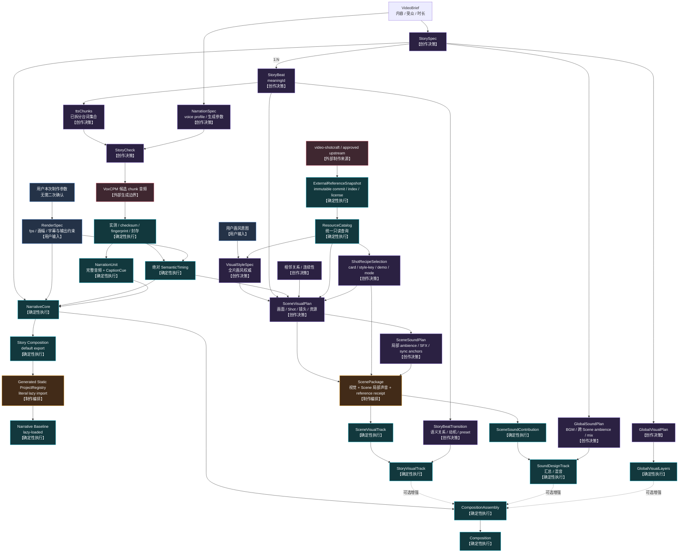
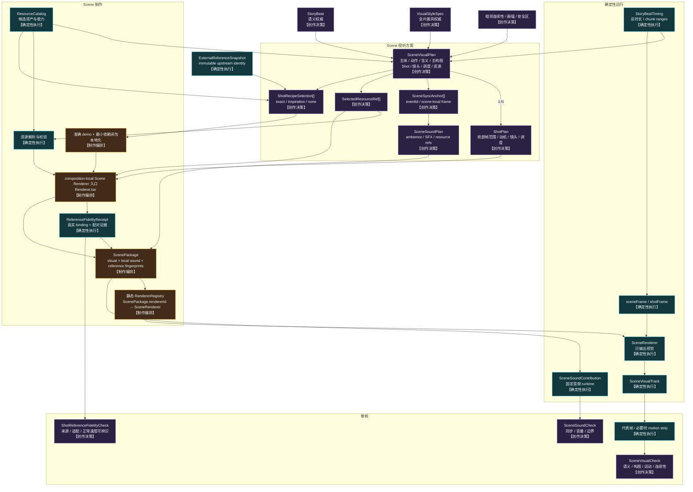

# 系统结构

> 文档类型：架构与依赖权威
>
> 最后复核：2026-08-08
>
> 当前完成状态只在 [ITERATION_STATUS.md](ITERATION_STATUS.md) 维护。

## 节点责任

```text
【创作决策】决定表达什么，以及采用什么视觉、声音和审美方案
【制作编排】把已确定方案落实为资源引用、源码、组件和静态绑定
【确定性执行】脚本、组件或运行时根据确定输入生成可重复结果
【外部生成边界】允许调用结果非 bit-by-bit 可重复的服务，输出先作为候选产物
```

Agent 贯穿创作与制作过程：参与创作决策、完成制作编排并调用确定性工具，但不作为
结构节点，也不进入正式渲染运行时。自动化只能检查和执行已确定输入，不能自行选择
StoryBeat、Scene 方案、Shot、资源、镜头、声音或转场。

M9.5 已把 Agent 与固定执行的交界落成合同；后续 v4 在同次 freeze 中生成每个 meaningId 的
Scene assignment 和一份 whole-film GlobalVisual assignment。N+1 owner 只写各自独占目录并先
运行非终态 check，主 Agent 复检后串行提交 immutable result。append-only event ledger 和
generated state projection 由中央脚本单写。这里的 `ProductionRunState` 是制作期投影，不是
手工状态，也不进入 Remotion runtime；repo 不保存 Agent/task/thread/progress/heartbeat 状态。

## Project 可删除性与单向依赖

具体 Project 是 ignored 的 `src/projects/<storyId>/` 与 `public/projects/<storyId>/` 本地叶节点，
不进入 Git 版本管理，可独立保留、归档或经明确授权后删除。依赖方向只能是具体 Project →
contracts/runtime/capabilities/production core；core、中央 package scripts 和 active 配置不得
枚举或分支判断具体 `storyId`。Project 自有测试、工具和 `verification.profile.json` 随 Project
一起存在或消失。

bundle 前生成的 ProjectRegistry 和 ResourceCatalog 是“当前 Project 集”的静态投影：允许零
Project，仍使用稳定排序、字面量 `import()` 与 `lazyComponent`；render runtime 不扫描目录。
两份聚合投影同样是 ignored 本地文件，由 `npm run bootstrap` 在 install、test、typecheck、lint、
build、dev 和 Composition listing 前重建。fresh clone 默认投影零 Project，只保留系统级
`CapabilityGallery`。删除或新增 Project 后只重算投影，不修改 Root 或 core 配置。`out/` 是本地
预览/证据输出，`deliveries/` 是不可覆盖的本地 release 叶节点；两者都不是源码健康前置条件。
历史媒体、用户批准和交付 release 只由显式 Project-owned 或 `delivery:*` 命令复验。

## M10 本地交付边界

M10 位于用户批准之后，是独立于 production orchestration 和 Remotion render runtime 的固定
应用层：

```text
Project-owned delivery spec + cover source
current FinalAssembly + FinalPreviewEvidence + FinalPreviewApproval + passing final-v2
approved exact preview
  → scripts/delivery/application
  → fixed local media/filesystem adapters
  → deliveries/<storyId>/<releaseId>/
```

`src/contracts/delivery.ts` 定义 future-only v1 contract 和 identity；`scripts/delivery/` 继续按
`cli / application / domain / adapters` 分层。application 只编排 current input、媒体检查和
封存；domain 只生成 canonical publishing/handoff/checksum 内容；adapters 只处理固定本地路径、
FFprobe/FFmpeg 和 Project-owned Remotion Still。delivery 不 import Project runtime，不进入
Composition，也不读取 Agent、Skill、MCP、Git、网络、账号、密钥或权限。

`releaseId` 由 approval、FinalAssembly 和交付规格 fingerprint 派生。交付规格同时绑定
Project-owned 的 `delivery/Covers.tsx`、`Root.tsx` 和 `index.ts` source checksums，因此修改封面
构图会得到新 release identity；旧 release 不迁移、不覆盖。写入先发生在固定 `.staging`，全部
媒体和 checksum 复验成功后以目录 rename 封存。任何绝对路径、`..`、符号链接、未知文件、
非 current input 或半成品都 fail closed。

## 当前设计顺序

Scene 外部叙事生产主链按以下顺序推进：

```text
用户任务 → ProductionRequirementsFreeze（M9.5）
VideoBrief → StorySpec + NarrationSpec → StoryBeat + authored ttsChunks → StoryCheck
用户本次制作参数 → RenderSpec（结构化与机械校验，不二次确认）
StoryCheck → VoxCPM generation boundary → sealed narration
sealed narration + RenderSpec → SemanticTiming + CaptionCue
→ NarrativeCore
→ Generated Static ProjectRegistry + lazy-loaded Composition
→ Narrative Baseline
→ fixed project:check + persisted AutoCheck（M4）
```

M4 历史上已完成 Narrative Baseline 的机械验证闭环；当前 core 保留透明 NarrativeCore、
zero-safe 本地 registry 生成与机械检查，具体作品 Composition、媒体和 evidence 不再随 Git
分发。
`project:check` 以只读固定顺序聚合 M1–M3 权威并校验 persisted AutoCheck drift。主观叙事
质量审核和 NarrativeCheck 均未实现。

M4 的边界位于：

- `src/contracts/auto-check.ts`：strict report、固定 check/evidence 顺序和 report fingerprint；
- `scripts/project-check/`：固定作品发现、只读聚合、pass-only 原子写入和 exact CLI；
- `scripts/baseline/evidence.ts`：M3 collector 与 persisted receipt 的独立只读复验；
- `src/projects/<story>/generated/narrative-auto-check.generated.json`：本地 Project 的持久化
  AutoCheck。

这些检查代码不进入 Remotion render runtime，也不调用 Agent、skill、MCP、provider 或网络。

这条主链必须在不存在 ScenePackage、renderer registry、视觉资源目录、SoundDesignTrack
和 GlobalVisualLayers 时独立工作。Scene、声音和全局效果是只读消费叙事主链的下游增强
轨；M6 已把 VisualStyleSpec、ScenePackage、外部镜头参考、本地化/保真、registry 和
visual/local-sound 投影落成通用基础，并用独立 synthetic proof 验证。M7 已为 GPS 创建五个
正式 Scene，并在真实 Composition 中装配两类投影；M8 已在其上增加全局投影与最终装配，
没有改写 M7 ScenePackage。M9 使用同一边界完成十 Scene 的竖屏产品漫画，并保持 GPS
产物零差异。详细流程见
[PRODUCTION_WORKFLOW.md](PRODUCTION_WORKFLOW.md)。

已实现的 Narrative Baseline 通过 generated static ProjectRegistry 注册为 Story Composition。
ProjectRegistry 的注册元数据静态可枚举，具体 Composition 代码通过 Remotion
`lazyComponent` 按需加载。它不读取 ScenePackage，也不导入 Scene renderer；它与
composition-local RendererRegistry 是两个独立装配边界。

### Composition 注册边界

```text
src/projects/<story>/Composition.tsx（default export）
+ 已校验 Story ID / RenderSpec / SemanticTiming
        ↓ bundle 前固定生成步骤
src/projects/project-registry.generated.ts
（静态元数据 + 字面量 () => import("./<story>/Composition")）
        ↓
Root 映射为 <Composition lazyComponent={entry.load} ... />
        ↓ 选中 / preview / render 时
Webpack 按需加载该 Story Composition
```

这里的“动态”只指 Composition 模块按需加载，不指运行时发现项目：

- 生成器只扫描固定一级目录 `src/projects/*/Composition.tsx`，稳定排序并拒绝非法 slug、
  重复 Composition ID、缺失合同或缺失 timing；
- ID、fps、width、height、durationInFrames 和小型 JSON-serializable defaultProps 在 registry
  中预先确定，Remotion 无需加载 Composition 就能列出它；
- 每个 registry import 都是生成后的字面量路径，模块路径不得来自 JSON、网络或字符串
  拼接；
- `Composition.tsx` 必须 default export，以满足 Remotion `lazyComponent` 的 Suspense
  加载约束；
- 所有 Story Composition 使用共同的 `StoryCompositionProps`；registry 的 defaultProps
  只传 `projectId` 等小型稳定标识，完整 Story、timing 和 manifest 留在项目模块内；
- `registerRoot()` 仍只在独立入口调用一次；Root 只读取 generated registry 并映射
  `<Composition>`；
- 正式 render runtime 不扫描文件系统，不生成 registry，也不动态改变 Composition 列表。

### Composition 组合模型

Composition 在语义上由一个必需主干和三个可选增强轨组成：

```text
Composition
├── NarrativeCore                  必需
└── EnhancementTracks              可选集合
    ├── StoryVisualTrack
    ├── SoundDesignTrack
    └── GlobalVisualLayers
```

在 CompositionAssembly 代码边界中，四者是并列的运行时装配输入；它们不互相包含，但也
不应被抹平成一个充满可选字段的万能 `Track` 类型。运行时分轨不等于创作数据分离：一个
ScenePackage 同时拥有 Scene 视觉贡献与局部声音贡献，StoryVisualTrack 和
SoundDesignTrack 分别汇总这些贡献。实现采用三层组合边界：

1. 抽取小而稳定的底层能力，例如时间线贡献、视觉贡献、音频贡献和 fingerprint
   依赖；
2. 用这些能力组合出 `NarrativeCore`、`StoryVisualTrack`、`SoundDesignTrack` 和
   `GlobalVisualLayers` 四个强语义聚合，由各自类型保证必需字段和领域约束；
3. `CompositionAssembly` 通过显式插槽接收四个聚合，再在内部展开为固定顺序的
   视觉层和音轨。

M8 已实现的源码装配边界为：

```ts
type CompositionAssemblyProps = {
  readonly narrativeCore: ReactNode;
  readonly storyVisualTrack?: ReactNode;
  readonly globalVisualLayers?: ReactNode;
  readonly soundDesignTrack?: ReactNode;
};
```

这是源码组装边界，不是允许 JSON 保存 React 组件或任意执行表达式的数据合同。GPS 调用方
传入全部四槽位；Narrative Baseline 调用仍可只传 `narrativeCore`。固定视觉顺序为 Scene、
GlobalVisual、Caption，固定音频顺序为 narration、Scene-local ambience/SFX、跨 Scene
ambience/BGM；不存在万能 track 数组或空壳运行时。

### 已实现的 M2 模块

```text
src/contracts/story-check.ts                     StoryCheck 严格合同与 current-input 校验
scripts/narration/domain/provider-input.ts       redaction-safe provider/request fingerprints
scripts/narration/domain/candidate-progress.ts   candidate / measured 状态与续跑规划
scripts/narration/domain/pcm-wav.ts              canonical PCM、checksum、BigInt 拼接
scripts/narration/domain/seal.ts                 完整 measured batch → seal 纯领域装配
scripts/narration/adapters/private-config.ts     Git-ignored 默认/外部覆盖私有配置与 profile 解析
scripts/narration/adapters/voxcpm-client.ts      每 authored chunk 一个直接 VoxCPM 请求
scripts/narration/adapters/ffmpeg-normalizer.ts  host FFmpeg 规范化
scripts/narration/adapters/candidate-workspace.ts checksum-verified resume 与原子 progress
scripts/narration/adapters/atomic-files.ts       lock、immutable promotion 与 atomic receipt
scripts/narration/{generate-runner,seal-runner,check,cli}.ts
                                                  生成、封存、只读检查和固定命令
```

这些模块不 import Remotion，不注册 Composition，也不读取或实现 Scene。候选与 measured
artifact 只存在于 ignored work tree；content-addressed WAV、active manifest 和
SemanticTiming 才是 M2 持久产物。

### 已实现的 M3 模块

```text
src/contracts/narrative-baseline.ts
                                              registry/Baseline/evidence schemas 与 fingerprints
src/remotion/runtime/narrative-core/          single audio、顶层字幕、透明 NarrativeCore
src/remotion/runtime/composition-assembly/    required narrativeCore slot only
src/projects/<story>/Composition.tsx          ignored local data validation + default export
scripts/registry/                             fixed discovery、AST check、stable atomic generation
src/projects/project-registry.generated.ts    ignored local projection + literal lazy import
src/Root.tsx                                  System component + Stories lazyComponent 映射
scripts/baseline/evidence.ts                  PNG alpha、MP4 streams/frames 与 receipt
```

M3 runtime 只读取本地静态源码、项目 JSON 和 M2 sealed artifacts；Root 不读取 Story 内容，
runtime 不扫描目录。

### 已实现的 M6 模块

```text
src/contracts/{visual-style,scene-primitives,resource-catalog,external-reference,
               shot-recipe,reference-fidelity,scene-task,scene-package,final-check}.ts
scripts/catalog/                       ResourceCatalog 生成、查询与漂移检查
scripts/external-references/           snapshot、Shotcraft resolver/localizer 与 fidelity
scripts/scene-package/                 pass-only ScenePackage/Coverage 生成与检查
scripts/renderer-registry/             composition-local 静态 registry 生成与检查
src/remotion/runtime/story-visual/     fixed Beat window 的纯视觉 Scene 投影
src/remotion/runtime/scene-sound/      fixed Beat window 的 Scene-local 音频投影
src/remotion/runtime/composition-assembly/ 可选 visual/sound 显式插槽
scripts/project-check/final-run.ts     v1 十项与声明 final assembly 项目的 v2 十五项机械聚合
src/remotion/proofs/m6-scene-runtime/  与 ProjectRegistry 隔离的 synthetic proof
```

所有生成器都是 pass-only、原子、byte-stable；check mode 只读。runtime 只消费静态 registry、
已校验合同和 `public/` 本地资产，不调用 Agent、skill、MCP、Git、网络或目录扫描。

### M8 历史验证过的本地 Project 模块

```text
src/contracts/{global-sound,global-visual,final-assembly,final-preview}.ts
src/remotion/runtime/global-sound/       frame-driven global buses 与 duck envelope
src/remotion/runtime/composition-assembly/ 四个显式语义插槽
src/projects/gps-relativity/global-visual/ project-local GlobalVisualLayers
scripts/final-assembly/                  FinalAssembly pass-only writer/checker
src/projects/gps-relativity/tools/       project-local global audio/freeze/media/evidence/approval
scripts/project-validation/              current Project profile discovery + controlled adapters
generated/final-mechanical-check.generated.json final-mechanical-check-v2
```

identity chain 为 M7 SoundDesignProjection + GlobalSoundPlan → FinalSoundProjection，M7
ScenePackage/registry/projection + global sound/global visual + Composition source/Remotion exact
version → FinalAssembly，完整媒体/review → FinalPreviewEvidence，真实用户决定 →
FinalPreviewApproval → `final-mechanical-check-v2`。任一上游或媒体字节变化只向下游失效，
checker 不修复或自动重签。

### M9 历史验证过的本地第二主题模块

```text
src/projects/product-comic-vertical/      十 Beat/十 ScenePackage 的 9:16 漫画作品
src/projects/product-comic-vertical/references/video-shotcraft/
                                           104/161/161 inventory、coverage 与 exact closure
src/projects/product-comic-vertical/global-visual/
                                           project-local 漫画连续性层
src/projects/product-comic-vertical/tools/
                                           project-local Scene/global audio、Shotcraft、evidence、approval
generated/m9-fail-closed-matrix.generated.json
                                           42-case isolation evidence
generated/m9-generalization-report.generated.json
                                           四类两主题泛化结论
```

上述具体 M8/M9 Project 路径是历史实现结构与本地作品结构说明，不属于 fresh clone 的 tracked
core；其可复验性取决于对应本地 Project、媒体和 evidence 是否存在。

M9 复用同一 NarrativeCore、ScenePackage/runtime、CompositionAssembly、FinalPreview 与 v2
合同；共享修改仅限 Narrative Baseline、Shotcraft closure、high-fidelity voice provider 和
Scene/Final Catalog 的去夹具耦合。漫画设计、十个 Scene、音频、GlobalVisual 和 evidence
编排仍为 project-local。三个 promotion candidates 只记录 proposal，不构成 runtime 或共享
capability 的当前组成。

## 总结构



## M6 Scene 基础与 M7 正式制作：Scene 内部

> M6 已实现本节的数据、生成器、registry 与 runtime 接入边界；M7 已完成 GPS 正式 Story
> Scene authoring、全 ready coverage 和批量 SceneVisualCheck/SceneSoundCheck。它们仍是
> Narrative Baseline 的可选下游，不反向成为叙事主链依赖。



## Scene 级 Renderer 边界

```text
1 StoryBeat = 1 Scene audiovisual production responsibility
1 completed Scene = 1 ScenePackage
1 ScenePackage = 1 Scene-level rendererId + 1 SceneSoundPlan
1 ScenePackage = 1 visual contribution + 1 local sound contribution
1 Scene renderer = N Shot
```

- `rendererId` 只存在于 ScenePackage，并绑定 Scene 级 renderer 入口；ShotPlan 不保存
  `rendererId`、组件或模块路径。
- Narrative Baseline 可以在任何 ScenePackage 产生前独立预览；上面的 ScenePackage
  一一关系描述完成 Scene 视听制作后的可装配结果，不是 Baseline 的前置条件。
- ShotPlan 只描述 Scene 内部的 `shotId`、局部帧范围、视觉动机、镜头、调度和资源引用。
- Scene renderer 可以在自己的目录内拆分任意数量的 Shot 组件和辅助文件，也可以调用
  已批准共享能力；这些内部组件不单独注册到 runtime registry。
- Scene runtime 每个 Scene 只解析一次 `rendererId`，向该入口提供 Scene timing、局部帧
  和已校验资源；Shot 的具体 JSX 与连续运动由 Scene renderer 负责。
- SceneRenderer 始终只输出视觉；ScenePackage 内的局部 ambience、SFX 和同步关系由固定
  Scene audio runtime 消费，不允许 Renderer.tsx 私自挂载旁白或任意音频。
- ScenePackage 不拥有独立时长。它的外层范围严格等于对应 StoryBeatTiming，所有 Shot、
  SceneSyncAnchor 和局部声音 cue 都必须落在 `[0, beatDurationInFrames)` 内；需要跨越 Beat
  边界的声音不属于 SceneSoundPlan。
- TTSChunk 与 CaptionCue 不决定 Shot 数量或边界。Shot 服务同一个 meaningId，可跨越
  多个 TTSChunk，也可在一个 TTSChunk 内切换。

## Scene 并行制作边界

ScenePackage 是 Scene 视听制作阶段的最小并行 Agent 任务。主 Agent 在分发前冻结 Story、
SemanticTiming、VisualStyleSpec、RenderSpec、ResourceCatalog snapshot、允许的
ExternalReferenceSnapshot、相邻连续性摘要和检查要求；子 Agent 只写自己的
`src/projects/<story>/scenes/<meaningId>/`。

```text
1 meaningId = 1 独占 Scene 目录 = 1 Agent 任务 = 1 ScenePackage
```

- 子 Agent 不修改 Story、旁白、字幕、SemanticTiming、VisualStyleSpec、Catalog、共享能力
  源码、RendererRegistry 或其他 Scene；
- 每个任务同时交付 SceneVisualPlan、ShotPlan、SceneSoundPlan、资源/recipe 选择、必要的
  本地化 Shot 源码、Renderer.tsx 和可生成 ScenePackage 所需的全部本地输入；
- 主 Agent 统一校验所有 ScenePackage、生成 composition-local RendererRegistry、汇总运行时
  visual/sound 投影，并执行跨 Scene 连续性和最终预览；
- 子 Agent 找不到资源、时间窗口无法容纳方案或输入自相矛盾时，必须返回显式 fallback 或
  fail 状态，不得扩展 Beat 时长或修改共享输入。

M9.5 第一版已把上述手工汇总边界收紧为以下固定流程：

- 主 Agent 在 TTS 前先冻结 `ProductionRequirementsFreeze`，其中绑定 RenderSpec 的画幅/fps/
  字幕要求、NarrationSpec 的 voice profile 和所有结构化额外要求；
- Baseline 后，主 Agent 冻结 `StoryResourcePool` 和 `SceneProductionBrief`。候选池覆盖整个
  Story 可能使用的批准资源，不替 Scene 做精确选择；
- 固定 freeze script 为每个 meaningId 生成只读 `SceneAssignment`，绑定 requirements/style/
  timing/pool fingerprints 和独占路径；
- Scene Agent 可以精确选择候选池子集或零资源，也可 project-local 自行实现；池外资源和
  共享输入修改 fail closed；
- Scene Agent 通过 submit/fail CLI 生成 `SceneProductionResult`，不写 coverage、registry、
  Composition、中央 events 或 state；
- watcher 轮询结果；任一 error/timeout/malformed/stale 即停止，全部 success 后由固定脚本
  生成 coverage、registry、projection、Composition 和机械 Preview；
- submit/post-scene 对 selected-resources envelope 使用同一 strict parser；replacement start 只
  识别 byte-exact generated scaffold，Composition listing 保留 stdout，媒体时间线以视频流而非
  含 AAC padding 的 container duration 为权威；
- M9.5 不运行 SceneVisualCheck/SceneSoundCheck 的 Agent 审美结论，成功只表示
  `mechanically-ready`，语义和审美留给用户完整预览。

当前 Codex 主 Agent 在 watcher 和 Scene Agent 工作期间必须保持任务运行，但可以逻辑上只等待。
repo 内脚本不创建/托管 Agent，也不承诺主任务结束后的 detached lifecycle。完整计划见
[M9.5 历史实施计划](archive/implementation-plans/2026-08-04-m9-5-contract-driven-production-orchestration-plan.md)。
首次真实 lifecycle 与 hardening 证据见
[M9.5 Production Trial and Hardening Evidence](evidence/2026-08-05-m9-5-production-trial-and-hardening.md)。

#### v3 production boundary（兼容历史）

v3 Run 在创建任何 scaffold/ledger/narration work 前执行同一 `production:preflight`。VoxCPM
adapter 固定 GET `/health` 与 `/ready`：前者证明服务存活，后者只区分 resident、允许自动装载的
cold/loading 和 external model failure；它不调用 clone/TTS route。Remotion adapter 使用正式
compositions executable、entry 与参数，browser sandbox/permission denial 不归因给 Scene，
也不会触发 `--no-sandbox` 或 fallback。preflight 是 transient 诊断，不写 event/state，不进入
作品 fingerprint。

`production-requirements-freeze-v3` 冻结 `scene-composition-boundary-v1` ownership：
Composition 的 `SceneSafeArea` exactly once 使用完整 readability policy；Scene Renderer 只持有
Beat 语义内容且不接收 raw policy。Renderer 根节点保持透明，不得绘制 Scene-local 安全区底板、
全帧底色、纹理或装饰背景；未使用像素保持透明。NarrativeCore 的 CaptionLayer 仍是唯一字幕
owner。v3 scaffold 直接挂载 StoryVisualTrack，不建立第二个 project-global visual wrapper；当前
`GlobalVisualLayers` enhancement 保持 absent，未来正式接入时独占全局背景、纹理、装饰和连续性
motif。静态 literal imports 进入生成 scaffold，source graph 发现只发生在制作期检查，render
runtime 不扫描目录。v1/v2 runtime 与现有正式项目保持原样。

#### v4 parallel GlobalVisual contract boundary

v4 requirements 绑定 `GlobalVisualBrief`，freeze 原子生成 N 个 Scene assignment 与一个
GlobalVisual assignment。两类 owner 并行创作、互不读取输出：ScenePackage 仍只拥有 Beat
语义视觉和局部声音，GlobalVisualPackage 只拥有 project-local 背景、纹理、装饰和连续性
motif。GlobalVisual source graph 固定从 `global-visual/GlobalVisualLayers.tsx` 进入，使用 Remotion
frame API，不渲染字幕、可见文本、音频或 Scene 语义，不实现 DSL、自动布局或自动导演。

watcher 只轮询 Scene/GlobalVisual immutable result contracts；到达顺序不进入 identity，也不能
由 Agent/task/thread/progress/heartbeat 推断完成。N+1 全 accepted 后，固定 post-scene 生成
GlobalVisualProjection v2、PreviewAssembly v3、Evidence v2 与 MechanicalCheck v2，并把静态
literal GlobalVisual import 接入已有强语义槽位。GlobalSound 继续 absent，v1-v3 和正式作品不
迁移、不回填。

## 外部镜头参考边界

`video-shotcraft` 等上游来源只进入 authoring path：显式 sync 固定完整 commit、解析
Gallery card/style-key、完整配方、准确 demo、preview 和最小依赖闭包；Scene Agent 再把已选
源码/资产本地化到自己的目录。正式 runtime 不访问上游仓库、全局 skill、远程 preview、
浮动 branch/tag，也不把 Catalog descriptor 当成动态 loader。

VisualStyleSpec 仍决定全片皮肤，ShotRecipeSelection 只决定当前 Shot 借用哪种运动结构：

```text
exact-demo-localized  → 必须通过 immutable lineage、真实 Renderer/frame-state binding、
                         source/adaptation 配对证据和正常速度可辨识检查
inspiration-only      → 记录 provenance，但不声明 exact fidelity
none                  → 普通 composition-local 自定义 Shot
```

代码许可证与 bundled audio/image/font 的逐项授权分开校验；未知或不允许当前用途的资产
`blocked`。Gallery preview 是 reference-only 证据，不能作为最终 Scene 视频播放。上游发生新
commit 不自动改变已冻结 Story；只有主 Agent 显式更新 ExternalReferenceSnapshot 并重新分发
受影响 Scene，相关 package 才按 fingerprint fail closed。

## 图层与音轨

```text
视觉层（上 → 下）
CaptionLayer
GlobalVisualLayers / StoryBeatTransition overlay
SceneVisualTrack
透明（无必需背景层）

非视觉音轨
NarrationAudioTrack
SoundDesignTrack：Scene-local ambience/SFX + GlobalSoundPlan
```

NarrativeCore 不渲染背景或其他全帧视觉，其唯一视觉输出是 CaptionLayer。StoryVisualTrack
和 GlobalVisualLayers 都缺失时，Composition 的其余视觉区域保持透明；具体容器、预览器
或输出编码如何呈现透明区域，不是 NarrativeCore 的责任。

SoundDesignTrack 是运行时汇总和混音视图：Scene 局部 ambience/SFX 的创作权威来自有序
ScenePackage，BGM、跨 Scene ambience、ducking 与 mastering 来自 GlobalSoundPlan。运行时
可以统一展开这些音频贡献，但不得生成或维护第二份 Scene SFX 计划。

M8 保留 M7 `SoundDesignProjection` fingerprint 不变，并新增 `FinalSoundProjection` 绑定
GlobalSoundPlan、current Catalog、两条全局资产 checksum、duck envelope 与 mastering policy。
GlobalVisualLayers 在 GPS 与产品漫画中分别是 project-local 固定组件，只消费各自 strict
plan/projection 和 Remotion frame API；它们不进入共享 capability、不渲染字幕，也不解释
任意 Scene DSL。

CaptionLayer 字号固定为 40 px。它从 Composition 宽高计算横屏、方形和竖屏的最大字幕
宽度，并把 RenderSpec 显式安全区与按宽高计算的响应式最小 inset 合并；最终宽度永远不
超过安全区剩余空间。

## 时间坐标

```text
compositionFrame：完整视频绝对帧
sceneFrame = compositionFrame - sceneStartFrame
shotFrame = sceneFrame - shotStartFrame
```

所有持久化范围统一为左闭右开的 `[startFrame, endFrame)`，并明确使用绝对帧还是局部帧。
Scene 外层范围直接读取 StoryBeatTiming；`sceneFrame = absoluteFrame - beat.startFrame`。
修改 Scene 内部视觉或局部声音不会改变该范围，也不会移动后续 Beat；只有重新生成上游
SemanticTiming 才会重算后续绝对帧并使依赖它的 ScenePackage 失效。
音频边界先在 canonical PCM 的累计整数样本坐标中建立，再统一向上量化到帧；不得逐
chunk 把浮点秒数转帧后相加。唯一公式见
[确定性执行：音频样本到帧](DETERMINISTIC_EXECUTION.md#8-音频样本到帧的唯一算法)。

## Remotion 对应

```text
Story                 -> Composition
StoryBeat             -> 语义数据 + Scene 外层 Sequence
Scene                 -> 独立视听制作任务 + 一个 Scene renderer 入口 + SceneSoundPlan
Shot                  -> Scene renderer 内部的局部 Sequence 或组件；无 registry 绑定
NarrationAudioTrack   -> Composition 绝对音轨
CaptionLayer          -> Composition 顶层透明视觉层
SceneSoundPlan        -> 固定 Scene 窗口内的 ambience / SFX 音频贡献
StoryBeatTransition   -> Scene 边界上的等时长视觉实现
```

`<Sequence>` 只提供局部时间和挂载范围。图层叠加由 JSX 同时存在、节点顺序、定位与
z-index 决定；Sequence 数量不等于 Scene 或 Shot 的业务数量。

## 确定性装配边界

Assembly 可以校验、定位、查 registry、装配图层和执行已声明 preset；不能选择或重排
StoryBeat，不能改台词和 timing，也不能自动选择资源、Shot、镜头、renderer 或转场。

确定性执行由合同校验、固定 CLI、静态 registry、通用 Remotion runtime 和 fingerprint
失效机制共同实现，不由一个万能执行器承担。VoxCPM 结果在生成后通过实测、checksum
和 fingerprint 封存，再成为后续时间权威。完整设计见
[DETERMINISTIC_EXECUTION.md](DETERMINISTIC_EXECUTION.md)。
