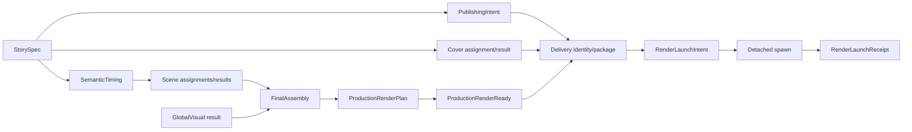

# 系统结构

> 文档类型：架构权威
>
> 最后复核：2026-08-09

## 分层

```text
src/contracts/                 strict data contracts and pure fingerprints
src/remotion/runtime/          offline frame-driven render runtime
src/remotion/capabilities/     explicitly promoted shared capabilities
src/projects/<story>/          ignored project-local source and generated authority
scripts/production/cli.ts      fixed CLI dispatch only
scripts/production/application use-case orchestration
scripts/production/domain/     pure run/event/projection rules
scripts/production/adapters/   filesystem/provider/process boundaries
scripts/delivery/cli.ts        delivery build/check dispatch
scripts/delivery/application/  input loading, package, launch, check
scripts/delivery/domain/       deterministic delivery model and canonical bytes
scripts/delivery/adapters/     filesystem, Cover media, detached spawn
```

CLI 入口保持薄；用例编排、纯规则和 external I/O 不平铺混合。render runtime 永远不调用
production/delivery scripts 或外部系统。

## Authority graph



任何 downstream artifact 都绑定 upstream fingerprint；current 输入漂移使其 fail closed，而不是
被脚本修复或回填。

## Production state

ProductionRun 是 append-only ledger 的派生投影：

```text
.producer-runs/<runId>/
├── run.json
├── events/
├── scene-results/
├── global-visual-result.json
├── state.generated.json
└── lock/
```

只有中央 repository CLI 写 event/state。Scene/GlobalVisual child 只写 assignment-owned source；
root 复检后 submit immutable results。repo 不存 Agent lifecycle、task、thread、progress 或
heartbeat。

当前状态机只接受：production-start → narrative → scene-freeze → scenes → render-ready。终态绑定
`production-render-plan-v1` 与 `production-render-ready-v1`，不包含媒体渲染阶段。

Scene authoring 期使用 repository-local `.agents/skills/remotion-best-practices/SKILL.md` router 与
按需 references，但 AGENTS、assignment、contracts 和 validators 优先。该 Skill 不进入
ProductionRun、ScenePackage fingerprint、ResourceCatalog 或 render runtime，也不改变 child 的
exclusive ownership。

## Composition ownership

Composition exactly once 提供 SceneSafeArea、NarrativeCore、CaptionLayer、GlobalVisual background
与 Scene track。Scene renderer 根透明且只画 current Beat 语义；ScenePackage owns Scene-local
ambience/SFX，不拥有旁白、字幕或全局音频。GlobalVisual owns project-local 背景/纹理/装饰/motif，
不读取 Scene output。`GlobalVisualLayers` 实现统一满足 runtime 的无 Props 组件类型；Composition
顶层独立解析 GlobalVisual plan/projection 并做 identity 校验。

ProjectRegistry 在 bundle 前按固定一级目录生成静态 TypeScript，Composition 用字面量
`import()` 与 `lazyComponent`；render runtime 不扫描目录或读取动态模块路径。
render-ready 的 compile gate 以 current Project `Composition.tsx` 为唯一 TypeScript root，让编译器
沿真实 imports 收集依赖，不枚举或阻塞其他 ignored Projects。

## Automatic delivery

delivery package 是 immutable directory，identity 绑定 PublishingIntent、CoverResult、render
plan/ready、Composition、exact argv 和 launch policy。manifest 只保存 planned frames/fps/duration，
不保存实际媒体事实。

intent-before-spawn/receipt-after-spawn 构成 exactly-once boundary。由于进程可能已经启动但 receipt
write 尚未成功，intent-without-receipt 无法安全判断，必须永久拒绝重试。receipt 只保存 intent
fingerprint、deliveryId、startedAt 与 spawn acknowledgement policy，不保存 PID 或 exit status。

detached adapter 不注册 exit/close listener，不拥有 child lifecycle。delivery check 只验证
package/intent/receipt；exact planned MP4 path 即使存在也不被读取或解释。

## Filesystem 与安全

- Project、public media、Run、out、deliveries 是 ignored local production artifacts。
- bootstrap 从 zero Project 重建 core proof assets、Catalog 与 Registry。
- delivery staging/target/output 路径逐级拒绝 symlink、escape、unknown entries 和覆盖。
- protected voice profiles/private config 不被通用扫描、stage 或 commit。
- Project deletion proof 只在 `mktemp` 隔离副本运行。
- 真实作品删除只通过 `project:delete`：一次预检后按 storyId 删除 `src/projects/`、
  `public/projects/`、`.narration-work/`、`.producer-runs/`、`out/` 与 `deliveries/` 中的全部绑定数据，
  再重建 Catalog/Registry。一个、多个与全部 Project 使用同一语义；core、其他 Project 和
  `public/voice_profile/` 永远不属于删除目标。
- `project:delete` 要求显式 `--confirm-delete`，并在 delivery staging 非空、目标 Run 有 writer
  lock、路径为 symlink/非目录或指定 storyId 不存在时，于任何删除发生前 fail closed。

## Extension boundary

新 Scene 能力默认留在 project-local。移入 `src/remotion/capabilities/` 必须先有具体、
fingerprint-bound promotion proposal，并获得用户对范围、API、文件与目标路径的明确授权。
