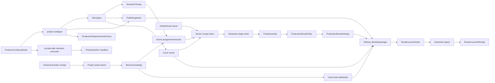

# 系统结构

> 文档类型：架构权威
>
> 最后复核：2026-08-16

## 分层

```text
src/contracts/                 strict data contracts and pure fingerprints
settings/contracts/            shared API DTO and runtime validation authority
settings/client/               browser-only React features, hooks and styles
settings/server/               same-origin local API, diagnostics and read-only progress projection
scripts/config/                private config read/write/migration boundary
src/remotion/runtime/          offline frame-driven render runtime
src/remotion/capabilities/visual-components explicitly promoted visual components
src/remotion/capabilities/scene-templates approved copy-on-configure Scene templates
proofs/scene-runtime/          isolated proof source, generated fixtures and evidence
src/projects/<story>/          ignored project-local source and generated authority
scripts/production/cli.ts      fixed CLI dispatch only
scripts/production/application use-case orchestration
scripts/production/domain/     pure run/event/projection rules
scripts/production/adapters/   filesystem/provider/process boundaries
scripts/project-assets/cli.ts  external asset import CLI dispatch
scripts/project-assets/application Project-local import and Catalog orchestration
scripts/project-assets/domain/ provider-neutral identity and media rules
scripts/project-assets/adapters/ provider receipt and protected filesystem boundaries
scripts/delivery/cli.ts        delivery build/check dispatch
scripts/delivery/application/  input loading, package, launch, check
scripts/delivery/domain/       deterministic delivery model and canonical bytes
scripts/delivery/adapters/     filesystem, Cover media, detached spawn
scripts/shared/                business-neutral atomic files, process ports and host media adapters
scripts/projects/delete.ts     preflighted destructive Project data cleanup
scripts/projects/configure.ts  new-Project ProducerConfig freeze application/CLI
scripts/projects/application/  Project-local Scene template instantiation use cases
scripts/scene-templates/       repository-wide Scene template authoring projections
```

CLI 入口保持薄；用例编排、纯规则和 external I/O 不平铺混合。render runtime 永远不调用
production/delivery scripts 或外部系统。`scripts/shared/` 只接纳无业务语义的窄接口与宿主适配器，
不得成为跨模块 service locator；`tests/architecture/script-layering.test.ts` 执行检查 domain、
application、adapter、Project template instantiation、Scene template projection 与跨流程依赖方向。
settings client 不依赖 Node、scripts 或 server；progress server 只消费 production/delivery 的只读
application query，不直接读取它们的 filesystem adapters。`proofs/` 不进入正常 Root/Registry，
其中 `source/`、`fixtures/`、`evidence/` 分别承担可执行证明、生成输入快照和真实媒体证据。

## Authority graph



任何 downstream artifact 都绑定 upstream fingerprint；current 输入漂移使其 fail closed，而不是
被脚本修复或回填。

## Production state

ProductionRun 是 append-only ledger 的派生投影：

```text
.producer-runs/<runId>/
├── run.json
├── events/
├── owner-receipts/
├── owner-results/
├── scene-results/
├── global-visual-result.json
├── watcher-launch-intent.json
├── watcher-launch-receipt.json
├── state.generated.json
└── lock/
```

只有 detached watcher 写 event/state、正式 results、registry convergence 与 delivery。owner
独立 Codex task 只写 assignment-owned source，再向固定 inbox 原子发布 ready/failed receipt。
repo 不存 Agent lifecycle、task、thread、progress、聊天或 heartbeat。

当前状态机只接受：production-start → narrative → scene-freeze → waiting-for-owner-results →
render-ready。缺失 receipt 永久等待，不使用 assignment deadline、heartbeat、timeout 或 retry。
终态绑定
`production-render-plan-v4` 与 `production-render-ready-v4`，不包含媒体渲染阶段。render plan
同时绑定 sealed narration 与其确定性、content-addressed 响度母带。

Scene authoring 期使用 repository-local `.agents/skills/remotion-best-practices/SKILL.md` router 与
按需 references，但 AGENTS、assignment、contracts 和 validators 优先。该 Skill 不进入
ProductionRun、ScenePackage fingerprint、ResourceCatalog 或 render runtime，也不改变 child 的
exclusive ownership。

## External asset boundary

Provider-specific receipt 只存在于 `scripts/project-assets/adapters/`。adapter 将当前 Pexels image
receipt v1 映射为版本化的通用 `ExternalAssetAcquisition` discriminated union；image 已开放，
video/audio 是独立且当前 fail-closed 的扩展 seam。准入负责路径 containment、regular/no-symlink、
真实媒体 identity、原子本地化、不可变来源证据和 Project manifest；ResourceCatalog 只暴露
Project-local `runtime-approved` descriptor。MCP、provider SDK、网络和 credential 不进入 Scene
owner、watcher、delivery 或 Remotion runtime，远程 URL 永远不是 runtime asset source。
另有可选 ignored `private/reference-assets/assets.manifest.json`，只暴露用户已人工确认许可、位于
`public/assets/library/` 的共享音频 `localize-asset` descriptor，并校验 fixed local license evidence。
这些条目只供 authoring 查询，不能作为 runtime resource 或直接进入 Scene/GlobalSound plan；外部
audio 的 Project-local import 仍未开放。

## Composition ownership

StorySpec v3 把 `narrated-scene` 与 `silent-scene` 作为严格联合。首尾 silent Scene 是普通 StoryBeat，
通过 SceneAssignment、ScenePackage、RendererRegistry、StoryVisualTrack 与 SoundDesignTrack；
不存在专用 Intro/Outro package、boundary sound track 或顶层 shell。silent preset 不保存位置 role，
只绑定视觉意图、音效意图、固定帧数、资源 ID 与 fingerprint，SemanticTiming 按 StoryBeat 顺序把它们
与 sealed PCM narrated windows 解析为连续全片时间轴。ProducerConfig 的首尾字段只是业务选择；
`project:configure` 从 `src/remotion/capabilities/scene-templates/` 复制完整源码与资源到 Project-local
Scene 并冻结 `template-copy` instance。freeze 不回读共享模板，只机械投影 plans、校验并直接 submit；
共享模板后续变化不会传递到既有 Project。Composition exactly once 提供
SceneSafeArea、NarrativeCore、CaptionLayer、GlobalVisual background 与 Scene track。Scene renderer
根透明且只画 current Beat 语义；ScenePackage owns Scene-local
ambience/SFX，不拥有旁白、字幕或全局音频。GlobalVisual owns project-local 背景/纹理/装饰/motif，
不读取 Scene output。`GlobalVisualLayers` 实现统一满足 runtime 的无 Props 组件类型；Composition
顶层独立解析 GlobalVisual plan/projection 并做 identity 校验。

ProjectRegistry 在 bundle 前按固定一级目录生成静态 TypeScript，Composition 用字面量
`import()` 与 `lazyComponent`；render runtime 不扫描目录或读取动态模块路径。
Registry 发现只注册显式使用 current StorySpec schema 的 Project；明确的非 current Project
保留在本地供配置页展示和严格删除，但不读取其旧合同、不进入 runtime import graph。根
TypeScript 检查同样不枚举 ignored `src/projects/` 或 `out/`，current Project 只经生成 Registry
进入真实 import graph。
render-ready 的 compile gate 以 current Project `Composition.tsx` 为唯一 TypeScript root，让编译器
沿真实 imports 收集依赖，不枚举或阻塞其他 ignored Projects。

## Automatic delivery

Root 以 `production:watch:start` exactly once 写 watcher launch intent，并只在 OS `spawn` 后写
receipt。intent-only 是 watcher-launch-ambiguous，禁止自动重试。watcher receipt 只证明 worker
启动，不证明 production 成功。root 随后使用 `create_thread` 派发共享 checkout 的 N+2 独立任务，
不调用 wait/read/poll，派发后立即结束。

每个 Project 只有 `deliveries/<storyId>/` 一个 current delivery slot。slot 内 package 对其 identity
是 immutable 的，identity 绑定 PublishingIntent、CoverResult、render plan/ready、Composition、
exact argv、launch policy 与实际使用资源的 attribution fingerprint/checksum；新 identity 通过
staging backup + promote 受控替换旧 package，不形成
历史 delivery 目录。manifest 只保存全片 planned frames/fps/duration，不保存实际媒体事实。
发布章节只对应 narrated Scene，并直接使用 SemanticTiming 的绝对 startFrame。
`delivery-publishing-v2` 投影发布文本、章节以及 package 内 MP4、4:3 Cover、3:4 Cover 的固定文件名，
不保存媒体完成状态。

intent-before-spawn/receipt-after-spawn 构成 exactly-once boundary。由于进程可能已经启动但 receipt
write 尚未成功，intent-without-receipt 无法安全判断，必须永久拒绝重试。receipt 只保存 intent
fingerprint、deliveryId、startedAt 与 spawn acknowledgement policy，不保存 PID 或 exit status。

detached adapter 不注册 exit/close listener，不拥有 child lifecycle。delivery check 只验证
package/intent/receipt；exact planned MP4 path 即使存在也不被读取或解释。

## Filesystem 与安全

- Project、public media、narration work、Run、out、deliveries 是 ignored local production
  artifacts。
- bootstrap 从 zero Project 重建 core proof assets、Catalog 与 Registry。
- delivery staging/target/output 路径逐级拒绝 symlink、escape、unknown entries 和覆盖。
- protected voice profiles/private config 不被通用扫描、stage 或 commit。
- `private/producer.config.json` 是权限 `0600` 的 ignored 文件；配置 API 默认只监听 loopback，显式
  `dev:lan` 才监听可信局域网，并始终要求 Origin/Host 精确同源。完整 token 不写日志、不进
  localStorage；LAN 端口不得暴露到公网。声线与可选 BGM 预设只接受仓库相对路径。BGM 预设尚未
  接入 current `globalSound: none` 的 Project freeze/render 路径；render runtime 不读取 ProducerConfig。
- 配置页从 `src/projects/` 的 source Project 与 current Run manifest storyId 的并集生成展示列表；
  `out/`、deliveries 等 output-only 清理目标不进入进度页。每个 Project 只读取其最新 current Run。
  删除 API 则继续使用独立的严格 ownership discovery，要求精确同源 JSON 与 Project ID 二次确认，
  并直接调用同一个 `deleteProjectData`，不复制或弱化 CLI 的预检、目标集合与 Catalog/Registry
  重建语义。
- 删除器在移除 Project 源码前先原子发布排除目标 Project 的 Registry，避免本地 Remotion Studio
  在删除窗口读取到指向已移除 Composition 的旧 import，并终止承载删除 API 的开发进程；若后续
  删除失败，异常路径会按磁盘真实状态重建 Registry 与 Catalog，不能隐藏仍存在的 Project。
- `production:start`、`project:configure`、`delivery:build` 与 Project 删除共享 repository operation
  lock；删除还会独占全部目标 Run writer locks，并在持锁后重读、比较 Project identity 与完整目标集。
  并发 mutation、active writer 或目标漂移均在第一次 `rm` 前 fail closed。
- 新 Project 只由 `project:configure` 将 defaults 写入 immutable Project contracts；new Run 将
  provider-attempt 与 mastering policy 写入 private-safe execution snapshot。narrative application
  可以为 drift check 重读私密配置，render/delivery runtime 仍只消费 Project/Run immutable inputs。
- Project deletion proof 只在 `mktemp` 隔离副本运行。
- 真实作品删除只通过 `project:delete`：一次预检后按 storyId 删除 `src/projects/`、
  `public/projects/`、`.narration-work/`、`.producer-runs/`、`out/` 与 `deliveries/` 中的全部绑定数据，
  再重建 Catalog/Registry。一个、多个与全部 Project 使用同一语义；core、其他 Project 和
  `public/voice_profile/` 永远不属于删除目标。
- `project:delete` 要求显式 `--confirm-delete`，并在 delivery staging 非空、目标 Run 有 writer
  lock、路径为 symlink/非目录或指定 storyId 不存在时，于任何删除发生前 fail closed。
- 删除器不解析旧 Run 的 production contract/state/event；它只从结构有效的 `run.json` 提取严格
  `runId` 与 `storyId` 所有权。这是清理边界，不是旧 Run runtime compatibility。

## Extension boundary

新 Scene 能力默认留在 project-local。移入 `src/remotion/capabilities/` 必须先有具体、
fingerprint-bound promotion proposal，并获得用户对范围、API、文件与目标路径的明确授权。
`src/remotion/capabilities/scene-templates/` 保存可供新 Project 复制的已批准 Scene template；它不是
既有 Project 的 runtime dependency。模板 Renderer 不挂载音频；可选 ignored 本地覆盖只在 bootstrap
由 `scripts/scene-templates/` 独立生成 `scene-template-audio.generated.json` authoring 投影，并在
`project:configure` 时由 `scripts/projects/application/` 把已校验的
`localize-asset` 音频及许可证元数据复制进 Project。复制后的 SFX/ambience 仍由 preset 投影的
`sound-plan.json` 经 Scene sound runtime 播放。该投影可用
`scene-template-audio:generate` / `scene-template-audio:check` 独立生成或只读复验；bootstrap 显式
调用相同生成器，proof asset generator 不拥有该投影。
Root 的 `System` folder 另行提供 `DefaultIntroPreview` / `DefaultOutroPreview` 演示 Composition；
预览外壳只消费模板定义与本地 authoring 投影，不进入 Project Registry、ScenePackage 或
production sound ownership。
