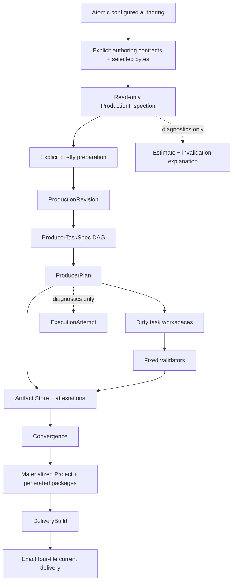

# Architecture

> 文档类型：架构 authority

## 1. 模块与依赖方向

```text
src/contracts/                 JSON-safe versioned contracts
src/remotion/                  runtime capabilities and top-level ownership
src/projects/<storyId>/        ignored Project authoring + materialized current source
scripts/project-production/
  domain/                      pure Revision, DAG, invalidation, plan rules
  application/                 orchestration/use cases and ports
  adapters/                    filesystem, Artifact Store, media, progress, host tools
  cli.ts                       inspect/prepare/check/commit/converge surface
scripts/projects/              atomic Project create/delete use cases and adapters
scripts/narration/             provider attempt cache, PCM validation, seal and timing
scripts/scene-package/          deterministic ScenePackage/Coverage generation
scripts/renderer-registry/      static composition-local registry generation
settings/                      config/progress API and UI
```

`domain/` 不读取 filesystem 且不依赖 application/adapters/CLI。application 编排 use cases，不承载 host
details；adapters 实现 filesystem/process/media ports，不能反向成为业务 authority。`scripts/project-production`
是唯一 production/delivery root，不存在第二条构建链。

## 2. Authority graph



ProductionRevision/TaskRevision/ArtifactAttestation/DeliveryBuildId 是内容 identities；ProductionInspection、
TaskDecisionExplanation、diagnostic baseline 与 ExecutionAttempt 都不是。它们不得进入或改变 dispatch、
materialization、delivery identity/authority。Agent chat、child identity、process lifecycle、clock 与 absolute
path 都在 authority graph 之外。

## 3. Contract boundaries

- ProductionRevision 只冻结 task inputs；不包含 Agent output、workspace path 或 attempt diagnostic。
- ProducerTaskSpec 绑定最小 complete input、dependency artifacts、declared read/output set 与 per-kind policy。
- ProducerPlan 投影结构化 task action、typed artifact state、direct changes、dependency propagation 与 blockedBy；
  DAG 拒绝 cycle、duplicate 或 unknown dependency。对外 explanation 只含 allowlisted input IDs 与安全 subject。
- ArtifactAttestation 绑定 exact sorted files、bytes、dependencies 与 validator policy；manifest 最后生成。
- DeliveryPublish 绑定 DeliveryBuildId、exact repository paths、media facts、checksums 与 publishing projection。

所有 JSON contracts 禁止代码、JSX、动态 module path 或 executable expression。runtime binding 由生成的静态
TypeScript registry 完成。

## 4. Write ownership

| Surface | Writer | Rule |
| --- | --- | --- |
| Project create/configured authoring | fixed atomic creator | existing/partial/conflicting target fail closed；零 provider/media/attempt |
| Existing Project authoring inputs | Root authoring Agent / fixed import command | preparation 前可变，受 Project ownership 限制 |
| `.producer-work/<story>/<taskRevision>` | one assigned child | only declared output set; cannot edit `task.json` or inputs |
| `.producer-artifacts` | fixed commit adapter | validator recheck + atomic promotion only |
| materialized Scene/GlobalVisual/Cover roots | fixed materializer | all artifacts present; controlled replace/rollback |
| generated packages/registry/Composition | fixed convergence | deterministic projection |
| delivery staging/current | fixed synchronous builder | exact identity, media validation, controlled promotion |
| `.producer-attempts` | fixed prepare/progress adapter | diagnostic snapshot only；不能拥有 artifact/delivery |

private config、voice profiles、shared media、core、other Projects 与 historical data 不属于 Agent task write scope。

## 5. Task isolation

Scene task reads one complete StoryBeat, its SemanticTiming slice, requirements/readability, Scene brief,
resource pool and selected resources. GlobalVisual reads Story/Timing/VisualStyle/requirements/brief/resources but
never Scene output. Cover reads only Story/VisualStyle/fixed CoverSpec. Template-copy is a fixed task over the
configured Project-local template instance.

每个 dirty Agent task 一个 runtime-native child；repository 不创建或保存 child identity。Root 只负责派发，
随后挂起在 bounded fixed continuation，且不轮询或推理。continuation 以 one-shot atomic claim 独占 exact
attempt，只订阅 immutable mechanical task-terminal event log；六小时总 deadline 防止无限等待。
ArtifactAttestation 才进入 production data plane。

## 6. Artifact Store security

Store/workspace paths 只由 strict storyId/task kind/taskRevision schemas 推导，不接收 arbitrary joined path。
所有 reads 和 commits 要求 containment、regular parents/files、no symlink/special file、exact declared set、
sorted unique logical paths、size/checksum current。相同 TaskRevision 与不同 bytes 是不可覆盖冲突。

promotion 在目标同父目录准备 staging，完整验证后写 manifest，最后原子 rename。捕获到 replacement failure
必须恢复上一有效 artifact。Attempt 写入失败不能污染 store。

## 7. Materialization 与 runtime

convergence 在任何 live write 前通过 read-only current-plan builder 重新计算 Revision、检查全部 required
artifacts；它不调用 provider、不创建 workspace 或 planning attempt。Scene/GlobalVisual/Cover roots
分别 staging 并受控替换；跨 `src`/`public` 操作必须 rollback。物化后重新 hash live exact paths。

ScenePackage、Coverage、RendererRegistry、GlobalVisualPackage 与 Composition 是 fixed projection，不由 Agent
workspace伪造。Composition owns global background, SceneSafeArea, CaptionLayer, narration and sound assembly；
Scene renderer 保持 transparent/full-frame coordinate system，并只用 Remotion frame API。

## 8. Synchronous delivery

Delivery builder 在一个 foreground command 内完成 render、probe、EOF decode、publish-last 和 current
promotion。build-owned staging 允许跨捕获失败复用同 identity 已验证媒体；不同 identity 不混用。
current directory exact 只允许三份 media 加 `publish.json`，其余文件、symlink、path drift 或 media mismatch
均 fail closed。

## 9. Progress、删除与历史隔离

settings 从 source readiness、read-only inspection、latest ExecutionAttempt 和 current delivery 投影，不扫描
historical `.producer-runs`，也不自行重算失效原因。删除器是唯一允许读取 legacy manifest ownership 的
current code path；它只提取严格
storyId/legacy ID 来安全定位删除目标，不解析或迁移旧 state。

Repository operation locks 保护 Project create/import/delete、prepare、artifact/materialization 和 delivery 的
互斥 filesystem transitions；inspect 不取 mutation lock。锁与诊断数据都不进入 content identity。

Scene authoring 仍必须使用 repository-local `remotion-best-practices`，但 Skill 不能扩大 TaskSpec 或
validator boundary。
