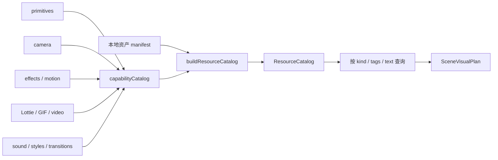

# 统一资源与能力目录

> 当前状态：共享能力源码已迁入；统一 `ResourceCatalog` 尚未实现，且不属于当前
> Narrative Baseline 里程碑。

## 目标

Scene 设计只通过一个只读目录发现可用资源，但每类资源仍由自己的源码或资产 manifest
维护。目录是查询视图，不是第二份实现真相，也不是运行时动态加载器。



## 当前已迁入能力

- Remotion core、media、Lottie、GIF、effects、transitions、light-leaks；
- Three.js、motion blur、layout utils、paths、shapes、Google Fonts、renderer、Tailwind v4；
- camera 2D/3D、focus pull、layered stage；
- code effects、motion treatments、soundtrack/ducking/SFX、style profiles；
- backgrounds、charts、cinematic、elements、layouts、logos、media、scene、text 与 transition
  primitives。

当前源码入口：

- `src/remotion/capabilities/`：各领域权威；
- `src/contracts/assets.ts`：sound capability 使用的最小资产 manifest 类型。

后续目标入口：

- `src/remotion/catalog/`：公共 export 与本地资产的只读汇总；
- `scripts/`：目录生成和完整性校验；
- `docs/contracts/`：目录合同。

## 资源条目

```text
ResourceDescriptor
├── id / kind / status
├── title / description
├── useCases / tags
├── authority
└── exportName（代码能力可选）
```

后续应为高价值能力逐步补充 `avoidWhen`、画幅、renderCost、代表帧和 motion strip；
这属于目录元数据增强，不改变其实现权威。

## 新能力

Scene 内新组件默认留在 `src/projects/<story>/`，不会因“看起来可复用”自动进入共享目录。
Scene renderer 可以调用目录中的共享能力，也可以拆分本地 Shot 组件；目录条目不会因此
变成 Shot 级 runtime renderer，ShotPlan 也不保存组件或模块路径。
具体 promotion 合同尚未落地；实现时必须保留“用户明确批准后才可提取”的边界。
