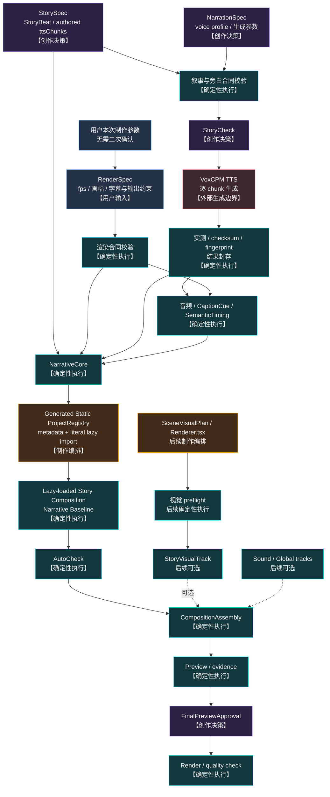
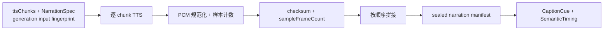

# 确定性执行设计

> Status：M1 合同/fingerprint/纯时间内核、M2 文件-backed 旁白封存、M3 Narrative
> Baseline runtime/registry/evidence 与 M4 机械 AutoCheck 闭环已实现；后续增强 runtime 仍为未来目标。

## 1. 定义

确定性执行不是一个万能脚本，也不负责创作选择。它由合同校验、固定 CLI、静态组件
注册、通用 Remotion runtime 和 fingerprint 失效机制组成。

```text
Agent 写入 StorySpec、NarrationSpec 和 authored ttsChunks，并结构化用户本次提供的 RenderSpec
        ↓
固定脚本校验声明并调用外部生成服务
        ↓
候选产物经实测、checksum 和 fingerprint 封存
        ↓
Remotion runtime 只读取声明和已封存本地产物
        ↓
固定检查、证据生成与渲染
```

系统区分三种“确定性”：

| 类型         | 含义                                                             |
| ------------ | ---------------------------------------------------------------- |
| 合同确定性   | 相同声明得到相同校验、范围计算、资源解析与装配决定               |
| 产物封存     | TTS 等外部生成结果经实测、checksum 和 fingerprint 后成为固定输入 |
| 帧运行确定性 | 相同源码、数据、资产和帧号得到相同 Remotion 画面状态             |

VoxCPM 不保证相同输入一定生成 bit-by-bit 相同波形。因此 TTS 节点的确定性指固定调用、
实测和封存流程，不是假定模型本身完全可重复。

已实现的 M1 边界位于 `src/contracts/`：`brief.ts`、`story.ts`、`narration.ts`、
`render.ts` 和 `project.ts` 定义严格输入合同；`fingerprint.ts` 与 `generation-input.ts`
实现 `sha256-canonical-json-v1` 分层指纹；`sealed-narration.ts` 只验证封存元数据；
`semantic-timing.ts` 使用 `BigInt` 和 `pcm-cumulative-ceil-v1` 生成绝对时间；
`m1-validation.ts` 聚合验证相互匹配的 source、manifest 与 timing。M1 不读取或生成音频文件。

M2 在不修改上述时间权威的前提下实现 `story-check.ts` 和 `scripts/narration/`：严格私有
配置解析、一个 controllable-clone VoxCPM adapter、candidate/measured resume、host FFmpeg
规范化、Node canonical WAV 测量、checksum、完整 PCM 拼接、content-addressed 原子封存、
compare-and-swap supersede、SemanticTiming 写入和真实文件只读检查。只有 `generate` 调用
provider；`seal` 和 `check` 不需要网络或私有配置。

M3 实现 `narrative-baseline.ts`、透明 NarrativeCore、required-only CompositionAssembly、
project-local Story Composition、generated static ProjectRegistry、`lazyComponent` Root 注册和
固定路径 evidence 检查。它只读消费 M2 产物，不读取私有配置或调用 provider。

M4 实现 `auto-check.ts` 与 `scripts/project-check/`，按固定顺序只读聚合 M1–M3 权威、生成
strict report fingerprint、检查 persisted report byte drift，并只在显式请求且全部通过时原子
写入 AutoCheck。它不生成 registry/evidence/旁白，不修改 SemanticTiming，也不调用 Agent、
skill、MCP、provider 或网络。

## 2. 总体实现



主链到 `Narrative Baseline` 不经过视觉 preflight、ResourceCatalog、ScenePackage 或 renderer
registry。M2 已把 sealed narration 与 SemanticTiming 落成真实文件，M3 已把 runtime、
registry、Baseline 和 evidence 落地，M4 已把 AutoCheck 落地；虚线增强输入、视觉分支和
Final Preview/Approval/Release 仍全部推迟，NarrativeCheck 未实现。流程权威见
[PRODUCTION_WORKFLOW.md](PRODUCTION_WORKFLOW.md)。

## 3. 节点与实现方式

| 设计节点                    | 实现方式                                                              | 固定输出                                         |
| --------------------------- | --------------------------------------------------------------------- | ------------------------------------------------ |
| Narration generation        | 宿主机 Node 脚本调用 VoxCPM，逐 chunk 生成                            | 候选 chunk 音频；不是时间权威                    |
| Narration seal              | 本地脚本规范化 PCM、计数 sample frame、校验、checksum、拼接和原子封存 | sealed manifest、完整 WAV、整数 sampleFrameCount |
| SemanticTiming / CaptionCue | 纯函数把累计样本边界统一量化为绝对帧                                  | `semantic-timing.generated.json`                 |
| NarrativeCore               | 通用 Remotion 组件                                                    | NarrationAudioTrack、CaptionLayer                |
| ProjectRegistry             | bundle 前按固定一级目录生成静态元数据和字面量 lazy import             | 可枚举、按需加载的 Story Composition 注册        |
| Narrative AutoCheck         | 固定脚本只读聚合 source、seal、timing、registry、Baseline 与 evidence | strict persisted report 与 report fingerprint    |
| ResourceCatalog             | 构建脚本汇总资产 manifest 和 capability exports                       | 只读目录与查询结果                               |
| 资源解析                    | preflight 校验 resourceId、文件、类型、状态和元数据                   | 资源校验报告                                     |
| SceneVisualTrack            | 通用 Scene runtime + 每个 ScenePackage 一个 renderer 入口             | 按 timing 挂载的纯视觉 Scene                     |
| StoryBeatTransition         | 有限的固定 preset 组件                                                | hard cut 或不改变时长的 overlay                  |
| Sound / Global layers       | 固定组件消费已选择的 preset 和资源 ID                                 | BGM、SFX、texture 等轨道                         |
| CompositionAssembly         | 显式插槽 + 强语义聚合的通用 `StoryComposition` 组件                   | 固定图层顺序和最终 Composition                   |
| 审核证据                    | Remotion CLI + Node 脚本                                              | still、contact sheet、必要时 motion strip        |

底层可共享时间线、视觉、音频和 fingerprint 贡献能力，但对外装配合同保留
`NarrativeCore`、`StoryVisualTrack`、`SoundDesignTrack` 和 `GlobalVisualLayers` 四个显式
插槽。`NarrativeCore` 必需，其余三个可选；不接受无约束的通用 track 数组代替
这个边界。数据文件只保存声明与稳定 ID，不保存 React 组件或底层能力实例。

M1 已落地数据合同、canonical fingerprint、封存 receipt 元数据校验和
SemanticTiming/CaptionCue 纯函数。M2 已落地表中前三项的真实 TTS、实测、封存和检查；
M3 已落地 NarrativeCore、ProjectRegistry、Narrative Baseline 与窄 evidence，M4 已落地固定
`project:check` 和 AutoCheck。当前
CompositionAssembly 只有必需 `narrativeCore` 插槽；ResourceCatalog、SceneVisualTrack、
转场、sound/global 与最终增强装配均属于后续阶段。

不要求每个确定性节点都拥有独立命令。相关检查应合并到少量面向作品的 CLI 中，避免
产生繁重、重复的阶段审核。

## 4. 已实现与目标目录

```text
src/contracts/                         数据合同与纯校验
scripts/narration/                     TTS、实测、拼接与封存
scripts/registry/                      ProjectRegistry 生成与漂移检查
scripts/baseline/                      M3 PNG/MP4 evidence 与 receipt
scripts/project-check/                 M4 只读作品级聚合与 pass-only AutoCheck
scripts/catalog/                       后续：资源目录构建与查询
scripts/preflight/                     后续：叙事主链与增强轨分级校验
src/remotion/runtime/narrative-core/   旁白、顶层字幕与绝对时间挂载
src/remotion/runtime/composition-assembly/ M3 required narrativeCore 装配
src/remotion/runtime/story-visual/     后续：Scene、Shot 与转场时间装配

src/projects/<story>/
├── story.json                         Agent 创作声明
├── Composition.tsx                    不依赖 Scene 的 Story Composition 入口
├── generated/                         timing、manifest、fingerprint 等生成数据
├── scenes/<meaningId>/                后续视觉阶段
│   ├── visual-plan.json               Agent 画面方案
│   ├── Renderer.tsx                   Agent 制作的 Scene 级视觉入口
│   └── shots/                         可选：Scene 内部本地 Shot 组件
├── renderer-registry.ts               ScenePackage.rendererId → SceneRenderer
└── assembly-plan.json                 已确定的装配声明

src/projects/project-registry.generated.ts  Story ID → 静态元数据 + 字面量 lazy import

public/projects/<story>/narration/     已封存的旁白产物
out/<story>/                           本地预览、证据与成片
```

物理文件可以按实施计划细化，但必须保持“创作声明、实测产物、生成元数据、React
源码、审核证据”彼此分离，不能共同修改一个万能 JSON。

## 5. Generated ProjectRegistry 与 lazy Composition

ProjectRegistry 同时解决两个不同问题：注册信息必须在 Remotion 列表阶段静态可枚举，
具体 Story Composition 代码可以在被选中、预览或渲染时按需加载。

```text
固定发现：src/projects/*/Composition.tsx
        + Story ID / RenderSpec / SemanticTiming
        ↓ project-registry generator
src/projects/project-registry.generated.ts
        ↓ Root.tsx 映射
<Composition lazyComponent={entry.load} ... />
        ↓
Webpack 按需加载指定 Story Composition
```

### 5.1 发现与生成

- 生成器只允许使用内置的固定一级目录模式发现恰好位于
  `src/projects/<story>/Composition.tsx` 的入口，不递归搜索，也不接受用户可配置 glob、
  环境变量、JSON module path 或网络返回的路径；
- `<story>` 必须符合固定 slug 合同；Composition ID 必须符合 Remotion ID 合同并全局唯一；
- 注册元数据由已校验的 Story ID、RenderSpec 和 SemanticTiming 生成，包括 `id`、`fps`、
  `width`、`height`、`durationInFrames` 和小型 JSON-serializable `defaultProps`；
- `durationInFrames` 使用已生成 SemanticTiming 的总帧数，不在 registry 中重新测量音频；
- 条目按 Composition ID 稳定排序；生成器原子写入完整文件，部分扫描或部分校验结果不得
  覆盖旧 registry；
- generated registry 是需要进入版本控制和 fingerprint 的确定性产物。正式检查使用
  read-only check mode 重新生成到内存并做 byte-for-byte 比较，发现漂移即失败。

生成结果的概念形态为：

```tsx
export const projectRegistry = [
  {
    id: "StoryExample",
    fps: 30,
    width: 1920,
    height: 1080,
    durationInFrames: 1824,
    defaultProps: { projectId: "story-example" },
    load: () => import("./story-example/Composition"),
  },
] as const;
```

`import()` 参数必须是生成源码中的字面量。JSON 只提供稳定业务数据，不保存组件、函数或
模块路径。

### 5.2 Root 与按需加载

`src/index.ts` 只调用一次 `registerRoot(RemotionRoot)`；`src/Root.tsx` 静态导入 generated
registry，并将每个条目映射为：

```tsx
<Composition
  id={entry.id}
  fps={entry.fps}
  width={entry.width}
  height={entry.height}
  durationInFrames={entry.durationInFrames}
  defaultProps={entry.defaultProps}
  lazyComponent={entry.load}
/>
```

- `src/projects/<story>/Composition.tsx` 必须 default export；
- 所有 Story 入口实现同一个 `StoryCompositionProps` 合同；generated `defaultProps` 只传
  `projectId` 等小型稳定标识，Story、timing 和 manifest 由该项目模块静态读取本地文件，
  不把大对象塞进 registry；
- 同一 `<Composition>` 只能设置 `component` 或 `lazyComponent` 之一，本项目生成的 Story
  条目只使用 `lazyComponent`；
- Root 不读取 Story JSON、不扫描目录、不执行 registry generator，也不导入全部 Story
  Composition；
- render runtime 只能消费已经生成的 registry。lazy loading 只是 Webpack 模块加载策略，
  不能改变注册条目、元数据、fingerprint 或 Composition ID；
- CapabilityGallery 等系统 Composition 可以保留独立手写静态注册，但不得混入 Story
  项目自动发现规则。

### 5.3 失效和失败

新增、删除或重命名项目入口，或者 Story ID、RenderSpec、SemanticTiming、Composition
默认导出和 generator version 变化时，ProjectRegistry 与 Narrative Baseline evidence
失效；sealed narration 只在其自身输入变化时失效。

缺失 default export、重复 ID、非法 ID、metadata 不完整、import target 不存在、生成结果
漂移或 registry 指纹不匹配均必须 fail closed，不能退回 runtime 扫描或手工猜测路径。

## 6. 静态 Renderer 边界

```text
ScenePackage.rendererId（每个 ScenePackage 恰好一个）
          ↓
composition-local renderer-registry.ts
          ↓
静态 import Scene 级 Renderer.tsx
          ↓
通用 Scene runtime
```

- Assembly 不根据 JSON 生成任意 JSX；
- JSON 不保存代码、表达式或动态模块路径；
- `rendererId` 的解析单位是 Scene，不是 Shot；ShotPlan 不保存 `rendererId`、组件或模块
  路径；
- Scene renderer 可以静态 import 本地 Shot 组件和已批准共享能力，但它们不成为独立
  runtime registry 入口；
- Scene 视觉源码仍由 Agent 制作；
- registry 属于制作编排，运行时只消费已经存在的静态绑定；
- 未知 rendererId、重复绑定或缺失组件必须 fail closed。

## 7. TTS 产物封存

本节的 M2 路径已经由 `scripts/narration/` 和 `gps-relativity` 真实产物实现。固定命令、
resume、lock、supersede 与隐私恢复步骤见
[NARRATION_GENERATION.md](NARRATION_GENERATION.md)。



封存记录至少包含：

- chunkId、meaningId、实际 `ttsText` 和顺序；
- voice profile、模式和可用时的 seed；
- 每块音频路径、checksum、规范化后的 sampleRate、channel layout、sampleFrameCount 和
  推导时长；
- 来自创作声明的显式停顿，以及实测音频中保留的自然静音；
- 完整 PCM WAV checksum、总 sampleFrameCount、generation input fingerprint 和 sealed
  narration fingerprint。

封存步骤不得根据标点或静音检测自动裁剪 TTSChunk。自然静音是该 chunk 已生成波形的一
部分，必须计入 sampleFrameCount；显式叙事停顿则按 StorySpec 声明插入零值 PCM。这里的
一个 sample frame 包含所有声道在同一采样时刻的样本，不能把交错声道样本总数当作时长。
所有 chunk 在拼接前规范化为 receipt 中记录的同一个整数 sampleRate，规范化算法版本进入
sealed narration fingerprint。

重新生成 TTS 必须产生新 fingerprint，不能覆盖旧封存结果后继续复用旧 timing。

## 8. 音频样本到帧的唯一算法

### 8.1 输入事实

v1 只接受以下整数输入：

- `R`：sealed narration 的 canonical PCM `sampleRate`；
- `Cj`：有序 timeline segment 的 `sampleFrameCount`，即每声道采样时刻数。segment
  只能是 TTSChunk 音频或显式叙事停顿；
- `fps`：经过 RenderSpec 合同校验的正整数帧率；
- `leadInFrames`、`tailFrames`：RenderSpec 结构化后的非负整数帧。

若用户用毫秒表达片头或片尾，Agent 只做固定结构化：

```text
durationFrames = ceilDiv(durationMs × fps, 1000)
```

这不是审批。RenderSpec 合同只校验类型、范围和字段兼容性；除非输入自相矛盾或缺少
没有默认值的必填字段，否则不得再次要求用户确认。

显式叙事停顿以非负整数 `pauseMs` 创作，并在封存时转为样本：

```text
pauseSampleFrames = floor((pauseMs × R + 500) / 1000)
```

即精确的 round-half-up；结果写入 sealed manifest，此后不在 runtime 重算。正停顿若被
量化为 0 个样本则合同失败。

### 8.2 累计样本边界

先在样本坐标中形成完整旁白，不得先把单个 chunk 转成帧：

```text
S[0] = 0
S[j] = C[0] + C[1] + ... + C[j-1]
S[total] = C[0] + C[1] + ... + C[n-1]
```

`S[j]` 是第 j 个 segment 的开始 sample frame；segment 范围统一使用左闭右开
`[S[j], S[j+1])`。每个显式停顿必须记录位置和 `meaningId` 所有权，因此样本时间线不能有
未解释空洞。

### 8.3 唯一帧量化

定义：

```text
ceilDiv(a, b) = floor((a + b - 1) / b)   // a >= 0, b > 0
Q(s) = ceilDiv(s × fps, R)
F[j] = leadInFrames + Q(S[j])
```

实现必须使用整数运算；TypeScript 使用 `BigInt` 计算乘法与 `ceilDiv`，通过范围校验后
才转换为 `number`。不得使用浮点秒数、`Math.round(durationSeconds × fps)`，也不得把
每个 chunk 的帧数分别取整后再累加。

所有时间范围共享同一组 `F[j]`：

- TTSChunk 的 CaptionCue 为其音频 segment 的 `[F[j], F[j+1])`；文本只取实际
  `ttsText`；
- 显式停顿保留 frame range 但不生成 CaptionCue；
- StoryBeat 的范围包住其声明拥有的 chunk 和停顿 segment，相邻 StoryBeat 复用同一个
  边界；
- 完整旁白从 `leadInFrames` 开始播放；Composition 总长度为：

```text
durationInFrames = leadInFrames + Q(S[total]) + tailFrames
```

这里使用向上取整，因为 Remotion 只能在整帧边界切换内容。新 CaptionCue 或新
StoryBeat 最多延后不足 1 帧，但绝不会早于其音频样本边界；最后一帧也一定覆盖最后一个
音频样本。共享边界保证相邻范围不重叠、不产生累计漂移。

例如 `R = 48000`、`fps = 30`、`leadInFrames = 15`、`tailFrames = 12`：

| segment    | sampleFrameCount | 累计样本范围      | 绝对帧范围 | 字幕         |
| ---------- | ---------------: | ----------------- | ---------- | ------------ |
| TTSChunk A |            52800 | `[0, 52800)`      | `[15, 48)` | A 的 ttsText |
| 显式停顿   |            12000 | `[52800, 64800)`  | `[48, 56)` | 无           |
| TTSChunk B |            45600 | `[64800, 110400)` | `[56, 84)` | B 的 ttsText |

其中 `Q(64800) = ceil(40.5) = 41`，所以 B 的字幕不会在其音频开始之前出现。Composition
总帧数是 `15 + Q(110400) + 12 = 96`。

### 8.4 运行时和校验约束

- sealed complete narration 必须是包含所有 TTSChunk 和显式叙事停顿的单一 PCM WAV；
  片头片尾不写入该 WAV，因此修改 RenderSpec 不会让 sealed narration 失效；
- NarrativeCore 用 `<Sequence from={leadInFrames}>` 挂载完整音频，`playbackRate` 固定为
  `1`，不得在 runtime 使用 `trimBefore`、`trimAfter` 或逐 chunk 排音频；
- complete WAV 的 decoded sampleFrameCount 必须等于 `S[total]`，各 segment
  sampleFrameCount 之和也必须等于 `S[total]`；
- frame range 使用零基、左闭右开 `[startFrame, endFrame)`；
- 任一 TTSChunk 若得到 `endFrame <= startFrame`，timing 生成必须 fail closed，不得偷加
  一帧；极短停顿可以在帧坐标中为 0 帧，但其 PCM 样本仍保留在音频中；
- 自然静音位于 TTSChunk 波形内部，因此会随该 chunk 的 CaptionCue 一起量化；v1 不做
  词级或语音活动级字幕对齐；
- `semantic-timing.generated.json` 必须记录 timing algorithm ID（例如
  `pcm-cumulative-ceil-v1`）、输入 fingerprint、`R`、`fps`、全部样本边界和全部帧边界。

Remotion 的 `<Sequence>` 会按 `from` 偏移子组件的 local frame；本项目只把它当挂载
机制，并且只向它传入已经生成的整数帧。样本到帧的权威计算必须在 bundle/render 之前
完成。

## 9. Fingerprint 与失效

```text
Story fingerprint
├── Generation input fingerprint（ordered ttsChunks + NarrationSpec）
│   └── Sealed narration fingerprint（selected chunks + explicit pauses）
│       └── SemanticTiming fingerprint
│           └── ProjectRegistry entry fingerprint
│               └── Narrative Baseline fingerprint
├── SceneVisualPlan fingerprint（后续）
│   └── Renderer source + resource fingerprint（后续）
│       └── ScenePackage fingerprint（后续）
└── Assembly fingerprint
```

M1 定义、M2 实际生成并校验到 SemanticTiming，M3 已继续生成 ProjectRegistry entry、
Narrative Baseline 和 evidence fingerprint；视觉、声音和全局分支仍是后续目标。视觉、
声音和全局层不得进入 sealed narration 或 SemanticTiming fingerprint。

| 修改                                            | 必须失效                                                   | 保持有效                 |
| ----------------------------------------------- | ---------------------------------------------------------- | ------------------------ |
| ttsText、顺序或 NarrationSpec                   | TTS、sealed narration、timing、Baseline 和所有下游         | Story 主题               |
| 显式叙事停顿                                    | sealed complete audio、timing、Baseline 和所有下游         | 已生成 chunk 候选        |
| RenderSpec timing 字段（fps、片头或片尾）       | timing、registry entry、字幕边界、Baseline 和下游          | sealed narration         |
| RenderSpec 非 timing 字段                       | 相关 registry 元数据、字幕布局或输出约束、Baseline 和下游  | sealed narration、timing |
| Story 入口、Composition ID 或 generator version | ProjectRegistry、Composition listing、Baseline 和 evidence | sealed narration、timing |
| SceneVisualPlan 或资源选择                      | Renderer、Scene 检查、视觉轨、完整 Preview                 | 已封存旁白               |
| Renderer 或资产内容                             | Scene 证据、视觉轨、完整 Preview                           | Story 与旁白             |
| transition、声音或全局层                        | Assembly、完整 Preview                                     | Scene 内部证据           |
| shared runtime                                  | 所有依赖该版本的 Composition 证据                          | 原始创作声明             |

失效传播由 fingerprint 比较和依赖关系完成，不依赖 Agent 记忆。

## 10. 聚合检查

M1–M4 当前提供聚焦机械检查、真实 file-backed 检查、registry drift check、listing、窄
Baseline evidence 与作品级 AutoCheck：

```bash
npm test
npm run narration:check -- --project gps-relativity
npm run registry:check
npm run compositions
npm run baseline:evidence -- --project gps-relativity
npm run project:check -- --project gps-relativity --level narrative
```

它们覆盖严格合同、StoryCheck、provider adapter、candidate/measured resume、canonical
fingerprint、真实 WAV/checksum/sample-frame、原子 sealed receipt、累计 PCM timing、
CaptionCue 一一对应、透明 NarrativeCore、静态 registry、lazy listing、PNG alpha、完整 render
媒体事实与 M3 evidence fingerprint。M4 作品级命令只有两种 exact forms：

```bash
npm run project:check -- --project gps-relativity --level narrative
npm run project:check -- --project gps-relativity --level narrative --write-auto-check
```

`narrative` 是所有后续阶段都必须通过的基础级别。聚合器按以下固定顺序检查：

- `source-contracts`；
- `story-check`；
- `sealed-narration`；
- `semantic-timing`；
- `project-registry`；
- `narrative-baseline`；
- `m3-evidence`。

默认形式从 source 和真实文件重算 report，并要求 persisted AutoCheck strict、fingerprint 和
canonical bytes 完全一致；它不修复 drift。`--write-auto-check` 仅在七项全部通过且 identity/
evidence 完整时原子写入；相同 bytes 不改 mtime。缺失、malformed、unknown field、identity
mismatch、checksum/registry/media drift 和未知参数全部 fail closed，失败不覆盖最后一份有效
AutoCheck。

视觉增强不存在时，`narrative` 不得因为缺少 SceneVisualPlan、ScenePackage、renderer
registry 或 ResourceCatalog 而失败。

它只能验证已确定输入，不能自动选择或修正 StoryBeat、Scene 方案、Shot、镜头、资源、
声音、转场或审美结果。`final` level 仍是未来目标，当前 CLI 明确拒绝；M4 也没有实现
NarrativeCheck、SceneVisualCheck、FinalPreviewApproval 或发布检查。

## 11. Skill 边界

skill 负责引导 Agent 完成 Story/ttsChunks 创作、旁白生成编排，以及后续 Scene 制作和
工具调用。正式 preview、render 和 quality runtime 只读取静态源码、合同数据、本地资产
和已封存产物，不调用 skill、Agent、MCP 或网络服务。
