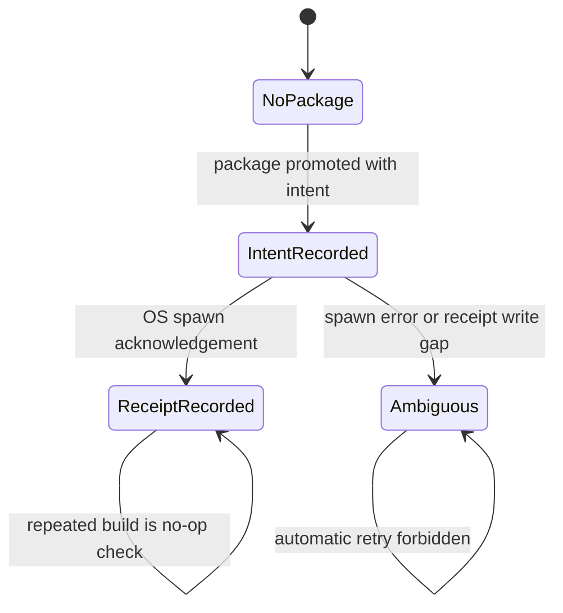

# 确定性执行

> 文档类型：执行语义权威
>
> 最后复核：2026-08-09

## 确定性的对象

仓库保证相同 sealed/current inputs 产生相同合同 identity、路径、canonical JSON 与启动计划；
不保证 TTS 波形、Remotion 最终媒体或外部进程结果 bit-for-bit 相同。

所有 persisted JSON 使用 strict schema、stable key order、newline-terminated canonical bytes 和
namespace/version-bound SHA-256 fingerprint。未知字段、非 current contract、path escape、symlink、
identity drift 或 malformed bytes fail closed。

NarrationSpec 与 narration generation input 是 current-only v2；已删除的 VoxCPM `seed` 不参与
任何合同。provider-attempt v2 绑定 adapter v2、完整 generation parameters 与安全内容 checksum，
因此旧 provider attempt 或任一参数漂移都不能复用候选。

## 时间确定性

旁白封存后，累计 PCM samples 是唯一时间 authority：

```text
frameBoundary = ceilDiv(cumulativeSamples * fps, sampleRate)
```

不得逐 chunk 把浮点秒数转 frame 再累加。Scene 与 transition 不能移动、缩短或覆盖 spoken
frames。planned duration 只能由 `frameCount / fps` 推导，不伪装为媒体实测。

## Production ledger

Run manifest immutable；events append-only、连续编号并绑定 previous-state fingerprint；Scene 与
GlobalVisual result immutable；state 是由 events/results/current fingerprints 重算的 projection。
重复 check 不写 event，不改变 bytes/mtime。

任何 fixed-stage failure 形成 terminal event 后，该 Run 永不恢复。公共流修复完成后必须从
current authored inputs 创建 fresh Run，不能编辑 event/state/result。

## Render-ready identity

`production-render-plan-v1` 固定：

- storyId/runId/compositionId；
- Composition source path 与 checksum；
- width/height/fps/frameCount；
- FinalAssembly、semantic timing、renderer registry 与 projections；
- layer/mix order；
- fixed Remotion render policy。

`production-render-ready-v1` 再绑定 plan fingerprint，并固定 status/handoff。该 artifact 只证明
所有 render-critical inputs current，不证明媒体存在。

在 ready artifact 写入前，目标 Project Composition 必须通过仓库固定 TypeScript/tsconfig 的
`noEmit` 编译。编译 root 只有 `src/projects/<storyId>/Composition.tsx`，依赖由真实 import graph
决定；失败只暴露去重后的 TypeScript diagnostic codes，不输出源码、绝对路径或完整 diagnostic。

## Delivery identity 与 canonical package

deliveryId 从 PublishingIntent fingerprint、CoverResult fingerprint、render-ready fingerprint、
render-plan fingerprint、Composition、placeholder-bound fixed render args 和 launch policy 计算。
真实 intent 把 placeholder 替换为该 deliveryId 的 exact output path，并 fingerprint exact
command/argv/output/log。

staging 中先写并校验：

```text
cover-4x3.png
cover-3x4.png
publishing.json
delivery-launch-manifest.json
HANDOFF.md
immutable-checksums.sha256
render-launch-intent.json
```

这些 bytes 通过后才原子提升。receipt 是 spawn 后新增的唯一允许文件；exact planned MP4 不属于
immutable ledger。

## Launch protocol



协议约束：

1. intent 必须 exclusive write 并在 spawn 前 durable visible；
2. adapter 使用 `shell: false`、fixed cwd/argv/log 和 `detached: true`；
3. promise 只由 `spawn` 或 `error` settle；spawn 后立即 unref；
4. receipt 只在 spawn acknowledgement 后 exclusive write；
5. receipt exists 才能通过 public delivery check；
6. intent without receipt 永远 launch-ambiguous，never retry；
7. 不监听 exit/close，不保存 PID，不轮询，不读取/hash/probe/decode MP4。

receipt bytes 先写同目录 temporary 并 fsync，再以 exclusive hard-link 原子发布；destination 一旦
可见就是完整 canonical bytes。

因此 `delivery-render-started` 是精确而有限的事实：OS 已确认启动 child。任何 render completion
或媒体质量结论都需要另一个被用户明确授权的系统。

## Idempotence 与 deletion

- render-ready check：current → no-op；drift → fail closed。
- delivery build：receipt current → no-op；intent-only → ambiguous；different/unknown target → fail。
- delivery check：只读 current package，不修复、不创建 receipt。
- 删除 Project/out/deliveries 不影响 core source gate；显式 project/media/delivery 命令保持
  fail closed。
- deletion matrix 只在隔离副本执行，真实 production artifacts 不作为测试夹具删除。
