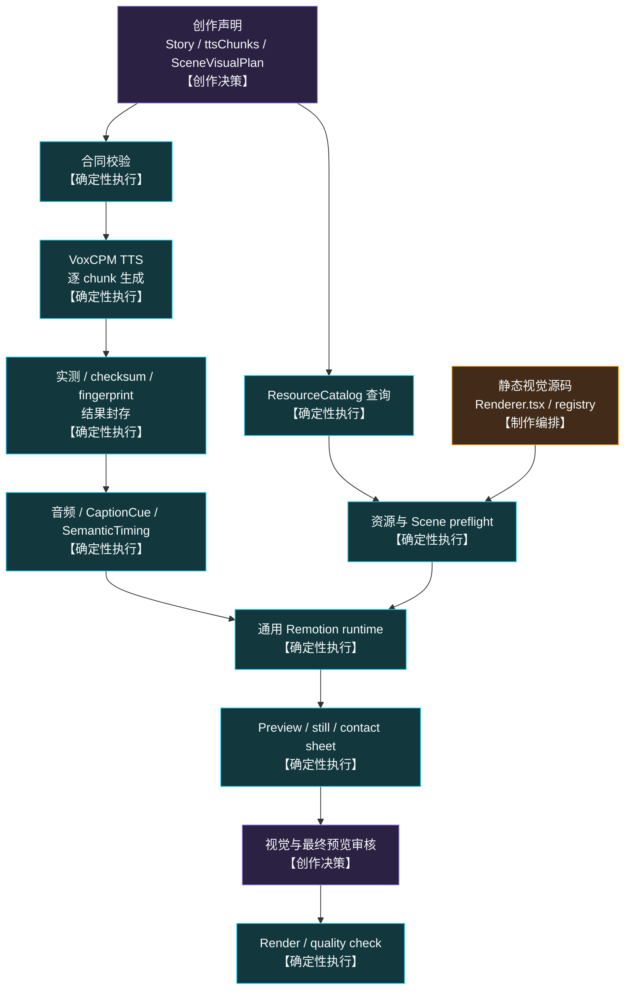
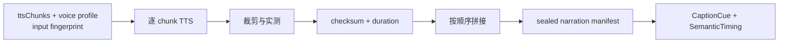

# 确定性执行设计

> Status：最终目标设计，尚未实现。

## 1. 定义

确定性执行不是一个万能脚本，也不负责创作选择。它由合同校验、固定 CLI、静态组件
注册、通用 Remotion runtime 和 fingerprint 失效机制组成。

```text
Agent 决定内容和方案
        ↓
Agent 写入稳定声明与静态源码
        ↓
脚本校验、测量并生成元数据
        ↓
Remotion runtime 按声明装配
        ↓
固定检查、证据生成与渲染
```

系统区分三种“确定性”：

| 类型         | 含义                                                             |
| ------------ | ---------------------------------------------------------------- |
| 合同确定性   | 相同声明得到相同校验、范围计算、资源解析与装配决定               |
| 产物封存     | TTS 等外部生成结果经实测、checksum 和 fingerprint 后成为固定输入 |
| 帧运行确定性 | 相同源码、数据、资产和帧号得到相同 Remotion 画面状态             |

VoxCPM 不保证相同输入一定生成 bit-by-bit 相同波形。因此 TTS 节点的确定性指固定调用、
实测和封存流程，不是假定模型本身完全可重复。

## 2. 总体实现



## 3. 节点与实现方式

| 设计节点                    | 目标实现                                                     | 固定输出                                      |
| --------------------------- | ------------------------------------------------------------ | --------------------------------------------- |
| TTS + 实测                  | 宿主机 Node 脚本调用 VoxCPM，逐 chunk 合成、裁剪、测量、拼接 | chunk 音频、完整音频、实测时长                |
| SemanticTiming / CaptionCue | 纯函数按实测 chunk 顺序累计绝对帧                            | `semantic-timing.generated.json`              |
| NarrativeCore               | 通用 Remotion 组件                                           | NarrationAudioTrack、CaptionLayer、BaseCanvas |
| ResourceCatalog             | 构建脚本汇总资产 manifest 和 capability exports              | 只读目录与查询结果                            |
| 资源解析                    | preflight 校验 resourceId、文件、类型、状态和元数据          | 资源校验报告                                  |
| SceneVisualTrack            | 通用 Scene runtime + composition-local 静态 registry         | 按 timing 挂载的纯视觉 Scene                  |
| StoryBeatTransition         | 有限的固定 preset 组件                                       | hard cut 或不改变时长的 overlay               |
| Sound / Global layers       | 固定组件消费已选择的 preset 和资源 ID                        | BGM、SFX、texture 等轨道                      |
| CompositionAssembly         | 通用 `StoryComposition` 组件                                 | 固定图层顺序和最终 Composition                |
| 审核证据                    | Remotion CLI + Node 脚本                                     | still、contact sheet、必要时 motion strip     |

不要求每个确定性节点都拥有独立命令。相关检查应合并到少量面向作品的 CLI 中，避免
产生繁重、重复的阶段审核。

## 4. 目标目录

```text
src/contracts/                         数据合同与纯校验
scripts/narration/                     TTS、实测、拼接与封存
scripts/catalog/                       资源目录构建与查询
scripts/preflight/                     Story、Scene、资产与 registry 校验
src/remotion/runtime/narrative-core/   旁白、字幕与 BaseCanvas
src/remotion/runtime/story-visual/     Scene、Shot 与转场时间装配
src/remotion/runtime/assembly/         Composition 总装

src/projects/<story>/
├── story.json                         Agent 创作声明
├── generated/                         timing、manifest、fingerprint 等生成数据
├── scenes/<meaningId>/
│   ├── visual-plan.json               Agent 画面方案
│   └── Renderer.tsx                   Agent 制作的视觉源码
├── renderer-registry.ts               rendererId → 静态组件
└── assembly-plan.json                 已确定的装配声明

public/projects/<story>/narration/     已封存的旁白产物
out/<story>/                           本地预览、证据与成片
```

物理文件可以按实施计划细化，但必须保持“创作声明、实测产物、生成元数据、React
源码、审核证据”彼此分离，不能共同修改一个万能 JSON。

## 5. 静态 Renderer 边界

```text
ScenePackage.rendererId
          ↓
composition-local renderer-registry.ts
          ↓
静态 import Renderer.tsx
          ↓
通用 Scene runtime
```

- Assembly 不根据 JSON 生成任意 JSX；
- JSON 不保存代码、表达式或动态模块路径；
- Scene 视觉源码仍由 Agent 制作；
- registry 属于制作编排，运行时只消费已经存在的静态绑定；
- 未知 rendererId、重复绑定或缺失组件必须 fail closed。

## 6. TTS 产物封存



封存记录至少包含：

- chunkId、meaningId、实际 `ttsText` 和顺序；
- voice profile、模式和可用时的 seed；
- 每块音频路径、checksum、采样信息与实测时长；
- 完整音频 checksum、总时长和 input fingerprint。

重新生成 TTS 必须产生新 fingerprint，不能覆盖旧封存结果后继续复用旧 timing。

## 7. Fingerprint 与失效

```text
Story fingerprint
├── Narration input fingerprint
│   └── Sealed narration fingerprint
│       └── SemanticTiming fingerprint
├── SceneVisualPlan fingerprint
│   └── Renderer source + resource fingerprint
│       └── ScenePackage fingerprint
└── Assembly fingerprint
```

| 修改                          | 必须失效                                     | 保持有效       |
| ----------------------------- | -------------------------------------------- | -------------- |
| ttsText、顺序或 voice profile | TTS、timing、字幕、Shot 帧规划、完整 Preview | Story 主题     |
| SceneVisualPlan 或资源选择    | Renderer、Scene 检查、视觉轨、完整 Preview   | 已封存旁白     |
| Renderer 或资产内容           | Scene 证据、视觉轨、完整 Preview             | Story 与旁白   |
| transition、声音或全局层      | Assembly、完整 Preview                       | Scene 内部证据 |
| shared runtime                | 所有依赖该版本的 Composition 证据            | 原始创作声明   |

失效传播由 fingerprint 比较和依赖关系完成，不依赖 Agent 记忆。

## 8. 聚合检查

目标提供一个作品级命令：

```bash
npm run project:check -- --project <slug>
```

一次检查：

- 数据合同和 ID 唯一性；
- TTSChunk 与 CaptionCue 一一对应；
- 所有 `[startFrame, endFrame)` 连续、无空洞、无重叠；
- Scene Shot 覆盖、resourceId 和 rendererId；
- registry 为静态绑定且不存在未知路径；
- SceneRenderer 不播放旁白、不渲染字幕；
- transition 不改变实测语义时间；
- typecheck、lint、bundle 和 Composition listing；
- 证据与输入 fingerprint 一致。

它只能验证已确定输入，不能自动选择或修正 StoryBeat、Scene 方案、Shot、镜头、资源、
声音、转场或审美结果。

## 9. Skill 边界

skill 负责引导 Agent 完成创作决策、Scene 制作和工具调用。正式 preview、render 和
quality runtime 只读取静态源码、合同数据、本地资产和已封存产物，不调用 skill、
Agent、MCP 或网络服务。
