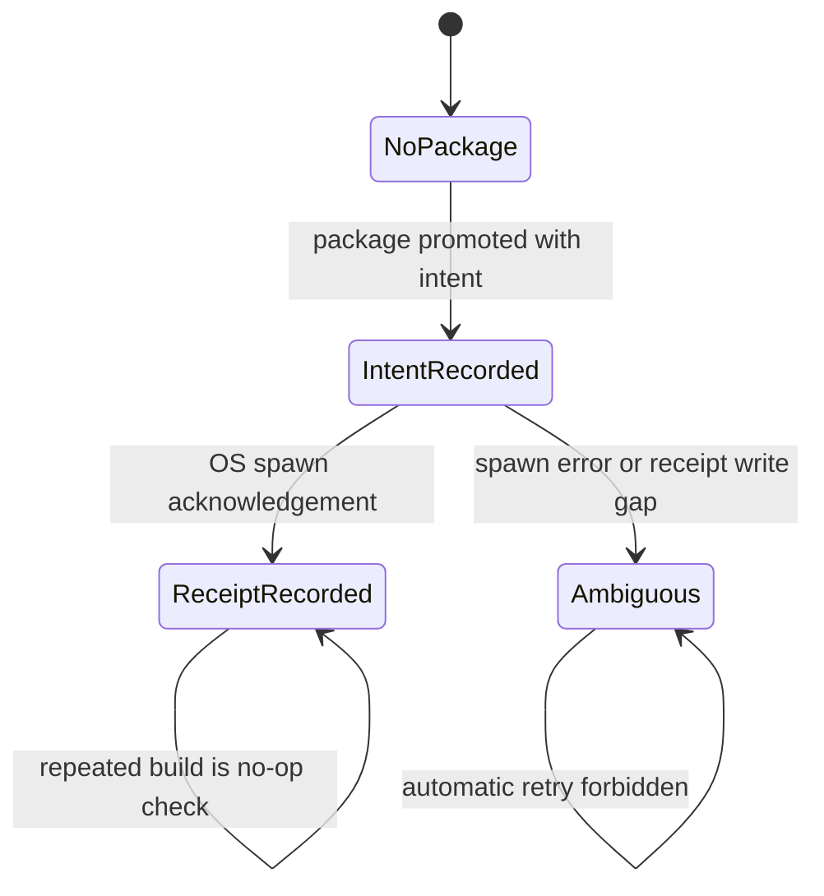

# 确定性执行

> 文档类型：执行语义权威
>
> 最后复核：2026-08-14

## 确定性的对象

仓库保证相同 sealed/current inputs 产生相同合同 identity、路径、canonical JSON 与启动计划；
不保证 TTS 波形、Remotion 最终媒体或外部进程结果 bit-for-bit 相同。

所有 persisted JSON 使用 strict schema、stable key order、newline-terminated canonical bytes 和
namespace/version-bound SHA-256 fingerprint。未知字段、非 current contract、path escape、symlink、
identity drift 或 malformed bytes fail closed。

NarrationSpec 与 narration generation input 是 current-only v2；已删除的 VoxCPM `seed` 不参与
任何合同。provider-attempt v2 绑定 adapter v2、完整 generation parameters 与安全内容 checksum，
因此旧 provider attempt 或任一参数漂移都不能复用候选。

ProducerConfig 自身使用 `producer-config-v1` strict schema 与 fingerprint。它是新 authoring/freeze
的默认/选择 authority，不是已封存 Project 的可变 runtime dependency：合集选择连同 catalog
fingerprint 进入 PublishingIntent v2，边缘留白进入 production-readability-v2，语速进入
provider-attempt，目标 LUFS 进入 mastering policy。声线文件与可选 BGM 预设只接受规范化仓库相对
路径；绝对路径、URL、反斜杠与目录逃逸 fail closed。BGM 预设当前不进入 Project/Run 或 render
identity。`project:configure` 要求显式 readability，不再存在创建阶段的 90px fallback。

start 的同一次 provider resolution 同时供 VoxCPM preflight 与 `NarrationExecutionSnapshot` 使用。
快照复用 provider-attempt fingerprint 与完整 mastering policy；provider-attempt 额外绑定 opaque
private-config fingerprint，从而让 URL/token/path 变化触发 drift，但 raw token、URL、绝对路径、
声线内容和 transcript 不进入 Project、Run、events、错误或日志。generation 在请求前重算并比较
快照；mastering 只使用 Run policy。已冻结 Project/Run 不因全局配置变化而改变。

## 时间确定性

旁白封存后，累计 PCM samples 是唯一时间 authority：

```text
frameBoundary = ceilDiv(cumulativeSamples * fps, sampleRate)
```

不得逐 chunk 把浮点秒数转 frame 再累加。Scene 与 transition 不能移动、缩短或覆盖 spoken
frames。planned duration 只能由 `frameCount / fps` 推导，不伪装为媒体实测。

SemanticTiming 只描述正文局部帧。成片固定使用 `fixed-bookends-v1`：60 帧片头、完整正文、240
帧片尾，因此 `frameCount = 60 + bodyFrameCount + 240`。正文由 Series 统一延后 60 帧，内部 frame
仍从 0 开始。delivery 章节只在最终投影时把正文 startFrame 加 60，不修改 SemanticTiming。M3
Narrative Baseline 是正文诊断渲染，显式限制到 body frame range，不冒充正式成片。

## Production ledger

Run manifest immutable；events append-only、连续编号并绑定 previous-state fingerprint；Scene 与
GlobalVisual result immutable；state 是由 events/results/current fingerprints 重算的 projection。
重复 check 不写 event，不改变 bytes/mtime。

任何 fixed-stage failure 形成 terminal event 后，该 Run 永不恢复。公共流修复完成后必须从
current authored inputs 创建 fresh Run，不能编辑 event/state/result。

owner receipt inbox 是按 assignment identity 隔离的 multi-writer 边界。receipt 绑定 current
run/story/assignment/task/requirements、排序后的规范化 output manifest/checksum 与 receipt
fingerprint；同内容重放 no-op，同 identity 不同内容、malformed、stale、symlink、escape、unknown
file 或 checksum drift fail closed。owner-receipts 不含 thread/task/progress/heartbeat。

receipt rename 前的 deterministic `.pending` 已包含完整 canonical bytes。publisher 中断但 receipt
尚未出现时，处理同一 immutable assignment 的替代线程可用相同语义内容完成 atomic rename；首次
pending 的 occurredAt/fingerprint 保持不变，不同语义内容仍冲突。这里不使用会把缺失 receipt 永久
锁死的空 publication lock。

缺失 receipt 不产生 event 或 failure；Run 保持 `waiting-for-owner-results`，不超时、不自动重试。
watcher restart 从 receipts、owner-results、formal results 与 events 恢复，已接受 identity 不重复写。

detached process 不是宿主机服务管理器：机器重启后 repository 不自动拉起 watcher。已有 launch
receipt 也不会被当成“进程仍存活”的证明或自动重启许可；突然断电还可能留下 writer lock。恢复逻辑
保证一次明确重新执行 worker 时不会重复 submit/event/delivery，但当前 runtime 不提供跨宿主机重启
的监督、存活探测或自动清锁。

## Render-ready identity

`production-render-plan-v3` 固定：

- storyId/runId/compositionId；
- Composition source path 与 checksum；
- width/height/fps、fixed bookend timeline、bodyFrameCount/final frameCount；
- `VideoBrief.sourceReferences` fingerprint；
- FinalAssembly、sealed/mastered narration、semantic timing、renderer registry 与 projections；
- layer/mix order；
- fixed Remotion render policy。

`production-render-ready-v3` 再绑定 plan fingerprint，并固定 status/handoff。该 artifact 只证明
所有 render-critical inputs current，不证明媒体存在。

在 ready artifact 写入前，目标 Project Composition 必须通过仓库固定 TypeScript/tsconfig 的
`noEmit` 编译。编译 root 只有 `src/projects/<storyId>/Composition.tsx`，依赖由真实 import graph
决定；失败只暴露去重后的 TypeScript diagnostic codes，不输出源码、绝对路径或完整 diagnostic。

## Delivery identity 与 canonical package

deliveryId 从 PublishingIntent fingerprint、canonical publishing checksum、CoverResult fingerprint、
render-ready fingerprint、render-plan fingerprint、Composition、实际使用资源的 attribution
fingerprint/checksum、Project 固定 output path、exact render args 和 launch policy 计算。真实 intent
fingerprint exact command/argv/output/log；deliveryId 仍是 current package 的校验 identity，但不再
作为存储目录名。

staging 中先写并校验：

```text
cover-4x3.png
cover-3x4.png
publishing.json
asset-attributions.json
delivery-launch-manifest.json
HANDOFF.md
immutable-checksums.sha256
render-launch-intent.json
```

这些 bytes 通过后才原子提升。receipt 是 spawn 后新增的唯一允许文件；exact planned MP4 不属于
immutable ledger。

## Launch protocol

同一 intent-before-spawn/receipt-after-spawn 协议先用于 detached production watcher，再用于最终
Remotion render。watcher 使用 fixed cwd/argv/log、`shell:false`、`detached:true`、non-inherited
stdio；receipt 只在 OS `spawn` 后写入。watcher intent 无 receipt 同样永久 ambiguous。



协议约束：

1. intent 必须 exclusive write 并在 spawn 前 durable visible；
2. adapter 使用 `shell: false`、fixed cwd/argv/log 和 `detached: true`；
3. promise 只由 `spawn` 或 `error` settle；spawn 后立即 unref；
4. receipt 只在 spawn acknowledgement 后 exclusive write；
5. receipt exists 才能通过 public delivery check；
6. intent without receipt 永远 launch-ambiguous，never retry；
7. 不监听 exit/close，不保存 PID，不轮询，不读取/hash/probe/decode MP4。

receipt bytes 先写同目录 temporary 并 fsync，再以 exclusive hard-link 原子发布；destination 一旦
可见就是完整 canonical bytes。

因此 `delivery-render-started` 是精确而有限的事实：OS 已确认启动 child。任何 render completion
或媒体质量结论都需要另一个被用户明确授权的系统。

## Idempotence 与 deletion

- render-ready check：current → no-op；drift → fail closed。
- delivery build：receipt current → no-op；intent-only → ambiguous；different/unknown target → fail。
- delivery check：只读 current package，不修复、不创建 receipt。
- 配置页 production progress 按 Project 独立选择 `createdAt` 最新 current Run，并只从校验后的
  manifest/events/state 和 fingerprint-bound delivery intent/receipt 投影；轮询不写仓库状态。
- 用户明确授权后，真实作品只由 `project:delete` 按 storyId 删除 Project、public media、
  narration work、Runs、out 与 deliveries，并确定性重建 Registry/Catalog；core source gate
  保持有效，其他显式 project/media/delivery 命令继续 fail closed。删除预检只投影 Run 的严格
  `runId/storyId` 所有权，不验证或解释已移除的 production contract/state/event。删除与其他
  Project-level mutation 共享 repository operation lock；目标 Run lock、持锁重检、删除前 Registry
  预发布和异常后的磁盘真实状态重建保证并发与失败路径不会暴露 stale projection。
- deletion matrix 只在隔离副本执行，真实 production artifacts 不作为测试夹具删除。
