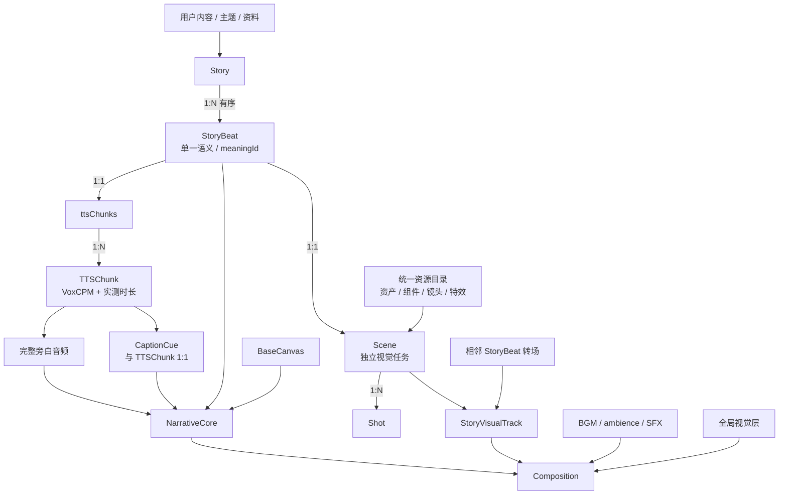

# 最终产品目标

## 一句话目标

把“内容到完整视频”拆成稳定的叙事主线和可独立替换的 Scene 视觉任务：即使没有视觉
增强，旁白、字幕和基础画布也能完整讲完故事；视觉质量主要在 Scene 层持续提升。

## 最终结构



```text
1 Story = 1 Composition
1 Story = N StoryBeat
1 StoryBeat = 1 meaningId = 1 NarrationUnit = 1 Scene
1 NarrationUnit = 1 ttsChunks collection = N TTSChunk = N CaptionCue
1 Scene = N Shot
N StoryBeat = N-1 StoryBeatTransition

Composition = NarrativeCore + StoryVisualTrack + SoundDesignTrack + GlobalVisualLayers
```

## 两个权威

- `StoryBeat` 是语义权威：决定表达什么、为什么进入下一段。
- 实测旁白时间线是时间权威：决定什么时候开始、持续多久。

Scene 与转场同时服务 StoryBeat 语义和实测时间，不能只根据台词字面生成，也不能反向
修改旁白与字幕时间。

## 不可偷换的边界

- Scene、Shot、TTSChunk 与 Remotion `<Sequence>` 不是同一个概念。
- NarrationUnit 与 Scene 是同一 StoryBeat 的语言表达和视觉表达，不互相拥有。
- CaptionLayer 顶层唯一；Scene renderer 不播放旁白、不渲染字幕。
- NarrativeCore 与 StoryVisualTrack 在同一个 Composition 中实时叠加，不预渲染成
  两条视频再合成。
- v1 转场只支持 hard cut 与不改变总时长的 visual-only overlay；双 Scene overlap
  等待明确的 input/output handles 模型。
- 运行时只消费静态源码、合同数据和本地资产，不调用 skill、Agent 或网络。
- 数据只保存声明和稳定 ID；不承载 JSX、代码或动态模块路径。
- 新 Scene 只能参考当前输入与已注册共享能力，不能参考旧 Scene 或旧 Composition。
- 新能力默认 composition-local；共享提取必须经过用户针对具体 proposal 的明确批准。
- 项目只使用宿主机 Node/npm，不使用 Docker。

## 完成定义

最终系统应能：

1. 从用户内容得到有序 StoryBeat 与已拆分 `ttsChunks`；
2. 生成并实测旁白，确定 CaptionCue 与完整绝对时间线；
3. 立即得到可独立预览的 Narrative Baseline；
4. 把每个 StoryBeat 作为独立 Scene 任务制作、替换和审核；
5. 从统一目录查询本地资产与共享制作能力；
6. 用静态 registry 和确定性 runtime 装配完整 Composition；
7. 以少量机械检查、批量视觉审核和一次最终预览批准完成交付；
8. 在用户明确批准后，把被多个真实主题证明的能力提升到共享层。
