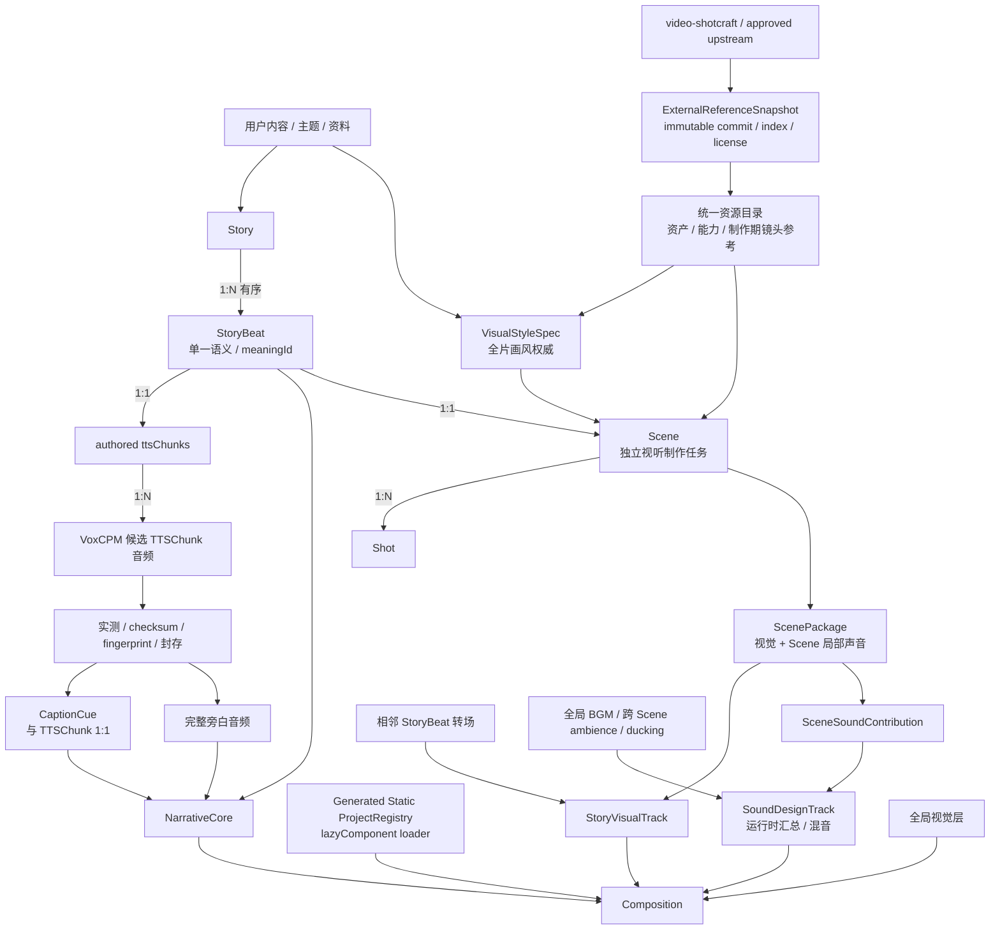

# 最终产品目标

> 当前实现：M1–M4 Narrative Baseline、M6 Scene Runtime foundation 与 M7 GPS 正式 Scene
> production 已完成；M6 synthetic proof 仍与正式 Story 隔离。M8 global sound/global visual、
> 最终批准与发布仍未实现，是当前下一步。

## 一句话目标

把“内容到完整视频”拆成稳定的叙事主线和可独立替换的 Scene 视听制作任务：即使没有
Scene 与其他增强，旁白和字幕也能完整讲完故事；画面与 Scene 局部声音主要在 Scene 层
按 StoryBeat 持续提升。

## 最终结构



```text
1 Story = 1 Composition
1 Story = N StoryBeat
1 StoryBeat = 1 meaningId = 1 NarrationUnit = 1 Scene
1 NarrationUnit = 1 ttsChunks collection = N TTSChunk = N CaptionCue
1 completed Scene = 1 ScenePackage
1 ScenePackage = 1 Scene-level rendererId + 1 SceneSoundPlan
1 Scene renderer = N Shot
N StoryBeat = N-1 StoryBeatTransition

Composition = NarrativeCore + selected optional EnhancementTracks
EnhancementTracks = StoryVisualTrack / SoundDesignTrack / GlobalVisualLayers
```

## 三个权威

- `StoryBeat` 是语义权威：决定表达什么、为什么进入下一段。
- 实测旁白时间线是时间权威：决定什么时候开始、持续多久。
- `VisualStyleSpec` 是全片画风权威：决定所有 Scene 共同遵守的视觉语言、连续性规则和
  禁止项。

Scene 与转场同时服务 StoryBeat 语义、全片画风和实测时间，不能只根据台词字面生成，
也不能反向修改旁白与字幕时间。

ExternalReferenceSnapshot 不是第四个创作权威。它只证明 Scene Agent 参考了哪一个不可变
上游版本、哪张镜头卡/样片/准确 demo，以及允许怎样本地化；具体是否选择、如何服务当前
StoryBeat，仍由 SceneVisualPlan 决定。

## 实施顺序与依赖方向

系统先完成不依赖 Scene 的必需主链：

```text
VideoBrief
→ StorySpec + NarrationSpec + RenderSpec
→ StoryBeat + 已创作 ttsChunks
→ 实测并封存的完整旁白
→ SemanticTiming + CaptionCue
→ NarrativeCore
→ Generated Static ProjectRegistry + lazy-loaded Composition
→ Narrative Baseline
```

StoryVisualTrack、SoundDesignTrack 和 GlobalVisualLayers 都是独立下游运行时增强轨。
它们可以缺失，只能消费已封存叙事主链，不能反向改写 Story、旁白、字幕或时间线；但
Scene 局部声音不是另一份独立创作权威，而是与画面一起由对应 ScenePackage 拥有，再投影
到 SoundDesignTrack。Scene 的具体视听表达最后设计。完整阶段、产物与失效边界见
[PRODUCTION_WORKFLOW.md](PRODUCTION_WORKFLOW.md)。

其中 RenderSpec 由用户在每次制作时直接提供，Agent 只做结构化和机械校验，不重复请求
确认。旁白时间用封存 PCM 的整数 sample-frame 数累计后统一量化到帧，不用逐段浮点
秒数推算。

## 节点责任

系统节点分为 `创作决策`、`制作编排` 和 `确定性执行`。Agent 贯穿前两类工作并调用
确定性工具，但正式渲染运行时不调用 Agent 或 skill。具体标注见
[ARCHITECTURE.md](ARCHITECTURE.md)。

## 不可偷换的边界

- Scene、Shot、TTSChunk 与 Remotion `<Sequence>` 不是同一个概念。
- NarrationUnit 与 Scene 是同一 StoryBeat 的语言表达和视听增强表达，不互相拥有。
- Narrative Baseline 不依赖 ScenePackage；Scene 完成视听制作后才产生可装配的
  ScenePackage。
- NarrativeCore 是唯一必需轨；视觉、声音设计和全局效果缺失时，Narrative Baseline
  仍必须可检查、预览和渲染。
- NarrativeCore 不绘制全帧背景；它的唯一视觉输出是顶层 `CaptionLayer`。没有装配
  StoryVisualTrack 或 GlobalVisualLayers 时，其余视觉区域保持透明。
- CompositionAssembly 以显式插槽并列装配 `NarrativeCore`、`StoryVisualTrack`、
  `SoundDesignTrack` 和 `GlobalVisualLayers`；实现抽取小型音频、视觉和时间线能力再
  组合成四个强语义聚合，不使用充满可选字段的万能 Track 类型。
- 四个运行时聚合不等于四份彼此独立的创作数据。ScenePackage 同时拥有视觉贡献与 Scene
  局部声音贡献；StoryVisualTrack 和 SoundDesignTrack 分别汇总同一批 ScenePackage 的对应
  投影，SoundDesignTrack 再叠加全局声音计划。
- ProjectRegistry 在 bundle 前自动发现固定目录并生成静态注册元数据；Story Composition
  通过 Remotion `lazyComponent` 按需加载。它不依赖 composition-local RendererRegistry。
- 每个 ScenePackage 只绑定一个 Scene 级 `rendererId`；ShotPlan 不绑定 `rendererId`、
  组件或模块路径。
- Scene renderer 是 runtime 的单一视觉入口，但内部可以拆分多个本地 Shot 组件并调用
  已批准共享能力；这些内部组件不成为独立 runtime registry 入口。
- CaptionLayer 顶层唯一；Scene renderer 只输出视觉，不播放旁白、不渲染字幕。Scene 局部
  ambience 与 SFX 由同一 ScenePackage 的 SceneSoundPlan 声明，并由固定音频 runtime 播放。
- 每个 Scene 的外部范围完全等于对应 StoryBeatTiming；Scene、Shot、局部音效和同步锚点
  都必须留在该固定窗口内，修改 Scene 不得 ripple-shift 后续 StoryBeat。
- NarrativeCore 与 StoryVisualTrack 在同一个 Composition 中实时叠加，不预渲染成
  两条视频再合成。
- v1 转场只支持 hard cut 与不改变总时长的 visual-only overlay；双 Scene overlap
  等待明确的 input/output handles 模型。
- “确定性 TTS”指固定生成、实测和产物封存流程，不承诺模型生成的波形 bit-by-bit
  可重复；封存音频及其 checksum、fingerprint 才是后续时间权威。
- 运行时只消费静态源码、合同数据和本地资产，不调用 skill、Agent 或网络。
- 数据只保存声明和稳定 ID；不承载 JSX、代码或动态模块路径。
- 新 Scene 只能参考当前输入、已注册共享能力和当前任务显式允许的冻结上游来源，不能
  参考旧 Scene 或旧 Composition。
- `video-shotcraft` 等镜头库是制作期 reference source，不是 runtime dependency 或全片画风
  权威。选中 recipe 时必须固定完整 commit、card/style-key、准确 demo 与 preview identities，
  只本地化最小依赖闭包，并用真实 Renderer/frame-state binding 和 source/adaptation 证据
  区分 exact-demo-localized 与 inspiration-only；未选中时允许空选择。
- 第三方代码许可证和媒体资产逐项授权分别验证；Gallery preview 只用于选型/审核，来源或
  授权未确认的 bundled audio/image/font 不得进入 ScenePackage。
- 新能力默认 composition-local；共享提取必须经过用户针对具体 proposal 的明确批准。
- 项目只使用宿主机 Node/npm，不使用 Docker。

## 完成定义

最终系统应能：

1. 从用户内容得到有序 StoryBeat 与已拆分 `ttsChunks`；
2. 生成并实测旁白，确定 CaptionCue 与完整绝对时间线；
3. 立即得到可独立预览的 Narrative Baseline；
4. 把每个 StoryBeat 作为独立 Scene 任务，可由独占该 meaningId 目录的 Agent 并行制作；
   每个 ScenePackage 内聚一个 Scene 级 renderer 入口、局部 ambience、SFX 与同步锚点，
   可独立替换和审核；
5. 从统一目录查询本地资产、共享制作能力与制作期镜头参考；选中上游 recipe 时把不可变
   来源、最小本地化实现和保真证据一起封存进 ScenePackage，不让 render runtime 依赖外部
   仓库；
6. 用 generated static ProjectRegistry 注册 Story Composition，通过 `lazyComponent`
   按需加载组件，并在 Scene 阶段用 composition-local RendererRegistry 绑定 Scene renderer；
7. 以少量机械检查、批量 ScenePackage 视听审核和一次最终预览批准完成交付；
8. 在用户明确批准后，把被多个真实主题证明的能力提升到共享层。

确定性执行的具体实现边界见
[DETERMINISTIC_EXECUTION.md](DETERMINISTIC_EXECUTION.md)。
