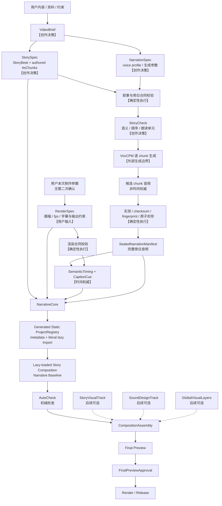

# 外部生产流程与解耦边界

> Status：M4 已为 `gps-relativity` 完成 Narrative Baseline 的作品级机械 AutoCheck 与失效
> 验证闭环；NarrativeCheck 和全部视觉/增强/发布能力仍未实现。

## 1. 文档范围

这里的“外部生产流程”指 Scene 内部视觉制作之外，从用户输入到可播放视频、最终装配和
交付的完整流程，同时包括 VoxCPM 等生成服务与本地确定性系统之间的边界。

当前设计顺序是：

```text
先稳定叙事生产主链
→ 再接入彼此独立的增强轨
→ 最后设计 Scene 的具体视觉表达
```

本阶段不设计或实现 Scene 构图、Shot、renderer、转场、视觉选材和共享视觉能力提升。
现有 Scene 文档只保留未来接入接口，不成为叙事主链的前置条件。

## 2. 必需主链与可选增强

```text
必需主链
VideoBrief
→ StorySpec + NarrationSpec + RenderSpec
→ Narration Generation
→ SealedNarrationManifest
→ SemanticTiming + CaptionCue + Complete Narration Audio
→ NarrativeCore
→ Generated Static ProjectRegistry + lazy-loaded Composition
→ Narrative Baseline

可选增强轨
StoryVisualTrack
SoundDesignTrack
GlobalVisualLayers

最终装配
NarrativeCore + 已选择的可选增强轨
→ Final Preview
→ FinalPreviewApproval
→ Render / Release
```

`NarrativeCore` 是唯一必需轨。任何增强轨缺失，都不得阻止 Narrative Baseline 的检查、
预览或渲染。

## 3. 总流程



虚线表示可选依赖。当前 M4 已实现到 `Narrative Baseline` 的机械 AutoCheck，并且不要求任何
增强轨存在。主观 NarrativeCheck 没有进入当前 gate。

## 4. 阶段输入与输出

| 阶段                     | 输入                                                              | 固定输出                                                                         | 边界                                                                                                           |
| ------------------------ | ----------------------------------------------------------------- | -------------------------------------------------------------------------------- | -------------------------------------------------------------------------------------------------------------- |
| Brief                    | 用户内容、资料、受众、时长与交付约束                              | `VideoBrief`                                                                     | 只描述目标，不包含实现代码                                                                                     |
| Story Authoring          | `VideoBrief`                                                      | `StorySpec`、有序 StoryBeat、已创作 `ttsChunks`、显式叙事停顿意图                | `ttsChunks` 和停顿都由创作决策产生，不按标点自动拆分或推断                                                     |
| Narration Authoring      | `VideoBrief`                                                      | `NarrationSpec`、voice profile 引用和允许的生成参数                              | 不包含 provider 地址、token 或私有配置                                                                         |
| Render Input             | 用户每次制作直接提供的参数                                        | `RenderSpec`                                                                     | Agent 原样结构化并应用合同中已经定义的默认值；只做类型、范围和兼容性校验，不形成确认或审批节点                 |
| Contract Check           | StorySpec、NarrationSpec 与用户提供的 RenderSpec                  | 分层校验报告；由有序 ttsChunks + NarrationSpec 得到 generation input fingerprint | 只校验已确定输入，不改写文案、声音选择或输出约束                                                               |
| Story Check              | StorySpec、NarrationSpec 与合同报告                               | Agent 叙事计划检查报告                                                           | 在调用外部生成前检查语义顺序、朗读单元和声音选择；不增加用户审批                                               |
| Narration Generation     | `StorySpec.ttsChunks`、`NarrationSpec`                            | 候选 chunk 音频                                                                  | 可调用 VoxCPM；候选产物不是时间权威                                                                            |
| Seal and Measure         | 完整候选 chunk 集合、显式停顿声明                                 | sealed manifest、chunk checksum、完整音频、实测时长和非朗读区间                  | 全部验证成功后原子封存；部分结果不得冒充完成                                                                   |
| Timing                   | sealed manifest、`RenderSpec.fps` 和显式时间边界                  | `SemanticTiming`、`CaptionCue`                                                   | 按 `pcm-cumulative-ceil-v1` 从累计 sampleFrameCount 计算；不得逐 chunk 转帧累加                                |
| Narrative Runtime        | `StorySpec`、`RenderSpec`、sealed narration、timing               | `NarrativeCore`                                                                  | 不消费 NarrationSpec 的生成参数，不调用 Agent、skill、MCP、VoxCPM 或网络服务                                   |
| Composition Registration | NarrativeCore、Story ID、RenderSpec、SemanticTiming、固定项目入口 | generated static ProjectRegistry、lazy-loaded Narrative Baseline Composition     | bundle 前固定一级目录发现；元数据静态可枚举，字面量 `import()` 交给 `lazyComponent`；render runtime 不扫描目录 |
| Baseline Evidence        | Narrative Baseline 与其 fingerprints                              | M3 透明 still、全长 render、严格 evidence receipt                                | 固定路径和机械媒体事实                                                                                         |
| Baseline AutoCheck       | M1–M3 source、封存产物、registry、Baseline 与 evidence            | M4 strict persisted report 和作品级机械汇总                                      | 默认只读 drift gate；不要求 ScenePackage、视觉资产或 renderer registry                                         |
| Narrative Check          | Narrative Baseline 与机械报告                                     | 未来可能另行设计的 Agent 叙事检查报告                                            | 不属于当前 gate；如未来设计，必须另行批准主观检查边界                                                          |
| Enhancement              | 已封存叙事主链                                                    | 相互独立的 visual、sound、global tracks                                          | 只能消费上游，不得改写 Story、旁白、字幕或 timing                                                              |
| Final Assembly           | NarrativeCore 与已选择增强轨                                      | Final Preview、assembly fingerprint                                              | 缺失未选择的增强轨不是错误                                                                                     |
| Approval and Release     | Final Preview                                                     | approval receipt、成片和发布物                                                   | 用户批准绑定 assembly fingerprint                                                                              |

## 5. 权威与所有权

### 创作权威

- `VideoBrief`：用户目标和约束权威；
- `StoryBeat`：语义、顺序和叙事推进权威；
- `ttsChunks`：已创作的实际朗读单元；工具不得按标点重新切分；
- chunk 或 StoryBeat 之间若需要额外停顿，必须由创作声明显式表达；工具不得根据标点
  猜测停顿。封存音频本身已有的自然静音按实测结果保留；
- `NarrationSpec`：本次 voice profile 和允许生成参数的权威；
- `RenderSpec`：用户在每次制作时直接交给 Agent 的 fps、画幅、字幕与交付格式权威。
  Agent 只负责结构化和机械校验，不得把它变成重复确认或创意审批；它不拥有台词或旁白
  波形。

### 产物权威

- VoxCPM 刚生成的 chunk 音频只是候选产物；
- 完整候选集合通过实测、checksum 和 fingerprint 后，
  `SealedNarrationManifest` 才成为旁白产物权威；
- `SemanticTiming` 只从 sealed manifest 生成，是后续绝对时间权威；
- CaptionCue 与 TTSChunk 一一对应，文本来自实际 `ttsText`，不做词级对齐；显式片头、
  片尾或段间静音属于 SemanticTiming 的非朗读区间，不生成伪字幕。

### 音频到帧

- 音频时间事实是封存 PCM 的整数 sample-frame 数（每声道采样时刻数），不是容器报告
  的浮点秒数或交错声道样本总数；
- 所有 chunk 和显式叙事停顿先形成一条连续样本时间线，再对每个累计样本边界统一执行
  `ceilDiv(累计样本 × fps, sampleRate)`；禁止每个 chunk 分别转帧后求和；
- `RenderSpec` 中的片头、片尾在结构化后保存为整数帧。完整旁白只在片头帧之后播放，
  修改片头片尾不会改写 sealed narration；
- CaptionCue 使用对应 TTSChunk 的两个共享边界，显式停顿只占时间、不生成字幕；
- 唯一公式、取整理由、零帧保护和运行时约束见
  [确定性执行：音频样本到帧](DETERMINISTIC_EXECUTION.md#8-音频样本到帧的唯一算法)。

### 运行时所有权

- `NarrativeCore` 拥有旁白播放、顶层 CaptionLayer 和绝对时间挂载；CaptionLayer 固定 40px
  字号，并按 Composition 宽高约束最大宽度和响应式安全区；NarrativeCore 不绘制背景，除
  CaptionLayer 外的视觉区域保持透明；
- `ProjectRegistry` 把静态可枚举的 Story 注册元数据与字面量 lazy import 绑定；它与未来
  把 rendererId 绑定到 SceneRenderer 的 RendererRegistry 是两个独立 registry；
- 固定生成步骤只发现 `src/projects/*/Composition.tsx`，稳定排序并生成
  `project-registry.generated.ts`；每个入口必须 default export；
- Root 静态读取 generated registry，再把条目的字面量 loader 传给 Remotion
  `lazyComponent`。具体 Composition 只在选中、preview 或 render 时加载；
- generated registry 必须进入 fingerprint，并由 read-only check mode 做 byte-for-byte
  漂移检查；正式 render runtime 不扫描目录、不生成 registry，也不读取 JSON 模块路径；
- visual、sound、global tracks 只拥有各自增强内容；
- CompositionAssembly 只装配，不进行创作选择，也不重算叙事时间。

## 6. VoxCPM 外部生成边界

只有 Narration Generation 阶段可以调用 VoxCPM。其余检查、preview、render 和 quality
流程只读取仓库内声明、本地源码和已封存产物。

必须遵守：

- 每个请求绑定 chunkId、meaningId、实际 `ttsText`、NarrationSpec 和 generation input
  fingerprint；
- 部分成功可以作为同一 generation input fingerprint 下的续跑候选，但不能生成 sealed
  receipt；
- 重试不得静默覆盖上一次已封存旁白；重新生成产生新的 sealed fingerprint；
- provider 不可用时，最后一份仍匹配 StorySpec 和 NarrationSpec 的 sealed narration 保持
  有效；
- provider 地址、token、私有配置不得写入 StorySpec、manifest 或 render runtime；
- runtime 不以“重新调用一次 TTS”修复缺失或失效产物，而是 fail closed。

## 7. 生命周期

```text
Draft
→ StoryReady
→ NarrationInProgress
→ NarrationSealed
→ BaselineReady
→ EnhancementInProgress（可跳过）
→ FinalPreviewReady
→ Approved
→ Rendered
```

这些名称用于描述生命周期，不建立一个可被手工修改的万能 `status` 字段。当前状态必须
由合同、产物、receipt 和 fingerprint 是否齐全且相互匹配推导。

允许返回上游修改，但必须形成新的 fingerprint 并让下游结果失效；不能修改上游后继续
沿用旧 timing、旧 preview 或旧 approval。

## 8. 失效方向

```text
Generation input fingerprint
= ordered StorySpec.ttsChunks + NarrationSpec

Sealed narration fingerprint
= generation input fingerprint
+ selected measured chunk checksums
+ explicit pause declarations
+ measurement / assembly algorithm version
+ complete audio checksum

SemanticTiming fingerprint
= sealed narration fingerprint + RenderSpec timing fields + timing algorithm version

ProjectRegistry entry fingerprint
= Story ID + RenderSpec registration fields + SemanticTiming total frames
+ literal Composition entry + registry generator version + generated entry checksum

Narrative Baseline fingerprint
= StorySpec + RenderSpec + sealed narration + SemanticTiming
+ ProjectRegistry entry fingerprint + NarrativeCore version

Visual / Sound / Global fingerprints（后续同级可选消费者）
= StorySpec + SemanticTiming + 各自声明、源码和资源

Assembly fingerprint
= Narrative Baseline fingerprint + selected enhancement fingerprints + assembly plan

Approval / Render evidence
= Assembly fingerprint
```

- StoryBeat、`ttsText`、顺序或 NarrationSpec 变化：旁白封存及所有下游失效；
- 只修改显式停顿：仍匹配 generation input fingerprint 的 chunk 候选可以复用；sealed
  complete audio、timing、Baseline 和下游证据失效；
- 只重新生成旁白：Story 语义仍可保留，但 timing、字幕、Baseline 和所有增强证据失效；
- 只修改 RenderSpec timing 字段（fps、片头或片尾）：已封存旁白保持有效；
  SemanticTiming、registry entry、字幕边界、Baseline 和依赖它们的下游结果失效；
- 只修改 RenderSpec 的非 timing 字段：已封存旁白与 SemanticTiming 保持有效；相关
  registry 元数据、字幕布局或输出约束、Baseline 和依赖它们的下游结果失效；
- 新增、删除、重命名 Story 入口，或修改 Composition ID、default export、registry
  generator：ProjectRegistry、Composition listing、Baseline 和 evidence 失效；sealed
  narration 与 SemanticTiming 只按各自输入判断；
- 只修改视觉：NarrativeCore、sealed narration、timing 和字幕保持有效；
- 只修改声音设计或全局层：旁白、字幕、Scene 内部证据保持有效；
- 任一最终装配输入变化：FinalPreviewApproval 失效，必须绑定新 assembly fingerprint。

失效只能向下游传播，视觉或发布阶段不得反向改写 StorySpec 和实测旁白时间线。

## 9. 当前里程碑

M2 已为 `gps-relativity` 实现和验证：

```text
VideoBrief
→ StorySpec + NarrationSpec + RenderSpec
→ StoryBeat + authored ttsChunks
→ StoryCheck
→ VoxCPM generation boundary
→ candidate / measured progress + resume
→ canonical PCM normalization / checksum / atomic sealed narration
→ SemanticTiming + CaptionCue
```

M2 本身明确没有实现：

- NarrativeCore、NarrationAudioTrack、CaptionLayer；
- generated static ProjectRegistry、Story Composition、preview 或 render；
- NarrativeCheck；
- SceneVisualPlan、ShotPlan、ScenePackage 和 Scene renderer；
- StoryVisualTrack、StoryBeatTransition 和视觉资产查询；
- SceneVisualCheck、视觉 benchmark 和 promotion；
- SoundDesignTrack、GlobalVisualLayers、封面与发布自动化。

M3 已在不修改上述 M2 权威的前提下继续实现：

```text
sealed narration + SemanticTiming
→ NarrationAudioTrack + CaptionLayer + transparent NarrativeCore
→ required-only CompositionAssembly
→ generated static ProjectRegistry + literal lazy import
→ GpsRelativity lazy Story Composition
→ transparent stills + 1731-frame H.264/AAC render + M3 evidence receipt
```

M4 已在不修改上述 M2/M3 权威的前提下继续实现：

```text
M1 contracts + StoryCheck identity + M2 sealed narration + SemanticTiming
+ ProjectRegistry + Narrative Baseline + M3 evidence
→ fixed project:check --level narrative
→ strict persisted AutoCheck + read-only drift gate
→ 16-case isolated invalidation proof
```

M4 明确只收口机械验证，没有增加主观审核。Scene、BaseCanvas、资源目录、可选增强轨、`final`
level 和发布流程仍未实现。NarrativeCheck 也没有实现。Gate A 的机械条件已通过，下一步只
允许单独编写并审阅 M5 视觉表达规格；视觉层
仍必须把 sealed narration、SemanticTiming 和 StoryBeat 当作只读输入。

## 10. M2/M3 完成事实与后续门槛

M2 已满足：

1. 一个全新真实主题形成合法 StorySpec、NarrationSpec、StoryBeat 和已创作
   `ttsChunks`；用户本次提供的 RenderSpec 只经结构化和机械校验，不产生二次确认，并在
   调用 VoxCPM 前通过非用户阻塞的 StoryCheck；
2. 真实 VoxCPM 逐 chunk 生成可中断续跑，未完成批次不会产生 sealed receipt；
3. 完整旁白经实测、checksum 和 fingerprint 封存且不会覆盖旧封存结果；
4. CaptionCue、meaningId 和 TTSChunk 一一对应；所有帧边界均由累计
   sampleFrameCount 按 `pcm-cumulative-ceil-v1` 重算得到，完整绝对时间线没有重叠、
   累计漂移或未解释空洞，所有非朗读区间都有显式来源；
5. 重复封存字节不变，不同 active seal 必须用精确 `--supersede` compare-and-swap；
6. 真实文件-backed checker 校验 manifest、WAV checksum/sample-frame 和 byte-equivalent
   SemanticTiming；
7. README、状态、架构、合同、恢复指南和真实验收证据与实际命令保持一致。

M3 另已满足：

1. 完整旁白只挂载一次且 `playbackRate=1`，字幕只消费已生成绝对帧；
2. NarrativeCore 除 CaptionLayer 外不绘制视觉，frame 0 的真实 PNG 全透明；
3. fixed first-level ProjectRegistry 生成、default export 检查、稳定排序、literal import、
   原子写入与 byte drift check 全部 fail closed；
4. Root 通过 `lazyComponent` 列出 `GpsRelativity` 30 fps、1920×1080、1731 frames；
5. frame 15 字幕可见且外部/左上透明，完整 render 有 1731 帧、1 路 H.264 与 1 路 AAC；
6. registry-entry、Narrative Baseline 与 M3 evidence fingerprints 均已生成并进入脱敏证据；
7. 全部 M1–M3 tests、typecheck、lint、bundle、listing、render 与隐私/保护 gate 通过。

M4 另已满足：固定七项 AutoCheck 全部通过；默认重算拒绝缺失、malformed 和 byte drift；
显式写入只保存 pass 且重复执行 checksum/mtime 稳定；16 类隔离 mutation 全部 fail closed；
M2/M3 受保护文件、fingerprint、listing 和媒体证据保持不变。主观 NarrativeCheck 不属于
本里程碑完成事实。
