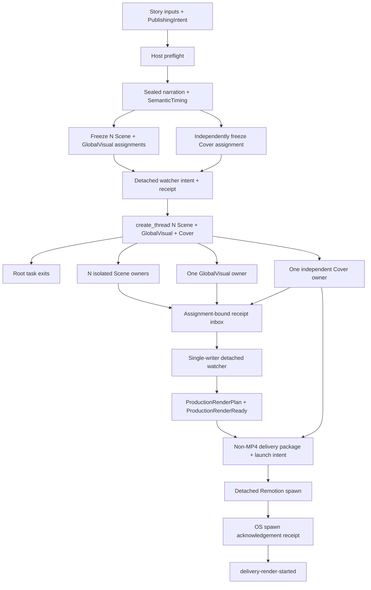

# 外部生产流程

> 文档类型：执行流程权威
>
> 最后复核：2026-08-11

## Current-only 主链



仓库不包含旧 production/delivery dispatch。历史普通文件不会被 current scripts 读取、迁移、
回填或解释。

## 1. Authoring 与 preflight

Agent 先通过 strict ProducerConfig 读取 render 默认值、Scene 基准边缘留白、合集数组和通用 TTS
默认策略，再 author VideoBrief、StorySpec、NarrationSpec、RenderSpec、StoryCheck、
PublishingIntent v2 和 current ProductionRequirementsFreeze。PublishingIntent 必须从合集数组选
且只选一个最合适的 ID，并封存名称与目录 fingerprint；不得写自由文本合集。RenderSpec 不保存
目标时长或字幕安全区。每个 StoryBeat 有稳定 meaningId；ttsChunks 按意义、语气与朗读节奏创作，
工具不得自动拆分。

`production:preflight` 使用 `production-start-preflight-v2` 在 Run write 前检查 VoxCPM
liveness/readiness 与 Remotion Chromium，
区分 resident-ready、loading、offloaded 与 model-load-failed。offloaded 表示首个真实生成请求会
自动重载，不触发 warm-up 或 test TTS；`denoise=true` 时还必须在真实生成前确认 denoiser
capability，否则返回脱敏 external blocker。真实调用直接使用宿主权限。

配置页与 Studio 由同一个 `npm run dev` 启动：loopback `:3100` 是配置控制台，`:3101` 是 Remotion
Studio。可信局域网可显式使用 `npm run dev:lan`，两者通过同一 LAN IP 访问；配置写入仍要求
Origin/Host 精确同源。私密 JSON、完整 token 和声线路径只允许停留在 ignored 配置与可信页面，
LAN 端口不得转发到公网。

## 2. Narrative baseline

`production:start` 建 immutable Run manifest；`production:narrative` 生成并封存 narration，按
sealed PCM 累计 sample 边界导出 SemanticTiming、CaptionCue 与 NarrativeCore，并完成 fixed
mechanical AutoCheck。实测音频时间不可被 Scene 或转场移动、压缩或吞掉。

TTS 语速在 provider response 后、canonical PCM 实测前处理并绑定 provider-attempt；目标 LUFS
进入两遍 loudnorm mastering policy 与母带 fingerprint。VoxCPM 可控/高品质克隆分别使用
`/clone` 与 `/clone_with_prompt`，内部 mode 不作为 provider 字段发送。

若 Agent-owned Story authoring 在实测时长后返工，旧 Run 保持 immutable，新 Run 必须显式使用
`production:narrative -- --run <runId> --supersede <current-sealed-fingerprint>` 绑定当前 active
seal identity。只有 identity 精确匹配时 fixed flow 才能原子提升新 seal；不得手改 active manifest。
新 baseline writer 允许把一个结构有效但 identity-stale 的旧 M3 receipt 作为待替换输入；所有
check-only 路径仍严格拒绝 stale 或 malformed evidence，replacement 只由 fixed writer 原子完成。

## 3. Freeze 与 owner 隔离

`production:scene:freeze` 原子冻结 N Scene assignments 与一个 GlobalVisual assignment；
`delivery:cover:freeze` 独立冻结 Cover assignment。

- Scene owner 制作前必须读取并使用 repository-local
  `.agents/skills/remotion-best-practices/SKILL.md`，同时以 AGENTS、assignment、contracts 与
  validators 为更高 authority；只写 exclusive project/public paths，完成后发布 ready/failed
  receipt，不直接 submit 正式结果。
- GlobalVisual owner 不读取 Scene results，不绘制字幕/可见文本/音频，不扩张为通用 DSL。
- Cover owner 只读取 assignment 内的 StorySpec、VisualStyleSpec、CoverSpec，并封存两个固定比例
  exact PNG。
- root 运行 `production:watch:start`，收到 OS spawn acknowledgement 后用 Codex `create_thread`
  派发独立任务并立即结束。root 不等待、读取或轮询任务，也不参与后续收口。

## 4. Receipt inbox、watcher 与 render-ready

每个 assignment 只有一个固定 receipt path。receipt 绑定 run/story/owner/meaningId、assignment、
task/requirements inputs、规范化 output manifest/checksum 与自身 fingerprint；同内容重放 no-op，
冲突、malformed、stale、symlink、path escape、unknown file 或 checksum drift fail closed。发布使用
同目录 temporary 与 atomic rename。仓库不保存 threadId、taskId、heartbeat、progress 或聊天内容。

owner 没有 receipt 时状态保持 `waiting-for-owner-results`，不读取 deadline 猜失败，不监控
heartbeat，不自动 retry 或创建替代任务。外部可为同一 immutable assignment 创建新线程。

watcher 按 assignment identity 扫描 receipts，先串行执行 fixed Scene/GlobalVisual validation 与正式
result write；events/state、registry/projections/Composition 和 delivery 仍只有它可写。Cover receipt
可提前出现，但 watcher 只在 production 已是 render-ready 后执行 Cover fixed check/submit，因此任何
Cover 缺失或失败都不会把 production 变成 failed，只会阻止 automatic delivery。

watcher 从 immutable N+1 results 投影 Coverage、RendererRegistry、visual/sound projections、
GlobalVisualProjection、FinalAssembly 与 current Composition。之后构建：

- `production-render-plan-v2`：绑定 story/run、sealed narration、content-addressed mastered
  narration、Composition/source checksum、width/height、fps、frameCount、layer/mix order 与固定
  Remotion policy；
- `GlobalVisualLayers` 的固定接口是无 Props；plan/projection 由 Composition 顶层解析并校验
  identity，不传给组件。render plan 与最终 Composition current 后，fixed flow 用仓库
  TypeScript/tsconfig 和 `noEmit` 只编译该 Project 的真实 import graph；
- `production-render-ready-v2`：绑定 plan 及全部 render-critical identities，状态
  `render-ready`，handoff `awaiting-automatic-delivery`。

任何类型不兼容都在写入 ProductionRenderReady 前终止当前 Run。

这个阶段不运行最终 Remotion render，不读取媒体，也不写媒体完成 evidence。Cover failure 不
改变 production 状态，但 delivery build 必须要求 current CoverResult。

## 5. Watcher launch 与自动交付 launch

`production:watch:start` exactly once 写 watcher launch intent，再用 fixed cwd/argv/log、
`shell:false`、`detached:true` 和非继承 stdio spawn worker。只在 OS `spawn` 后写 watcher launch
receipt；intent 无 receipt 永久 ambiguous，禁止重试。receipt 不证明 watcher 完成生产。

`delivery:build` 从 current inputs 确定性生成 deliveryId，在 staging 中写 exact Covers、
publishing、handoff、`delivery-launch-manifest-v1`、`render-launch-intent-v1` 和 checksum ledger，
检查后原子提升。

intent 已持久化后才允许 spawn。adapter 使用固定 executable/argv/cwd/log、`shell: false` 与
`detached: true`，只监听 `spawn` 和 `error`。收到 `spawn` 后立即 `unref()` 并写
`render-launch-receipt-v1`。stdout 返回 `delivery-render-started`。

exactly-once 规则：

- receipt exists → check current package，返回 no-op；
- intent exists + no receipt → launch-ambiguous，fail closed，never retry；
- output/log pre-exists before first launch → fail closed；
- spawn error → intent 保留、receipt 缺失，后续同样 ambiguous。

## 6. 终点与交接

主 Agent 只报告 run、watcher intent/receipt、已创建任务与未派发 assignment，并立即结束。后台
watcher 自动到达 `delivery-render-started` 后停止，不等待或监控 detached Remotion child。两层
spawn receipt 都不是生产成功或 MP4 有效声明。

## 7. 作品删除

用户明确要求删除一个、多个或全部已制作作品时，含义是删除对应 storyId 的完整本地生产数据，
不是只删除 MP4。统一执行：

```bash
npm run project:delete -- --project <story-id> --confirm-delete
npm run project:delete -- --project <story-a> --project <story-b> --confirm-delete
npm run project:delete -- --all --confirm-delete
```

删除集合固定覆盖 `src/projects/<storyId>/`、`public/projects/<storyId>/`、
`.narration-work/<storyId>/`、该 storyId 的全部 `.producer-runs/<runId>/`、`out/<storyId>/` 与
`deliveries/<storyId>/`，随后重建 ResourceCatalog 与 ProjectRegistry。命令不触碰 core、其他作品、
private config 或 `public/voice_profile/`。任何目标 symlink/非目录、目标 writer lock、非空
`deliveries/.staging/` 或不存在的显式 storyId 都会在首次删除前令命令失败。

## 故障所有权

- Agent-owned authored artifact 被 check 拒绝：退回同一 owner 修改其独占路径。
- fixed workflow 在 valid inputs 下失败：停止、保存脱敏 incident、写 Red regression、做最小
  shared fix、验证 Green，并从 fresh Run 重放。
- provider/host/permission/authorization：external blocker，不增加 fallback/retry。
- launch-ambiguous：确定性终态；除非用户明确设计新的人工处置流程，否则不得自动处理。
