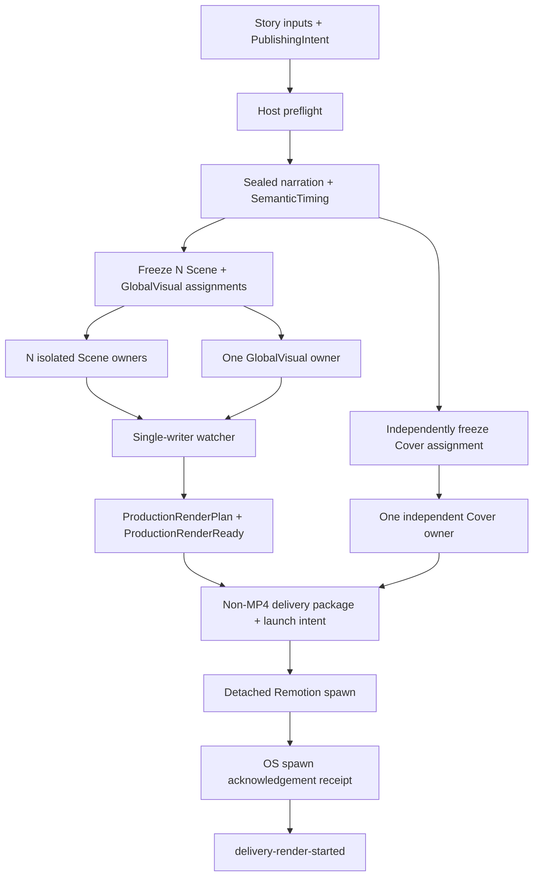

# 外部生产流程

> 文档类型：执行流程权威
>
> 最后复核：2026-08-09

## Current-only 主链

仓库不包含旧 production/delivery dispatch。历史普通文件不会被 current scripts 读取、迁移、
回填或解释。

## 1. Authoring 与 preflight

Agent author VideoBrief、StorySpec、NarrationSpec、RenderSpec、StoryCheck、PublishingIntent 和
current ProductionRequirementsFreeze。每个 StoryBeat 有稳定 meaningId；ttsChunks 按意义、语气
与朗读节奏创作，工具不得自动拆分。

`production:preflight` 使用 `production-start-preflight-v2` 在 Run write 前检查 VoxCPM
liveness/readiness 与 Remotion Chromium，
区分 resident-ready、loading、offloaded 与 model-load-failed。offloaded 表示首个真实生成请求会
自动重载，不触发 warm-up 或 test TTS；`denoise=true` 时还必须在真实生成前确认 denoiser
capability，否则返回脱敏 external blocker。真实调用直接使用宿主权限。

## 2. Narrative baseline

`production:start` 建 immutable Run manifest；`production:narrative` 生成并封存 narration，按
sealed PCM 累计 sample 边界导出 SemanticTiming、CaptionCue 与 NarrativeCore，并完成 fixed
mechanical AutoCheck。实测音频时间不可被 Scene 或转场移动、压缩或吞掉。

若 Agent-owned Story authoring 在实测时长后返工，旧 Run 保持 immutable，新 Run 必须显式使用
`production:narrative -- --run <runId> --supersede <current-sealed-fingerprint>` 绑定当前 active
seal identity。只有 identity 精确匹配时 fixed flow 才能原子提升新 seal；不得手改 active manifest。
新 baseline writer 允许把一个结构有效但 identity-stale 的旧 M3 receipt 作为待替换输入；所有
check-only 路径仍严格拒绝 stale 或 malformed evidence，replacement 只由 fixed writer 原子完成。

## 3. Freeze 与 owner 隔离

`production:scene:freeze` 原子冻结 N Scene assignments 与一个 GlobalVisual assignment；
`delivery:cover:freeze` 独立冻结 Cover assignment。

- Scene owner 制作前必须读取并使用 repository-local
  `.agents/skills/remotion-best-practices/SKILL.md`，同时以 AGENTS、assignment、contracts 与
  validators 为更高 authority；只写 exclusive project/public paths，先 check，再由 root
  submit/fail。
- GlobalVisual owner 不读取 Scene results，不绘制字幕/可见文本/音频，不扩张为通用 DSL。
- Cover owner 只读取 assignment 内的 StorySpec、VisualStyleSpec、CoverSpec，并封存两个固定比例
  exact PNG。
- root 保持 watcher 活跃，只让 repository CLI 写 events/state/results。

## 4. Watcher 与 render-ready

watcher 从 immutable N+1 results 投影 Coverage、RendererRegistry、visual/sound projections、
GlobalVisualProjection、FinalAssembly 与 current Composition。之后构建：

- `production-render-plan-v1`：绑定 story/run、Composition/source checksum、width/height、fps、
  frameCount、layer/mix order 与固定 Remotion policy；
- `GlobalVisualLayers` 的固定接口是无 Props；plan/projection 由 Composition 顶层解析并校验
  identity，不传给组件。render plan 与最终 Composition current 后，fixed flow 用仓库
  TypeScript/tsconfig 和 `noEmit` 只编译该 Project 的真实 import graph；
- `production-render-ready-v1`：绑定 plan 及全部 render-critical identities，状态
  `render-ready`，handoff `awaiting-automatic-delivery`。

任何类型不兼容都在写入 ProductionRenderReady 前终止当前 Run。

这个阶段不运行最终 Remotion render，不读取媒体，也不写媒体完成 evidence。Cover failure 不
改变 production 状态，但 delivery build 必须要求 current CoverResult。

## 5. 自动交付 launch

`delivery:build` 从 current inputs 确定性生成 deliveryId，在 staging 中写 exact Covers、
publishing、handoff、`delivery-launch-manifest-v1`、`render-launch-intent-v1` 和 checksum ledger，
检查后原子提升。

intent 已持久化后才允许 spawn。adapter 使用固定 executable/argv/cwd/log、`shell: false` 与
`detached: true`，只监听 `spawn` 和 `error`。收到 `spawn` 后立即 `unref()` 并写
`render-launch-receipt-v1`。stdout 返回 `delivery-render-started`。

exactly-once 规则：

- receipt exists → check current package，返回 no-op；
- intent exists + no receipt → launch-ambiguous，fail closed，never retry；
- output/log pre-exists before first launch → fail closed；
- spawn error → intent 保留、receipt 缺失，后续同样 ambiguous。

## 6. 终点与交接

主 Agent 报告 run、deliveryId、delivery directory、planned MP4/log path、intent/receipt identity
和保护检查。不得等待或监控 detached child；不得把 MP4 存在、进程 exit 或 launch receipt
转换为 render success 声明。

## 故障所有权

- Agent-owned authored artifact 被 check 拒绝：退回同一 owner 修改其独占路径。
- fixed workflow 在 valid inputs 下失败：停止、保存脱敏 incident、写 Red regression、做最小
  shared fix、验证 Green，并从 fresh Run 重放。
- provider/host/permission/authorization：external blocker，不增加 fallback/retry。
- launch-ambiguous：确定性终态；除非用户明确设计新的人工处置流程，否则不得自动处理。
