# Production Workflow

> 文档类型：生产流程 authority
>
> 本文只描述 current Revision/DAG/Artifact 主链。
>
> Repository CLI 与 Desktop Workspace 都在 composition root 注入显式 locations/runtime；Desktop control plane
> 只使用 authenticated Unix-domain socket，单次 DeliveryBuild 仅允许 `127.0.0.1` OS-ephemeral 临时 HTTP data plane，
> 终态必须关闭，详见 [ITERATION_STATUS.md](ITERATION_STATUS.md)。

## 1. 主链概览

```mermaid
flowchart LR
  Author[Atomic create or isolated same-Project candidate] --> MCP{Current Root exposes compatible MCP tools?}
  MCP -->|no: omit slot| Resolve[Resolve execution policy]
  MCP -->|yes: load slot| Catalog{Local Catalog satisfies need?}
  Catalog -->|yes| Resolve
  Catalog -->|no| Import[MCP receipt + project asset import]
  Import --> Resolve
  Resolve --> Inspect[Read-only readiness + cost + invalidation]
  Inspect --> Report[Root reports before cost]
  Report --> Prepare[Provider and fixed preparation]
  Prepare --> Plan[ProductionRevision + Task DAG]
  Plan --> Reuse[Reuse valid artifacts]
  Plan --> Dirty[Create dirty Agent task workspaces]
  Dirty --> Mode{Resolved execution mode}
  Mode -->|inline default| Inline[Root sequential executor]
  Mode -->|subagents| Children[Runtime-native task children]
  Inline --> Check[Read-only task check]
  Children --> Check[Read-only task check]
  Check --> Terminal[Attempt-bound commit or failure event]
  Terminal -->|failure| Exit[Terminal nonzero exit]
  Terminal -->|all artifacts| Continue[Fixed continuation]
  Reuse --> Continue
  Continue --> Barrier[All required artifacts]
  Barrier --> Materialize[Controlled materialization]
  Materialize --> Derived[Packages + Registry + Composition]
  Derived --> SourceCurrent[Attested source-current]
  SourceCurrent --> Policy{Delivery policy}
  Policy -->|manual| Stop[Source current terminal]
  Policy -->|automatic or later explicit action| Build[Synchronous media build]
  Build --> Verify[Exact four-file validation]
  Verify --> Current[Controlled current delivery]
```



一个新 ExecutionAttempt 可以失败或消失；已验证 artifact 仍按内容 identity 复用。inspection/explanation/
baseline/attempt 只属于 diagnostic plane，不影响 Revision、TaskRevision、ArtifactAttestation、dispatch、
materialization 或 DeliveryBuild。历史执行目录不参与 prepare、converge、delivery 或 settings progress。

图中的 MCP 分支是当前 Root Agent 的 pre-inspect capability slot，不是 ProductionRevision/Task DAG node。
只有当前 Agent 实际可调用同一 MCP 的 status/search/preview/acquire tools，且 acquisition receipt 能通过
`project:asset:import` 时才投影该阶段；安装配置、shell discovery 或其他 Agent 的 tool surface 不算可用。
缺失时整个 slot 无错误、无占位地省略。存在时仍先查本地 Catalog，只有准入后的 Project-owned manifest ID
与 bytes fingerprint 才进入后续确定性主链；MCP、远程 URL、凭据、receipt 和 candidate path 留在 adapter
boundary，task executors 与 runtime 不感知。

## 2. Project authoring

新 Project 从 strict `ProjectCreateInput` 原子创建：

```bash
npm run project:create -- --project <storyId> --input <repository-relative-json>
```

fixed creator 在受控 staging 中验证完整 Project/source/public/template/sound/catalog transaction，将
ProducerConfig 的 render/readability/TTS defaults 与选定 boundary Scene templates 投影到 Project-local
configured authoring。已存在、partial、cross-project、symlink/path escape/special-file 或不同 creation identity
都 fail closed；相同 identity 重复调用只读 current。create 不调用 provider、不生成媒体，也不写
`.narration-work`、workspace、artifact、attempt 或 delivery。Project-local media 只能在创建成功后 import。
public `project validate` / `project create` 在上述 transaction 前对每个 narrated `ttsChunk` 执行固定
`caption-display-unit-v1` 预算检查；超过 72 display half-units 时返回精确 `ttsText` path、稳定 code 与
`ownerAction`，且不写 Project。
template instance 同时包含一个 Project-local Renderer adapter；它接收共享 runtime 的
`viewportWidth`/`viewportHeight`，只把 safe-area-local dimensions 映射给模板内部 `width`/`height`。其源码和
import graph 与其他 copied bytes 一起冻结；后续共享模板或 generator 修复不会隐式迁移既有 Project。

installed Workspace 修改现有作品时使用 public candidate surface，不直接写 live Project：

```bash
./.rsp/bin/rsp schema project-revision
./.rsp/bin/rsp project revise-context --project <storyId>
./.rsp/bin/rsp project revise-validate < project-revision-input.json
./.rsp/bin/rsp project revise < project-revision-input.json
./.rsp/bin/rsp inspect --project <storyId> --candidate <candidateId>
./.rsp/bin/rsp prepare --project <storyId> --candidate <candidateId>
```

raw `ProjectRevisionInput` 绑定 `storyId`、exact current `baseRevisionId` 与非空实际 patch，保持 narrated
meaningIds/order 和 boundary Scenes。fixed creator 在 `.rsp/revisions/<storyId>/<candidateId>/` 隔离复制 current
Project/media 并应用 patch；base revision/source-current/Delivery 任一漂移都 fail closed。候选强制 automatic
Delivery，并通过 command 返回的 exact task/continuation commands 进入下述同一主链。
包含 Story patch 时，`revise-validate` / `revise` 会在读取 current base 或创建 candidate 前执行相同字幕预算校验，
因此无效输入不会被 stale/missing-current 诊断遮蔽，也不会产生 candidate。

StoryBeat 明确区分 narrated-scene 与 silent-scene。narrated beat 的 `ttsChunks` 是 Agent-authored atomic
units，不由工具机械拆分或截断。每个 chunk 最多 72 display half-units；超限时 Agent 保持 narration order 拆成
相邻 chunks，并重新验证同一 raw input。silent beat 只允许在首尾，使用固定 frame/template/sound，不创建 TTS、
CaptionCue 或 sealed segment。
外部媒体必须先经 `project:asset:import` 本地化为 Project-owned、runtime-approved asset，只有 manifest ID
和校验后的 bytes fingerprint 进入 Revision/task inputs。

## 3. 只读 inspect 与显式 prepare

先运行严格只读 inspection：

```bash
npm run project:produce:inspect -- --project <storyId>
```

inspect 不获取 mutation lock、不调用 provider、不刷新 Catalog、不创建 cache/workspace/attempt/artifact，也不
物化或交付。它在前后 snapshot 一致时返回 `configured-authoring`、`timing-ready` 或
`production-inputs-ready`，以及 provider/cache/Agent/delivery estimate、baseline、task explanations 和
nextAction；无法确定的 estimate 显式为 `null`。并发 source drift 返回稳定错误，不自动 retry。

Root 先向用户报告 readiness、cost、reuse 与失效原因，之后才运行：

```bash
npm run project:produce:prepare -- --project <storyId>
```

prepare 是唯一公开的有成本 preparation 入口。它在 operation lock 内完成所有 provider request 前可做的
只读验证，随后才允许 narration cache/provider、seal/master/timing、timing-bound authoring projection、fixed
artifact、Revision/DAG、dirty Agent workspace 与新 ExecutionAttempt 写入。若仍缺 timing-bound authoring，
返回 `project-authoring-required`，不创建 owner workspaces 或伪造完整 Revision。
prepare 同时写入不含私有配置或声纹内容的 narration preparation receipt，把 active seal/mastering 与本次
选择的 provider-attempt identity 精确绑定。VoxCPM inspect 只读取该 receipt 来重建 current DAG，未来请求成本
仍保持 `null`，不会为了估算打开或 normalize 私有 voice material。

production inputs ready 时生成：

- `ProductionRevision`：只含生产输入，不含 Agent output 或过程数据；
- `ProducerTaskSpec[]`：内容寻址 DAG nodes，具备 dependency artifacts、declared read/output set 和
  task-kind validator policy；
- `ProducerPlan`：稳定排序的 action、typed artifact state、allowlisted direct changes、DAG dependency changes
  与 blockedBy；
- `ExecutionAttempt`：task diagnostic snapshots、estimated/actual cost、等待/收敛或失败诊断，不进入任何
  产物 identity。

diagnostic snapshot 的公开 input ID 是显式 allowlist，必须覆盖 current TaskSpec 的全部
`inputFingerprints[].id`，包括 Scene originality policy 使用的 `originality-baseline`。该 ID 只投影稳定的
fingerprint，不暴露 baseline 内容；缺少安全映射时 prepare 在创建 ExecutionAttempt 前 fail closed，属于需要另行
工程修复的 fixed workflow defect，不得归因于视频 brief、Provider 配置或通过新建 Project 重试规避。

Task kinds 包括 narration chunk/seal/timing、scene-template、scene-owner、global-visual-owner、cover-owner 与
composition-convergence。DeliveryBuild 不属于 Producer DAG；共享输入只进入真正依赖它的 node key，避免全局版本
导致无差别失效。

## 4. Artifact reuse 与 task workspace

每个 artifact hit 都重新解析 ArtifactAttestation，并复验 task/dependencies/policy、exact sorted output set、
normalized contained paths、regular files、no symlink、size 与 checksum。任何 unknown file、escape、special file、
stale checksum 或 identity conflict 都 fail closed。

prepare 只为 action 为 `dispatch-agent` 的 non-reused task 建立：

```text
.producer-work/<storyId>/<taskRevision>/
├── task.json
├── inputs/context.json
├── inputs/task-contract.json
└── <declared outputs>
```

Agent 不能直接写 live Project。inspect 前用 `project:execution:resolve` 按用户提示词明确字段、配置页、内置
`inline` 默认的优先级冻结本次执行策略；该诊断策略不进入 identity。inline 时 Root 一次执行一个 workspace；
subagents 时使用不超过四个且受 runtime capacity 限制的 bounded pool，并要求宿主验证
`shared-workspace` 或 `controller-io` worker transport；普通 delegate/thread/chat 不算 native child，未验证
transport 时在 prepare 前阻塞。`scene-template` 和其他 fixed tasks
不由 Agent 创作。仓库只产出通用 workspace 与 shell command，不调用厂商 Agent SDK；每个 TaskRevision
只归属一个 executor。Scene executor 完整读取 repository-local
`remotion-best-practices`，且不能用 Skill 扩大
TaskSpec/validator/write scope。

SceneTask v7 是 clean-break 的最小 Scene 输入：它只包含 Scene-only requirements 与由
Composition readability policy 确定性派生的 `sceneViewport`（safe-area-local width/height/min font
size/fingerprint）。raw policy、full-frame width/height 和四边 inset 不进入 task workspace。Renderer
从本地 `(0, 0)` 布局；只有 Composition 在 runtime 安装/clip SceneViewport 并拥有 CaptionLayer。
validator 拒绝 Renderer 自建 SceneViewport/provider、读取 raw policy/inset 或调用 `useVideoConfig()`
恢复 full-frame authority。
`scene-owner-validator-v3` 还绑定 Project 创建/修订时冻结的历史 Renderer normalized fingerprint baseline；命中
历史 Project 实现时 task check 失败。converge 在物化前同时比较 narrated `scene-owner` 的 exact checksum 与
normalized fingerprint；两个 meaningId 的 Renderer bytes 相同或仅靠空白/注释改写时整次 attempt fail closed。
改变 visual/shot plan JSON 不能绕过这两道门槛。

GlobalVisual task context 另外包含从 canonical SemanticTiming 确定性派生的 `GlobalVisualLayerPolicy`：base range
固定为完整 Composition，decoration range 固定为首个至末个 narrated Scene 的连续窗口，decoration frame origin
固定为窗口 local zero。`global-visual-owner-validator-v2` 要求 `GlobalVisualBaseLayer` 与
`GlobalVisualDecorationLayers` 两个 no-Props export，并拒绝越出 decoration range 的 continuity windows；Agent
不能把 silent boundary Scene 的项目装饰重新放回 base layer。

`scene-template` fixed producer 与 validator 共用同一 exact output contract：artifact 包含 immutable
copied source/assets，以及从 template instance、SceneTaskInput 和 ResourceCatalog 机械派生的 canonical
Scene plans、selected-resource envelope 与 fidelity receipt。live-only
`task-input.generated.json`/`generated/scene-package.generated.json` 不进入该 artifact identity。

task executor 在任何 task 读写前先运行 prepare 返回的 exact attempt-bound bind command。只有
`task-worker-bound` 返回的 shared path 或 controller-IO commands 可用；Task/attempt identity、immutable input、
checksum 或 transport 验证失败必须零写入停止，禁止猜路径。绑定后只写 declared outputs，并循环：

```bash
npm run project:task:finalize -- --task <taskRevision> --attempt <attemptId> --binding <bindingId>
npm run project:task:check -- --task <taskRevision> --attempt <attemptId> --binding <bindingId>
npm run project:task:commit -- --task <taskRevision> --attempt <attemptId> --binding <bindingId>
npm run project:task:fail -- --task <taskRevision> --attempt <attemptId> --binding <bindingId> --kind task|host|fixed
```

check 只读；commit 必须重跑同一 validator。成功 promotion 使用同父 staging/atomic rename，manifest 最后写，
并产生 immutable ArtifactAttestation。相同 identity/bytes no-op；冲突绝不覆盖。commit/fail 都写入 exact
attempt 的机械 task-terminal event；executor chat 不参与 barrier，也不进入 repository state。
finalize/check 的 structured `agent-output` issues 由同一 executor 修复；不得调用 host failure。host 仅限真实
spawn/mount/controller-IO/sandbox/permission 故障，immutable authority fault 记录为 fixed-controller。

## 5. Fixed continuation、convergence 与物化

Root inline 执行完或完成 bounded admission 后只启动 prepare 返回的 exact command，然后挂起：

```bash
npm run project:produce:continue -- --project <storyId> --revision <revisionId> --attempt <attemptId>
```

Root 此后不轮询、读取 executor 终态、推理、修复或重试。bounded fixed continuation 首先对 exact attempt
建立 one-shot atomic claim，然后订阅 immutable event log（不是可失败的 progress projection）。任一 Agent
terminal failure 立即写失败终态并非零退出，不调用 converge；全部 Agent artifacts committed/current 后内部
只调用一次 converge。重复 continuation fail closed；从 ExecutionAttempt 创建起一小时总 deadline 内仍缺 terminal 时写
`producer-continuation-timeout` 后退出。converge 失败原样退出且不重新进入 Root。

terminal failed attempt 保持不可变。显式 `attempt recover-inspect` 只读确认同一 current Revision、无 active attempt
且 fixed dependencies current；随后 `attempt reissue` 创建 fresh attempt/binding，零 provider request、无需 current
Delivery、保留有效 draft 并复用 valid artifacts。candidate revision 的 current Delivery 前置门不变。

converge 只调用 read-only current-plan builder 重算 current inputs；不调用 provider、不创建 workspace 或
ExecutionAttempt。revision 不同返回 stable stale 结果。任何 required artifact 缺失时，
返回 incomplete 且不得写 live owner roots、source-current 或 delivery。
对 unchanged template Scene，create-only、fixed-prepared 与 materialized source view 必须归一到相同 exact
output set 和 TaskRevision；已声明 derived outputs 只能幂等吸收，unknown file 或 checksum drift 仍 fail closed。

齐全后，materializer 从 Artifact Store 读取 bytes，分别对 Scene、GlobalVisual、Cover owned roots 使用
staging + controlled replace + rollback。随后 fixed application 机械刷新 ScenePackage、Coverage、
RendererRegistry、GlobalVisualPackage 与生成式 Composition。生成式 Composition 全程挂载 GlobalVisual base，并用
`Sequence` 只在派生 narrated window 挂载 decoration；这是 fixed projection，不由 Agent 输出决定。它必须从 live
paths 重读 exact outputs，并证明与 ArtifactAttestation 的 path/size/checksum 一致，人工漂移不能进入 build。

artifact/materialized bytes 复验后，converge 写入 canonical `source-current` attestation。`manual` 到此成功终结且
deliveries 保持不变；`automatic` 才继续 Delivery。该 policy 只控制 terminal flow，不进入 Revision、TaskRevision、
ArtifactAttestation 或 source-current identity。

## 6. Explicit 四文件 delivery

DeliveryBuildId 绑定 `revisionId + sourceCurrentId + rendererRuntimeFingerprint + publishingFingerprint + Composition metadata + build policy`。
build 前后都复验 source-current/materialized bytes。每个 Project 有一个 build-owned staging，可复用同 identity 已验证的 video 或 Cover；
捕获到的失败不替换 current package。

build 同步等待 Remotion/FFmpeg，依次验证：

- video 是 H.264/AAC，声道、尺寸、fps、frame count 与 RenderSpec 一致并 EOF-decode；
- Covers 是 exact 1600×1200 和 1200×1600 PNG 且可完整 decode；
- 三个媒体的 logical path、size、checksum 与 `publish.json` 一致；
- directory exact 只有 `video.mp4`、`cover-4x3.png`、`cover-3x4.png`、`publish.json`。

`publish.json` 最后写。四文件全部通过才 controlled replace `deliveries/<storyId>/`。相同完整 identity 返回
`project-production-current`；新 package 成功提升返回 `project-production-complete`。这两个状态均证明实际
current files 完整，不是计划、聊天或进程启动事实。

普通 production 只提升本 Project 的 current Delivery；candidate production 在 candidate exact-four-file package
复验后，另由 fixed promotion 在 operation lock 下替换 live Project/media/source-current/Delivery 并重新生成/复验
Registry/Catalog。promotion 任一步失败按逆序恢复旧 current，candidate 不能留下半晋升的第二 authority。

## 7. Progress 与失败后继续

settings API 从 `src/projects/` 枚举 source Projects，展示 sourceState、inspection estimate、current Revision、
逐任务 direct/dependency/artifact 解释、latest attempt actual cost 和 four-file delivery。UI/API 复用同一
structured explanation，不从错误文案或 task kind 猜 DAG。它不扫描历史执行数据，也不把 `out/` 或
delivery-only 目录伪装成 Project；raw fingerprint、authoring text、private path/provider body 不对外投影。
Agent execution preferences 独立保存到 `private/execution-preferences.json`，不改变 ProducerConfig fingerprint；
文件缺失时使用内置 `inline`，当前提示词 override 只进入本次 resolver 输入，除非用户明确要求保存。

若三个 Agent tasks 中两个已 commit、第三个失败，当前 lifecycle 立即结束。用户另行启动 inspect/prepare 时，
前两个必须是 reuse，只派发第三个。
delivery 若在生成 video 后失败，后续显式 Delivery 不重跑 provider、Agent task、workspace 或 ExecutionAttempt，并
复用同 identity 已验证 staging media。这不是自动 retry；每次都由显式用户/automatic policy action 与 current
source inspection 得出。

## 8. 作品删除

用户明确删除一个或多个作品时，默认含义是删除其全部本地 production data，而不是只删 MP4：

```bash
npm run project:delete -- --project <storyId> --confirm-delete
```

删除器要求完整 Project ID，精确清理 `src/projects`、Project-owned `public`、`.narration-work`、
`.producer-work`、`.producer-artifacts`、`.producer-attempts`、legacy `.producer-runs`、`out` 和 `deliveries`
中的对应 ownership roots，并重建 Registry/Catalog。它不删除 core、其他 Project、shared assets、private
config 或 voice profiles。

legacy data 仅在删除器内部以最小严格 `runId/storyId` parser 判定 ownership；这不是 runtime compatibility。
删除矩阵只允许在 `mktemp` 隔离副本中运行。

## 9. 固定流程故障

Agent workspace validator 失败由同一 task executor 在宣告终态前修正 owning output 并重跑。任何 task terminal
failure 或 validator/store/materialization/delivery fixed failure 都立即结束当前 lifecycle。系统缺陷只能在
用户另行启动的 engineering task 中诊断、Red/Green 和验证，然后再显式创建新 attempt；不得在失败 attempt
内修复或重试。若 shared fixed flow 本身正常且失败来自 task，用户可显式运行 recover-inspect/reissue 创建 fresh
attempt；这不是 reopen，也不改变旧 attempt。
