# Production Workflow

> 文档类型：生产流程 authority
>
> 本文只描述 current Revision/DAG/Artifact 主链。

以下命令在 creator 生成的用户 Workspace 中运行。npm scripts 只调用安装在该 Workspace 的 compiled
`axmorf` bin；CLI 从 marker 解析唯一 writable Workspace root，并分别读取 npm package 中
immutable RuntimeResources。脚本不依赖源码 checkout、global install、Desktop、`rsp`、shell 或 `.bin` 路径。

## Workspace capability gate

Agent 第一次接手生成 Workspace 时先读取 `AGENTS.md` 并运行 `npm run doctor`。若失败，只能准备 package 声明的
Node.js/npm、普通 npm dependencies 与宿主前置条件后重跑；不得修改 `node_modules`、package internals、精确版本、
lockfile authority、sandbox 或 validator 来制造 Green。无法满足时报告 external blocker。doctor Green 只表示
当前环境可以进入下面的主链，不表示已经生产或交付视频，也不把该 OS 整体认证为受支持平台。

## 1. 主链概览

```mermaid
flowchart LR
  Author[Atomic create or isolated revision candidate] --> MCP{Current Root exposes compatible MCP tools?}
  MCP -->|no: omit slot| Resolve[Resolve execution policy]
  MCP -->|yes: load slot| Catalog{Local Catalog satisfies need?}
  Catalog -->|yes| Resolve
  Catalog -->|no| Import[MCP receipt + project asset import]
  Import --> Resolve
  Resolve --> Inspect[Read-only readiness + cost + invalidation]
  Inspect --> Report[Root reports before cost]
  Report --> Prepare[Provider and fixed preparation]
  Prepare --> Plan[ProductionRevision + Task DAG]
  Plan --> Reuse[Reuse valid artifacts]
  Plan --> Dirty[Create dirty Agent task workspaces]
  Dirty --> Mode{Resolved execution mode}
  Mode -->|explicit inline| Inline[Root sequential executor]
  Mode -->|verified transport| Children[Bounded runtime-native children]
  Inline --> Bind[Attempt-bound zero-write bind]
  Children --> Bind
  Bind --> Check[Finalize and read-only task check]
  Check --> Terminal[Attempt-bound commit or failure event]
  Terminal -->|failure| Exit[Terminal nonzero exit]
  Children -->|all admitted| Continue[Fixed continuation]
  Inline -->|all committed| Continue
  Terminal -->|events| Continue
  Exit --> Diagnose[Root diagnosis]
  Diagnose -->|proven task fault and recovery allowance| Recovery[Wait for old workers to exit then inspect and reissue]
  Diagnose -->|system external unknown or limit| ReportFailure[Report blocker]
  Recovery -->|ready and fresh attempt| Mode
  Reuse --> Continue
  Continue --> Barrier[All required artifacts]
  Barrier --> Materialize[Controlled materialization]
  Materialize --> Derived[Packages + Registry + Composition]
  Derived --> Build[Synchronous media build]
  Build --> Verify[Exact four-file validation]
  Verify --> CandidateGate{Candidate scope?}
  CandidateGate -->|no| Current[Controlled current delivery]
  CandidateGate -->|yes| Promote[Controlled promotion with rollback]
  Promote --> Current
```



一个新 ExecutionAttempt 可以失败或消失；已验证 artifact 仍按内容 identity 复用。inspection/explanation/
baseline/attempt 只属于 diagnostic plane，不影响 Revision、TaskRevision、ArtifactAttestation、dispatch、
materialization 或 DeliveryBuild。历史执行目录不参与 prepare、converge、delivery 或 settings progress。

图中的 MCP 分支是当前 Root Agent 的 pre-inspect capability slot，不是 ProductionRevision/Task DAG node。
只有当前 Agent 实际可调用同一 MCP 的 status/search/preview/acquire tools，且 acquisition receipt 能通过
`project:asset:import` 时才投影该阶段；安装配置、shell discovery 或其他 Agent 的 tool surface 不算可用。
缺失时整个 slot 无错误、无占位地省略。存在时仍先查本地 Catalog，只有准入后的 Project-owned manifest ID
与 bytes fingerprint 才进入后续确定性主链；MCP、远程 URL、凭据、receipt 和 candidate path 留在 adapter
boundary，task executors 与 runtime 不感知。

## 2. Project authoring

新 Project 从 strict `ProjectCreateInput` 原子创建：

```bash
npm run project:create -- --project <storyId> --input <repository-relative-json>
```

create 同事务冻结 `production/scene-originality-baseline.json`，entries 只来自创建前其他 Project 的完整
TS/TSX Scene source graph；重复 create 复用已冻结 bytes。旧 Project 缺失时必须由用户显式运行
`npm run project:originality:freeze -- --project <storyId>`；该迁移零 provider、持 repository lock、create-only，
inspect/prepare 不会静默生成空 baseline。

fixed creator 在受控 staging 中验证完整 Project/source/public/template/sound/catalog transaction。
用户明确的 `render.width/height/fps/locale` 优先，未指定字段逐项继承 ProducerConfig `renderDefaults`；
解析后的 render、readability/TTS defaults 与选定 boundary Scene templates 投影到 Project-local
configured authoring。已存在、partial、cross-project、symlink/path escape/special-file 或不同 creation identity
都 fail closed；相同 identity 重复调用只读 current。create 不调用 provider、不生成媒体，也不写
`.narration-work`、workspace、artifact、attempt 或 delivery。Project-local media 只能在创建成功后 import。
Agent 须把横竖屏/宽高比转为 create input 的具体宽高，不能只写文字要求，也不为单次需求改写保存配置。
`project-created` / `project-create-current` 返回已复验的 `render`；在 provider preparation 前核对实际尺寸、fps、locale
与用户明确要求，一致后才继续。未提供覆盖字段的旧输入保持原有继承行为；既有 Project 不原地更改 RenderSpec。
template instance 同时包含一个 Project-local Renderer adapter；它接收共享 runtime 的
`viewportWidth`/`viewportHeight`，只把 safe-area-local dimensions 映射给模板内部 `width`/`height`。其源码和
import graph 与其他 copied bytes 一起冻结；后续共享模板或 generator 修复不会隐式迁移既有 Project。

新 Project 的 `visualStyle.theme` 默认 dark，也可选择 light 或四角色 hex 自定义值。create/revision 在 mutation 前
验证颜色与对比度；copied Renderer 读取同一已固化主题。Composition 实际绘制主题底色，首尾没有独立白色衬板。
旧版 immutable 首尾不自动迁移；不兼容的主题修订前置拒绝。见 [主题合同](contracts/VISUAL_THEME_CONTRACT.md)。

全新 creator Workspace 的 bootstrap 会先把 runtime package 中 runtime-policy 覆盖的共享音频/视觉素材投影到
`public/assets/axmorf-shared/`，并把 package manifest 投影进 Resource Catalog。默认 config 选择 AXMORF 首尾
template；create 只把所选 template 实际使用的音频复制到 `public/projects/<storyId>/scenes/...`，并改写为
Project-owned resource IDs。共享路径冲突不会覆盖，未被 template 使用的共享视觉素材继续作为 Catalog capability
供新 Scene authoring 选择；既有 Project 不自动迁移。

StoryBeat 明确区分 narrated-scene 与 silent-scene。narrated beat 的 `ttsChunks` 是 Agent-authored atomic
units；silent beat 只允许在首尾，使用固定 frame/template/sound，不创建 TTS、CaptionCue 或 sealed segment。
外部媒体必须先经 `project:asset:import` 本地化为 Project-owned、runtime-approved asset，只有 manifest ID
和校验后的 bytes fingerprint 进入 Revision/task inputs。

create 与 revision validate/create 共用 structured pre-mutation authoring validation。顶层
`authoring-validation-failed` 返回 field-level issues；`caption-display-budget-exceeded` 使用
`caption-display-unit-v1`，要求每个 authored `ttsChunk` 不超过 72 display half-units。Agent 应改短或在自然语义
边界拆分 chunk，不得弱化 validator。该错误在 create lock/staging 与 candidate mutation 前返回。

现有 Project 不直接修改 live authoring。先读取 exact current context：

```bash
npm run project:revise:context -- --project <storyId>
npm run project:revise:validate -- --input <repository-relative-json>
npm run project:revise -- --project <storyId> --input <repository-relative-json>
```

context 在返回 editable authoring 前同时复验 current `baseRevisionId` 与 exact-four-file
`baseDeliveryBuildId`。strict patch 只开放 authored sections，并保持 narrated meaningId/order 与 boundary Scenes。
candidateId 由 canonical input 确定；候选在 `.producer-revisions/<storyId>/<candidateId>/` 隔离 source/public/
narration/work/attempt/out/delivery。相同完整 input/base bytes 只读 current，stale base、未知文件、symlink、special
file 或路径逃逸 fail closed。candidate create 和后续 production 在 promotion 前都不修改 live Project/Delivery。

## 3. 只读 inspect 与显式 prepare

先运行严格只读 inspection：

```bash
npm run project:produce:inspect -- --project <storyId>
```

候选生产在同一公共主链上为 inspect/prepare/task/continue/recovery 追加 exact
`--candidate <candidateId>`；该参数只选择受信 scope，不进入任何 content identity。

inspect 不获取 mutation lock、不调用 provider、不刷新 Catalog、不创建 cache/workspace/attempt/artifact，也不
物化或交付。它在前后 snapshot 一致时返回 `configured-authoring`、`timing-ready` 或
`production-inputs-ready`，以及 provider/cache/Agent/delivery estimate、baseline、task explanations 和
nextAction；无法确定的 estimate 显式为 `null`。并发 source drift 返回稳定错误，不自动 retry。

Root 先向用户报告 readiness、cost、reuse 与失效原因，之后才运行：

```bash
npm run project:produce:prepare -- --project <storyId>
```

prepare 是唯一公开的有成本 preparation 入口。它在 operation lock 内完成所有 provider request 前可做的
只读验证，随后才允许 narration cache/provider、seal/master/timing、timing-bound authoring projection、fixed
artifact、Revision/DAG、dirty Agent workspace 与新 ExecutionAttempt 写入。若仍缺 timing-bound authoring，
返回 `project-authoring-required`，不创建 owner workspaces 或伪造完整 Revision。
prepare 同时写入不含私有配置或声纹内容的 narration preparation receipt，把 active seal/mastering 与本次
选择的 provider-attempt identity 精确绑定。VoxCPM inspect 只读取该 receipt 来重建 current DAG，未来请求成本
仍保持 `null`，不会为了估算打开或 normalize 私有 voice material。

production inputs ready 时生成：

- `ProductionRevision`：只含生产输入，不含 Agent output 或过程数据；
- `ProducerTaskSpec[]`：内容寻址 DAG nodes，具备 dependency artifacts、declared read/output set 和
  task-kind validator policy；
- `TaskExecutionContract`：仅为 Agent tasks 生成的 immutable、attempt-neutral input，定义 purpose/workflow/
  constraints、component signatures、exact outputs 与 Agent/fixed ownership；不含 transport、binding、failure
  state 或 command template；
- `ProducerPlan`：稳定排序的 action、typed artifact state、allowlisted direct changes、DAG dependency changes
  与 blockedBy；
- `ExecutionAttempt`：task diagnostic snapshots、estimated/actual cost、等待/收敛或失败诊断，不进入任何
  产物 identity。

Task kinds 包括 narration chunk/seal/timing、scene-template、scene-owner、global-visual-owner、cover-owner、
composition-convergence 与 delivery-build。共享输入只进入真正依赖它的 node key，避免全局版本导致无差别失效。
Scene originality baseline fingerprint/context 只进入 `scene-owner`；template-copy fixed task 豁免，因此 baseline
变化只失效 Agent Scene branch，不改变 ProductionRevision 或其他 owner TaskRevision。

## 4. Artifact reuse 与 task workspace

每个 artifact hit 都重新解析 ArtifactAttestation，并复验 task/dependencies/policy、exact sorted output set、
normalized contained paths、regular files、no symlink、size 与 checksum。任何 unknown file、escape、special file、
stale checksum 或 identity conflict 都 fail closed。

prepare 只为 action 为 `dispatch-agent` 的 non-reused task 建立：

```text
.producer-work/<storyId>/<taskRevision>/
├── task.json
├── inputs/context.json
├── inputs/task-contract.json
└── <declared outputs>
```

Agent 不能直接写 live Project。inspect 前用 `project:execution:resolve` 按用户提示词明确字段、配置页、内置
`subagents`/4 默认的优先级冻结本次执行策略；该诊断策略不进入 identity。inline 时 Root 一次执行一个 workspace；
subagents 时使用不超过四个且受 runtime capacity 限制的 bounded pool，并要求本次宿主验证
`shared-workspace` 或 `controller-io` transport。transport 是不持久化的 host capability evidence；未验证时在
prepare 前阻塞。`scene-template` 和其他 fixed tasks
不由 Agent 创作。仓库只产出通用 workspace 与 shell command，不调用厂商 Agent SDK；每个 TaskRevision
只归属一个 executor。Scene executor 完整读取 Workspace-local
`remotion-best-practices`，且不能用 Skill 扩大
TaskSpec/validator/write scope。

SceneTask v7 是 clean-break 的最小 Scene 输入：它只包含 Scene-only requirements 与由
Composition readability policy 确定性派生的 `sceneViewport`（safe-area-local width/height/min font
size/fingerprint）。raw policy、full-frame width/height 和四边 inset 不进入 task workspace。Renderer
从本地 `(0, 0)` 布局；只有 Composition 在 runtime 安装/clip SceneViewport 并拥有 CaptionLayer。
validator 拒绝 Renderer 自建 SceneViewport/provider、读取 raw policy/inset 或调用 `useVideoConfig()`
恢复 full-frame authority。

GlobalVisual context 包含 fixed workflow 从 canonical SemanticTiming 派生的严格 layer policy：base range 是完整
Composition，decoration range 是首个至末个 narrated Scene 的连续窗口，decoration 的 Remotion frame origin 是
窗口 local zero。GlobalVisual validator 要求同一入口恰好导出两个 no-Props component，并拒绝越出
decoration range 的 continuity window；themed base 必须直接返回 null，由 Composition 固定绘制 theme.background。
themed decoration 在 Scene 后方的固定隔离组内合成，group opacity 上限 8%，配色校验覆盖该最差背景范围。
旧 Project 无 theme 时继续将其 base 放入 background slot。其 decoration 通过
前景 `globalVisualLayers` slot 的 `Sequence` 限定在该窗口。

`scene-template` fixed producer 与 validator 共用同一 exact output contract：artifact 包含 immutable
copied source/assets，以及从 template instance、SceneTaskInput 和 ResourceCatalog 机械派生的 canonical
Scene plans、selected-resource envelope 与 fidelity receipt。live-only
`task-input.generated.json`/`generated/scene-package.generated.json` 不进入该 artifact identity。

新 TaskExecutionContract 进入 Agent task input fingerprint，因此采用该 contract 后 Agent TaskRevision/artifact
一次失效；ProductionRevision 与已验证 current delivery 都不改变。executor 必须先运行 prepare 返回的 exact
attempt-bound bind command；bind 只校验 binding/task/active attempt、三个 immutable inputs 的 checksum 与
contract，且 task content 零写入。只有 `task-worker-bound` 才授予 capability：

```bash
npm run project:task:bind -- --task <taskRevision> --attempt <attemptId> --binding <bindingId> --transport shared-workspace|controller-io
npm run project:task:describe -- --task <taskRevision> --attempt <attemptId> --binding <bindingId>
npm run project:task:finalize -- --task <taskRevision> --attempt <attemptId> --binding <bindingId>
npm run project:task:check -- --task <taskRevision> --attempt <attemptId> --binding <bindingId>
npm run project:task:commit -- --task <taskRevision> --attempt <attemptId> --binding <bindingId>
npm run project:task:fail -- --task <taskRevision> --attempt <attemptId> --binding <bindingId> --kind task|host|fixed
npm run project:task:file-read -- --task <taskRevision> --attempt <attemptId> --binding <bindingId> --path <logicalPath>
npm run project:task:file-write -- --task <taskRevision> --attempt <attemptId> --binding <bindingId> --path <declaredOutputPath>
```

shared-workspace 只允许 binding 返回的 workspace/declared files；controller-io 没有 filesystem access，file-read
只读 immutable inputs/已有 declared outputs，file-write 从 strict `{ "contentBase64": "..." }` stdin 原子写
declared output。describe/finalize/check/commit 与 authored-output task failure 都要求 full binding；finalize 只投影
fixed derived fields 并调用同一 task validator，executor 只修正 `agent-output` issues。Root-only
`spawnFailureCommand` 只记录真实 child spawn/transport/permission fault；`fixedFailureCommand` 只记录 immutable/
controller fault。二者使用更窄 authority，不能读取或修改 task content。

check 只读；commit 必须重跑同一 validator。成功 promotion 使用同父 staging/atomic rename，manifest 最后写，
并产生 immutable ArtifactAttestation。相同 identity/bytes no-op；冲突绝不覆盖。commit/fail 都写入 exact
attempt 的机械 task-terminal event；executor chat 不参与 barrier，也不进入 repository state。

## 5. Fixed continuation、convergence 与物化

Root inline 执行完或完成 bounded admission 后启动 prepare 返回的 exact command，每个 attempt 仅一次：

```bash
npm run project:produce:continue -- --project <storyId> --revision <revisionId> --attempt <attemptId>
```

Root 用原进程阻塞等待或原生通知做低 token 监督；普通等待超时只续等，不轮询 child/status、反复读日志或推理未变进度。
错误通知时读取相关诊断并指导原 executor，Root 不读写其 workspace、不代 commit、不修复运行中的 continuation。
只按 fixed 结果报告一次，忽略迟到重复成功通知。bounded fixed continuation 首先对 exact attempt
建立 one-shot atomic claim，然后订阅 immutable event log（不是可失败的 progress projection）。任一 Agent
terminal failure 立即写失败终态并非零退出，不调用 converge；全部 Agent artifacts committed/current 后内部
只调用一次 converge。重复 continuation fail closed；从 ExecutionAttempt 创建起一小时总 deadline 内仍缺 terminal 时写
`producer-continuation-timeout` 后退出。converge 失败原样退出；Root 只诊断报告系统故障，不能在生产中修复底层程序。

converge 只调用 read-only current-plan builder 重算 current inputs；不调用 provider、不创建 workspace 或
ExecutionAttempt。revision 不同返回 stable stale 结果。任何 required artifact 缺失时，
返回 incomplete 且不得写 live owner roots 或 delivery。
在第一次 live materialization 前，converge 对同 revision 的全部 `scene-owner` attested TS/TSX source graph 做
exact manifest 与 token-normalized 双重去重；任一冲突直接终止并保持 live owner roots 零写入。
对 unchanged template Scene，create-only、fixed-prepared 与 materialized source view 必须归一到相同 exact
output set 和 TaskRevision；已声明 derived outputs 只能幂等吸收，unknown file 或 checksum drift 仍 fail closed。

齐全后，materializer 从 Artifact Store 读取 bytes，分别对 Scene、GlobalVisual、Cover owned roots 使用
staging + controlled replace + rollback。随后 fixed application 机械刷新 ScenePackage、Coverage、
RendererRegistry、GlobalVisualPackage 与生成式 Composition。它必须从 live paths 重读 exact outputs，并证明
与 ArtifactAttestation 的 path/size/checksum 一致，人工漂移不能进入 build。

## 6. 同步四文件 delivery

DeliveryBuildId 绑定 `revisionId + artifactSetFingerprint + Composition metadata + build policy`。build 前后都
复验 materialized bytes。每个 Project 有一个 build-owned staging，可复用同 identity 已验证的 video 或 Cover；
捕获到的失败不替换 current package。

build 同步等待 Remotion/FFmpeg，依次验证：

- video 是 H.264/AAC，声道、尺寸、fps、frame count 与 RenderSpec 一致并 EOF-decode；
- Covers 是 exact 1600×1200 和 1200×1600 PNG 且可完整 decode；
- 三个媒体的 repository path、size、checksum 与 `publish.json` 一致；
- directory exact 只有 `video.mp4`、`cover-4x3.png`、`cover-3x4.png`、`publish.json`。

`publish.json` 最后写。四文件全部通过才 controlled replace `deliveries/<storyId>/`。相同完整 identity 返回
`project-production-current`；新 package 成功提升返回 `project-production-complete`。这两个状态均证明实际
current files 完整，不是计划、聊天或进程启动事实。

candidate continuation 在隔离 delivery 上完成同样的 exact-four validation 后，自动尝试 promotion。promotion
在 repository lock 内再次复验 live base、candidate record、expected candidate Revision/Delivery tuple 与四文件
bytes，然后受控替换 source/public/narration/delivery 四个 Project-owned roots、刷新 Registry/Catalog 并复验结果。任何一步
失败按逆序恢复原 current roots；candidate 保留，以便仅重试：

```bash
npm run project:revision:promote -- --project <storyId> --candidate <candidateId> --revision <revisionId> --delivery <deliveryBuildId>
```

promotion failure 不改变 candidate production attempt 的终态，不使用 attempt reissue 修复。

## 7. Progress 与失败后继续

settings API 从 `src/projects/` 枚举 source Projects，展示 sourceState、inspection estimate、current Revision、
逐任务 direct/dependency/artifact 解释、latest attempt actual cost 和 four-file delivery。UI/API 复用同一
structured explanation，不从错误文案或 task kind 猜 DAG。它不扫描历史执行数据，也不把 `out/` 或
delivery-only 目录伪装成 Project；raw fingerprint、authoring text、private path/provider body 不对外投影。
Agent execution preferences 独立保存到 `private/execution-preferences.json`，不改变 ProducerConfig fingerprint；
文件缺失时使用内置 `subagents`、最大并发 4，当前提示词 override 只进入本次 resolver 输入，除非用户明确要求保存。worker
transport 永远不保存。

若多个 Agent tasks 中一部分已 commit、另一个失败，当前 attempt 立即结束且旧 attempt immutable。Root 根据结构化
错误和原 executor 的最小相关片段诊断；只有已证明的 Agent-authored output fault 可自动恢复。每个用户制作请求（含
candidate）最多一次，重试或换 candidate 不重置额度。先等待原 continuation 及所有旧 workers 经原生完成或 stop 后
确认退出，无法证明就阻塞；禁止新旧 writer 重叠。再运行只读、零 provider 的
`npm run project:attempt:recover-inspect -- --project <storyId> --attempt <failedAttemptId>`；只有 failed terminal、
无 active attempt、current Revision exact same 且没有 dirty/blocked fixed task，报告诊断、修正和复用结果并得到
`attempt-recovery-ready` 时，才运行
`npm run project:attempt:reissue -- --project <storyId> --attempt <failedAttemptId>`。reissue 在 lock 内重检，
不要求 current delivery，复用 valid artifacts 与合法 draft，并返回 fresh attempt/bindings/continuation；只派 dirty tasks
到 fresh workers。恢复再次失败、相同错误无新修正或原因不明时停止报告，不重跑 prepare/旁白绕过额度。后续用户明确恢复
另算授权；active/stale/fixed-flow recovery fail closed，不重开旧 attempt。此策略属于 Agent 编排规则，不是 CLI 自动重试循环。
delivery 若在生成 video 后失败，再次 prepare 不重跑已验证 TTS/Agent artifacts，converge 复用已验证 staging
video，只生成缺失媒体。这不是自动 retry；每次都由显式 inspect/report/prepare 与 content inspection 得出。

## 8. 作品删除

用户明确删除一个或多个作品时，默认含义是删除其全部本地 production data，而不是只删 MP4：

```bash
npm run project:delete -- --project <storyId> --confirm-delete
```

删除器要求完整 Project ID，精确清理 `src/projects`、Project-owned `public`、`.narration-work`、
`.producer-work`、`.producer-artifacts`、`.producer-attempts`、`.producer-revisions`、legacy `.producer-runs`、`out` 和 `deliveries`
中的对应 ownership roots，并重建 Registry/Catalog。它不删除 core、其他 Project、shared assets、private
config 或 voice profiles。

legacy data 仅在删除器内部以最小严格 `runId/storyId` parser 判定 ownership；这不是 runtime compatibility。
删除矩阵只允许在 `mktemp` 隔离副本中运行。

## 9. 固定流程故障

Agent workspace validator 失败由同一 task executor 在宣告终态前修正 owning output 并重跑。任何 task terminal
failure 或 validator/store/materialization/delivery fixed failure 都立即结束当前 attempt。Root 可诊断并报告系统缺陷的
证据和所需工程范围；只有用户另行启动的 engineering task 才能修复、Red/Green 和验证，然后再显式创建新 attempt；不得在失败 attempt
内修复或重试。

## npm Workspace reliability

Browser preparation, real-render readiness, bounded media processes and explicit interrupted-attempt recovery are described in
[Workspace reliability](guides/WORKSPACE_RELIABILITY.md). Process ownership and logs are diagnostic-only; read-only inspection remains zero-write.
