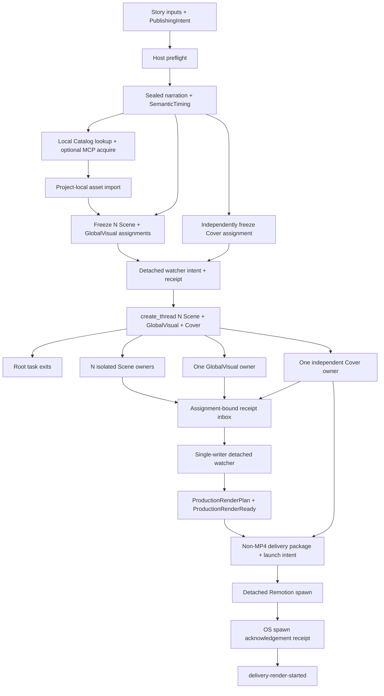

# 外部生产流程

> 文档类型：执行流程权威
>
> 最后复核：2026-08-15

## Current-only 主链



仓库不包含旧 production/delivery dispatch。历史普通文件不会被 current production/delivery
scripts 读取、迁移、回填或解释。显式 `project:delete` 仅为清理提取 Run 的严格
`runId/storyId` 所有权，不解析旧 production contract/state/event。

## 1. Authoring 与 preflight

Agent 先 author VideoBrief、StorySpec 与 project-local `producer-input.json`，再运行
`npm run project:configure -- --project <storyId> --input <path>`。fixed application 只通过 strict
ProducerConfig helper 读取一次默认值，生成 NarrationSpec/RenderSpec/StoryCheck、PublishingIntent
v2 与 current ProductionRequirementsFreeze。PublishingIntent 必须从合集数组选且只选一个 ID，
包含 6–7 个唯一且不含空白字符的话题字符串，并封存名称与完整目录 fingerprint；readability 必须显式来自 ProducerConfig，创建 API 不再使用
90px fallback。RenderSpec 不保存目标时长或字幕安全区。StorySpec v2 使用严格联合：
`narrated-scene` 拥有原子 `ttsChunks`，`silent-scene` 只允许 intro/outro，并绑定视觉、音效、资源与
固定帧数的 preset。每个 StoryBeat 只有一个稳定 meaningId；默认新 Story 显式包含 intro 与 outro，
Project source 可替换 preset 或显式关闭。工具不得自动拆分、补静音 TTS 或伪造字幕。VideoBrief 另以
`sourceReferences: [{title, url}]` 保存本期资料引用；最多 8 条且 URL 只接受 HTTP(S)。

默认 preset 的 `reusable-scene` implementation 额外绑定 capability source fingerprint 与精确
Scene-local cue choreography。`scene-owner` 只用于 Project 显式选择的替代 preset；它不是默认路径。

`production:preflight` 使用 `production-start-preflight-v2` 在 Run write 前检查 VoxCPM
liveness/readiness 与 Remotion Chromium，
区分 resident-ready、loading、offloaded 与 model-load-failed。offloaded 表示首个真实生成请求会
自动重载，不触发 warm-up 或 test TTS；`denoise=true` 时还必须在真实生成前确认 denoiser
capability，否则返回脱敏 external blocker。真实调用直接使用宿主权限。

同一次 start 的 VoxCPM preflight 从一份已解析配置构建 provider-attempt identity 与 mastering
policy，并把组合后的 `NarrationExecutionSnapshot` 写入 immutable Run manifest。narrative generation
重新解析当前私密输入后必须得到完全相同的快照才允许发出 provider request；mastering 只消费 Run
中冻结的 policy，不再回读全局配置。任何 provider/connection/voice/参数/语速/LUFS 漂移都要求
fresh Run。快照只包含安全 ID、数值 policy 与 fingerprint，不包含 token、URL、绝对路径或声线内容。

配置页与 Studio 由同一个 `npm run dev` 启动：loopback `:3100` 是配置控制台，`:3101` 是 Remotion
Studio。可信局域网可显式使用 `npm run dev:lan`，两者通过同一 LAN IP 访问；配置写入仍要求
Origin/Host 精确同源。私密 JSON、完整 token 和声线路径只允许停留在 ignored 配置与可信页面，
LAN 端口不得转发到公网。声线与可选 BGM 文件字段只接受仓库相对路径；BGM 当前仅为配置预设，
`project:configure` 不会把它冻结或挂载到 current `globalSound: none` 的生产路径。

配置页的“只读环境诊断”复用 metadata-only 声线检查、VoxCPM health/ready 与固定 Remotion browser
preflight；不生成测试语音、不 warm-up provider，也不修改 Chromium sandbox policy，只返回脱敏
状态与修复建议。

配置页的“制作进度”从 `src/projects/` source directory 与 current Run manifest storyId 的并集生成
Project 列表，不把 `out/`、deliveries 等 output-only 清理目标当成 Project；删除器仍独立扫描全部
ownership roots。进度页对每个 Project 只选择 `createdAt` 最新的一条 current Production Run。六个
关键步骤只投影 strict manifest、append-only events、derived state 与 fingerprint-bound delivery
intent/receipt，每 3 秒刷新；它不运行生产脚本、不读取 PID/exit 状态、不保留历史 Run，也不把
`delivery-render-started` 表述为 MP4 完成。

外部素材服务只在 authoring 阶段负责 search/preview/acquire。当前唯一 provider adapter 严格接收
stock-assets-mcp 的 Pexels image acquisition receipt v1；仓库不依赖其 package、SDK 或密钥。
Agent 先查 current ResourceCatalog，确需外部图片时 acquire 后运行：

```bash
npm run project:asset:import -- \
  --project <storyId> \
  --receipt <absolute-receipt-path> \
  --role scene-visual
```

CLI 从 receipt 同目录安全定位候选文件，拒绝 symlink、escape、non-regular file、未知字段/版本/
kind，以及 MIME、扩展名、尺寸、大小、checksum、license 或 attribution 漂移；然后原子写入
`public/projects/<storyId>/assets/`、不可变来源证据与 `assets.manifest.json`，并重建/检查
ResourceCatalog。相同 identity 重放是只读 no-op，冲突不覆盖；导入发生在 Scene freeze 前，已有
freeze 的 Project 必须 fresh Run。当前只开放 image，内部 discriminated contract 为 video/audio
保留独立分支但明确拒绝导入。Cover 不消费这些资源。

## 2. Narrative baseline

`production:start` 建 immutable Run manifest；`production:narrative` 只为 narrated Scene 生成并
封存 narration，按 sealed PCM 累计 sample 边界和 silent preset 固定帧一次性导出覆盖全片的
SemanticTiming、narrated-only CaptionCue 与 NarrativeCore，并完成 fixed
mechanical AutoCheck。实测音频时间不可被 Scene 或转场移动、压缩或吞掉。

M3 Narrative Baseline 使用完整 SemanticTiming；NarrativeCore 从 `narrationStartFrame` 只挂载一次
完整旁白，CaptionLayer 只消费 narrated chunks。silent Scene 不进入 generation input、VoxCPM、
sealed manifest 或 CaptionCue，但其固定窗口计入 baseline 与最终 Composition 总帧数。

TTS 语速在 provider response 后、canonical PCM 实测前处理并绑定 provider-attempt；目标 LUFS
进入两遍 loudnorm mastering policy 与母带 fingerprint。VoxCPM 可控/高品质克隆分别使用
`/clone` 与 `/clone_with_prompt`，内部 mode 不作为 provider 字段发送。

若 Agent-owned Story authoring 在实测时长后返工，旧 Run 保持 immutable，新 Run 必须显式使用
`production:narrative -- --run <runId> --supersede <current-sealed-fingerprint>` 绑定当前 active
seal identity。只有 identity 精确匹配时 fixed flow 才能原子提升新 seal；不得手改 active manifest。
新 baseline writer 允许把一个结构有效但 identity-stale 的旧 M3 receipt 作为待替换输入；所有
check-only 路径仍严格拒绝 stale 或 malformed evidence，replacement 只由 fixed writer 原子完成。

## 3. Freeze 与 owner 隔离

`production:scene:freeze` 对 intro、content 与 outro 每个 StoryBeat 原子冻结一个普通 Scene
assignment，并冻结一个 GlobalVisual assignment；
`delivery:cover:freeze` 独立冻结 Cover assignment。Scene freeze 同时从 current authority 无条件生成
Project-local `generated/resource-catalog.generated.json` 快照，因此未导入外部素材的 code-led
Project 也具有 delivery attribution 所需的确定性 Catalog；后续 freeze/render-ready/delivery 只做
canonical byte check，缺失或漂移均 fail closed。

freeze 对已批准的 reusable intro/outro 只做确定性投影：写 Project-local Renderer wrapper、完整
task-input、visual/shot/anchor/sound plans、selected resources、empty recipe 与 not-applicable
fidelity receipt。它不选择新设计。返回的 `preauthoredMeaningIds` 仍拥有普通 SceneAssignment，
Scene owner 只运行 `production:scene:check` 并发布 ready receipt，不修改这些固定文件。
silent Scene brief 不接受另行注入的 snapshot card；带 exact cue 的 reusable preset 要求
`sceneLocalSound: allowed`，冲突在 freeze 时直接 fail closed。

- Scene owner 制作前必须读取并使用 repository-local
  `.agents/skills/remotion-best-practices/SKILL.md`，同时以 AGENTS、assignment、contracts 与
  validators 为更高 authority；只写 exclusive project/public paths，完成后发布 ready/failed
  receipt，不直接 submit 正式结果。
- GlobalVisual owner 不读取 Scene results，不绘制字幕/可见文本/音频，不扩张为通用 DSL。
- Scene/GlobalVisual owner 只消费 assignment 中冻结的 Project-local Resource ID，不调用 MCP、
  provider、网络或远程 URL。
- Cover owner 只读取 assignment 内的 StorySpec、VisualStyleSpec、CoverSpec，并封存两个固定比例
  exact PNG。
- root 运行 `production:watch:start`，收到 OS spawn acknowledgement 后用 Codex `create_thread`
  派发独立任务并立即结束。root 不等待、读取或轮询任务，也不参与后续收口。

## 4. Receipt inbox、watcher 与 render-ready

每个 assignment 只有一个固定 receipt path。receipt 绑定 run/story/owner/meaningId、assignment、
task/requirements inputs、规范化 output manifest/checksum 与自身 fingerprint；同内容重放 no-op，
冲突、malformed、stale、symlink、path escape、unknown file 或 checksum drift fail closed。发布使用
同目录 temporary 与 atomic rename。仓库不保存 threadId、taskId、heartbeat、progress 或聊天内容。

owner 没有 receipt 时状态保持 `waiting-for-owner-results`，不读取 deadline 猜失败，不监控
heartbeat，不自动 retry 或创建替代任务。外部可为同一 immutable assignment 创建新线程。

watcher 按 assignment identity 扫描 receipts，先串行执行 fixed Scene/GlobalVisual validation 与正式
result write；events/state、registry/projections/Composition 和 delivery 仍只有它可写。Cover receipt
可提前出现，但 watcher 只在 production 已是 render-ready 后执行 Cover fixed check/submit，因此任何
Cover 缺失或失败都不会把 production 变成 failed，只会阻止 automatic delivery。

watcher 从 immutable N+1 results 投影 Coverage、RendererRegistry、visual/sound projections、
GlobalVisualProjection、FinalAssembly 与 current Composition。之后构建：

- `production-render-plan-v4`：绑定 story/run、sealed narration、content-addressed mastered
  narration、Composition/source checksum、`VideoBrief.sourceReferences` fingerprint、width/height、
  fps、`scene-package-timeline-v1`、`semanticTimingFrameCount` 与相等的最终 `frameCount`、
  layer/mix order 与固定 Remotion policy；
- `GlobalVisualLayers` 的固定接口是无 Props；plan/projection 由 Composition 顶层解析并校验
  identity，不传给组件。render plan 与最终 Composition current 后，fixed flow 用仓库
  TypeScript/tsconfig 和 `noEmit` 只编译该 Project 的真实 import graph；
- `production-render-ready-v4`：绑定 plan 及全部 render-critical identities，状态
  `render-ready`，handoff `awaiting-automatic-delivery`。

任何类型不兼容都在写入 ProductionRenderReady 前终止当前 Run。

current Project Composition 直接装配完整 Scene coverage。intro/outro 与正文一样消费 visual-plan、
shot-plan、sync-anchors、sound-plan、selected resources、RendererRegistry 与 Scene sound runtime；
Scene renderer 仍只负责视觉。默认 intro/outro preset 使用批准的 `story-bookends` reusable capability，
其 source fingerprint 进入 preset/task/package identity，并使用 bootstrap 可重建、Catalog checksum 与
Project-Authored license 绑定的本地 PCM 提示音。替换 preset 会改变 Story/timing/task/package identity，
关闭 preset 会移除对应 StoryBeat，因此旧音效不会残留。ProjectRegistry、render plan、Composition
metadata 与 delivery planned duration 都直接使用 `SemanticTiming.durationInFrames`。

这个阶段不运行最终 Remotion render，不读取媒体，也不写媒体完成 evidence。Cover failure 不
改变 production 状态，但 delivery build 必须要求 current CoverResult。

## 5. Watcher launch 与自动交付 launch

`production:watch:start` exactly once 写 watcher launch intent，再用 fixed cwd/argv/log、
`shell:false`、`detached:true` 和非继承 stdio spawn worker。只在 OS `spawn` 后写 watcher launch
receipt；intent 无 receipt 永久 ambiguous，禁止重试。receipt 不证明 watcher 完成生产。

`delivery:build` 从 render plan 中实际使用的 ScenePackage/GlobalVisualPackage 资源选择解析绑定的
ResourceCatalog，去重生成 fingerprint-bound `asset-attributions.json`；未使用的 Catalog 资源不
进入投影，无需署名时仍写稳定空结果。它不改写 PublishingIntent description。

build 从 current inputs 确定性生成 deliveryId，在 staging 中写 exact Covers、包含 MP4 与 Cover
固定文件名的 `delivery-publishing-v2`、attribution、handoff、`delivery-launch-manifest-v4`、
`render-launch-intent-v4` 和 checksum ledger，
检查后原子提升到每个 Project 唯一的 `deliveries/<storyId>/` current slot。slot 中 identity 不变时
只读复验；identity 变化时先把旧 slot 移入 staging backup，再提升新 package，提升失败则恢复旧
slot；成功后不保留多个 delivery 目录。publishing/manifest 的 frameCount 与 planned duration 使用
成片总帧数；发布章节只覆盖 narrated StoryBeat，并直接使用 SemanticTiming 中的绝对 startFrame。

intent 已持久化后才允许 spawn。adapter 使用固定 executable/argv/cwd/log、`shell: false` 与
`detached: true`，只监听 `spawn` 和 `error`。收到 `spawn` 后立即 `unref()` 并写
`render-launch-receipt-v4`。stdout 返回 `delivery-render-started`。

exactly-once 规则：

- receipt exists + same identity → check current package，返回 no-op；
- receipt exists + changed identity → replace current package，启动新 render；
- intent exists + no receipt → launch-ambiguous，fail closed，never retry；
- spawn error → intent 保留、receipt 缺失，后续同样 ambiguous。

## 6. 终点与交接

主 Agent 只报告 run、watcher intent/receipt、已创建任务与未派发 assignment，并立即结束。后台
watcher 自动到达 `delivery-render-started` 后停止，不等待或监控 detached Remotion child。两层
spawn receipt 都不是生产成功或 MP4 有效声明。

## 7. 作品删除

用户明确要求删除一个、多个或全部已制作作品时，含义是删除对应 storyId 的完整本地生产数据，
不是只删除 MP4。统一执行：

```bash
npm run project:delete -- --project <story-id> --confirm-delete
npm run project:delete -- --project <story-a> --project <story-b> --confirm-delete
npm run project:delete -- --all --confirm-delete
```

删除集合固定覆盖 `src/projects/<storyId>/`、`public/projects/<storyId>/`、
`.narration-work/<storyId>/`、该 storyId 的全部 `.producer-runs/<runId>/`、`out/<storyId>/` 与
`deliveries/<storyId>/`，随后重建 ResourceCatalog 与 ProjectRegistry。命令不触碰 core、其他作品、
private config 或 `public/voice_profile/`。任何目标 symlink/非目录、目标 writer lock、非空
`deliveries/.staging/` 或不存在的显式 storyId 都会在首次删除前令命令失败。
删除器不要求旧 Run 通过 current ProductionRun schema；它只校验 JSON、目录 `runId` identity 与
严格 storyId，以保证已移除合同留下的数据仍可安全删除。这不构成旧 Run 兼容或迁移。

配置页 Project 详情提供同一删除能力，但必须输入完整 Project ID 二次确认，且 API 只接受精确同源
JSON DELETE。`project:configure`、`production:start`、`delivery:build` 与删除共享 repository operation
lock；删除还独占目标 Run writer locks，并在持锁后重读完整目标集。删除源码前先原子发布排除目标的
ProjectRegistry，避免同一 `npm run dev` 下 Studio 因旧 import 退出并中断 API；若后续清理失败，
异常路径按磁盘真实状态重建 Registry/Catalog。浏览器连接中断只表示删除结果需重新确认，不能据此
断言删除失败或成功。

## 故障所有权

- Agent-owned authored artifact 被 check 拒绝：退回同一 owner 修改其独占路径。
- fixed workflow 在 valid inputs 下失败：停止、保存脱敏 incident、写 Red regression、做最小
  shared fix、验证 Green，并从 fresh Run 重放。
- provider/host/permission/authorization：external blocker，不增加 fallback/retry。
- launch-ambiguous：确定性终态；除非用户明确设计新的人工处置流程，否则不得自动处理。
