# Production Workflow

> 文档类型：生产流程 authority
>
> 本文只描述 current Revision/DAG/Artifact 主链。

## 1. 主链概览

```mermaid
flowchart LR
  Author[Atomic create or current authoring edits] --> Inspect[Read-only readiness + cost + invalidation]
  Inspect --> Report[Root reports before cost]
  Report --> Prepare[Provider and fixed preparation]
  Prepare --> Plan[ProductionRevision + Task DAG]
  Plan --> Reuse[Reuse valid artifacts]
  Plan --> Dirty[Create dirty Agent task workspaces]
  Dirty --> Children[Runtime-native task children]
  Children --> Check[Read-only task check]
  Check --> Commit[Validator recheck + ArtifactAttestation]
  Reuse --> Barrier[All required artifacts]
  Commit --> Barrier
  Barrier --> Materialize[Controlled materialization]
  Materialize --> Derived[Packages + Registry + Composition]
  Derived --> Build[Synchronous media build]
  Build --> Verify[Exact four-file validation]
  Verify --> Current[Controlled current delivery]
```



一个新 ExecutionAttempt 可以失败或消失；已验证 artifact 仍按内容 identity 复用。inspection/explanation/
baseline/attempt 只属于 diagnostic plane，不影响 Revision、TaskRevision、ArtifactAttestation、dispatch、
materialization 或 DeliveryBuild。历史执行目录不参与 prepare、converge、delivery 或 settings progress。

## 2. Project authoring

新 Project 从 strict `ProjectCreateInput` 原子创建：

```bash
npm run project:create -- --project <storyId> --input <repository-relative-json>
```

fixed creator 在受控 staging 中验证完整 Project/source/public/template/sound/catalog transaction，将
ProducerConfig 的 render/readability/TTS defaults 与选定 boundary Scene templates 投影到 Project-local
configured authoring。已存在、partial、cross-project、symlink/path escape/special-file 或不同 creation identity
都 fail closed；相同 identity 重复调用只读 current。create 不调用 provider、不生成媒体，也不写
`.narration-work`、workspace、artifact、attempt 或 delivery。Project-local media 只能在创建成功后 import。

StoryBeat 明确区分 narrated-scene 与 silent-scene。narrated beat 的 `ttsChunks` 是 Agent-authored atomic
units；silent beat 只允许在首尾，使用固定 frame/template/sound，不创建 TTS、CaptionCue 或 sealed segment。
外部媒体必须先经 `project:asset:import` 本地化为 Project-owned、runtime-approved asset，只有 manifest ID
和校验后的 bytes fingerprint 进入 Revision/task inputs。

## 3. 只读 inspect 与显式 prepare

先运行严格只读 inspection：

```bash
npm run project:produce:inspect -- --project <storyId>
```

inspect 不获取 mutation lock、不调用 provider、不刷新 Catalog、不创建 cache/workspace/attempt/artifact，也不
物化或交付。它在前后 snapshot 一致时返回 `configured-authoring`、`timing-ready` 或
`production-inputs-ready`，以及 provider/cache/Agent/delivery estimate、baseline、task explanations 和
nextAction；无法确定的 estimate 显式为 `null`。并发 source drift 返回稳定错误，不自动 retry。

Root 先向用户报告 readiness、cost、reuse 与失效原因，之后才运行：

```bash
npm run project:produce:prepare -- --project <storyId>
```

prepare 是唯一公开的有成本 preparation 入口。它在 operation lock 内完成所有 provider request 前可做的
只读验证，随后才允许 narration cache/provider、seal/master/timing、timing-bound authoring projection、fixed
artifact、Revision/DAG、dirty Agent workspace 与新 ExecutionAttempt 写入。若仍缺 timing-bound authoring，
返回 `project-authoring-required`，不创建 owner workspaces 或伪造完整 Revision。
prepare 同时写入不含私有配置或声纹内容的 narration preparation receipt，把 active seal/mastering 与本次
选择的 provider-attempt identity 精确绑定。VoxCPM inspect 只读取该 receipt 来重建 current DAG，未来请求成本
仍保持 `null`，不会为了估算打开或 normalize 私有 voice material。

production inputs ready 时生成：

- `ProductionRevision`：只含生产输入，不含 Agent output 或过程数据；
- `ProducerTaskSpec[]`：内容寻址 DAG nodes，具备 dependency artifacts、declared read/output set 和
  task-kind validator policy；
- `ProducerPlan`：稳定排序的 action、typed artifact state、allowlisted direct changes、DAG dependency changes
  与 blockedBy；
- `ExecutionAttempt`：task diagnostic snapshots、estimated/actual cost、等待/收敛或失败诊断，不进入任何
  产物 identity。

Task kinds 包括 narration chunk/seal/timing、scene-template、scene-owner、global-visual-owner、cover-owner、
composition-convergence 与 delivery-build。共享输入只进入真正依赖它的 node key，避免全局版本导致无差别失效。

## 4. Artifact reuse 与 task workspace

每个 artifact hit 都重新解析 ArtifactAttestation，并复验 task/dependencies/policy、exact sorted output set、
normalized contained paths、regular files、no symlink、size 与 checksum。任何 unknown file、escape、special file、
stale checksum 或 identity conflict 都 fail closed。

prepare 只为 action 为 `dispatch-agent` 的 non-reused task 建立：

```text
.producer-work/<storyId>/<taskRevision>/
├── task.json
├── inputs/context.json
└── <declared outputs>
```

Agent 不能直接写 live Project。Root 只将 dirty `scene-owner`、`global-visual-owner`、`cover-owner` 各自交给
一个 runtime-native child；`scene-template` 和其他 fixed tasks 不派发。容量受限可分批，但一 child 只拥有
一个 TaskRevision。Scene child 完整读取 repository-local `remotion-best-practices`，且不能用 Skill 扩大
TaskSpec/validator/write scope。

child 在 workspace 内循环：

```bash
npm run project:task:check -- --task <taskRevision>
npm run project:task:commit -- --task <taskRevision>
```

check 只读；commit 必须重跑同一 validator。成功 promotion 使用同父 staging/atomic rename，manifest 最后写，
并产生 immutable ArtifactAttestation。相同 identity/bytes no-op；冲突绝不覆盖。child chat 仅用于 barrier，
不进入 repository state。

## 5. Convergence 与物化

Root 等待全部已派发 child 达到 committed/current、明确 task failure 或 host failure 后，在一次编排尝试中
恰好调用一次：

```bash
npm run project:produce:converge -- --project <storyId> --revision <revisionId>
```

converge 只调用 read-only current-plan builder 重算 current inputs；不调用 provider、不创建 workspace 或
ExecutionAttempt。revision 不同返回 stable stale 结果。任何 required artifact 缺失时，
返回 incomplete 且不得写 live owner roots 或 delivery。

齐全后，materializer 从 Artifact Store 读取 bytes，分别对 Scene、GlobalVisual、Cover owned roots 使用
staging + controlled replace + rollback。随后 fixed application 机械刷新 ScenePackage、Coverage、
RendererRegistry、GlobalVisualPackage 与生成式 Composition。它必须从 live paths 重读 exact outputs，并证明
与 ArtifactAttestation 的 path/size/checksum 一致，人工漂移不能进入 build。

## 6. 同步四文件 delivery

DeliveryBuildId 绑定 `revisionId + artifactSetFingerprint + Composition metadata + build policy`。build 前后都
复验 materialized bytes。每个 Project 有一个 build-owned staging，可复用同 identity 已验证的 video 或 Cover；
捕获到的失败不替换 current package。

build 同步等待 Remotion/FFmpeg，依次验证：

- video 是 H.264/AAC，声道、尺寸、fps、frame count 与 RenderSpec 一致并 EOF-decode；
- Covers 是 exact 1600×1200 和 1200×1600 PNG 且可完整 decode；
- 三个媒体的 repository path、size、checksum 与 `publish.json` 一致；
- directory exact 只有 `video.mp4`、`cover-4x3.png`、`cover-3x4.png`、`publish.json`。

`publish.json` 最后写。四文件全部通过才 controlled replace `deliveries/<storyId>/`。相同完整 identity 返回
`project-production-current`；新 package 成功提升返回 `project-production-complete`。这两个状态均证明实际
current files 完整，不是计划、聊天或进程启动事实。

## 7. Progress 与失败后继续

settings API 从 `src/projects/` 枚举 source Projects，展示 sourceState、inspection estimate、current Revision、
逐任务 direct/dependency/artifact 解释、latest attempt actual cost 和 four-file delivery。UI/API 复用同一
structured explanation，不从错误文案或 task kind 猜 DAG。它不扫描历史执行数据，也不把 `out/` 或
delivery-only 目录伪装成 Project；raw fingerprint、authoring text、private path/provider body 不对外投影。

若三个 Agent tasks 中两个已 commit、第三个失败，新 prepare 时前两个必须是 reuse，只派发第三个。
delivery 若在生成 video 后失败，再次 prepare 不重跑已验证 TTS/Agent artifacts，converge 复用已验证 staging
video，只生成缺失媒体。这不是自动 retry；每次都由显式 inspect/report/prepare 与 content inspection 得出。

## 8. 作品删除

用户明确删除一个或多个作品时，默认含义是删除其全部本地 production data，而不是只删 MP4：

```bash
npm run project:delete -- --project <storyId> --confirm-delete
```

删除器要求完整 Project ID，精确清理 `src/projects`、Project-owned `public`、`.narration-work`、
`.producer-work`、`.producer-artifacts`、`.producer-attempts`、legacy `.producer-runs`、`out` 和 `deliveries`
中的对应 ownership roots，并重建 Registry/Catalog。它不删除 core、其他 Project、shared assets、private
config 或 voice profiles。

legacy data 仅在删除器内部以最小严格 `runId/storyId` parser 判定 ownership；这不是 runtime compatibility。
删除矩阵只允许在 `mktemp` 隔离副本中运行。

## 9. 固定流程故障

Agent workspace validator 失败由同一 child 修正 owning output 并重跑。validator/store/materialization/
delivery 在 valid input 下失败是 shared system defect：停止、保存脱敏 incident、增加精确 Red、实施最小
Green、运行 focused/full gates，然后从 current inputs 新建 attempt。不得手改 artifact/current delivery、
增加 fallback success、自动重试 provider、预热 TTS 或降低 Chromium sandbox。
