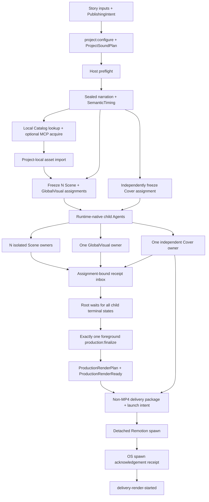

# 外部生产流程

> 文档类型：执行流程权威
>
> 最后复核：2026-08-18

## 默认 build 主链

已有 Project 的普通修改和重建不进入 ProductionRun：

```text
current Project authoring source
  → deterministic ScenePackage/coverage/registry refresh
  → target Composition and Cover/GlobalVisual source compile/validation
  → run-independent source snapshot + buildId
  → reusable buildId staging
  → synchronous video.mp4 + two Cover renders
  → codec/channel/dimension/fps/frame/checksum/EOF verification
  → publish.json written last
  → controlled staged replace deliveries/<storyId>/
```

命令为 `npm run project:build -- --project <storyId>`。同 snapshot 且四个 current 文件完整时 no-op；
失败后同 buildId 复用已经验证的 staged artifact，只重做缺失或损坏部分。render/inspect/publish 失败
都发生在 current slot 替换前；捕获到的 promotion 失败恢复上一版。authoring source 或
Project-owned public asset 的 byte 变化
会自动产生新 buildId。`publish.json` 不从旧 Run 或旧 delivery 推断，也不迁移它们。

## 显式 audited production 主链



仓库不包含旧 production/delivery dispatch。历史普通文件不会被 current production/delivery
scripts 读取、迁移、回填或解释。显式 `project:delete` 仅为清理提取 Run 的严格
`runId/storyId` 所有权，不解析旧 production contract/state/event。

## 1. Authoring 与 preflight

Agent 先 author VideoBrief、StorySpec 与 project-local `producer-input.json`，再运行
`npm run project:configure -- --project <storyId> --input <path>`。fixed application 只通过 strict
ProducerConfig helper 读取一次默认值，生成 NarrationSpec/RenderSpec、PublishingIntent
v2 与 current ProductionRequirementsFreeze。PublishingIntent 必须从合集数组选且只选一个 ID，
包含 6–7 个唯一且不含空白字符的话题字符串，并封存名称与完整目录 fingerprint；readability 必须显式来自 ProducerConfig，创建 API 不再使用
90px fallback。RenderSpec 不保存目标时长或字幕安全区。StorySpec v3 使用严格联合：
`narrated-scene` 拥有原子 `ttsChunks`，`silent-scene` 只允许位于时间线首尾边界，并绑定视觉、音效、
资源与固定帧数的 preset。合同不保存 intro/outro role；每个 StoryBeat 只有一个稳定 meaningId。
工具不得自动拆分、补静音 TTS 或伪造字幕。VideoBrief 另以
`sourceReferences: [{title, url}]` 保存本期资料引用；最多 8 条且 URL 只接受 HTTP(S)。

ProducerConfig 的 `sceneDefaults` 在 `project:configure` 阶段选择首尾 Scene template。脚本把所选
template 的完整源码与资源复制到 Project-local Scene，写入 `template-copy` instance/preset identity；
已有 Project 以后不再读取全局选择或共享 template。模板声音可由 ignored 本地
`scene-template-sound-overrides.json` 在 bootstrap 时选择，但只以 authoring projection 进入模板；
配置时必须连同已验证许可证元数据一起本地化。`scene-owner` 仅表示该 Scene 需要 Agent 创作。

`production:preflight` 使用 `production-start-preflight-v3` 在 Run write 前按默认 TTS provider
dispatch，再检查 Remotion Chromium。VoxCPM 继续检查 loopback liveness/readiness，
区分 resident-ready、loading、offloaded 与 model-load-failed。offloaded 表示首个真实生成请求会
自动重载，不触发 warm-up 或 test TTS；`denoise=true` 时还必须在真实生成前确认 denoiser
capability，否则返回脱敏 external blocker。SpeechSDK OpenAI 不调用生成 API，也没有伪造的通用
ready probe；只记录 `configuration-validated-generation-not-probed`，凭证与网络由首次真实生成校验。
真实调用直接使用宿主权限。

同一次 start 的 provider-aware preflight 从一份已解析配置构建 provider-attempt identity 与
mastering policy，并把组合后的 `NarrationExecutionSnapshot` v2 写入 immutable Run manifest。
narrative generation
重新解析当前私密输入后必须得到完全相同的快照才允许发出 provider request；mastering 只消费 Run
中冻结的 policy，不再回读全局配置。任何 provider/connection/voice/参数/语速/LUFS 漂移都要求
fresh Run。快照只包含安全 ID、数值 policy 与 fingerprint，不包含 token、URL、绝对路径或声线内容。

配置页与 Studio 由同一个 `npm run dev` 启动：loopback `:3100` 是配置控制台，`:3101` 是 Remotion
Studio。可信局域网可显式使用 `npm run dev:lan`，两者通过同一 LAN IP 访问；配置写入仍要求
Origin/Host 精确同源。私密 JSON、完整 token 和声线路径只允许停留在 ignored 配置与可信页面，
LAN 端口不得转发到公网。声线与可选 BGM 文件字段只接受仓库相对路径。`project:configure`
把已配置 BGM 本地化到 Project，封存 checksum、资源描述、独立音量与 `sound.json` identity；
render-ready 将它作为一个循环 `SoundContribution`，只覆盖首个到最后一个 narrated Scene 的内容窗口。

配置页的“只读环境诊断”复用 metadata-only 声线检查与固定 Remotion browser preflight：VoxCPM
额外执行 health/ready，SpeechSDK OpenAI 只报告配置已验证、真实生成时再验证凭证/网络。诊断不生成
测试语音、不 warm-up provider、不产生云端费用，也不修改 Chromium sandbox policy，只返回脱敏状态。

配置页的“制作进度”从 `src/projects/` source directory 与 current Run manifest storyId 的并集生成
Project 列表，不把 `out/`、deliveries 等 output-only 清理目标当成 Project；删除器仍独立扫描全部
ownership roots。主状态投影 `project:build` 的准备、视频、两个 Cover、验证和提升六阶段，以及严格
解析、路径/文件类型/size/checksum 验证后的四文件 current delivery。当前 source snapshot 一致为完成，
不一致为待重建；轮询不重复执行 FFmpeg/ffprobe/EOF decode。build 运行态原子写入 ignored staging，
普通失败保留阶段供同 buildId 续建，成功后删除；页面只读观察，不启动脚本。最新 current audited Run
继续由 strict manifest、append-only events、derived state 与 delivery intent/receipt 投影，但默认折叠，
不迁移旧 Run，也不把 `delivery-render-started` 表述为 MP4 完成。

外部素材服务只在 authoring 阶段负责 search/preview/acquire。当前唯一 provider adapter 严格接收
stock-assets-mcp 的 Pexels image acquisition receipt v1；仓库不依赖其 package、SDK 或密钥。
用户已人工确认许可、需要跨 Project 复用的本地参考音频，可放在
`public/assets/library/`，并由 ignored
`private/reference-assets/assets.manifest.json` 记录 checksum、媒体信息、用途与 `localize-asset` 许可，
许可 evidence 固定由 ignored `private/reference-assets/MIXKIT_AUDIO_LICENSE.md` 提供并校验 checksum。
Catalog 在文件存在时合并该 manifest；它不创建虚假 Project，也不改变缺少本地参考库时的
fresh-clone/bootstrap 行为。它只用于 authoring 查询，不能直接进入 Scene/ProjectSound plan；current
production 尚未开放外部 audio import，真正使用前必须先实现并通过独立授权的 Project-local audio
准入。
Agent 先查 current ResourceCatalog，确需外部图片时 acquire 后运行：

```bash
npm run project:asset:import -- \
  --project <storyId> \
  --receipt <absolute-receipt-path> \
  --role scene-visual
```

CLI 从 receipt 同目录安全定位候选文件，拒绝 symlink、escape、non-regular file、未知字段/版本/
kind，以及 MIME、扩展名、尺寸、大小、checksum、license 或 attribution 漂移；然后原子写入
`public/projects/<storyId>/assets/`、不可变来源证据与 `assets.manifest.json`，并重建/检查
ResourceCatalog。相同 identity 重放是只读 no-op，冲突不覆盖；导入发生在 Scene freeze 前，已有
freeze 的 Project 必须 fresh Run。当前只开放 image，内部 discriminated contract 为 video/audio
保留独立分支但明确拒绝导入。Cover 不消费这些资源。

## 2. Narrative baseline

`production:start` 建 immutable Run manifest；`production:narrative` 只为 narrated Scene 生成并
封存 narration，按 sealed PCM 累计 sample 边界和 silent preset 固定帧一次性导出覆盖全片的
SemanticTiming、narrated-only CaptionCue 与 NarrativeCore，并完成 fixed
mechanical AutoCheck。实测音频时间不可被 Scene 或转场移动、压缩或吞掉。

Narrative Baseline 使用完整 SemanticTiming；NarrativeCore 从 `narrationStartFrame` 只挂载一次
完整旁白，CaptionLayer 只消费 narrated chunks。silent Scene 不进入 generation input、TTS provider、
sealed manifest 或 CaptionCue，但其固定窗口计入 baseline 与最终 Composition 总帧数。

TTS 语速在 provider response 后、canonical PCM 实测前处理并绑定 provider-attempt；目标 LUFS
进入两遍 loudnorm mastering policy 与母带 fingerprint。VoxCPM 可控/高品质克隆分别使用
`/clone` 与 `/clone_with_prompt`，内部 mode 不作为 provider 字段发送。SpeechSDK OpenAI 使用
`@speech-sdk/core@0.27.0` 的 `createOpenAI()` direct factory；adapter 对 4096 字符上限与音频 tag
fail closed，固定 `maxRetries=0`，且不传 timestamps、volume/output/speed/chunking/fallback 选项。
每个 authored ttsChunk 只调用一次 SDK，返回字节继续进入仓库 canonical PCM/seal/mastering 权威链路。

若 Agent-owned Story authoring 在实测时长后返工，旧 Run 保持 immutable，新 Run 必须显式使用
`production:narrative -- --run <runId> --supersede <current-sealed-fingerprint>` 绑定当前 active
seal identity。只有 identity 精确匹配时 fixed flow 才能原子提升新 seal；不得手改 active manifest。
新 baseline writer 允许把一个结构有效但 identity-stale 的旧 narrative baseline receipt 作为待替换输入；所有
check-only 路径仍严格拒绝 stale 或 malformed evidence，replacement 只由 fixed writer 原子完成。

## 3. Freeze 与 owner 隔离

`production:scene:freeze` 对每个 StoryBeat 原子冻结一个普通 Scene
assignment，并冻结一个 GlobalVisual assignment；
`delivery:cover:freeze` 独立冻结 Cover assignment。Scene freeze 同时从 current authority 无条件生成
Project-local `generated/resource-catalog.generated.json` 快照，因此未导入外部素材的 code-led
Project 也具有 delivery attribution 所需的确定性 Catalog；后续 freeze/render-ready/delivery 只做
canonical byte check，缺失或漂移均 fail closed。

`project:configure` 已经复制并冻结 `template-copy` Renderer 与资源。freeze 只写完整 task-input、
visual/shot/anchor/sound plans、selected resources、empty recipe 与 not-applicable fidelity receipt，
然后校验冻结 identity、复制 checksum、资源与 ScenePackage 绑定并由脚本直接写正式结果；不进入
通用 Scene readability check、focused compile 或创意审查。返回的 `templateMeaningIds` 不创建 Scene owner
或 receipt；只有
`ownerMeaningIds` 被派发。silent Scene brief 不接受另行注入的 snapshot card；带 exact cue 的 template 要求
统一 `sound: allowed`，冲突在 freeze 时直接 fail closed。

exact-reference Scene 由 owner 提供 source/adaptation 正常速度预览和 phase-pair 帧证据。fixed checker
只校验文件 checksum、相位映射、来源/本地化/license lineage 与 Renderer frame binding；不读取 Agent
自评，不判断“像不像”、trait 是否通过或正常速度是否可辨识。

- Scene owner 制作前必须读取并使用 repository-local
  `.agents/skills/remotion-best-practices/SKILL.md`，同时以 AGENTS、assignment、contracts 与
  validators 为更高 authority；只写 exclusive project/public paths，完成后发布 ready/failed
  receipt，不直接 submit 正式结果。
- GlobalVisual owner 不读取 Scene results，不绘制字幕/可见文本/音频，不扩张为通用 DSL。
- Scene/GlobalVisual owner 只消费 assignment 中冻结的 Project-local Resource ID，不调用 MCP、
  provider、网络或远程 URL。
- Cover owner 只读取 assignment 内的 StorySpec、VisualStyleSpec、CoverSpec，并封存两个固定比例
  exact PNG。
- root 用运行环境原生子 Agent 一 owner 一 child 派发，等待所有 child 进入成功、明确失败或宿主失败
  终态，然后只调用一次 `production:finalize`。root 不读 owner 输出、不逐项 submit、不轮询 Run。
- Agent direct-write boundary 与 fixed writer 分离。`production:start` 在 scaffold 后冻结
  project-authoring protected workspace，Narrative 固定输出完成后刷新 checkpoint；Scene freeze 先拒绝 current Project 以外的 Agent 漂移，再按
  assignments 冻结 owner-authoring scope。owner receipt 与 finalize 复验该 scope，core、共享素材、
  其他 Project、private 或 voice profile 漂移 fail closed。Narrative、Catalog、Registry、Run、out 与
  delivery 仍由现有 fixed writers 决定路径，不纳入 Agent direct-write allowlist；render-ready 后写
  Cover-only checkpoint，补 Cover 与再次 finalize 不跳过边界检查。它是阶段推进前的漂移检测而非
  OS sandbox；Project-local 素材输出位于 current `public/projects/<storyId>/` allowlist，共享
  `public/assets/library/` 不允许在该生产中被 Agent 修改。

## 4. Receipt inbox、foreground finalize 与 render-ready

每个 assignment 只有一个固定 receipt path。receipt 绑定 run/story/owner/meaningId、assignment、
task/requirements inputs、规范化 output manifest/checksum 与自身 fingerprint；同内容重放 no-op，
冲突、malformed、stale、symlink、path escape、unknown file 或 checksum drift fail closed。发布使用
同目录 temporary 与 atomic rename。仓库不保存 child identity、heartbeat、progress 或聊天内容。

root 等待的是宿主 child 终态，不从聊天结果推断 receipt。全部 child 终态后仍只调用一次 finalize；
required receipt 缺失时 fixed command 在任何 stage/result/event/state 写入前返回稳定 incomplete。

foreground finalize 按 expected assignment identity 校验 receipts，先串行执行 fixed
Scene/GlobalVisual validation 与正式 result write；events/state、registry/projections/Composition 和
delivery 仍只有它可写。Cover receipt 可提前出现，但 finalize 只在 production 已是 render-ready 后
执行 Cover fixed check/submit，因此任何
Cover 缺失或失败都不会把 production 变成 failed，只会阻止 automatic delivery。

finalize 从 immutable N+1 results 与冻结的 ProjectSoundPlan 投影 Coverage、RendererRegistry、统一
visual/sound projections、GlobalVisualProjection、FinalAssembly 与 current Composition。之后构建：

- `production-render-plan-v5`：绑定 story/run、sealed narration、content-addressed mastered
  narration、Composition/source checksum、`VideoBrief.sourceReferences` fingerprint、width/height、
  fps、`scene-package-timeline-v1`、`semanticTimingFrameCount` 与相等的最终 `frameCount`、
  完整 sound projection、实际引用的 background-music 资源、layer/mix order 与固定 Remotion policy；
- `GlobalVisualLayers` 的固定接口是无 Props；plan/projection 由 Composition 顶层解析并校验
  identity，不传给组件。render plan 与最终 Composition current 后，fixed flow 用仓库
  TypeScript/tsconfig 和 `noEmit` 只编译该 Project 的真实 import graph；
- `production-render-ready-v5`：绑定 plan 及全部 render-critical identities，状态
  `render-ready`，handoff `awaiting-automatic-delivery`。

任何类型不兼容都在写入 ProductionRenderReady 前终止当前 Run。

current Project Composition 直接装配完整 Scene coverage。首尾 silent Scene 与正文一样消费 visual-plan、
shot-plan、sync-anchors、sound-plan、selected resources、RendererRegistry 与 Scene sound runtime；
Scene renderer 仍只负责视觉。`template-copy` 使用已冻结的 Project-local Renderer、资源与 instance
fingerprint；freeze 只机械生成 plans、校验 source graph/package，并直接写正式 Scene result，不等待
Scene owner receipt。替换或关闭全局选择只影响尚未配置的新 Project；ProjectRegistry、render plan、Composition
metadata 与 delivery planned duration 都直接使用 `SemanticTiming.durationInFrames`。

这个阶段不运行最终 Remotion render，不读取媒体，也不写媒体完成 evidence。Cover failure 不
改变 production 状态，但 delivery build 必须要求 current CoverResult。

## 5. 默认 Project build

`project:build` 只消费 current Project source 和已封存旁白。它不要求 runId、owner receipt、finalize、
CoverResult、ProductionRenderReady 或 detached launch record。Scene Renderer 改动会机械重算
ScenePackage、coverage 与 composition-local registry；template-copy Scene 使用同一确定性投影，不进入
通用 Scene owner/check/review。生成式 Composition 的 render runtime 直接绑定 current authoring
source，不再把 run-bound ProductionRenderPlan 当成渲染前置条件。

source snapshot 覆盖 Project source、Project-owned public media 与 shared render runtime，显式排除
assignment、receipt、render-ready/render-plan 和旧 package result 等过程投影。`publish.json` exactly
绑定 `video.mp4`、`cover-4x3.png`、`cover-3x4.png` 的 current 路径、checksum、size 和实测 media facts。

## 6. Foreground finalize 与 audited delivery launch

`production:finalize` 是一次 foreground fixed command，不创建/等待 Agent、不 detached、不写 production
launch intent/receipt。它返回 `delivery-render-started`、`owner-receipts-incomplete`、
`agent-write-boundary-violated`、`production-failed` 或 `render-ready-delivery-blocked`。

`delivery:build` 从 render plan 中实际使用的 ScenePackage/GlobalVisualPackage 资源选择解析绑定的
ResourceCatalog，去重生成 fingerprint-bound `asset-attributions.json`；未使用的 Catalog 资源不
进入投影，无需署名时仍写稳定空结果。它不改写 PublishingIntent description。

build 从 current inputs 确定性生成 deliveryId，在 staging 中写 exact Covers、包含 MP4 与 Cover
固定文件名的 `delivery-publishing-v2`、attribution、handoff、`delivery-launch-manifest-v4`、
`render-launch-intent-v4` 和 checksum ledger，
检查后原子提升到每个 Project 唯一的 `deliveries/<storyId>/` current slot。slot 中 identity 不变时
只读复验；identity 变化时先把旧 slot 移入 staging backup，再提升新 package，提升失败则恢复旧
slot；成功后不保留多个 delivery 目录。publishing/manifest 的 frameCount 与 planned duration 使用
成片总帧数；发布章节只覆盖 narrated StoryBeat，并直接使用 SemanticTiming 中的绝对 startFrame。

intent 已持久化后才允许 spawn。adapter 使用固定 executable/argv/cwd/log、`shell: false` 与
`detached: true`，只监听 `spawn` 和 `error`。收到 `spawn` 后立即 `unref()` 并写
`render-launch-receipt-v4`。stdout 返回 `delivery-render-started`。

exactly-once 规则：

- receipt exists + same identity → check current package，返回 no-op；
- receipt exists + changed identity → replace current package，启动新 render；
- intent exists + no receipt → launch-ambiguous，fail closed，never retry；
- spawn error → intent 保留、receipt 缺失，后续同样 ambiguous。

## 7. Audited production 终点与交接

主 Agent 报告 run、child 终态汇总与一次 finalize JSON outcome。`delivery-render-started` 是 audited
production 成功终点，但只证明 detached Remotion spawn acknowledgement；root 不等待或监控 render
child，也不声明 MP4 有效。

## 8. 作品删除

用户明确要求删除一个、多个或全部已制作作品时，含义是删除对应 storyId 的完整本地生产数据，
不是只删除 MP4。统一执行：

```bash
npm run project:delete -- --project <story-id> --confirm-delete
npm run project:delete -- --project <story-a> --project <story-b> --confirm-delete
npm run project:delete -- --all --confirm-delete
```

删除集合固定覆盖 `src/projects/<storyId>/`、`public/projects/<storyId>/`、
`.narration-work/<storyId>/`、该 storyId 的全部 `.producer-runs/<runId>/`、`out/<storyId>/` 与
`deliveries/<storyId>/`，随后重建 ResourceCatalog 与 ProjectRegistry。命令不触碰 core、其他作品、
private config 或 `public/voice_profile/`。任何目标 symlink/非目录、目标 writer lock、非空
`deliveries/.staging/` 或不存在的显式 storyId 都会在首次删除前令命令失败。
删除器不要求旧 Run 通过 current ProductionRun schema；它只校验 JSON、目录 `runId` identity 与
严格 storyId，以保证已移除合同留下的数据仍可安全删除。这不构成旧 Run 兼容或迁移。

配置页 Project 详情提供同一删除能力，但必须输入完整 Project ID 二次确认，且 API 只接受精确同源
JSON DELETE。`project:configure`、`production:start`、`delivery:build` 与删除共享 repository operation
lock；删除还独占目标 Run writer locks，并在持锁后重读完整目标集。删除源码前先原子发布排除目标的
ProjectRegistry，避免同一 `npm run dev` 下 Studio 因旧 import 退出并中断 API；若后续清理失败，
异常路径按磁盘真实状态重建 Registry/Catalog。浏览器连接中断只表示删除结果需重新确认，不能据此
断言删除失败或成功。

## 故障所有权

- Agent-owned authored artifact 被 check 拒绝：退回同一 owner 修改其独占路径。
- fixed workflow 在 valid inputs 下失败：停止、保存脱敏 incident、写 Red regression、做最小
  shared fix、验证 Green，并从 fresh Run 重放。
- provider/host/permission/authorization：external blocker，不增加 fallback/retry。
- launch-ambiguous：确定性终态；除非用户明确设计新的人工处置流程，否则不得自动处理。
