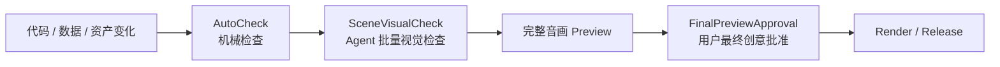

# 简化审核模型

## 默认路径

## 三层检查

| 层级 | 负责人 | 内容 | 是否每次阻塞用户 |
| --- | --- | --- | --- |
| AutoCheck | 脚本/运行时 | 合同、连续帧范围、资源、registry、typecheck、lint、build | 否 |
| SceneVisualCheck | Agent | 语义可读、构图、运动、相邻连续性、字幕避让 | 否，批量汇报 |
| FinalPreviewApproval | 用户 | 完整音画节奏与最终审美 | 是，默认唯一创意批准 |

## 条件检查

- 新视觉语言或高风险镜头：增加 `VisualDirectionCheck`；
- meaning-changing motion：增加 motion strip 或短 Preview；
- Shotcraft 来源：增加 exact-demo fidelity；
- 重场景或长片：增加代表性 benchmark；
- 需要发布：再检查封面、编码、音量与发布物；
- 共享能力提取：单独提交 promotion proposal，不能搭车批准。

静态布局不重复生成大量相似 still；Scene 默认以 contact sheet 批量查看。相同
fingerprint 的机械产物无需重复创意审批。
