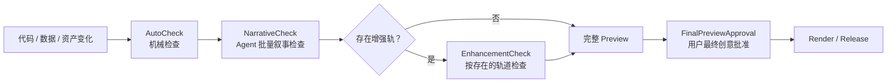

# 简化审核模型

## 默认路径

## 检查层级

| 层级                 | 负责人      | 内容                                                               | 是否每次阻塞用户     |
| -------------------- | ----------- | ------------------------------------------------------------------ | -------------------- |
| AutoCheck            | 脚本/运行时 | 合同、连续帧范围、封存产物、ProjectRegistry 漂移与 lazy import、fingerprint、typecheck、lint、build | 否 |
| NarrativeCheck       | Agent       | Story 完整性、旁白可懂度、字幕对应、无截断和整体叙事节奏           | 否，批量汇报         |
| EnhancementCheck     | Agent       | 仅检查实际存在的 visual、sound、global 轨；SceneVisualCheck 属于此层 | 否，批量汇报         |
| FinalPreviewApproval | 用户        | 已选择轨道装配后的完整音画节奏与最终审美                           | 是，默认唯一创意批准 |

当前 Narrative Baseline 里程碑执行生成前 StoryCheck、机械 AutoCheck 和生成后
NarrativeCheck。不存在 ScenePackage、renderer registry 或视觉资产时，EnhancementCheck
必须跳过而不是失败；Baseline checkpoint 也不新增一次强制用户审批。

在调用 VoxCPM 前另有一次 Agent 内部 `StoryCheck`，用于检查 StoryBeat 顺序、已创作的
`ttsChunks` 和 voice profile 选择。它是生成前的成本控制，不是新的用户批准节点。

RenderSpec 是用户每次制作时直接给 Agent 的输入。Agent 将它结构化并执行类型、范围、
字段兼容性等机械校验；RenderSpec 不进入 StoryCheck，也不新增确认或审批节点。

## 条件检查

- 新视觉语言或高风险镜头：增加 `VisualDirectionCheck`；
- meaning-changing motion：增加 motion strip 或短 Preview；
- Shotcraft 来源：增加 exact-demo fidelity；
- 重场景或长片：增加代表性 benchmark；
- 需要发布：再检查封面、编码、音量与发布物；
- 共享能力提取：单独提交 promotion proposal，不能搭车批准。

静态布局不重复生成大量相似 still；Scene 默认以 contact sheet 批量查看。相同
fingerprint 的机械产物无需重复创意审批。

进入后续视觉阶段时，SceneVisualCheck 的审核单位是完整 Scene renderer 输出，包括其
内部所有 Shot、连续运动和相邻 Scene 关系；内部 Shot 组件不形成额外的用户批准节点。

机械检查最终汇总为作品级 `project:check`，而不是在每个节点建立一套独立审批。目标
检查项见 [DETERMINISTIC_EXECUTION.md](DETERMINISTIC_EXECUTION.md)。
