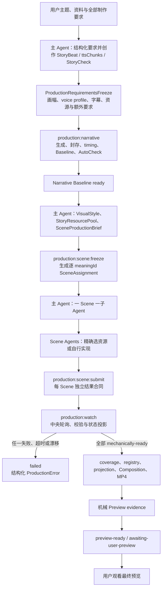

# M9.5 数据合同驱动的稳定生产编排实施计划

> **归档说明：** 历史实施快照；其中命令、路径和状态不再代表当前仓库事实。

> **状态：** 2026-08-05 已按本计划 inline 完成 Task 1–Task 10；实现停在
> `preview-ready / awaiting-user-preview`，没有创建真实新作品、用户批准或发布事实，也未 push。
>
> **里程碑位置：** M9 第二主题泛化已完成；M9.5 位于 M9 与 M10 发布收口之间。M9.5
> 只把已经证明的生产节点接成可恢复、可监控、fail-closed 的固定流程，不重新制作或迁移
> M1–M9 的 GPS / ProductComicVertical 权威产物。
>
> **生产模式：** code-first programmable video；Remotion、React/TypeScript、宿主机 Node/npm
> 和现有 VoxCPM adapter 保持不变。

## 1. 目标与完成定义

M9.5 的目标不是再做一个样片，而是把当前仍依赖主 Agent 逐步记忆和手工串联的生产过程，
收口成“创作输入由 Agent 决定、状态与阶段推进由严格合同和固定脚本负责”的稳定路径。

完成后的单次正常制作流程必须是：



M9.5 完成必须满足：

1. 主 Agent 在调用旁白前冻结整套制作要求，不只冻结画风；画面比例、分辨率、fps、voice
   profile、语言、字幕、安全区、内容限制、资源政策、声音政策和额外要求都有合同身份；
2. 主 Agent 完成 `StoryBeat`、authored `ttsChunks`、`NarrationSpec`、`RenderSpec`、
   `StoryCheck` 和要求冻结后，只调用一个固定 narrative runner，就能持续推进到 current
   Narrative Baseline 与 passing narrative AutoCheck；
3. Narrative Baseline ready 后，主 Agent 只做项目级创作冻结：`VisualStyleSpec`、大致覆盖
   整个 Story 的候选资源池、Scene 生产简报和逐 Scene 分配；
4. 每个 Scene 子 Agent 只拥有自己的 meaningId 目录，可以从 Story 候选资源池精确选取零个
   或多个资源，也可以完全使用 project-local Remotion 实现；
5. Scene 子 Agent 不直接修改中央状态，只调用固定 submit/fail 命令提交严格结果合同；
6. 中央 watcher 只轮询合同，不读取 Agent 对话，不依赖主 Agent 记忆；任一 Scene 错误、
   timeout、malformed result、共享输入漂移或越权资源都会 fail closed；
7. 所有 Scene 成功后，固定脚本自动生成 coverage、renderer registry、运行时 projection、
   无全局 BGM 的 Composition、完整 MP4 与机械 Preview evidence；
8. 成功状态只能是 `preview-ready` / `awaiting-user-preview`，不得写成 `approved`、
   `reviewed`、`quality-pass` 或发布完成；语义和审美由用户观看最终预览后决定；
9. 当前 Codex 主任务在子 Agent 工作和 watcher 等待期间保持运行，但可以逻辑上不再参与
   创作；M9.5 不承诺主任务结束后子 Agent 继续存活；
10. M1–M9 现有合同 parser、GPS/ProductComicVertical 产物、fingerprint、approval、evidence
    与 persisted final reports 保持 byte-for-byte current。

## 2. 本轮批准需求与明确排除项

### 2.1 主 Agent 仍负责的创作决策

主 Agent 只负责固定脚本不能可靠代替的决策：

- 把用户原始任务结构化为 `VideoBrief` 和完整制作要求；
- 创作 Story、StoryBeat、authored `ttsChunks` 与显式叙事停顿；
- 选择或遵从用户指定的 voice profile，写入 `NarrationSpec`；
- 把画幅、fps、分辨率、字幕安全区和输出要求写入 `RenderSpec`；
- 形成调用 TTS 前的 current `StoryCheck`；
- Narrative Baseline 完成后，形成 VisualStyleSpec、Story 级候选资源池、SceneProductionBrief
  和逐 Scene 的语义/连续性/额外要求；
- 使用 Codex 当前原生能力分发一 Scene 一子 Agent。

voice profile 和画幅不是 Scene 阶段才决定的事项。它们必须在第一次冻结中确定：voice
profile 参与 generation input fingerprint，RenderSpec 参与 timing、registry、字幕布局和
Composition identity。

### 2.2 固定脚本负责的执行

固定脚本负责：

- 严格解析和 fingerprint 所有冻结合同；
- 创建运行目录、事件 ledger、原子状态投影和单写者锁；
- VoxCPM generate/resume、PCM normalize/measure、seal、narration check；
- SemanticTiming、CaptionCue、标准 Narrative Composition scaffold、ProjectRegistry、
  Baseline 媒体、evidence 和 narrative AutoCheck；
- 从冻结的 SceneProductionBrief 生成逐 meaningId SceneAssignment；
- 接收并机械校验每个 Scene 的源码、声明、资源选择、ScenePackage 和结果合同；
- 轮询结果、检测失败/超时/漂移、生成 coverage、RendererRegistry、projection 和最终
  Composition；
- 渲染完整 MP4，做帧数、时长、画幅、流、完整解码、音频存在性与合同 identity 的机械
  检查；
- 把当前 run 推进到 `preview-ready` 或 `failed`。

### 2.3 M9.5 明确不做

- 不实现 M10 封面、编码发布包、上传、账号、网络、密钥或权限；
- 不自动发布，也不把本地 MP4 称为“已发布”；
- 不创建全片 BGM、跨 Scene ambience 或 ducking；这些以后作为独立可选增强加入；
- 不创建独立 `GlobalVisualLayers`；第一版通过 VisualStyleSpec 和逐 Scene 要求保持整体一致；
- 不实现 NarrativeCheck、SceneVisualCheck、SceneSoundCheck 或任何 Agent 审美审核 gate；
- 不自动修改失败 Scene，不实现用户预览后的定点修订循环；用户以后可单独要求重做某个
  Scene；
- 不实现通用 Scene DSL、自动布局器、自动导演或关键词到镜头的自动选择；
- 不让固定脚本选择 StoryBeat、Shot、精确资源、镜头方案或审美结果；
- 不把 Scene 子 Agent 的对话、内部推理或进程状态保存为生产合同；
- 不在仓库脚本中直接调用 Codex subagent API，也不接入 Codex App Server/SDK/Agents SDK；
- 不执行三个 promotion proposal，不移动新的共享 capability；
- 不要求主 Agent 在当前任务结束后还能继续托管子 Agent；真正 detached orchestration 留作
  独立后续 Epic；
- 不重写 M8/M9 已存在且要求 global sound/global visual 的 `FinalAssembly` 或 approval
  artifact；M9.5 新流程使用显式无全局增强的版本化 PreviewAssembly/PreviewEvidence 合同。

## 3. 当前 repo truth 与 M9.5 插入位置

### 3.1 已经可复用的真实能力

当前仓库已经提供：

- M1 严格 Story/Narration/Render/timing contracts 与 canonical fingerprint；
- M2 `narration:generate`、`narration:seal`、`narration:check`，包括真实 VoxCPM、候选续跑、
  原子封存和 `NarrationGenerationProgress`；
- M3 ProjectRegistry、lazy Composition、NarrativeCore、Baseline evidence；
- M4 `project:check --level narrative` 与 pass-only persisted AutoCheck；
- M6 VisualStyle、ResourceCatalog、SceneTaskInput、ScenePackage、Coverage、RendererRegistry、
  StoryVisualTrack 和 Scene-local SoundDesignTrack；
- M7/M8/M9 两个作品的真实 project-local authoring/evidence orchestration；
- M8/M9 FinalAssembly、FinalPreviewEvidence、用户 Approval 和 final-v2，但它们的 current
  project scripts 仍绑定具体样例并包含全局增强/Agent review；
- pass-only、原子、byte-stable writer 与 read-only drift gate 的既有模式。

### 3.2 当前仍然缺少的能力

当前没有：

- 统一的 `ProductionRequirementsFreeze`；
- 一个跨 narrative/Scene/preview 的 `ProductionRun` 事件和状态合同；
- 通用 `production:*` CLI；
- 标准新项目 Narrative Composition scaffold；
- Story 级候选资源池与逐 Scene assignment/result envelope；
- 只依赖文件合同的 Scene watcher；
- 不要求 global sound/global visual/Agent review 的机械 PreviewAssembly 和 PreviewEvidence；
- 一个证明成功、Scene 失败、超时、malformed、共享输入漂移都按合同收口的通用编排
  fixture。

M9.5 只补这些生产编排缺口。M10 继续保持发布收口，不吸收 M9.5 的 Agent 调度或创作逻辑。

## 4. 权威分层与两次冻结

### 4.1 第一次冻结：ProductionRequirementsFreeze

项目必须新增 strict `ProductionRequirementsFreezeV1`。它不是复制所有既有合同，而是把现有
权威文件、可读摘要和额外要求绑定成一次不可静默修改的生产入口。

最低字段：

```ts
type ProductionRequirementsFreezeV1 = {
  readonly schemaVersion: 1;
  readonly contractVersion: "production-requirements-freeze-v1";
  readonly storyId: string;
  readonly sourceBindings: {
    readonly videoBrief: ArtifactBinding;
    readonly storySpec: FingerprintedArtifactBinding;
    readonly narrationSpec: FingerprintedArtifactBinding;
    readonly renderSpec: FingerprintedArtifactBinding;
    readonly storyCheck: FingerprintedArtifactBinding;
  };
  readonly normalizedSummary: {
    readonly locale: string;
    readonly fps: number;
    readonly width: number;
    readonly height: number;
    readonly voiceProfileId: string;
    readonly captionSafeArea: Readonly<Record<string, number>>;
  };
  readonly enhancementSelection: {
    readonly storyVisual: "required";
    readonly sceneLocalSound: "allowed" | "none";
    readonly globalSound: "none";
    readonly globalVisual: "none";
  };
  readonly resourcePolicy: {
    readonly selfAuthoredVisualsAllowed: true;
    readonly unlistedThirdPartyResources: "deny";
  };
  readonly additionalRequirements: readonly ProductionRequirement[];
  readonly requirementsFingerprint: Sha256Digest;
};
```

`normalizedSummary` 只是便于主/子 Agent 阅读的校验投影，不是第二份 authority。schema 必须
打开并核对绑定的源合同，确认 voice profile、width/height/fps、locale 和字幕安全区完全一致；
不一致即 fail closed。

`ProductionRequirement` 最低字段：

```ts
type ProductionRequirement = {
  readonly requirementId: string;
  readonly scope:
    | "production"
    | "narrative"
    | "all-scenes"
    | "scene"
    | "final-preview";
  readonly targetMeaningIds: readonly string[];
  readonly category:
    | "content"
    | "render"
    | "narration"
    | "caption"
    | "visual"
    | "resource"
    | "sound"
    | "delivery"
    | "other";
  readonly statement: string;
  readonly owner: "main-agent" | "scene-agent" | "script" | "user-preview";
  readonly verification: "contract" | "mechanical" | "user-preview";
  readonly severity: "error" | "warning";
};
```

自由文本只存在于 `statement`，其作用范围、责任方、验证方式和严重级别必须结构化。脚本
不得把 `user-preview` 要求假装成机械可验证项。

### 4.2 第二次冻结：SceneProductionBrief

Narrative Baseline current 后，主 Agent 写：

- `VisualStyleSpec`：项目画风、art direction、连续性规则、禁止项；
- `StoryResourcePool`：整个 Story 可能使用的已批准候选资源和冻结参考；
- `SceneProductionBrief`：全片 Scene 制作要求、相邻连续性摘要、声音政策和检查政策；
- 每个 meaningId 的 Scene 语义/构图/运动/额外要求。

`StoryResourcePool` 是宽候选池，不替每个 Scene 做精确选择。最低字段：

```ts
type StoryResourcePool = {
  readonly schemaVersion: 1;
  readonly storyId: string;
  readonly requirementsFingerprint: Sha256Digest;
  readonly resourceCatalogFingerprint: Sha256Digest;
  readonly allowedResourceIds: readonly string[];
  readonly allowedSnapshots: readonly {
    readonly sourceId: string;
    readonly snapshotFingerprint: Sha256Digest;
    readonly allowedCardIds: readonly string[];
  }[];
  readonly selfAuthoredVisualsAllowed: true;
  readonly poolFingerprint: Sha256Digest;
};
```

Scene Agent 可以：

- 从 `allowedResourceIds`/`allowedSnapshots` 精确选择零个或多个；
- 只使用项目本地代码、Remotion frame API 与已批准共享 capability 自行实现；
- 把精确选择写入现有 `selected-resources.json`/ShotRecipeSelection。

Scene Agent 不可以：

- 扩大 StoryResourcePool；
- 引入未登记第三方媒体、远程 URL、浮动上游或未经许可字体/音频；
- 修改 ResourceCatalog、VisualStyleSpec、SemanticTiming 或其他 Scene；
- 因素材不足而延长 Beat 或改写旁白。

确需池外资源时，Scene 结果必须是 `blocked`/failed ProductionError；M9.5 正常流程停止，不
自动扩池或重发任务。

## 5. ProductionRun 合同与目录

### 5.1 tracked 创作合同

新作品使用：

```text
src/projects/<story>/production/
├── requirements.json
├── scene-production-brief.json
├── story-resource-pool.json
└── scene-assignments/
    └── <meaningId>.generated.json
```

`requirements.json`、`scene-production-brief.json` 和 `story-resource-pool.json` 是 Agent-authored
或 Agent 决策后写入的 tracked 合同；`scene-assignments/*.generated.json` 由固定脚本从它们和
current timing 生成。

### 5.2 ignored 运行合同

运行中状态保存在 repo-local ignored 目录：

```text
.producer-runs/<runId>/
├── run.json
├── events/
│   └── <sequence>-<eventId>.json
├── scene-results/
│   └── <meaningId>.json
├── state.generated.json
└── lock
```

这些文件仍是 strict 数据合同，但不是 render runtime 输入，也不进入已封存作品的 canonical
identity。成功生产产物继续写入 `src/projects/<story>/`、`public/projects/<story>/` 和
`out/<story>/` 的既有边界。

不得保存 raw Agent transcript、thinking、token、provider endpoint、私有配置、环境变量、
未脱敏 stack trace 或完整 stdout/stderr。

### 5.3 不允许手改的状态投影

`state.generated.json` 由事件 ledger 和 current artifact fingerprints 复算；任何命令执行前都
先复算并要求 byte-equivalent。它不是人工填写的万能 status。

最低状态：

```text
initialized
→ narrative-running
→ baseline-ready
→ scene-inputs-frozen
→ scenes-running
→ post-scene-running
→ preview-ready

任一 active state → failed
```

`preview-ready` 是 M9.5 自动流程的成功终点，含义是“完整 MP4 和机械 evidence current，
等待用户观看”，不是用户批准。

## 6. 事件、成功结果与错误合同

### 6.1 ProductionStageEvent

所有状态变化只能由固定脚本提交事件，再由 projector 原子更新状态。事件使用 strict
discriminated union：

- `stage-started`；
- `stage-succeeded`；
- `stage-failed`；
- `scene-result-accepted`；
- `preview-ready`。

每个事件绑定：

- `runId`、`storyId`、严格递增 `sequence`、`stageId`、`attempt`；
- previous state fingerprint；
- current input fingerprints；
- 成功时的 output artifact bindings/fingerprints；
- 失败时的 `ProductionError`；
- event fingerprint。

事件只追加、不覆盖。重复提交相同事件保持 bytes/mtime 稳定；冲突事件、跳序、旧
previous state、未知 stage 或非法 transition 都 fail closed。

### 6.2 ProductionError

错误合同必须同时覆盖预期错误和意外异常：

```ts
type ProductionError = {
  readonly schemaVersion: 1;
  readonly kind: "expected" | "unexpected";
  readonly code: string;
  readonly stageId: string;
  readonly scope: "run" | "narrative" | "scene" | "post-scene" | "preview";
  readonly meaningId: string | null;
  readonly summary: string;
  readonly description: string;
  readonly retryable: boolean;
  readonly remediation: string | null;
  readonly commandId: string;
  readonly inputFingerprint: Sha256Digest;
  readonly redactionApplied: boolean;
  readonly errorFingerprint: Sha256Digest;
};
```

要求：

- expected error 使用稳定 code，例如 `STALE_REQUIREMENTS`、`NARRATION_FAILED`、
  `SCENE_TIMEOUT`、`RESOURCE_NOT_ALLOWED`、`SCENE_RESULT_MALFORMED`；
- unexpected error 统一 `kind: unexpected`，保留脱敏后的可操作描述，不吞掉“发生了什么”；
- raw stack、绝对路径、token、私有 endpoint、环境变量和值不进入合同；
- sanitizer 不能只做字符串替换后假装安全，必须 allowlist 可持久化字段、限制长度并测试
  URL、Bearer、query token、Unix/Windows absolute path 和多行 stack；
- 错误事件写入成功后，run 才进入 `failed`；如果连错误合同都无法原子写入，CLI 输出最小
  脱敏错误并非零退出，不得谎报已记录。

### 6.3 SceneProductionResult

每个 Scene 只有一个 accepted result：

- success：绑定 assignment/task input、ScenePackage、renderer source graph、精确选中资源、
  optional fidelity receipt 和 Scene 机械检查 fingerprint；
- failure：绑定 assignment/task input 和 ProductionError；
- timeout：只由 watcher 在 deadline 到达且没有合法结果时生成；
- malformed/stale/duplicate 结果不能被当作 success，watcher 写 central failure event 后停止。

Scene Agent 不能直接写 `state.generated.json` 或 events。`scene-results/<meaningId>.json` 也只能
由 `production:scene:submit` / `production:scene:fail` 的原子 writer 创建。

## 7. 主 Agent 与 Scene Agent 生命周期

### 7.1 主 Agent 的真实边界

当前 M9.5 不拥有 Agent runtime。主 Agent 使用当前 Codex 原生方式分发 Scene，然后启动：

```bash
npm run production:watch -- --run <runId>
```

watcher 可以长时间等待文件合同，主 Agent 此后不做创意决策，只保持当前任务存在、等待命令
返回。主 Agent 可以逻辑上“停止工作”，但不能假定结束当前 Codex 任务后子 Agent 仍可靠
运行。

真正允许主 Agent 完全退出的 detached workflow，必须以后由 Codex App Server/SDK、Agents
SDK、队列或其他外部 lifecycle owner 实现；它不属于 M9.5。

### 7.2 Scene Agent 的固定交接

每个 Scene Agent 的 prompt 只给：

- assignment 文件绝对路径；
- 独占 sceneRoot/publicAssetRoot；
- current Story/Beat/timing/requirements/style/resource pool 的只读路径和 fingerprints；
- 成功 submit 命令与主动 fail 命令；
- 禁止修改的共享路径；
- deadline。

成功时执行：

```bash
npm run production:scene:submit -- --run <runId> --scene <meaningId>
```

主动发现无法完成时执行：

```bash
npm run production:scene:fail -- \
  --run <runId> \
  --scene <meaningId> \
  --code <stable-code> \
  --description <safe-description>
```

submit 本身发生校验异常时必须自动写 Scene failure result；Agent 崩溃且没有结果时，由
watcher 在 assignment deadline 后写 `SCENE_TIMEOUT`。

## 8. 固定 Narrative Pipeline

### 8.1 命令

```bash
npm run production:start -- --project <storyId>
npm run production:narrative -- --run <runId>
npm run production:status -- --run <runId>
```

`production:start`：

1. strict 读取 VideoBrief、StorySpec、NarrationSpec、RenderSpec、StoryCheck 和
   ProductionRequirementsFreeze；
2. 验证 normalized summary 与源合同一致；
3. 生成/检查标准 project-local Narrative Composition scaffold，拒绝覆盖非模板手写入口；
4. 创建 immutable `run.json`、第一个 event 和 byte-stable state projection；
5. stdout 只输出机器可读 JSON：runId、state path、requirements fingerprint。

`production:narrative` 固定调用顺序：

```text
requirements/current StoryCheck check
→ narration generate/resume
→ narration seal
→ narration check
→ registry generate/check
→ compositions listing
→ Baseline transparent still / caption still / full MP4
→ baseline evidence write/check
→ project:check narrative --write-auto-check
→ project:check narrative read-only
→ baseline-ready event
```

实现优先直接调用现有 TypeScript runner/domain 函数，不通过拼接 shell 字符串重写业务逻辑。
只有 Remotion/ffmpeg 等现有进程边界使用参数数组启动子进程。

任何一步失败都写 `stage-failed` 和 ProductionError，停止后续步骤。Narration 的同 generation
input candidate resume 继续复用现有语义；run event 不取代
`NarrationGenerationProgress`/SealedNarrationManifest，也不成为新的旁白权威。

## 9. Scene 冻结、提交与中央监控

### 9.1 Scene freeze

主 Agent 写完 VisualStyleSpec、StoryResourcePool、SceneProductionBrief 后执行：

```bash
npm run production:scene:freeze -- --run <runId>
```

固定脚本必须：

1. 要求 current run 为 `baseline-ready`；
2. 重验 narrative AutoCheck、requirements、Story、SemanticTiming、VisualStyle、Catalog 和
   resource pool fingerprints；
3. 按 StoryBeat 顺序生成一 meaningId 一 assignment；
4. 每个 assignment 绑定 existing SceneTaskInput、Requirements、SceneBrief、ResourcePool、
   allowed directories、deadline 和相邻摘要；
5. 生成后 read-only byte drift check；
6. 提交 `scene-inputs-frozen` event。

### 9.2 Scene submit

`production:scene:submit` 对单个独占目录依次：

```text
assignment/current shared fingerprint check
→ required authored Scene files strict parse
→ selected resources subset-or-empty check
→ local asset/license/path check
→ renderer source graph / forbidden import check
→ optional exact-reference fidelity conditional check
→ ScenePackage pass-only generation/check
→ focused typecheck/static runtime check
→ SceneProductionResult success atomic write
```

它不生成 coverage，不写 central registry，不修改 Composition，不运行整片审美检查。共享输入
在任何时点漂移都使提交失败。

### 9.3 Central watcher

`production:watch` 必须使用单写者 lock，轮询所有 expected Scene result paths：

- 未到 deadline 且结果缺失：继续等待；
- current success：记录 accepted，不重复处理；
- explicit failure：立即写 run failure 并非零退出；
- malformed/stale/unknown/duplicate result：立即 fail closed；
- deadline 到期：写 `SCENE_TIMEOUT` 并停止；
- 所有 success：提交 `post-scene-running`，进入固定 post-scene pipeline。

poll interval 和 timeout 必须来自 strict run policy；测试使用注入 clock/scheduler，不做真实
长时间 sleep。

## 10. 无全局 BGM 的固定装配与机械 Preview

### 10.1 版本化装配合同

不得修改 M8/M9 current FinalAssembly bytes。新增 `PreviewAssemblyV1` 或等价版本化合同，
显式表达：

```text
required: NarrativeCore
present: StoryVisualTrack
present-or-none: Scene-local SoundDesignTrack
absent: GlobalSoundPlan / BGM / cross-scene ambience / ducking
absent: GlobalVisualLayers
```

它绑定：requirements、narrative AutoCheck、sealed narration、SemanticTiming、CaptionCue、
SceneCoverage、全部 ScenePackage、RendererRegistry、StoryVisualProjection、可选 Scene-local
SoundDesignProjection、Composition source checksum、Remotion exact version 和固定 layer/mix
order。

“absent” 必须是合同中的显式选择，不能靠缺字段猜测；M9.5 不引入充满 nullable 字段的万能
Track 类型。

### 10.2 Post-scene pipeline

所有 Scene success 后固定执行：

```text
shared freeze drift check
→ SceneCoverage generate/check
→ RendererRegistry generate/check
→ StoryVisual / SceneSound projection check
→ standard Composition assembly check
→ ProjectRegistry generate/check
→ compositions listing
→ full MP4 render
→ representative stills/contact sheet generation
→ technical media check + complete decode
→ ProductionPreviewEvidence write/check
→ production-preview-mechanical-check-v1
→ preview-ready event
```

机械 evidence 至少验证：

- MP4 checksum 与 relative path；
- expected/actual width、height、fps、frame count、duration；
- H.264 视频流与按 requirements 选择的音频流；
- 完整解码无错误；
- 所有 StoryBeat 有 current ScenePackage/explicit allowed fallback；本 M9.5 正常路径默认要求
  all ready；
- registry、projection、assembly 和 media identity current；
- representative still/contact sheet 文件存在且 checksum current；
- 不存在 BGM、cross-scene ambience、ducking 或 GlobalVisualLayers 的隐式输入。

机械 evidence 不包含“画面表达准确”“构图好看”“转场自然”“音效审美通过”等结论。其
aggregate 字段只能是 `mechanically-ready`。

### 10.3 用户交接

成功 stdout 必须返回：

- `runId`；
- `status: preview-ready`；
- MP4 relative path 和 checksum；
- PreviewEvidence fingerprint；
- state path；
- 明确文字 `awaiting explicit user preview decision`。

用户若认为某个 Scene 不合格，后续单独启动定点 Scene 修订任务；该修改循环不在本计划，
不得为了预留循环而把 M9.5 状态机设计成任意跳转图。

## 11. CLI 与目录目标

### 11.1 新增源码

```text
src/contracts/production-requirements.ts
src/contracts/production-run.ts
src/contracts/production-scene-result.ts
src/contracts/production-preview.ts

scripts/production/
├── cli.ts
├── start.ts
├── narrative.ts
├── scene-freeze.ts
├── scene-submit.ts
├── scene-fail.ts
├── watch.ts
├── post-scene.ts
├── preview-evidence.ts
├── project-scaffold.ts
├── domain/
│   ├── events.ts
│   ├── transitions.ts
│   ├── projection.ts
│   └── errors.ts
└── adapters/
    ├── run-store.ts
    ├── process-runner.ts
    └── error-redaction.ts

tests/production/
```

### 11.2 package scripts

```json
{
  "production:start": "node --import tsx scripts/production/cli.ts start",
  "production:status": "node --import tsx scripts/production/cli.ts status",
  "production:narrative": "node --import tsx scripts/production/cli.ts narrative",
  "production:scene:freeze": "node --import tsx scripts/production/cli.ts scene-freeze",
  "production:scene:submit": "node --import tsx scripts/production/cli.ts scene-submit",
  "production:scene:fail": "node --import tsx scripts/production/cli.ts scene-fail",
  "production:watch": "node --import tsx scripts/production/cli.ts watch",
  "production:preview:check": "node --import tsx scripts/production/cli.ts preview-check"
}
```

所有 CLI 只接受文档规定的 exact form；未知参数、重复 flag、缺参、额外 positional args 和
非法 slug/runId/meaningId 全部非零退出。

## 12. 实施任务与 TDD 顺序

每个 Task 在同一主对话 inline 执行：先写失败测试，确认 Red 原因正确，再做最小 Green，跑
聚焦验证，精确 staging 和本地 commit。不得使用子 Agent 实施 M9.5 本身，不 push。

### Task 1：生产要求与额外要求合同

**目标文件：**

- `src/contracts/production-requirements.ts`
- `src/contracts/index.ts`
- `tests/production/production-requirements.test.ts`

**Red：**

- normalized width/height/fps/voice profile 与绑定源合同不一致；
- duplicate requirementId、非法 scope/owner/verification 组合；
- `verification: mechanical` 却没有脚本 owner；
- scene scope 缺 targetMeaningIds 或 target 不存在；
- globalSound/globalVisual 不是 explicit `none`；
- unknown fields、绝对路径、私有配置字段。

**Green：** strict schema、fingerprint builder、current source resolver 和 summary equality
check。不得改变现有 M1 contracts。

**聚焦验证：**

```bash
node --import tsx --test tests/production/production-requirements.test.ts
npm run typecheck
```

**commit：** `feat(production): add frozen production requirements contract`

### Task 2：Run event、状态投影与错误脱敏

**目标文件：**

- `src/contracts/production-run.ts`
- `scripts/production/domain/{events,transitions,projection,errors}.ts`
- `scripts/production/adapters/{run-store,error-redaction}.ts`
- `tests/production/{run-state,error-redaction,run-store}.test.ts`
- `.gitignore`

**Red：** 非法 transition、乱序/重复/冲突 event、previous fingerprint stale、手改 state、两个
writer、半写 JSON、unexpected stack/token/endpoint/absolute path 泄漏、错误写入失败。

**Green：** append-only event store、single-writer lock、canonical atomic writer、state
projector、allowlist sanitizer 和 strict ProductionError。

**聚焦验证：**

```bash
node --import tsx --test \
  tests/production/run-state.test.ts \
  tests/production/error-redaction.test.ts \
  tests/production/run-store.test.ts
```

**commit：** `feat(production): add fail-closed run state ledger`

### Task 3：production:start 与标准 Narrative scaffold

**目标文件：**

- `scripts/production/{cli,start,project-scaffold}.ts`
- `tests/production/{cli,start,project-scaffold}.test.ts`
- `package.json`

**Red：** malformed requirements、source drift、已有非模板 Composition、runId collision、未知
CLI 参数、重复执行 bytes/mtime 变化、M7/M9 入口被覆盖。

**Green：** exact CLI、strict start、immutable run manifest、standard default-export Narrative
Composition scaffold，已存在 current scaffold 时 no-op。

**聚焦验证：**

```bash
node --import tsx --test \
  tests/production/cli.test.ts \
  tests/production/start.test.ts \
  tests/production/project-scaffold.test.ts
npm run registry:check
```

**commit：** `feat(production): start contract-bound production runs`

### Task 4：固定 Narrative runner

**目标文件：**

- `scripts/production/narrative.ts`
- 必要的现有 runner 小型导出调整
- `tests/production/narrative-runner.test.ts`

**Red：** generate/seal/check/registry/baseline/evidence/AutoCheck 任一步失败，错误事件、后续
停止、repeat current no-op、stale requirement、stale StoryCheck、candidate resume 和
supersede 边界。

**Green：** 直接组合现有 TypeScript runners；process adapter 只用于 Remotion/ffmpeg；
成功绑定所有 output fingerprints 后才写 `baseline-ready`。

测试使用 fake provider/process adapter 和临时 fixture，不调用真实 VoxCPM，不伪造真实作品
evidence。

**聚焦验证：**

```bash
node --import tsx --test tests/production/narrative-runner.test.ts
node --import tsx --test tests/narration/*.test.ts tests/baseline/*.test.ts tests/project-check/*.test.ts
```

**commit：** `feat(production): orchestrate narrative baseline deterministically`

### Task 5：StoryResourcePool、Scene brief 与 assignment freeze

**目标文件：**

- `src/contracts/production-scene-result.ts`
- `scripts/production/scene-freeze.ts`
- `tests/production/{story-resource-pool,scene-freeze}.test.ts`

**Red：** pool 资源不在 current Catalog、snapshot/card 不允许、requirements/style/timing stale、
missing/duplicate meaningId、assignment 路径重叠、Scene 额外要求漏投影、空资源选择被错误
拒绝。

**Green：** strict StoryResourcePool/SceneProductionBrief/SceneAssignment 和稳定按 Beat 排序的
pass-only generator。

**聚焦验证：**

```bash
node --import tsx --test \
  tests/production/story-resource-pool.test.ts \
  tests/production/scene-freeze.test.ts
```

**commit：** `feat(production): freeze story resource pool and scene assignments`

### Task 6：Scene submit/fail 合同入口

**目标文件：**

- `scripts/production/{scene-submit,scene-fail}.ts`
- `tests/production/{scene-submit,scene-fail}.test.ts`

**Red：** pool 外资源、共享输入 drift、非法远程 import、Scene 越界、malformed package、
exact recipe 缺 current receipt、failure description 泄密、重复 success/failure 冲突、子 Agent
试图改 state。

**Green：** subset-or-empty selection、existing ScenePackage/fidelity/runtime checks、focused
compile、atomic SceneProductionResult writer。submit 校验异常自动形成 failure result。

**聚焦验证：**

```bash
node --import tsx --test \
  tests/production/scene-submit.test.ts \
  tests/production/scene-fail.test.ts \
  tests/scene-package/*.test.ts \
  tests/renderer-registry/*.test.ts
```

**commit：** `feat(production): accept isolated scene result contracts`

### Task 7：中央 watcher 与并发/超时语义

**目标文件：**

- `scripts/production/watch.ts`
- `tests/production/watch.test.ts`

**Red：** 部分完成继续等、任一失败立即终止、malformed/stale/unknown result、timeout、两
watchers、乱序到达、所有成功只触发一次 post-scene、shared freeze 在等待中漂移。

**Green：** 注入 clock/scheduler 的 deterministic poller、single writer lock、accepted result
投影和明确非零失败。

**聚焦验证：**

```bash
node --import tsx --test tests/production/watch.test.ts
```

**commit：** `feat(production): monitor scene contracts with a central watcher`

### Task 8：无全局增强的 PreviewAssembly 与机械 evidence

**目标文件：**

- `src/contracts/production-preview.ts`
- `scripts/production/{post-scene,preview-evidence}.ts`
- `tests/production/{preview-assembly,post-scene,preview-evidence}.test.ts`

**Red：** 隐式 global sound/global visual、错误画幅/帧数/流/时长、MP4 截断、Scene coverage
不全、registry/projection/source drift、把 mechanical 结果写成 approved/reviewed。

**Green：** versioned PreviewAssembly、固定 post-scene pipeline、完整 decode/mechanical
evidence 和 `preview-ready` event。M8/M9 FinalAssembly/Approval schemas 与 artifacts 保持不变。

**聚焦验证：**

```bash
node --import tsx --test \
  tests/production/preview-assembly.test.ts \
  tests/production/post-scene.test.ts \
  tests/production/preview-evidence.test.ts
```

**commit：** `feat(production): assemble mechanically ready scene previews`

### Task 9：两 Scene 临时端到端编排证明

**目标文件：**

- `tests/production/orchestration-e2e.test.ts`
- `tests/production/fixtures/` 中只保留最小声明；运行产物写临时目录

**场景：**

1. fake provider + 两 Scene success → `preview-ready`；
2. Scene A success、Scene B expected failure → run failed 且不装配；
3. Scene 缺结果 → timeout；
4. Scene result malformed/stale → failed；
5. Scene 等待期间 requirements/Catalog/timing drift → failed；
6. watcher/post-scene 重跑 current → bytes/mtime stable；
7. GPS 与 ProductComicVertical 受保护 fingerprint/approval/evidence/report 不变。

不得把 synthetic proof 注册进正常 ProjectRegistry，不调用真实 VoxCPM，不生成假的用户批准。

**验证：**

```bash
node --import tsx --test tests/production/orchestration-e2e.test.ts
npm run registry:check
npm run project:check -- --project gps-relativity --level final
npm run project:check -- --project product-comic-vertical --level final
```

**commit：** `test(production): prove contract-driven orchestration end to end`

### Task 10：操作文档、authority closeout 与全量门

**目标文件：**

- `docs/PRODUCTION_ORCHESTRATION.md`
- `README.md`、`AGENTS.md`
- `docs/{README,FINAL_PRODUCT_GOAL,PRODUCTION_WORKFLOW,ITERATION_STATUS,ROADMAP,ARCHITECTURE,DETERMINISTIC_EXECUTION,TERMINOLOGY,REVIEW_MODEL}.md`
- 本计划状态段

只在所有实现和 gates 真实通过后，把 M9.5 从“计划待实施”改为“已实现”。不得把 M10、
发布、detached Agent、BGM、global visual、Agent review 或用户批准写成已实现。

**验证：**

```bash
npm run docs:check-links
npm test
npm run typecheck
npm run lint
npm run catalog:check
npm run registry:check
npm run build
npm run compositions
npm run check
git diff --check
git status --short
```

`npm run check` 必须纳入 production contract/orchestration tests，但不得把真实 VoxCPM、真实
长时间 scene wait 或网络调用塞进默认 gate。

**commit：** `docs(production): close m9.5 orchestration milestone`

## 13. Fail-closed matrix

M9.5 至少覆盖：

| 失败类别                                                  | 预期结果                                          |
| --------------------------------------------------------- | ------------------------------------------------- |
| requirements unknown field / malformed                    | start 拒绝，无 run                                |
| normalized voice/ratio 与源合同不一致                     | `STALE_REQUIREMENTS`                              |
| Story/ttsChunks/NarrationSpec/RenderSpec/StoryCheck drift | narrative 停止                                    |
| provider 失败或部分 chunk                                 | run failed；candidate 可按既有规则续跑，不能 seal |
| sealed narration/timing/registry/Baseline evidence drift  | 不得进入 baseline-ready                           |
| VisualStyle/ResourcePool/SceneBrief 漂移                  | scene freeze/submit/watch 拒绝                    |
| resource pool 外选择                                      | `RESOURCE_NOT_ALLOWED`                            |
| Scene 自行实现且选零资源                                  | 合法                                              |
| Scene 修改共享输入                                        | central freeze drift，整次 run failed             |
| Scene success result malformed/stale                      | `SCENE_RESULT_MALFORMED` / `STALE_SCENE_RESULT`   |
| Scene explicit fail                                       | watcher 立即 failed，不装配                       |
| Scene 无结果超过 deadline                                 | `SCENE_TIMEOUT`                                   |
| 两 watcher 或 event conflict                              | single-writer fail closed                         |
| coverage/registry/projection/Composition 失败             | post-scene failed，无 preview-ready               |
| MP4 帧数/画幅/流/完整解码错误                             | PreviewEvidence 不写 pass                         |
| global BGM/ambience/ducking/global visual 意外出现        | PreviewAssembly/check 拒绝                        |
| Agent review/approval artifact 缺失                       | 不影响 mechanical preview；状态不得称 approved    |
| error 含 token/endpoint/绝对路径/stack                    | sanitizer 脱敏或拒绝持久化                        |
| state.generated.json 被手改                               | 下一个命令发现 byte drift 并拒绝                  |
| current 命令重复执行                                      | bytes 与 mtime 稳定                               |

## 14. 实施纪律与 Git 边界

- 在当前 `codex/foundation` 上 inline 执行；开始前重读 AGENTS、authority docs、此计划、
  branch/HEAD/status；
- 保护当前用户未跟踪 `public/voice_profile/`，不得读取、移动、删除、stage 或提交；
- 不使用子 Agent 实施 M9.5；Scene 子 Agent 是未来生产 runtime 的业务场景，不是本次代码
  实施方法；
- 每 Task Red/Green 后做精确 staging 与本地 commit；不使用 `git add .`；
- 不修改或重新生成 GPS/ProductComicVertical 的真实媒体、approval 或 evidence，除非聚焦
  checker 明确要求只读验证；
- 不调用真实 VoxCPM，除非用户另行授权一个真实生产验收；默认测试使用依赖注入 fake；
- 不 push；
- 遇到真实 blocker 才停止，不能因实现量大把未完成任务表述为完成。

## 15. 计划自审

### 15.1 与用户需求一致

- 完整制作要求在 TTS 前冻结，包含但不限于画幅与 voice profile；
- 主 Agent 的资源选择是 Story 级宽候选池，Scene Agent 做精确子集或零选择；
- Scene Agent 可以自行实现，不强制套资源或 Shotcraft；
- 状态由合同和脚本维护，主 Agent 只等待 watcher；
- 脚本成功提交成功事件，失败保存脱敏错误和描述；
- 所有 Scene success 后由固定脚本继续装配和机械测试；
- 不做背景音乐、跨 Scene ambience、ducking 或独立全局视觉层；
- 不做 Scene Agent 审美审核，最终由用户看完整 Preview；
- 当前主 Agent 任务保持运行，未假设 root task 结束后子 Agent 继续存活。

### 15.2 与现有架构一致

- Narrative Baseline 仍不依赖 Scene；
- sealed PCM/SemanticTiming 仍是唯一时间权威；
- Scene 不修改 Story、旁白、字幕、RenderSpec 或 Beat 窗口；
- ProjectRegistry 与 RendererRegistry 分离；
- runtime 不调用 Agent、skill、MCP、Git、网络或目录扫描；
- 数据合同不保存 JSX、代码或动态模块路径；
- current M8/M9 FinalAssembly/Approval 保持不变；
- M10 发布仍是下一个独立里程碑。

### 15.3 最小而不偷换的自动化边界

M9.5 自动化的是已经确定的步骤、状态推进、等待、校验、装配和机械 evidence；没有把
创作决策伪装成确定性脚本，也没有把机械可用性伪装成最终审美质量。

## 16. Planning-only 编写轮次的停止边界

本节记录 2026-08-04 编写计划时的历史边界：当时只同步本计划与 authority docs，不创建
`src/contracts/production-*`、`scripts/production/`、tests、package scripts、`.producer-runs/`
或真实新作品。2026-08-05 后续轮次已按 Task 1–Task 10 实施本计划；仍未 push，也未开始 M10。
