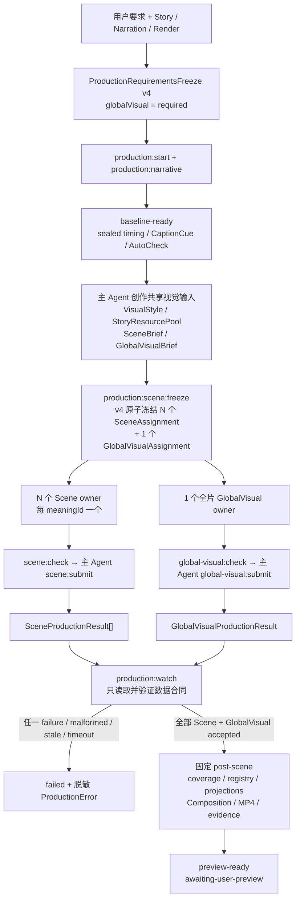

# Agent 创作 GlobalVisualLayers 的合同驱动并行生产实施计划

> **状态：** 已于 2026-08-07 按 Task 1 → Task 7 完成实施、验证与本地提交；未 push。
>
> **日期：** 2026-08-07
>
> **基线：** `codex/foundation` @ `ef530f0`；计划编写前 `git status --short` 为空。
>
> **实施方式：** 获批后在当前主对话 inline 按 Task 1 → Task 7 执行。每个 Task 遵循
> Red → 最小 Green → 聚焦验证 → 精确 staging → 独立本地 commit；禁止 `git add .`，不 push。
>
> **唯一成功边界：** future-only 新 production 可以在 Scene Agents 之外，同时启动一个
> 全片级 GlobalVisual Agent，并只通过严格 assignment/package/result 合同汇合到中央 watcher；
> 固定脚本最终生成包含 `GlobalVisualLayers` 的机械 Preview，并停在
> `preview-ready / awaiting-user-preview`。

## 1. 目标与完成定义

本计划把现有正式作品已经证明的 project-local `GlobalVisualLayers` 接入稳定 production
主链。接入方式必须复用当前“Agent 创作、数据合同交接、中央脚本 single-writer、固定脚本
投影与装配”的生产逻辑，而不是把 Agent 的任务、对话或进度变成 runtime 状态。

完成后的正常流程是：



实现完成必须同时满足：

1. `ProductionRequirementsFreeze` 在 Run 前明确冻结 `globalVisual: "required"`；不能在 Scene
   开始后由 Agent 上下文临时决定是否增加 GlobalVisual；
2. Narrative Baseline 完成后，同一 production freeze 原子生成 N 个 Scene assignment 和一个
   Story 级 GlobalVisual assignment；GlobalVisual 不按 `meaningId` 拆分；
3. GlobalVisual owner 与所有 Scene owners 同时开始，GlobalVisual assignment 不引用任何
   ScenePackage、Scene renderer source 或 SceneProductionResult fingerprint；
4. GlobalVisual owner 只在独占目录创作 strict plan、project-local Renderer、可选本地资产选择
   和可复算 package；不写中央 result、event、state、projection、Composition 或 Preview；
5. repo CLI 不创建、查询、轮询或托管 Agent，不保存 `agentId`、task/thread ID、model、heartbeat、
   progress、对话、推理或日志；
6. `production:watch` 只轮询固定 result 路径并校验 strict contracts。GlobalVisual 先完成、Scene
   先完成或交错完成，都必须得到相同的最终身份；
7. watcher 的成功汇合条件固定为：所有 expected Scene results accepted **且** 当前
   GlobalVisual result accepted；只满足一侧不得进入 post-scene；
8. `GlobalVisualProjection`、静态 Composition import、PreviewAssembly、evidence 和 mechanical
   check 只由固定脚本生成，并绑定 assignment/package/source graph/resource fingerprints；
9. 新 Preview 固定装配 `StoryVisualTrack → GlobalVisualLayers → NarrativeCore/CaptionLayer`，
   GlobalVisual 不渲染字幕、不拥有 Scene 语义内容、不增加 GlobalSound；
10. v1–v3 requirements、既有 Run、GPS/ProductComicVertical 正式 GlobalVisual、approval、evidence
    和 final reports 不迁移、不回填、不重新生成；
11. 自动流程仍只到 `preview-ready / awaiting-user-preview`，不创建用户批准，不运行
    NarrativeCheck/Scene 审美 gate，不进入 M10、promotion、发布或 push。

## 2. 当前 repo truth

### 2.1 已实现且直接复用的能力

- 当前新 Run 使用 `production-requirements-freeze-v3`、Run-before-write preflight、
  `production-readability-v1` 和 `scene-composition-boundary-v1`；
- `production:scene:freeze/check/submit/fail/watch` 已形成 assignment → Agent-owned files →
  package → immutable result → append-only event/state 的闭环；
- watcher 是中央唯一 writer，`state.generated.json` 只从 Run manifest、append-only events、
  immutable result 和 current fingerprints 复算；
- post-scene 已固定生成 coverage、RendererRegistry、StoryVisual/SoundDesign projection、静态
  Composition、ProjectRegistry、完整 MP4、still、contact sheet、evidence 和 mechanical check；
- `GlobalVisualPlan` v1 与 `GlobalVisualProjection` v1 已存在，GPS 和 ProductComicVertical 均有
  project-local `GlobalVisualLayers.tsx` 和正式最终装配证明；
- `CompositionAssembly` 已有独立 `globalVisualLayers?: ReactNode` 强语义槽位，当前固定源码顺序
  是 `storyVisualTrack → globalVisualLayers → narrativeCore → soundDesignTrack`；
- `ResourceCatalog` 已支持 `mediaRole/useContext = "global-visual"`；
- render runtime 已满足静态 import、本地资产、Remotion frame API、无 Agent/skill/MCP/Git/网络/
  目录扫描的边界。

### 2.2 当前尚未实现的部分

- `EnhancementSelectionSchema` 把 `globalVisual` 固定为 `"none"`；
- current production freeze 只产出逐 meaningId Scene assignments，没有 Story 级 GlobalVisual
  brief、assignment、package 或 production result；
- `ProductionRunState` 只记录 `acceptedSceneResults`，event union 没有
  `global-visual-result-accepted`；
- watcher 只读取 `.producer-runs/<runId>/scene-results/*.json`，全部 Scene accepted 后立即进入
  post-scene；
- Production PreviewAssembly v1/v2 固定 `globalVisualLayers: "absent"`，layer order 不包含
  GlobalVisual；
- PreviewEvidence 固定声明 GlobalVisual absent，mechanical check 只有
  `enhancementAbsence: "pass"`；
- v3 project scaffold 明确不静态 import 或装配 `GlobalVisualLayers`；
- 当前 Skill 只要求一个 meaningId 一个 Scene child，没有一个全片级 GlobalVisual child 的
  assignment/result 协议。

### 2.3 本计划的插入位置

本计划不等待 Scene 完成后再创作 GlobalVisual。GlobalVisual 所需的 width/height/fps、总帧数、
Story、StoryBeat 绝对时间窗、caption safe area、VisualStyle 和批准资源，在 Baseline 与第二次
冻结时已经 current。

因此插入位置固定为：

```text
baseline-ready
  → 主 Agent 写 VisualStyle / StoryResourcePool / SceneBrief / GlobalVisualBrief
  → production:scene:freeze 同时冻结 SceneAssignments + GlobalVisualAssignment
  → Scene owners 与 GlobalVisual owner 并行
  → result contracts 汇合
  → fixed post-scene
```

## 3. 已锁定的 hard boundary

### 3.1 “合同驱动”与“监控 Agent”的区别

production 系统只承认以下事实：

- frozen assignment 是否 current；
- 固定 authoring 文件是否存在且通过 schema/source/resource 校验；
- immutable result contract 是否出现、是否与 assignment/package/current inputs 一致；
- append-only event 是否已由 single writer 接受；
- 全部 required result contracts 是否已满足汇合条件。

production 系统禁止承认或保存：

- Agent/child/task/thread/conversation ID；
- model/provider 名称、token 用量或推理内容；
- queued/running/idle 等 Agent 生命周期状态；
- heartbeat、百分比进度、当前步骤或聊天日志；
- Codex collaboration/App Server/Agents SDK 的 runtime dependency；
- “Agent 已结束”但没有 current result contract 的隐式成功。

主 Agent 可以在 Codex 原生协作面创建 N+1 个独立 owner，但这是仓库外的 authoring control
plane。仓库内 data plane 只看到 assignment 与 result。`production:watch` 的轮询对象是固定文件
合同，不是 Agent。assignment 的 `deadlineAt` 只表示 required result contract 的到达上限，不能
写成 Agent 健康或存活判断。

### 3.2 GlobalVisual 创作权威

GlobalVisual owner 只拥有一部 Story 的全片级：

- 全片背景或透明区域的统一承接；
- frame treatment：边框、vignette、grain、全片统一纹理；
- 非语义装饰；
- 使用绝对 composition frame 的连续性 motif 与时间窗；
- `global-visual` use-context 下已批准的 project-local 资产选择。

GlobalVisual owner 不拥有：

- Story、旁白、字幕、CaptionCue、SemanticTiming 或 Beat 时长；
- 单个 Beat 的语义主体、Shot、Scene 构图、Scene transition 或 Scene-local sound；
- GlobalSoundPlan、BGM、跨 Scene ambience、ducking 或 mastering；
- visible text、CaptionLayer、NarrativeCore 或用户批准；
- 通用 Track、`layers[]`、组件/模块路径 DSL、keyframe DSL、自动布局器、自动导演或 theme
  engine；
- Scene Agent 的源码、资源目录或结果合同。

GlobalVisual 可以在不同 StoryBeat 时间窗显示不同的同一全局 motif，但这些窗口只由 frozen
Story/SemanticTiming 推导；不得读取最终 Scene 输出后按 Scene 成品重新设计。

### 3.3 Scene 边界保持不变

- 每个 meaningId 仍对应一个独占 Scene owner、ScenePackage 和 SceneProductionResult；
- Scene Renderer 根节点透明，只渲染当前 Beat 语义内容；
- Scene 不绘制项目级背景、纹理、边框或连续性 motif，也不 import GlobalVisual；
- GlobalVisual assignment/result fingerprint 不进入任何 ScenePackage；
- Scene result fingerprint 也不进入 GlobalVisualAssignment/Package/Result；
- 两类创作只在最终确定性 CompositionAssembly 汇合。

### 3.4 兼容策略

- 新 production 使用 `ProductionRequirementsFreeze` v4；`production:start` 实施后只为新 Run
  接受 v4；
- v1–v3 requirements、Run/event/state/result 和 Preview artifacts 继续按原 schema 只读解析；
- SceneTask/SceneAssignment/ScenePackage/SceneProductionResult 的 v3 视觉边界不变；v4 requirements
  只通过现有 `requirementsFingerprint` 绑定进入这些 Scene 合同，不为 GlobalVisual 增加 Scene
  字段或创建 v4 Scene 合同；
- 不给旧合同注入 `globalVisual: required`，不回填 assignment/result/projection；
- GPS/ProductComicVertical 继续使用现有 formal-project 路径，不迁移到 production v4；
- existing `GlobalVisualPlan` v1 保持 byte-compatible；新 production 通过新的 assignment、
  package、result 和 projection v2 补足 timing/style/source-graph identity；
- 旧 v1/v2 PreviewAssembly 保持 `globalVisualLayers: absent`；只有 v4 requirements 生成新的
  PreviewAssembly v3。

## 4. 目标数据合同

### 4.1 版本矩阵

| 合同                                | 当前     | 新版本 | 新版本职责                                                        |
| ----------------------------------- | -------- | ------ | ----------------------------------------------------------------- |
| ProductionRequirementsFreeze        | v1/v2/v3 | v4     | `globalVisual: "required"`；继续冻结 readability/boundary         |
| ProductionReadabilityPolicy         | v1       | 不升级 | 继续作为 safe-area/字号唯一数值权威                               |
| SceneTask/Assignment/Package/Result | v1/v2/v3 | 不升级 | v4 继续复用 v3 Scene boundary；只绑定新 requirements fingerprint  |
| GlobalVisualBrief                   | 无       | v1     | Agent-authored 全片视觉职责、允许项、禁止项和资源意图             |
| GlobalVisualAssignment              | 无       | v1     | 冻结完整输入身份、时间线摘要、允许资源和独占路径                  |
| GlobalVisualPlan                    | v1       | 不升级 | 继续只表达 frame treatment 与 continuity motif                    |
| GlobalVisualPackage                 | 无       | v1     | 绑定 plan、source graph、资源、assignment 与 current inputs       |
| GlobalVisualProductionResult        | 无       | v1     | immutable success/failure envelope                                |
| GlobalVisualProjection              | v1       | v2     | 绑定 production assignment/package/source graph/resource identity |
| ProductionRun/Event/State           | v1       | v2     | 增加一个 GlobalVisual accepted result，不增加 Agent 状态          |
| ProductionError                     | v1       | v2     | 增加 `global-visual` scope；stage 仍为并行 `scenes`               |
| ProductionPreviewAssembly           | v1/v2    | v3     | 显式 present GlobalVisual 与固定 layer order                      |
| ProductionPreviewEvidence           | v1       | v2     | current GlobalVisual evidence；只保留 global sound absence        |
| ProductionPreviewMechanicalCheck    | v1       | v2     | 增加 `globalVisual: pass` 与 enhancement policy 检查              |

### 4.2 ProductionRequirementsFreeze v4

v4 继承 v3 的 current source bindings、readability policy 和 scene boundary ownership，只改变
future production 的增强选择：

```ts
type ProductionRequirementsFreezeV4 = {
  readonly schemaVersion: 4;
  readonly contractVersion: "production-requirements-freeze-v4";
  // v3 current fields remain structurally bound
  readonly enhancementSelection: {
    readonly storyVisual: "required";
    readonly sceneLocalSound: "allowed" | "none";
    readonly globalSound: "none";
    readonly globalVisual: "required";
  };
  readonly requirementsFingerprint: Sha256Digest;
};
```

`globalVisual: "required"` 描述最终作品必须包含该强语义对象，不描述由哪一个 Agent、模型或
任务实现。Agent 是 authoring mechanism，不进入 requirements identity。

### 4.3 GlobalVisualBrief v1

tracked 创作输入：

```text
src/projects/<storyId>/production/global-visual-brief.json
```

最低合同：

```ts
type GlobalVisualBriefV1 = {
  readonly schemaVersion: 1;
  readonly contractVersion: "global-visual-brief-v1";
  readonly storyId: StoryId;
  readonly responsibility: "project-global-background-texture-decoration-continuity-v1";
  readonly visualIntent: readonly {
    readonly intentId: string;
    readonly description: string;
    readonly appliesTo: "full-composition" | "frozen-frame-windows";
  }[];
  readonly constraints: {
    readonly captionOwner: "caption-layer";
    readonly sceneSemanticOwner: "scene-package";
    readonly visibleText: "forbidden";
    readonly motion: "remotion-frame-api-only";
    readonly runtimeExternalAccess: "forbidden";
    readonly genericDsl: "forbidden";
  };
  readonly briefFingerprint: Sha256Digest;
};
```

brief 只表达意图和边界，不包含 JSX、模块路径、表达式、具体 Agent 信息或生成状态。

### 4.4 GlobalVisualAssignment v1

由 `production:scene:freeze` 在 requirements v4 下与所有 Scene assignments 同一次
write/check 原子冻结：

```text
src/projects/<storyId>/production/global-visual-assignment.generated.json
```

最低合同：

```ts
type GlobalVisualAssignmentV1 = {
  readonly schemaVersion: 1;
  readonly contractVersion: "global-visual-assignment-v1";
  readonly runId: ProductionRunId;
  readonly storyId: StoryId;
  readonly compositionId: CompositionId;
  readonly requirementsFingerprint: Sha256Digest;
  readonly globalVisualBriefFingerprint: Sha256Digest;
  readonly storyFingerprint: Sha256Digest;
  readonly renderFingerprint: Sha256Digest;
  readonly semanticTimingFingerprint: Sha256Digest;
  readonly visualStyleFingerprint: Sha256Digest;
  readonly resourceCatalogFingerprint: Sha256Digest;
  readonly resourcePoolFingerprint: Sha256Digest;
  readonly readabilityPolicyFingerprint: Sha256Digest;
  readonly timeline: {
    readonly fps: number;
    readonly width: number;
    readonly height: number;
    readonly durationInFrames: number;
    readonly captionSafeArea: Insets;
    readonly storyBeatWindows: readonly {
      readonly meaningId: MeaningId;
      readonly startFrame: number;
      readonly endFrame: number;
    }[];
  };
  readonly allowedResourceIds: readonly ResourceId[];
  readonly exclusivePaths: {
    readonly plan: "src/projects/<storyId>/global-visual-plan.json";
    readonly sourceDirectory: "src/projects/<storyId>/global-visual";
    readonly publicDirectory: "public/projects/<storyId>/global-visual";
  };
  readonly deadlineAt: IsoTimestamp;
  readonly assignmentFingerprint: Sha256Digest;
};
```

assignment 必须显式不包含 ScenePackage、Scene renderer、SceneProductionResult、Agent/task/thread
或 conversation identity。`storyBeatWindows` 是 SemanticTiming 的只读摘要；schema/fingerprint
检查必须证明它与 current timing 完全一致。

### 4.5 GlobalVisual Agent-owned files 与 GlobalVisualPackage v1

GlobalVisual owner 只能写：

```text
src/projects/<storyId>/global-visual-plan.json
src/projects/<storyId>/global-visual/GlobalVisualLayers.tsx
src/projects/<storyId>/global-visual/**              # 同目录静态 helper
src/projects/<storyId>/global-visual/selected-resources.json
public/projects/<storyId>/global-visual/**           # 仅 assignment 批准时
```

`production:global-visual:check` 对这些文件做 mechanical validation，并以 write/check byte-stable
方式生成：

```text
src/projects/<storyId>/global-visual/generated/global-visual-package.generated.json
```

最低合同：

```ts
type GlobalVisualPackageV1 = {
  readonly schemaVersion: 1;
  readonly contractVersion: "global-visual-package-v1";
  readonly storyId: StoryId;
  readonly compositionId: CompositionId;
  readonly assignmentFingerprint: Sha256Digest;
  readonly requirementsFingerprint: Sha256Digest;
  readonly semanticTimingFingerprint: Sha256Digest;
  readonly visualStyleFingerprint: Sha256Digest;
  readonly readabilityPolicyFingerprint: Sha256Digest;
  readonly globalVisualPlanFingerprint: Sha256Digest;
  readonly rendererId: "project-global-visual";
  readonly rendererSourceGraphFingerprint: Sha256Digest;
  readonly selectedResources: readonly SelectedResourceRef[];
  readonly selectedResourcesFingerprint: Sha256Digest;
  readonly packageFingerprint: Sha256Digest;
};
```

JSON 不包含 runtime module path。固定 renderer path 由 project convention 和静态 scaffold
共同保证；`rendererId` 只是强语义身份，不是动态 loader。

`production:global-visual:check` 必须验证：

- GlobalVisualPlan v1 的 story/composition/width/height/fps/duration/caption safe area/Catalog 均与
  assignment current；
- motif windows 排序、不重叠、不越过总帧数；
- 完整 source graph 只从固定 entry 与允许的 project-local/shared paths 组成；
- 禁止 Scene 目录、NarrativeCore、CaptionLayer、音频 runtime、网络、Git、Agent/skill/MCP、
  目录扫描、动态 import、CSS animation/transition；
- 禁止可见文字、字幕复制、StoryBeat 语义数据结构和任意 runtime code path JSON；
- motion 只使用 Remotion frame API，根层 `pointerEvents: "none"`；
- selected resources 全部来自 frozen Catalog/resource pool、use-context 为 `global-visual`、资产位于
  assignment 独占 public 路径或已批准共享路径、checksum/license/attribution current；
- source graph、plan、selected resources 与 package fingerprint 可重复复算。

check 可以刷新 GlobalVisual-owned generated package，但不得写 result、event、state、projection、
Composition、Preview 或 Git index。

### 4.6 GlobalVisualProductionResult v1

固定结果路径：

```text
.producer-runs/<runId>/global-visual-result.json
```

success：

```ts
type GlobalVisualProductionSuccessV1 = {
  readonly schemaVersion: 1;
  readonly contractVersion: "global-visual-production-result-v1";
  readonly status: "success";
  readonly runId: ProductionRunId;
  readonly storyId: StoryId;
  readonly assignmentFingerprint: Sha256Digest;
  readonly requirementsFingerprint: Sha256Digest;
  readonly globalVisualPackage: {
    readonly repositoryPath: "src/projects/<storyId>/global-visual/generated/global-visual-package.generated.json";
    readonly packageFingerprint: Sha256Digest;
  };
  readonly globalVisualPlanFingerprint: Sha256Digest;
  readonly rendererSourceGraphFingerprint: Sha256Digest;
  readonly selectedResourcesFingerprint: Sha256Digest;
  readonly mechanicalCheckFingerprint: Sha256Digest;
  readonly resultFingerprint: Sha256Digest;
};
```

failure：

```ts
type GlobalVisualProductionFailureV1 = {
  readonly schemaVersion: 1;
  readonly contractVersion: "global-visual-production-result-v1";
  readonly status: "failure";
  readonly runId: ProductionRunId;
  readonly storyId: StoryId;
  readonly assignmentFingerprint: Sha256Digest;
  readonly requirementsFingerprint: Sha256Digest;
  readonly error: ProductionError; // scope = global-visual, meaningId = null
  readonly resultFingerprint: Sha256Digest;
};
```

strict schemas 必须拒绝 `agentId`、`taskId`、`threadId`、`model`、`progress`、`heartbeatAt`、
`conversation`、`logs` 或任意额外字段。

只有主 Agent 在复查 changed paths 并重跑 check 后，才调用 submit/fail CLI 写 immutable result：

```bash
npm run production:global-visual:check -- --run <runId>
npm run production:global-visual:submit -- --run <runId>
npm run production:global-visual:fail -- --run <runId> --code <CODE> --description "<safe description>"
```

相同 submit 必须 bytes/mtime stable；不同 fingerprint 的第二次写入必须 fail closed。

### 4.7 GlobalVisualProjection v2

现有 v1 继续服务 GPS/ProductComicVertical。新 production 从 accepted package 机械生成 v2：

```ts
type GlobalVisualProjectionV2 = {
  readonly schemaVersion: 2;
  readonly projectionVersion: "global-visual-projection-v2";
  readonly storyId: StoryId;
  readonly compositionId: CompositionId;
  readonly durationInFrames: number;
  readonly requirementsFingerprint: Sha256Digest;
  readonly assignmentFingerprint: Sha256Digest;
  readonly packageFingerprint: Sha256Digest;
  readonly globalVisualPlanFingerprint: Sha256Digest;
  readonly rendererSourceGraphFingerprint: Sha256Digest;
  readonly selectedResourcesFingerprint: Sha256Digest;
  readonly productionResultFingerprint: Sha256Digest;
  readonly projectionFingerprint: Sha256Digest;
};
```

projection 只由 fixed post-scene writer/checker 生成，GlobalVisual owner 不写。任一 plan/source/
resource/assignment/result drift 都必须使 projection 和 Preview 失效。

### 4.8 PreviewAssembly v3、Evidence v2 与 MechanicalCheck v2

PreviewAssembly v3 在 v2 shared Scene boundary 基础上新增：

```ts
readonly globalVisual: {
  readonly assignmentFingerprint: Sha256Digest;
  readonly packageFingerprint: Sha256Digest;
  readonly resultFingerprint: Sha256Digest;
  readonly planFingerprint: Sha256Digest;
  readonly projectionFingerprint: Sha256Digest;
  readonly rendererSourceGraphFingerprint: Sha256Digest;
};
readonly enhancements: {
  readonly narrativeCore: "required";
  readonly storyVisualTrack: "present";
  readonly globalSoundPlan: "absent";
  readonly bgm: "absent";
  readonly crossSceneAmbience: "absent";
  readonly ducking: "absent";
  readonly globalVisualLayers: "present";
};
readonly layerOrder: readonly [
  "story-visual",
  "global-visual",
  "narrative-core",
  "scene-local-sound",
];
```

PreviewEvidence v2：

- 增加 `currentChecks.globalVisual = "current"`；
- `absentEnhancements` 只保留 GlobalSound/BGM/crossSceneAmbience/ducking；
- 增加 `presentEnhancements.globalVisualLayers = true`；
- evidence fingerprint 绑定 PreviewAssembly v3 与完整媒体 checksum；
- 不增加 Agent review、审美评分或用户批准字段。

MechanicalCheck v2：

```ts
checks: {
  contracts: "pass";
  sceneCoverage: "pass";
  rendererRegistry: "pass";
  projections: "pass";
  globalVisual: "pass";
  composition: "pass";
  media: "pass";
  completeDecode: "pass";
  enhancementPolicy: "pass";
}
```

`aggregateStatus` 仍只能是 `mechanically-ready`，handoff 仍只能是
`awaiting explicit user preview decision`。

## 5. Freeze、并行汇合与 single-writer 状态

### 5.1 保留 current CLI 拓扑

为避免为同一第二次视觉冻结创建竞争 writer，v4 不增加独立
`production:global-visual:freeze`。现有：

```bash
npm run production:scene:freeze -- --run <runId>
```

在 v4 下升级为一次原子 visual-authoring freeze：

1. 读取 current requirements、Story、SemanticTiming、AutoCheck、VisualStyle、ResourceCatalog、
   StoryResourcePool、SceneProductionBrief 和 GlobalVisualBrief；
2. write/check N 个 SceneAssignments；
3. write/check 1 个 GlobalVisualAssignment；
4. 任何一个 drift/invalid 均不写 `stage-succeeded/scene-freeze`；
5. event outputArtifacts 同时绑定全部 assignments；
6. 旧 v1–v3 requirements 仍只生成 Scene assignments，bytes/fingerprints 不变。

命令名保留是兼容决定；v4 guide/Skill 必须明确它冻结的是所有并行视觉创作输入，不能把
GlobalVisual 留在 Agent 对话里。

### 5.2 ProductionRun/Event/State v2

新 v4 Run 使用 versioned Run/Event/State v2；旧 v1 原样解析。状态名称与阶段拓扑保持当前
逻辑，不引入“Agent running”状态：

```text
baseline-ready
→ scene-inputs-frozen
→ scenes-running
→ post-scene-running
→ preview-ready
```

在 v4 中，`scenes-running` 的精确定义是“等待 frozen visual-authoring result contracts”；它不
表示任何 Agent 的进程状态。

ProductionError v2 只新增 `scope: "global-visual"`，并要求 `meaningId: null`、
`stageId: "scenes"`。旧 v1 error 保持原 union 和 fingerprint；不得把 Agent 错误堆栈、任务
identity 或对话写入 description。

Event v2 新增：

```ts
type GlobalVisualResultAcceptedEventV2 = {
  readonly type: "global-visual-result-accepted";
  readonly stageId: "scenes";
  readonly globalVisualResultFingerprint: Sha256Digest;
  readonly outputArtifacts: readonly [ProductionOutputArtifact];
  // common append-only event fields
};
```

State v2 新增：

```ts
readonly acceptedGlobalVisualResult: null | {
  readonly resultFingerprint: Sha256Digest;
};
```

规则：

- GlobalVisual result 可以在任何 Scene result 前后被接受；
- 同一 result 只接受一次；相同文件重复观察 no-op；接受后 bytes/fingerprint 改变即 stale；
- `stage-succeeded/scenes` 只有在
  `acceptedSceneResults.length === expectedAssignments.length` 且
  `acceptedGlobalVisualResult !== null` 时合法；
- stage succeeded 的 outputArtifacts 同时列出全部 Scene results 和 GlobalVisual result；
- 缺失 GlobalVisual result 时即使所有 Scene 完成也保持 `scenes-running`；超过 assignment
  deadline 产生 `GLOBAL_VISUAL_RESULT_TIMEOUT`，它描述缺失合同，不描述 Agent 死亡；
- GlobalVisual failure result 产生 scope `global-visual` 的脱敏 ProductionError 并 terminal；
- `state.generated.json` 继续只由 event projection 生成，不从 Agent API 或聊天状态推断。

### 5.3 watcher 的纯合同依赖

watcher 每轮只做：

1. resolve current SceneAssignments 与 GlobalVisualAssignment；
2. 检查 expected result 路径没有 symlink/unknown/malformed；
3. 读取 current immutable result contracts；
4. 对 success result 重跑 package/source/resource/current-input validation；
5. append 尚未接受的 result event；
6. 复算 derived state；
7. 判断合同汇合或 sleep。

watcher 不：

- 调用 Codex/Agent API；
- 查询 task status 或 Agent mailbox；
- 保存 Agent identity；
- 根据“Agent 已完成”创建 result；
- 自动修改 Agent-owned files；
- 为缺失 result 伪造 success/fallback。

## 6. 确定性 post-scene 与 runtime 装配

全部结果合同 accepted 后，post-scene 依次：

1. 复检 requirements v4、所有 Scene assignments/results、GlobalVisual assignment/result；
2. 生成/检查 Scene coverage、RendererRegistry、StoryVisualProjection、Scene-local
   SoundDesignProjection；
3. 读取 GlobalVisualPackage，重算 plan/source graph/selected resources；
4. 生成/检查 `global-visual-projection-v2`；
5. 生成 v4 project scaffold，使用字面量静态 import：

```ts
import { GlobalVisualLayers } from "./global-visual/GlobalVisualLayers";
```

6. `CompositionAssembly` 显式传入：

```tsx
globalVisualLayers={
  <GlobalVisualLayers plan={globalVisualPlan} projection={globalVisualProjection} />
}
```

7. 生成/检查 PreviewAssembly v3；
8. 生成 ProjectRegistry、列出 Composition、渲染完整 Preview、still 和 contact sheet；
9. 生成/检查 Evidence v2 与 MechanicalCheck v2；
10. append `preview-ready`，不创建 approval。

scaffold 和 runtime 必须继续满足：

- GlobalVisual entry 是 project-local 固定字面量 import；
- JSON 不包含 JSX、module path 或 executable expression；
- render runtime 不扫描目录、不读取 Agent/result/run state、不访问网络；
- GlobalVisual motion 只消费 Remotion frame API；
- CaptionLayer 仍在 NarrativeCore 顶层且视觉上高于 GlobalVisual；
- GlobalSoundPlan/BGM/cross-Scene ambience/ducking 仍 absent。

## 7. 文件与 CLI 目标

### 7.1 新增合同和 production 模块

```text
src/contracts/production-global-visual.ts
scripts/production/application/global-visual-check.ts
scripts/production/application/global-visual-submit.ts
scripts/production/application/global-visual-fail.ts
scripts/production/application/global-visual-validator.ts
tests/contracts/production-global-visual.test.ts
tests/production/global-visual-freeze.test.ts
tests/production/global-visual-submit.test.ts
tests/production/global-visual-validator.test.ts
```

### 7.2 修改 current 通用模块

```text
src/contracts/index.ts
src/contracts/production-requirements.ts
src/contracts/production-run.ts
src/contracts/global-visual.ts
src/contracts/production-preview.ts
scripts/production/adapters/run-store.ts
scripts/production/application/scene-freeze.ts
scripts/production/application/watch.ts
scripts/production/application/post-scene.ts
scripts/production/application/post-scene-default.ts
scripts/production/application/project-scaffold.ts
scripts/production/application/index.ts
scripts/production/domain/events.ts
scripts/production/domain/projection.ts
scripts/production/domain/transitions.ts
scripts/production/cli.ts
package.json
tests/production/production-requirements.test.ts
tests/production/run-state.test.ts
tests/production/watch.test.ts
tests/production/post-scene.test.ts
tests/production/preview-assembly.test.ts
tests/production/project-scaffold.test.ts
tests/production/orchestration-e2e.test.ts
tests/production/package-script-integration.test.ts
```

### 7.3 Skill 与文档 closeout

```text
.agents/skills/remotion-story-producer-video/SKILL.md
.agents/skills/remotion-story-producer-video/references/direct-production-workflow.md
.agents/skills/remotion-story-producer-video/references/scene-agent-orchestration.md
.agents/skills/remotion-story-producer-video/references/global-visual-agent-orchestration.md
tests/docs/video-production-skill.test.ts
AGENTS.md
docs/ARCHITECTURE.md
docs/PRODUCTION_WORKFLOW.md
docs/DETERMINISTIC_EXECUTION.md
docs/ITERATION_STATUS.md
docs/ROADMAP.md
docs/guides/PRODUCTION_ORCHESTRATION.md
docs/README.md                         # 仅在导航需要新 reference 时修改
```

### 7.4 新 exact CLI

```json
{
  "production:global-visual:check": "node --import tsx scripts/production/cli.ts global-visual-check",
  "production:global-visual:submit": "node --import tsx scripts/production/cli.ts global-visual-submit",
  "production:global-visual:fail": "node --import tsx scripts/production/cli.ts global-visual-fail"
}
```

所有命令只接受 exact `--run`，fail 额外接受现有同形的 `--code/--description`；未知、重复、
缺失或额外参数非零退出。

## 8. Fail-closed matrix

| 场景                                                        | 预期结果                                   |
| ----------------------------------------------------------- | ------------------------------------------ |
| v4 requirements 缺少 GlobalVisualBrief                      | freeze 前失败，不写 assignment/event       |
| v4 `globalVisual` 不是 `required`                           | requirements parse 失败                    |
| brief/assignment/result 含 Agent/task/model/heartbeat 字段  | strict schema 失败                         |
| GlobalVisualAssignment 引用 ScenePackage/result fingerprint | strict schema 失败                         |
| GlobalVisual result 先于所有 Scene 到达                     | 接受 result，保持 `scenes-running`         |
| 所有 Scene 先完成、GlobalVisual 缺失                        | 保持 `scenes-running`，不得进入 post-scene |
| 两类结果任意交错顺序                                        | 最终 event/state/Preview fingerprints 一致 |
| result 是 symlink、malformed 或 unknown version             | terminal fail closed                       |
| result 与 assignment/requirements 不匹配                    | `STALE_GLOBAL_VISUAL_RESULT`               |
| accepted result 后 bytes/fingerprint 改变                   | terminal stale failure                     |
| GlobalVisual owner 提交 failure result                      | terminal、脱敏 `global-visual` error       |
| deadline 前没有 GlobalVisual result                         | `GLOBAL_VISUAL_RESULT_TIMEOUT`             |
| plan story/composition/尺寸/fps/时长/safe area/Catalog 漂移 | check/submit/watcher 失败                  |
| motif window 越界、重叠或乱序                               | GlobalVisualPlan parse 失败                |
| source import Scene/Caption/audio/network/dynamic module    | source validator 失败                      |
| source 含 visible text 或 CSS animation/transition          | source validator 失败                      |
| selected resource 不在冻结池或 role/use-context 错误        | check/submit/watcher 失败                  |
| selected asset checksum/license/attribution 漂移            | check/submit/watcher 失败                  |
| source helper 改变但 entry bytes 未变                       | source graph fingerprint 漂移并失败        |
| package/projection/assembly 任一 identity 漂移              | post-scene/preview check 失败              |
| v4 scaffold 缺少 GlobalVisual literal import/slot           | scaffold/check 失败                        |
| v4 Preview 仍声明 GlobalVisual absent                       | Assembly/Evidence/Check parse 失败         |
| GlobalSound/BGM/ducking 被加入                              | enhancement policy 失败                    |
| v1–v3 Run/Preview 重新计算后 bytes 改变                     | compatibility test 失败                    |
| GPS/ProductComicVertical 正式产物 checksum 改变             | protection gate 失败                       |

## 9. 实施任务与 TDD 顺序

### Task 1：future-only requirements 与 GlobalVisual 合同族

**目标**

先锁定 v4 compatibility、GlobalVisualBrief/Assignment/Package/Result/Projection v2 和 Preview v3
的纯数据边界，不接 CLI、不改 watcher、不写作品文件。

**Red tests**

新增/修改：

```text
tests/contracts/production-global-visual.test.ts
tests/contracts/global-visual.test.ts
tests/production/production-requirements.test.ts
tests/production/preview-assembly.test.ts
```

先证明：

- new builders/schemas 尚不存在；
- v4 要求 `globalVisual: required`，v1–v3 仍 byte-compatible；
- GlobalVisual contracts strict reject Agent metadata、Scene result dependency、module path/JSX；
- Plan v1 保持不变，Projection v2 绑定 production identities；
- Preview v3 present GlobalVisual，旧 v1/v2 仍 absent。

**最小 Green**

- 新增 `src/contracts/production-global-visual.ts`；
- 扩展 requirements/run/global-visual/preview contract unions 和 exports；
- 所有 fingerprint 使用 canonical input、固定 namespace/version；
- 不改 GPS/ProductComicVertical JSON 或 current plan/projection bytes。

**聚焦验证**

```bash
node --import tsx --test \
  tests/contracts/production-global-visual.test.ts \
  tests/contracts/global-visual.test.ts \
  tests/production/production-requirements.test.ts \
  tests/production/preview-assembly.test.ts
npm run typecheck
```

**提交边界**

精确 stage Task 1 contract/test paths，建议 commit：

```text
feat(production): define global visual production contracts
```

### Task 2：同次 freeze、GlobalVisual check/submit/fail 与独占路径

**目标**

让 v4 `production:scene:freeze` 原子输出 N+1 assignments，并提供与 Scene 同形但 Story 级的
check/submit/fail contract entry。

**Red tests**

```text
tests/production/global-visual-freeze.test.ts
tests/production/global-visual-validator.test.ts
tests/production/global-visual-submit.test.ts
tests/production/cli.test.ts
tests/production/package-script-integration.test.ts
```

覆盖：

- v4 freeze 缺 brief 失败且无部分输出；
- assignments 同一次 write/check byte-stable；
- GlobalVisual assignment 不含 Scene result/Agent metadata；
- validator 的 source/resource/visible-text/runtime boundary；
- child check 不写 result/event/state；
- submit/fail 只写 fixed immutable result；
- same submit no-op、conflicting submit fail；
- exact CLI 参数和 package script 默认门包含新 tests。

**最小 Green**

- 扩展 `scene-freeze.ts` 的 v4 branch；
- 新增 validator/check/submit/fail application modules；
- 扩展 run-store fixed path；
- 接入 CLI/application index/package scripts；
- 复用 current Catalog selected-resource parser、source graph collector、atomic writer 和 error
  redaction，不复制较弱实现。

**聚焦验证**

```bash
node --import tsx --test \
  tests/production/global-visual-freeze.test.ts \
  tests/production/global-visual-validator.test.ts \
  tests/production/global-visual-submit.test.ts \
  tests/production/cli.test.ts \
  tests/production/package-script-integration.test.ts
npm run typecheck
```

**提交边界**

```text
feat(production): freeze and submit global visual work
```

### Task 3：result-contract watcher 汇合与 Run/Event/State v2

**目标**

让 watcher 在不感知 Agent 的前提下，以任意到达顺序接受 Scene 与 GlobalVisual result contracts，
并只在 N+1 完整时进入 post-scene。

**Red tests**

修改：

```text
tests/production/run-state.test.ts
tests/production/watch.test.ts
tests/production/run-store.test.ts
tests/production/error-redaction.test.ts
```

必须先覆盖三种完成顺序：

1. GlobalVisual first；
2. all Scenes first；
3. interleaved。

另覆盖 missing/timeout/failure/malformed/stale/mutated/symlink/idempotent restart，并静态证明
`scripts/production/` 没有 Codex/Agents SDK/App Server dependency。

**最小 Green**

- 增加 Event/State v2 和 `acceptedGlobalVisualResult` 投影；
- watcher 解析 current assignment/result/package/source/resources；
- 结果接受事件仍由 central lock/single writer append；
- 汇合谓词固定为 `allScenesAccepted && globalVisualAccepted`；
- deadline 只描述缺失 result contract；
- v1 watcher/state fixtures 不改 bytes/fingerprint。

**聚焦验证**

```bash
node --import tsx --test \
  tests/production/run-state.test.ts \
  tests/production/watch.test.ts \
  tests/production/run-store.test.ts \
  tests/production/error-redaction.test.ts
npm run typecheck
```

**提交边界**

```text
feat(production): join scene and global visual results
```

### Task 4：GlobalVisualProjection v2、v4 scaffold 与 Preview v3

**目标**

只在全部 result contracts accepted 后，由 fixed post-scene 生成 GlobalVisualProjection、静态
Composition wiring、PreviewAssembly/Evidence/Check，并真实挂入已有强语义槽位。

**Red tests**

修改：

```text
tests/production/post-scene.test.ts
tests/production/project-scaffold.test.ts
tests/production/preview-assembly.test.ts
tests/runtime/composition-assembly.test.tsx
```

先证明：

- v4 post-scene 缺 GlobalVisual accepted identity 时失败；
- v4 scaffold 必须有 literal import 和一个 `globalVisualLayers` slot；
- layer order 精确为 StoryVisual → GlobalVisual → Narrative/Caption；
- Evidence/Check 绑定 current GlobalVisual，不再把它列为 absent；
- GlobalSound 仍 absent；
- projection/package/source drift fail closed；
- v1–v3 scaffold/preview tests 保持原行为。

**最小 Green**

- 扩展 post-scene current-freeze/current-result recheck；
- 生成/检查 Projection v2；
- 新增 v4 project scaffold renderer；
- 生成 PreviewAssembly v3、Evidence v2、MechanicalCheck v2；
- ProjectRegistry 和 render runtime 继续只使用静态 project entry。

**聚焦验证**

```bash
node --import tsx --test \
  tests/production/post-scene.test.ts \
  tests/production/project-scaffold.test.ts \
  tests/production/preview-assembly.test.ts \
  tests/runtime/composition-assembly.test.tsx
npm run typecheck
npm run build
```

**提交边界**

```text
feat(production): assemble global visual preview
```

### Task 5：N+1 数据合同端到端与完整失效矩阵

**目标**

用 fake provider/process/clock/scheduler 和临时 Story fixture 证明：仓库只依赖 assignment/result
files，不依赖任何 Agent runtime；不同 result 到达顺序产生 byte-stable 同一 Preview identity。

**Red tests**

扩展：

```text
tests/production/orchestration-e2e.test.ts
tests/production/compatibility-matrix.test.ts
```

E2E 至少包含两个 Scene + 一个 GlobalVisual，并执行：

- v4 start/narrative/freeze；
- 写入独立 GlobalVisual-owned fixture files；
- GlobalVisual check + root submit；
- 两个 Scene check + root submit；
- 三种 result arrival order；
- watcher → post-scene → preview-ready；
- preview check no-op；
- fail-closed matrix 中所有合同、source、resource、state、projection/assembly drift；
- v1–v3 compatibility fixtures 与 GPS/ProductComicVertical 保护 identity。

测试不伪造“Agent 状态”；fixture 只模拟一个外部 author 已经根据 assignment 写好了允许文件。

**最小 Green**

- 只修复 E2E 揭示的 shared domain/application 缺陷；
- 不为 fixture 加 production bypass、test-only schema 字段或假成功；
- 不读取或修改正式作品媒体/approval/evidence/final report。

**聚焦验证**

```bash
node --import tsx --test \
  tests/production/orchestration-e2e.test.ts \
  tests/production/compatibility-matrix.test.ts
npm test
```

**提交边界**

```text
test(production): prove parallel global visual contracts
```

### Task 6：Skill、production guide 与 authority docs 对齐

**目标**

把 current normal workflow 更新为“N 个 Scene owner + 一个 GlobalVisual owner 并行，仓库只看
合同”，不把实现目标提前写成既有事实。

**Red tests**

先更新 `tests/docs/video-production-skill.test.ts`，要求：

- Skill thin entry 明确 N+1 owner；
- freeze 后同时启动 Scene 与 GlobalVisual owners；
- GlobalVisual reference 完整说明独占路径、输入、check/rework/root-submit；
- 文案明确 repo 不监控 Agent，watcher 只接受结果合同；
- GlobalVisual 不读取 Scene outputs，不渲染字幕，不扩张为 DSL/自动导演；
- 成功终点仍是 awaiting user preview；
- Skill context budget 继续通过。

**最小 Green**

- 新增 JIT `references/global-visual-agent-orchestration.md`；
- 精简修改 Skill entry、direct workflow 和 Scene orchestration reference；
- 更新 `PRODUCTION_WORKFLOW`、`ARCHITECTURE`、`DETERMINISTIC_EXECUTION`、production guide、
  ROADMAP/ITERATION_STATUS/AGENTS 的事实边界；
- 只有实现和验证完成后，`ITERATION_STATUS` 才写为 implemented；
- 不新增用户审批、NarrativeCheck、审美 gate、M10 或发布步骤。

**聚焦验证**

```bash
node --import tsx --test tests/docs/video-production-skill.test.ts
npm run docs:check-links
npm run lint
```

**提交边界**

```text
docs(production): document parallel global visual workflow
```

### Task 7：完整工程门、真实 Composition 门与保护收口

**目标**

确认新合同和 scaffold 已进入默认门禁、当前正式作品仍 current，并归档本计划。

**执行前保护基线**

- `git status --short --branch`；
- 精确记录本计划实施开始时已有的 tracked/untracked 变化，保护用户内容；
- 不枚举、不读取、不 stage 私有 config 或受保护 voice-profile 内容；
- 对 GPS/ProductComicVertical 正式 source/generated approval/evidence/final report 使用既有静态
  protection gate，不重新写文件；
- 确认 staged 中无 secret、token、private config、run state、diagnostic media。

**全量验证**

```bash
npm run check:static
npm run compositions
npm run check
```

`npm run compositions` 与 `npm run check` 第一次就按仓库规则在宿主权限运行，不能先用受限
sandbox 失败来判断代码或 Chromium 不可用。

另执行：

```bash
git diff --check
git status --short
git diff --name-only <task-7-start-head>..HEAD
```

验证完成后：

- 把本计划从 `docs/implementation-plans/` 移入
  `docs/archive/implementation-plans/`，添加已完成归档状态；
- 更新 archive README 的一句事实摘要；
- 精确 stage closeout 文档；
- 建议 final commit：

```text
docs(production): close global visual orchestration
```

不得 push。

## 10. 计划自审

### 10.1 与用户刚确认的流程一致

- GlobalVisual 不等待 Scene 完成；它与 Scene owners 在同次 freeze 后并行；
- 所需风格、画幅、总时长、StoryBeat 时间窗、caption safe area 和资源在 assignment 中已经冻结；
- 时间窗可以按 StoryBeat 变化，但不依赖 Scene 成品；
- 一个全片 GlobalVisual owner，不按 Scene 拆分；
- 汇合发生在数据合同，不发生在 Agent 状态。

### 10.2 与当前 production 架构一致

- 复用 assignment → check → root submit/fail → immutable result → watcher accept 模式；
- 中央 event/state 仍 single-writer；
- ScenePackage 与 GlobalVisualPackage 双向不引用；
- project-local static renderer 与已有 CompositionAssembly strong slot 保持一致；
- Preview 仍 mechanical-only，用户批准边界不变。

### 10.3 数据合同完整性

- 用户要求在 v4 RequirementsFreeze 中先冻结；
- 创作意图有 GlobalVisualBrief；
- authoring 输入有 immutable GlobalVisualAssignment；
- authoring 输出有 deterministic GlobalVisualPackage；
- stage handoff 有 immutable GlobalVisualProductionResult；
- runtime 有 deterministic Projection v2；
- Final Preview identity 有 Assembly/Evidence/MechanicalCheck 新版本；
- 每一层均有 current-input fingerprint 与 fail-closed drift 规则。

### 10.4 没有偷换成 Agent 监控

- schema 明确拒绝 Agent/task/model/progress/heartbeat/conversation/log 字段；
- repo scripts 不调用 Agent API；
- watcher 只读 fixed result path；
- missing result 是合同未到达，不是 Agent health judgement；
- Agent 是否存在、正在运行或已经结束都不能替代 result contract。

### 10.5 没有扩张 GlobalVisual 边界

- 不拥有 Scene 语义、字幕、音频或用户批准；
- 不读取 Scene results；
- 不增加通用 DSL、自动布局或自动导演；
- 不进入共享 capability promotion；
- 不改变 GlobalSound absent 边界。

### 10.6 实施开始前必须重新核验

获批执行时必须重新读取 branch、HEAD、`git status`、authority docs、current contract/tests 和
CodeGraph blast radius。本计划中的 `ef530f0` 只记录编写时事实，不能替代实施时 repo truth。

## 11. 本轮 planning-only 停止边界

本轮只新增并自审本计划文件。不得开始 Task 1，不修改 TypeScript、tests、package scripts、
Skill、authority docs 或 generated artifacts；不 stage、不 commit、不 push。
