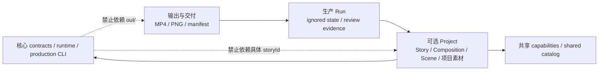

# Project 可删除性与产物解耦实施计划

> 文档类型：已完成实施计划归档
>
> 日期：2026-08-07
>
> 归档状态：Task 1–9 已完成并通过隔离删除矩阵；本文保留实施前事实与批准边界快照

## 1. 结论与目标

本计划实现的不是“作品做完后自动删除”，而是以下架构不变量：

> 任意 `src/projects/<storyId>/` 可以保留，也可以删除；删除并重新生成派生注册后，
> Remotion Story Producer 核心仍能测试、构建、列出剩余 Composition，并继续制作新视频。

同样，`out/` 中的 MP4、PNG、contact sheet、波形图和媒体 evidence 可以存在，也可以整体
不存在；它们只影响对应生产 Run 或显式媒体复验，不影响核心仓库健康。

依赖方向必须保持单向：



图中虚线表示需要由测试禁止的反向依赖，不表示运行时调用。

## 2. 已确认的当前事实

当前已经具备正确基础，但尚未完成解耦：

- `src/Root.tsx` 遍历 generated `projectRegistry`，每个作品通过 `lazyComponent={entry.load}`
  延迟加载；Root 没有逐个手写 Composition。
- Registry 在 bundle 前按固定一级目录发现 `src/projects/*/Composition.tsx`，并生成字面量
  `import()`；render runtime 不扫描目录。
- 当前 generated Registry 固定列出七个作品。删除目录但未重新生成 Registry 时，静态 import
  会失效。
- `npm run check:host` 目前除 Composition listing 外，还固定运行
  `project:verify -- --all`；中央 `formal-projects.json` 和 adapter map 硬编码 GPS 与 Product
  Comic。
- GPS/Product Comic 的项目专属工具和测试位于 `scripts/project-tools/<storyId>/`、
  `tests/<storyId>/` 等中央路径。删除 Project 目录不会同时移除这些反向引用。
- shared `src/remotion/catalog/assets.manifest.json` 当前登记 GPS 项目素材；删除对应
  `public/projects/gps-relativity/` 会让 shared catalog 失效。
- production Preview 会把 MP4/PNG 写入 ignored `out/`，但又把包含这些路径/checksum 的
  evidence/check report 写进 tracked Project `generated/`；默认正式作品门禁因此依赖历史媒体。
- `out/` 已被 Git ignore；`.producer-runs/` 也已被 Git ignore。

当前代码与文档仍是事实权威。本计划只描述目标实现，不把目标写成已经完成。

## 3. 术语和所有权

### 3.1 核心系统

以下路径不得 import、枚举或判断任何具体 `storyId`：

- `src/contracts/`
- `src/remotion/runtime/`
- `src/remotion/capabilities/`
- `scripts/production/` 的通用流程
- `scripts/registry/`、`scripts/catalog/`、`scripts/project-check/` 的通用部分
- core tests 与默认 `npm run check` 编排

允许核心按已验证的 `<storyId>` 和固定目录约定处理“当前存在的 Project”，但不得出现
`gps-relativity`、`product-comic-vertical` 等项目特例。

### 3.2 Project

一个 Project 是可选的作品源工程，拥有：

- Story、NarrationSpec、RenderSpec、Composition 和 Scene 源码；
- sealed narration、SemanticTiming、ScenePackage、projection、FinalAssembly 等渲染必需输入；
- 项目级 VisualStyle、资源声明、GlobalVisual/GlobalSound 和项目本地工具；
- 仅验证该 Project 的测试和可选历史兼容规则。

Project 可以长期保留。可删除性只是解耦验收，不是保存期限政策。

### 3.3 派生注册

`project-registry.generated.ts` 和聚合 ResourceCatalog 是当前 Project 集合的 build-time
projection，不是作品存在清单的手写权威。它们可以继续 tracked，但必须在所有消费命令前
自动重算；删除 Project 后产生对应 generated diff 是正常行为。

### 3.4 生产与媒体产物

以下内容不属于核心或可编辑 Project 源码：

- 完整 MP4、review MP4；
- still PNG、contact sheet、waveform、spectrogram；
- 只证明这些媒体身份的 PreviewEvidence、media mechanical check、用户预览决定；
- 将来的 release manifest、封面和交付包。

这些内容属于 ignored Run workspace 或用户指定的交付目录。媒体不存在时，显式媒体复验应
清楚失败；核心/source check 必须继续通过。

## 4. 硬边界

- 不实现“做完自动删除”，也不新增 `project:delete` 命令。
- 不引入插件框架、monorepo workspace、数据库、Docker 或远程存储。
- 不在 render runtime 扫描目录；仍使用 bundle 前生成的静态字面量 `import()`。
- 不改变 sealed PCM 时间权威、`ttsChunks`、CaptionLayer、ScenePackage、GlobalVisual 或
  GlobalSound 所有权。
- 不借解耦自动 promotion 项目代码到共享 capabilities。
- 不迁移、重算或代签已有 FinalPreviewApproval；历史项目兼容只做路径/调用隔离。
- 不要求删除任何现有 Project、`public/projects/` 或 `out/` 文件来完成实现。
- 本计划不实现 M10；只修正 M10 后续必须遵守的交付边界。

## 5. 完成定义

实现完成必须同时证明：

1. 保留所有现有 Project 时，全部现有 Composition 仍可列出，现有作品可显式复验。
2. 在隔离临时副本中只删除任意一个 `src/projects/<storyId>/`，重新生成 Registry/Catalog 后，
   默认检查通过，剩余 Composition 正确，被删 Composition 不再出现。
3. 同一副本继续删除对应 `public/projects/<storyId>/`，默认检查仍通过。
4. 删除整个 `out/`，默认检查仍通过；只有显式 media/evidence 命令失败并说明缺少媒体。
5. 删除所有具体 Project 和全部 `public/projects/<storyId>/` 后，零 Story Registry 合法，
   `CapabilityGallery` 仍可列出，核心测试、typecheck、lint 和 build 通过。
6. 核心源码、默认 test manifest、package check 编排和中央配置不包含具体项目 ID 或到项目专属
   工具的 import/path 分支。
7. 新增一个符合固定目录约定的 synthetic Project 后，无需修改 Root、核心 adapter map 或
   package scripts 即可注册和执行 source verification。
8. 默认检查不读取 `out/`、FinalPreviewEvidence、FinalPreviewApproval 或历史 review PNG；
   显式媒体复验仍能验证 checksum drift。

## 6. 实施顺序

每个任务按 Red → Green → 聚焦验证 → 精确 staging → 小步本地 commit 执行。不得使用
`git add .`，不得提前开始下一任务，不 push。

### Task 1：固化 Project 边界和删除矩阵的 Red tests

**目标**

先让测试表达目标架构，避免后续只移动文件却没有真正解除反向依赖。

**新增/修改**

- 新增 `tests/architecture/project-boundary.test.ts`；
- 新增 `tests/architecture/project-deletability.test.ts`；
- 新增最小临时 Project fixture helper；
- 将 architecture tests 纳入 `npm test`。

**Red 断言**

- Registry generator 接受零个 Project；当前实现需明确证明该行为。
- 删除 fixture Project 后重新生成 Registry，不再出现它的 import。
- core 路径不得 import `src/projects/<storyId>` 或 `scripts/project-tools/<storyId>`。
- package 默认 check 命令不得枚举具体项目 ID。
- 默认检查调用图不得读取 `out/` 或媒体 evidence。
- project-owned tests/tools 不得留在删除 Project 后仍会被默认发现的中央目录。

**聚焦验证**

```bash
node --import tsx --test tests/architecture/*.test.ts
```

**建议 commit**

```text
test(architecture): define removable project boundary
```

### Task 2：使 ProjectRegistry 成为自动重算、zero-safe 的派生投影

**目标**

保留现有 `lazyComponent + literal import()` 设计，只消除“必须先手工修 Registry 才能删除
Project”的脆弱性。

**修改范围**

- `scripts/registry/project-files.ts`
- `scripts/registry/domain.ts`
- `scripts/registry/generate.ts`
- `src/Root.tsx`
- `tests/registry/*`
- `package.json`

**实现要求**

- 明确支持 `projectRegistry = []`，Root 在零 Story 时仍注册 `CapabilityGallery`。
- 所有会消费 Registry 的命令在消费前运行同一个 generation step：dev、test、typecheck、lint、
  build、compositions 和默认 check 不得各自实现不同逻辑。
- `registry:check` 继续只读检测 drift；generation 仍使用原子、byte-stable 写入。
- 删除 Project 后只需运行既有 generator；不增加 runtime discovery，也不生成动态模块路径 JSON。
- Root/registry tests 使用 synthetic IDs，不再断言 GPS 或 Product Comic 必须存在。

**Red/Green 关键用例**

- 0 Project → empty registry source；
- 1 Project → exactly one literal import；
- N Project → 稳定排序；
- 删除其中一个 → 仅移除对应 entry；
- 缺失 Composition 的普通目录 → 不注册；malformed Project 仍 fail closed。

**聚焦验证**

```bash
node --import tsx --test tests/registry/*.test.ts tests/registry/*.test.tsx
npm run registry:generate
npm run registry:check
npm run typecheck
```

**建议 commit**

```text
refactor(registry): make project projection removable and zero-safe
```

### Task 3：把 verification profile 和项目专属工具归还给 Project

**目标**

移除中央 GPS/Product Comic 项目清单和 adapter map。Project 存在时可显式复验；Project 删除后
不存在悬空的中央调用。

**修改范围**

- `scripts/project-validation/profiles.ts`
- `scripts/project-validation/adapters.ts`
- `scripts/project-validation/cli.ts`
- 删除中央 `scripts/project-validation/formal-projects.json`
- 将 `scripts/project-tools/gps-relativity/` 移入
  `src/projects/gps-relativity/tools/verification/`
- 将 `scripts/project-tools/product-comic-vertical/` 移入
  `src/projects/product-comic-vertical/tools/verification/`
- 为需要附加复验的 Project 增加严格、无模块路径的 `verification.profile.json`
- 更新 `tests/project-validation/*`

**实现要求**

- profile 只保存 version 和固定 step ID，不保存 shell、JSX、模块路径或任意命令。
- CLI 只按当前发现的 Project 和固定文件名约定解析 profile。
- common source steps 由通用 adapter 执行；项目特有 step 只能解析到同一 Project 下的固定
  `tools/verification/<step>.ts`。
- `--all` 表示“所有当前存在且声明 profile 的 Project”；零个 profile 合法成功。
- 缺失声明过的 step adapter 仍 fail closed；删除整个 Project 后不再尝试运行它。

**聚焦验证**

```bash
node --import tsx --test tests/project-validation/*.test.ts
npm run project:verify -- --all --scope source
```

**建议 commit**

```text
refactor(projects): localize project verification ownership
```

### Task 4：把真实作品测试归还给对应 Project，核心测试只使用 synthetic fixtures

**目标**

删除 Project 时，其专属测试一起消失；core test suite 不把历史真实作品当成平台能力前置条件。

**迁移范围**

- `tests/gps-relativity/**`
- `tests/product-comic-vertical/**`
- `tests/projects/gps-relativity-*`
- `tests/projects/product-comic-vertical-*`
- `tests/narration/gps-relativity-project.test.ts`
- `tests/production/compatibility-matrix.test.ts` 中绑定真实作品 checksum 的部分
- `package.json` test 编排

**实现要求**

- 项目测试移到对应 `src/projects/<storyId>/tests/`，保持项目源码与测试共同所有权。
- 新的 test runner 固定运行 core test roots，再发现当前 Project 下的 `tests/*.test.ts(x)`；
  zero Project 不产生 unmatched-glob 错误。
- contracts/runtime/production 通用行为继续使用 `story-example`、临时目录和 synthetic bytes。
- 旧 artifact 兼容行为使用最小 synthetic fixture；只有作品自身测试允许断言该作品的历史 identity。
- 删除 Project 后，typecheck、lint 和 test 不得再加载它的测试或工具。

**聚焦验证**

```bash
npm test
npm run typecheck
npm run lint
```

**建议 commit**

```text
refactor(tests): make real video checks project-owned
```

### Task 5：拆分 source health 与 media evidence verification

**目标**

默认仓库检查验证“代码能否继续制作和渲染”，不要求历史 MP4/PNG 仍在 `out/`；媒体 identity
只在明确请求时验证。

**修改范围**

- `scripts/project-check/`
- `scripts/project-validation/`
- `scripts/baseline/evidence.ts`
- `scripts/production/application/preview-evidence.ts`
- `package.json`
- 对应 `tests/project-check/`、`tests/project-validation/` 和 `tests/production/`

**命令边界**

- `npm run check`：core + 当前 Project source/render-critical contracts + build/listing；不读 `out/`。
- `npm run project:verify -- --all --scope source`：验证当前 Project 源码、渲染输入、Registry、
  Scene/Global projection 和 Composition。
- `npm run project:evidence:check -- --project <id>`：显式检查当前 Run/历史作品 MP4、PNG 和
  checksum；媒体缺失时清楚失败。
- `npm run project:approval:check -- --project <id>`：显式检查对应批准记录，不进入默认 check。

**必须保留在 Project 的渲染输入**

- sealed narration manifest 与被 Composition 使用的本地 WAV；
- SemanticTiming、CaptionCue、ScenePackage/coverage/registry/projection；
- ProductionPreviewAssembly 或 FinalAssembly 等 Composition 实际 import 的装配声明。

**不得成为默认 source gate 的媒体记录**

- narrative baseline MP4/PNG evidence；
- production/final preview MP4、representative still、contact sheet；
- PreviewEvidence、media mechanical check、FinalPreviewApproval。

**关键测试**

- 临时删除 `out/` 后 `npm run check` 路径仍通过；
- 同一状态执行显式 evidence check 必须因媒体缺失失败；
- 修改一个 PNG byte 只使 media evidence 失效，不使 Project source invalid；
- 修改 render-critical WAV/ScenePackage 仍使 source check fail closed。

**建议 commit**

```text
refactor(checks): separate project source health from media evidence
```

### Task 6：未来 production 的媒体 evidence 改为 Run-owned

**目标**

停止把 future production 的媒体检查记录写成 tracked Project 源码，同时不迁移或重签已有正式
作品。

**修改范围**

- `scripts/production/application/post-scene.ts`
- `scripts/production/application/post-scene-default.ts`
- `scripts/production/application/preview-evidence.ts`
- `scripts/production/adapters/run-store.ts`
- Production output artifact/path contracts 与对应测试

**实现要求**

- future Run 的 PreviewEvidence 和 preview mechanical check 写入
  `.producer-runs/<runId>/artifacts/`；MP4/PNG 仍可写入 ignored `out/<storyId>/production/<runId>/`。
- Project 内只写 Composition 真正需要的 assembly/projection，不写媒体身份作为源码权威。
- Run events/state 记录 run-local evidence fingerprint 和 output path，但不进入 render runtime。
- `production:preview:check` 从 Run manifest/state 解析当前路径，不假定 evidence 位于
  `src/projects/<storyId>/generated/`。
- 现有 v1-v4 Run 和 GPS/Product Comic 文件保持原字节；旧路径只读兼容必须基于合同版本或
  artifact 自描述，不能基于中央 project ID 分支。

**聚焦验证**

```bash
node --import tsx --test tests/production/*.test.ts
npm run check:static
```

**建议 commit**

```text
refactor(production): keep preview evidence run-owned
```

### Task 7：拆分 shared catalog 与 Project 资源声明

**目标**

shared catalog 只拥有真正共享的资源和 capabilities；项目素材由当前 Project 自己声明。删除
Project 或对应 `public/projects/<storyId>/` 后，不留下 shared manifest 悬空引用。

**修改范围**

- `src/remotion/catalog/assets.manifest.json`
- `scripts/catalog/project-files.ts`
- `scripts/catalog/generate.ts`
- Project-local `resource-catalog.json`/asset manifest
- `scripts/production/application/scene-freeze.ts`
- `tests/catalog/*` 与相关 production fixtures

**实现要求**

- 从 shared manifest 移出 GPS 等项目专属资产描述；不自动 promotion。
- catalog generation 聚合 shared catalog 与“当前 Project”显式声明，输出仍 deterministic、
  byte-stable。
- zero Project 时生成只含 shared capabilities/assets 的合法 catalog。
- orphan `public/projects/<storyId>/` 文件不会被扫描或自动注册；Project manifest 删除后它们只是
  未引用文件。
- Project 删除后重新生成 catalog，不再包含该 Project 的资源 ID。

**聚焦验证**

```bash
node --import tsx --test tests/catalog/*.test.ts
npm run catalog:generate
npm run catalog:check
```

**建议 commit**

```text
refactor(catalog): make project resources removable
```

### Task 8：移除 core 中剩余的项目 ID 分支和保护门禁

**目标**

清除最后的反向耦合，同时保留历史资料的可读性。

**修改范围**

- `scripts/compatibility/formal-project-artifacts-v1.ts`
- `scripts/project-check/final-run.ts`
- `scripts/project-validation/*`
- `tests/compatibility/*`
- `tests/production/compatibility-matrix.test.ts`
- package scripts 和 architecture boundary checker

**实现要求**

- legacy filename、receipt shape 和 checksum 兼容按 schema/version/文件自描述处理，或放入对应
  Project 自有 verification adapter；core 不判断 `projectId === ...`。
- 默认 `check:host` 不再把“GPS/Product Comic 历史媒体仍 current”当成核心门禁。
- 历史 evidence、archive 和 Git history可以继续出现作品名称；它们不参与 runtime 或默认检查。
- architecture checker 对 core imports、中央 manifests、package scripts 和 active config 做结构
  检查，不用一份会不断增长的“已知项目 ID 黑名单”冒充依赖分析。

**聚焦验证**

```bash
node --import tsx --test tests/architecture/*.test.ts tests/compatibility/*.test.ts
npm run check:static
```

**建议 commit**

```text
refactor(core): remove concrete project compatibility branches
```

### Task 9：执行真实删除矩阵、同步 authority docs 并收口

**目标**

在隔离临时副本中证明可删除性，不删除当前工作树的任何作品。

**矩阵**

| Case | 临时副本操作                                        | 必须结果                                                      |
| ---- | --------------------------------------------------- | ------------------------------------------------------------- |
| A    | 不删除任何内容                                      | 当前全部 Composition 与 source checks 通过                    |
| B    | 只删除一个 `src/projects/<id>/`                     | Registry/Catalog 重算；其余项目与核心通过                     |
| C    | 在 B 基础上删除对应 `public/projects/<id>/`         | 默认检查仍通过，无 shared catalog 悬空引用                    |
| D    | 只删除整个 `out/`                                   | 默认检查通过；显式 media check 准确失败                       |
| E    | 删除全部具体 Project 与全部 `public/projects/<id>/` | zero Story registry；CapabilityGallery、core build/check 通过 |
| F    | 从零状态添加 synthetic Project                      | 无 Root/core config 修改即可 listing 与 source verify         |

临时副本只能使用明确路径和自动清理的 `mktemp -d`；当前工作树只读，不执行 broad delete 或
`git clean`。

**Authority docs 收口**

实现和矩阵通过后再更新：

- `docs/ARCHITECTURE.md`：增加单向依赖和可删除 Project 边界；
- `docs/DETERMINISTIC_EXECUTION.md`：Registry/Catalog 是 current-set projection，media evidence
  是 Run-owned；
- `docs/PRODUCTION_WORKFLOW.md`：区分 Project source、Run review 和 delivery output；
- `docs/ITERATION_STATUS.md`：只在实现完成后声明 deletability 已实现；
- `docs/ROADMAP.md`：重新定义 M10 为向用户指定目录导出交付包，不能反向把 Project/媒体固化为
  核心依赖；
- `docs/guides/FORMAL_PROJECT_VERIFICATION.md`：正式作品复验改成显式 Project-owned 命令；
- `AGENTS.md`：把真实作品从核心保护门禁改为“存在时项目自有验证”，保留删除需明确授权的
  安全规则；
- 完成后将本计划移入 `docs/archive/implementation-plans/` 并更新 archive README。

**最终验证**

```bash
npm test
npm run typecheck
npm run lint
npm run docs:check-links
npm run catalog:check
npm run registry:check
npm run check:static
npm run check
npm run compositions
git diff --check
git status --short
```

`npm run check`、`npm run compositions` 和删除矩阵中的 Remotion listing 首次直接使用宿主环境。
媒体 evidence/approval 复验作为额外显式验证运行，不重新进入默认核心门禁。

**建议 commit**

```text
docs(architecture): close removable project boundary
```

## 7. 实施时的保护策略

- 开始前记录当前 branch、HEAD、`git status` 和所有 tracked Project 文件清单。
- 不以“可删除”为理由删除当前作品；所有删除证明只在临时副本执行。
- 迁移 project-owned tools/tests 使用 `git mv` 并同步引用，避免复制后留下双重权威。
- GPS/Product Comic 的 source/media checksum 先记录基线；本计划不要求重渲染或重签批准。
- 若某个现有历史 checker 无法在不依赖 `out/` 的情况下保留，则将它降为 Project-owned 显式
  media verification，不得删除验证逻辑或伪造 pass。
- `public/voice_profile/` 不读取、不移动、不 staging、不提交。
- 每个任务只提交自己的白名单文件；实现完成前不修改 M10 状态为 started。

## 8. 自审结论

本计划没有把 Project 当成必须删除的一次性缓存，也没有取消媒体验证。它只改变验证的所有权：

- Project 存在时，仍可完整编辑、渲染和显式复验；
- Project 删除时，核心没有反向依赖；
- 输出存在时，可以用 checksum 复验；输出删除时，不影响源码健康；
- 历史作品可以继续保留，但不再充当核心系统永远必须存在的 fixture。

计划的最小核心改动是 Registry zero-safe、Project-owned tools/tests/profile、source/media gate
拆分和 Project-local catalog；没有引入通用插件系统、自动归档器或自动删除生命周期。
