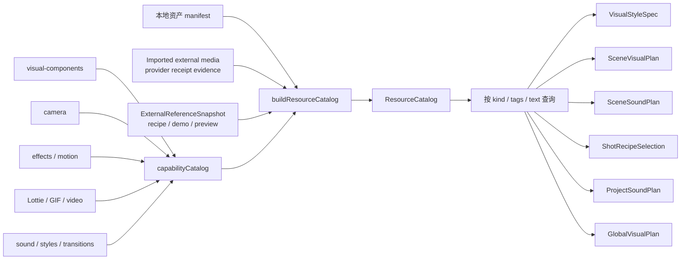

# 统一资源与能力目录

> 文档类型：维护指南
>
> 最后复核：2026-08-18
>
> 系统结构与当前状态分别以 [ARCHITECTURE.md](../ARCHITECTURE.md) 和
> [ITERATION_STATUS.md](../ITERATION_STATUS.md) 为准。

## 职责

Scene 设计只通过一个只读目录发现可用视觉、音频、style profile、共享制作能力和制作期镜头
参考，但每类资源仍由自己的源码、资产 manifest 或冻结外部来源快照维护。目录是查询视图，
不是第二份实现真相，也不是运行时动态加载器。



## 当前已迁入能力

- Remotion core、media、Lottie、GIF、effects、transitions、light-leaks；
- Three.js、motion blur、layout utils、paths、shapes、Google Fonts、renderer、Tailwind v4；
- camera 2D/3D、focus pull、layered stage；
- code effects、motion treatments、background music/sound effects、style profiles；
- `visual-components/` 下的 backgrounds、charts、cinematic、elements、layouts、logos、
  media-layouts、scene-patterns、text 与 transition-components；
- `scene-templates/` 下仅保存可在 configure 时复制并冻结的完整 Scene template，不与 runtime
  media、transition preset 或 Project-local Scene 混为一类；新 Project 只在 atomic create transaction 中
  复制所选 instance。`DefaultIntroPreview` / `DefaultOutroPreview` 是 shared template 的 system preview，
  不是 Project delivery；片尾 mark + wordmark 以一个 responsive lockup box 居中，关注按钮维持独立的同轴布局。

当前权威与生成入口：

- `src/remotion/capabilities/`：各领域权威；
- `capability.visual-components`：共享视觉组件 Catalog identity；chart/layout descriptor 复用同一
  明确 export authority，不保留旧目录或兼容别名；
- `src/remotion/catalog/assets.manifest.json`：本地 asset descriptor 权威；
- `src/remotion/catalog/style-descriptors.ts` 与 `capability-descriptors.ts`：静态 export
  descriptor 声明；
- `src/remotion/catalog/resource-catalog.generated.json`：由 bootstrap 重建的 ignored 本地读取
  视图；
- `packages/studio/src/contracts/resource-catalog.ts`：四类 descriptor、选择引用和准入合同；
- `scripts/catalog/`：稳定生成、byte drift check 和只读查询。

```bash
npm run catalog:generate
npm run catalog:check
npm run catalog:query -- --kind capability --tag motion
npm run catalog:query -- --kind asset --text proof
```

Scene template 的可选本地声音由独立 authoring projection 管理，不由 proof generator 或具体
Project 拥有：

```bash
npm run scene-template-audio:generate
npm run scene-template-audio:check
```

`generate` 从 ignored private reference manifest 与 override 生成
`scene-template-audio.generated.json`；`check` 只读比较 expected bytes。bootstrap 显式调用同一
生成器，随后 `project:create` 才把选中的声音、许可证和模板源码复制进具体 Project。

fresh clone 先由 `npm install` 的 prepare hook 执行 `npm run bootstrap`；也可手动执行该命令。
bootstrap 会先重建 catalog 所需的 core synthetic proof 资产，再生成当前本地 Project 集投影。
Scene runtime proof 单独从 tracked core asset、style 与 capability authority 构建稳定 Catalog
projection；它不会把 ignored private reference 或 Project-owned descriptor 的存在写进 tracked proof
fingerprint。

生成器按 ID 稳定排序，校验 authority file/source export、asset regular-file/checksum、style
profile identity、重复 ID 和 descriptor fingerprint；write 只在完整通过后原子替换，check/query
不写文件。

## 资源条目

```text
ResourceDescriptor
├── id / kind / status
├── title / description
├── useCases / tags
├── authority
├── allowedUse（runtime-approved / localize-code / localize-asset / reference-only / blocked）
├── license / attribution / verification status（按资源需要）
├── mediaRole / visualRole / soundRole（按 kind）
└── exportName（代码能力可选）
```

后续可为高价值能力逐步补充 `avoidWhen`、画幅、renderCost、代表帧和 motion strip；
这属于目录元数据增强，不改变其实现权威。

## 外部镜头参考

外部可播放媒体与 authoring-only 镜头参考是不同边界。当前 `project:asset:import` 只准入 Pexels
image receipt v1：校验候选 bytes 后复制到 Project-owned public 路径，把 provider receipt 映射为
通用 acquisition evidence 和 `runtime-approved` asset descriptor。ProductionRevision 建立后不能偷换
输入；Scene/GlobalVisual tasks 只消费 Revision 绑定的本地 Resource ID。video/audio 分支存在于通用合同中，但当前
明确 fail closed；Catalog 不把它们伪装成已支持资源。

`video-shotcraft` 等上游库通过 `ExternalReferenceSnapshot` 进入制作期查询面，而不是直接
安装为 Composition 依赖。主 Agent 在显式 authoring sync 中固定 repository 和完整 commit，
再生成 card/style-key、完整配方、准确 demo、preview 与最小依赖闭包的 content-addressed
descriptor。浮动 branch/tag、远程 `latest` 或全局 skill 安装路径不能成为生产 identity。

目录必须把不同用途分开：

- shot recipe、demo source、preview 和 sequence pattern 是 authoring-only reference；
- 选中的最小源码闭包必须复制到对应 Scene 的 `shots/`，由静态 import/AST 检查证明实际
  Renderer binding；runtime 不从 Catalog 或上游仓库加载它；
- preview 只用于选型和 source/adaptation 对照，不能当作最终 Scene 素材；
- 第三方代码许可证与 bundled audio/image/font 逐资产授权分别验证；来源不明、未确认或
  不允许当前用途的条目一律 `blocked`，不能因仓库顶层许可证而默认放行；
- 未使用外部 recipe 的 Scene 使用空 ShotRecipeSelection，不能被目录强迫套卡。

Scene runtime synthetic fixture 只冻结 `draw-svg-trace` 一张 card/style-key，固定完整 commit、准确
demo/preview identity，并仅本地化两个源码文件及 Apache-2.0 license。它证明 resolver、最小
闭包 guard 和 fidelity receipt，不复制 Gallery、模板集合、全部 demos 或音频库，也不作为
GPS 正式资源选择。

已删除 Project 的历史 Scene、音频 overlay 和 Project-local GlobalVisual 不属于 current Catalog，
不能从旧 evidence 反推为当前可选资源。真实删除必须通过
[`project:delete`](../PRODUCTION_WORKFLOW.md#8-作品删除) 清理完整 Project-owned 数据并重建
Catalog/Registry。历史 GPS 选型只保留在 evidence 中；恢复或新建 Project 时必须从 current
Catalog、current local assets 和当次 ProductionRevision 重新选择。

## 新能力

Scene 内新组件默认留在 `src/projects/<story>/`，不会因“看起来可复用”自动进入共享目录。
Scene renderer 可以调用目录中的共享能力，也可以拆分本地 Shot 组件；目录条目不会因此
变成 Shot 级 runtime renderer，ShotPlan 也不保存组件或模块路径。
具体 promotion 合同尚未落地；后续实现时必须保留“用户明确批准后才可提取”的边界。

## Scene 并行查询边界

Root 先只读 inspect，再由 prepare 在分发 Scene 任务前绑定同一份 ResourceCatalog snapshot 和允许的
ExternalReferenceSnapshot。每个 meaningId 子 Agent 只读查询这些快照，把最终视觉/音频
选择写入自己的 `selected-resources.json`，把 recipe 选择写入
`shot-recipe-selection.json`；子 Agent 不得修改 Catalog、共享 capability exports、上游
revision 或其他 Scene 的资源/recipe 选择。

`VisualStyleSpec.styleProfileId` 必须解析到 Catalog 中唯一、已批准的 style profile；
SceneVisualPlan 的视觉资源与 SceneSoundPlan 的音效 contribution 也必须解析到相应 kind/role。
repository-local `remotion-best-practices` 只提供 Scene authoring guidance，不是 Catalog 条目、
资源 manifest 或 production identity，也不改变这些解析规则。
缺失、重复、类型不匹配、路径越界或 snapshot fingerprint 漂移全部 fail closed。
exact recipe 还必须唯一解析到 cardId/style-key、准确 demo 与 preview identities，并由独立
reference fidelity receipt 证明最小本地化闭包、真实 Renderer/frame-state binding、配对
证据文件及其相位/checksum；receipt 不包含 Agent 自评，也不判断正常速度可辨识度。
card-name-only、metadata-only 或未使用的孤儿源码不能通过。
通过校验的视觉与音频选择最终共同进入对应 `ScenePackage`；Catalog 只负责发现、解析和
校验资源，不拥有 ScenePackage，也不成为第二份 Scene 创作权威。
